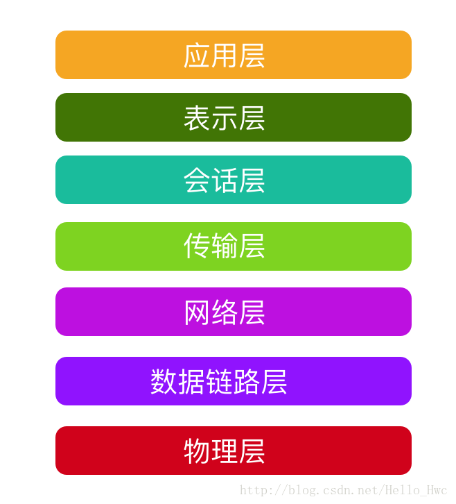
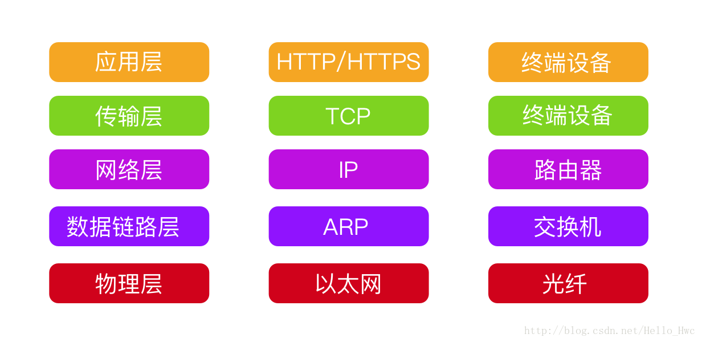
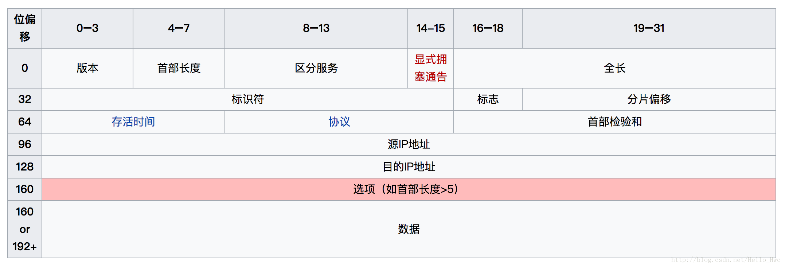
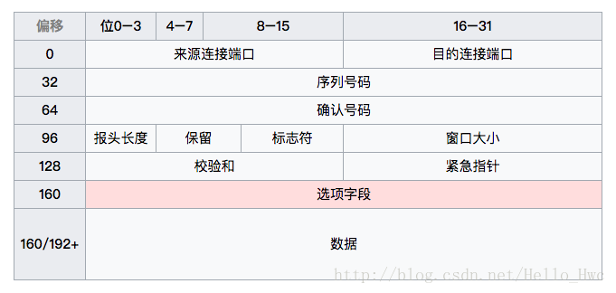
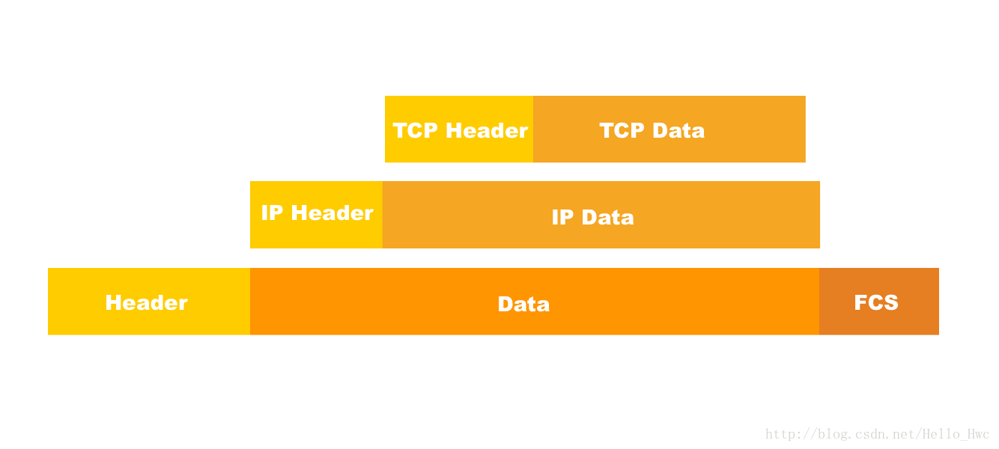
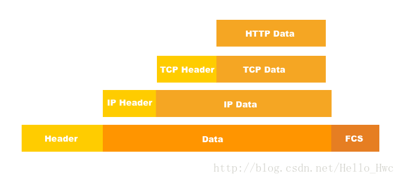
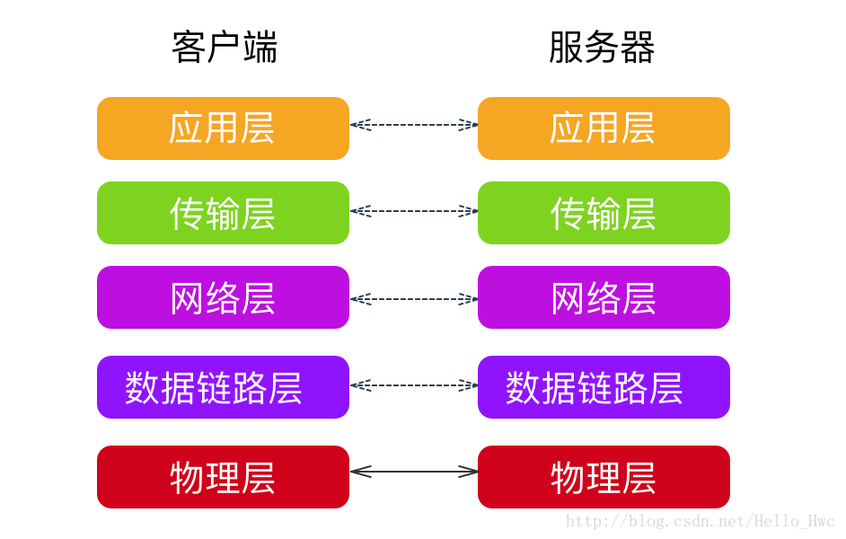

## 网络分层

网络的基础分层是OSI的七层架构：



> OSI的全称是Open System Interconnection(开放系统互联模型),是由国际标准化组织ISO设计，解决不同体系结构网络互相连接的问题。

实际应用中，五层架构是最常见的，也是最容易理解的：



网络分层后，每一层都工作着不同的协议和实际的物理设备，下一层为上一层提供服务，上层的实现无需考虑下层的细节，相同层级之间进行相互通信。


----

### 物理层 

> 物理层提供了物理设备通信通道上的原始比特流传输。
> **物理层的存在使得上一层的无需关注实际的传输介质**。

以[IEEE802.3](https://zh.wikipedia.org/wiki/%E4%BB%A5%E5%A4%AA%E7%BD%91%E5%B8%A7%E6%A0%BC%E5%BC%8F)协议为例，物理层的一帧主要包括以下三部分：


> - Header: 帧头部信息，包括目标地址，源地址，Data段的长度等信息。
> - Data: 帧实际传输的数据信息
> - FCS: 校验信息

这里我们提到了Header中包含了目标地址和源地址等信息。那么如何表示一台物理设备的地址呢？

答案是：[MAC地址](https://zh.wikipedia.org/wiki/MAC%E5%9C%B0%E5%9D%80)。

> MAC 地址也称作物理地址，用来唯一确定一台可以联网的物理设备。MAC地址一共48位（6）个字节，前24位由IEEE分配给厂商，后24位由厂商自行决定。这样就保证了两个网卡的MAC地址不会一样。

在实际传输的时候，设备A是如何发数据包发送给设备B呢？其实以太网的原理很简单：

> 设备A向子网里的所有设备发送数据包，所有设备的在接受到数据包之后，取出MAC地址和自己的进行检查，如果MAC地址一致则接收，不一致则忽略。


---

### 数据链路层

> 数据链路层提供了物理寻址，同时将原始比特流转变为逻辑传输线路。**数据链路层将有差错的物理信道变为无差错的、能可靠传输数据帧的数据链路。**

前面我们提到了两台设备可以通过广播进行通信。但是，不可能我在上海，你在北京，我们仍然通过广播数据包的方式进行通讯。

这就引申出了子网的概念，只有在同一子网中的设备才采用广播的方式。而不同的子网之间通过网关（Gateway）连接。

那么，如何在不同的网关之间寻址呢？这时候就要引入一个**逻辑地址：IP地址**。这里我们先不管IP地址是什么，只要知道它是一台设备的逻辑地址即可。

在引入了IP地址之后，无形中又引入了一个问题：
> 如何从IP地址，找到设备MAC地址？

数据链路层提供了IP地址到MAC地址的映射，其中ipv4采用ARP协议，ipv6采用NDP协议。

ARP的更多细节可以参见[IBM的这篇文档](https://www.ibm.com/developerworks/cn/linux/l-arp/)，讲解的非常详细，大致的过程是：

> ARP工作的时候，送出一个含有所希望的IP地址的以太网广播数据包。目的主机，或者另一个包含该主机的系统响应后，以一个含有IP地址和MAC地址的数据包进行应答。

---
### 网络层

> 网络层提供了逻辑编址，分组传输，路由选择等服务，提供主机到主机之间的通信。

网络层的最重要的协议就是IP协议，IP协议主要作用有两个：为每一台计算机分配一个IP地址，确定哪些地址在同一个网络中。IP协议提供的是不可靠的传输，它的优点是在网络传输的时候无需先确定一条“通路”。

目前应用最广泛的版本还是ipv4，ipv6正在积极部署中。

- ipv4用32位来表示一个地址：比如208.80.152.2。（4组10进制数）
- ipv6用128位来表示一个地址：比如2001:0db8:85a3:08d3:1319:8a2e:0370:734 （8组16进制数）

IP地址包括网络地址和主机地址，通过[子网掩码](https://zh.wikipedia.org/wiki/%E5%AD%90%E7%BD%91)来区分。

ipv4的数据包格式如下：



ip的数据包是被放到物理层帧的data段里进行传输的：


### 传输层

> 传输层的主要任务是**向上层屏蔽下层数据发送的细节，提供可靠的端到端的通信和流量控制，保证报文正确传输**，提供端口到端口的通信。

网络层提供的是主机到主机的通信，而同一主机上可能有不同的应用需要联网，这就是端口的作用：端口可以用来区分同一主机的不同应用。

常见的工作于传输层的协议是TCP和UDP。传输层在收到应用层的数据后，在必要的时候会对数据进行切割，编号，然后交给网络层进行传输。

以TCP为例，数据包格式如下:



同样可以简化为：header + data。这样数据包由高层到低层的结构进行了如下改变：




---
### 应用层 

> 应用层定义了用户于网络之间的直接接口，提供用户请求的各种服务。简单来说，**应用层就是定义用户数据以什么样的格式被传输**。

常见的工作在应用层的协议有：HTTP/HTTPS/FTP/SMTP等。比如HTTP是建立在TCP上的协议，那么HTTP在工作的时候数据包格式如下：




----
## 工作方式

在网络分层模型中，逻辑上是同层之间进行通信的，而实际的物理连接则是通过物理层中使用的具体介质。



以一次对http://www.baidu.com请求为例，讲解下分层的具体工作流程

### DNS查询

- 检查域名是否在缓存里，如果在，则直接返回ip地址。
- 如果没底没有DNS服务器或者默认网关的IP地址，采用ARP的方式对DNS/网关进行查询，获取其IP地址
- 获得了DNS服务器或者默认网关地址后，使用 53 端口向 DNS 服务器发送 UDP 请求包，如果响应包太大，会使用 TCP 协议
- 如果对应的DNS服务器没有找到域名对应的IP地址，则一层一层的向高层DNS进行查询，直到找到对应的ip地址

### TCP连接

找到目标IP后，会尝试进行连接，连接的时候会进行三次握手，这里先不考虑握手的细节，先看下如何向服务器发送TCP请求数据包的。

- 请求的数据包先传递给传输层，在传输层请求被分装成TCP Segment，目标端口（80）会被加入头部，源端口会在系统内核内随机选取。
- TCP Segment被送往网络层，网络层会在包中添加一个IP头部，这个头部包括了目标IP地址和源IP地址，形成了TCP Packet
- TCP Packet被送往链路层，链路层会在包中加入frame头部，包括了本地网卡的MAC地址和网关（本地路由器的）MAC地址。

### 传输

在TCP包从本地计算机发送出去，经过调制解调器把数字信号转换为模拟信号。数据包首先到达本地字网的路由器，接着路过各种路由器，到达baidu.com的服务器。每一次经过路由器的时候，路由器会取出数据包的IP地址，通过路由选择算法找到最合适的路径，并继续传递下去。

### 响应

服务器收到数据包后，服务器的调制解调器（或者其他设备）将模拟信号转换为数字信号，然后经由物理层 - 链路层 - 网络层 - 传输层的解析后，传输层收到了TCP的连接请求，对客户端进行响应。

### 数据传递

在建立TCP连接后，服务器通过TCP协议把响应HTML通过一个个TCP的数据包传输给客户端，客户端的网络层将收到的TCP数据包进行重新排序，调整后，交给应用层，至此一次HTTP请求完毕。


----
## 加密

### 对称加密
对称加密是加密和解密采用相同的秘钥，代表算法AES，DES。

这个加密模式有一个很大的缺点：假设信息由甲方传输给乙方，如果甲方采用密钥进行加密，那么必须想办法把密钥告诉乙方。如何保存和传输密钥久成了一件很麻烦的事情。

### 非对称加密

非对称加密需要两份秘钥：公钥和私钥。用公钥加密的数据要用私钥来解密，用私钥加密的数据要用公钥解密，代表算法RSA。

以RSA算法为例，在加密之前首先需要生成公钥和私钥

1. 随机选择两个质数 p = 61;q = 53;（质数越大，越难破解）
2. 计算两个质数的乘积：n = 61×53 = 3233，二进制就是110010100001，这个密钥是12位的，实际应用中RSA一般为1024或者2048位
3. 计算n的欧拉函数φ(n)

	```
	　φ(n) = (p-1)(q-1) = 3120
	``` 
4. 随机选择一个整数e，条件是1< e < φ(n)，且e与φ(n) 互质。比如选择 e = 17
5. 计算e对于φ(n)的模反元素d。所谓"模反元素"就是指有一个整数d，可以使得ed被φ(n)除的余数为1。找到一组整数解，可以得出 d = 2753

	```
	ed - 1 = kφ(n) 即 17d - 1 = k * 3012
	```
则

- (n,e)=(3233,17)为公钥
- (n,d)=(3233,2753)为私钥

接着，用公钥对数据进行加密：

RSA加密要求被加密的信息m必须是整数（字符串取ascii或者unicode），且m < n。这里待加密的m = 65，根据公式进行加密，得出加密后的结果c = 2970

```
m^e ≡ c (mod n) 即  65^17 ≡ c (mod 3233)
c = 2970
```

按照私钥对c = 2970进行解密

```
c^d ≡ m (mod n) 即 2970 ^ 2753 = m(mod 3233)
```

得出 m = 65

更多细节，可以参考：RSA算法原理[（一）](http://www.ruanyifeng.com/blog/2013/06/rsa_algorithm_part_one.html)[（二）](http://www.ruanyifeng.com/blog/2013/07/rsa_algorithm_part_two.html)

对于更长的数据可以采用分段加密，或者采用DES加密数据后，再把密钥用RSA加密。接受者用RSA解密密钥，然后再用DES解密数据。

