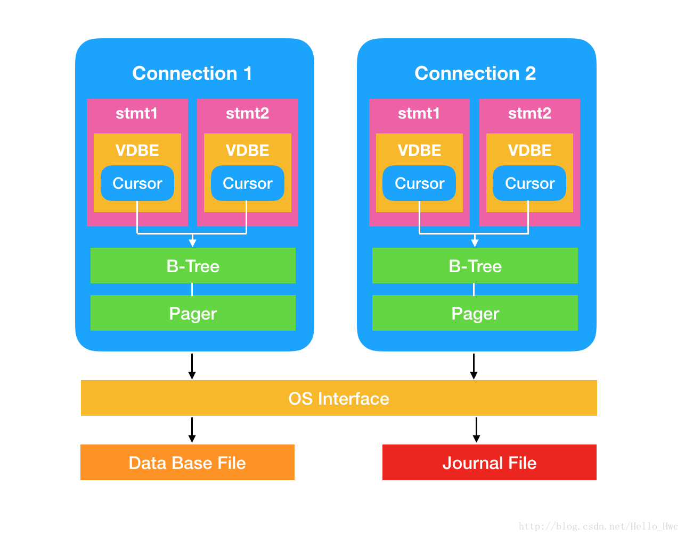
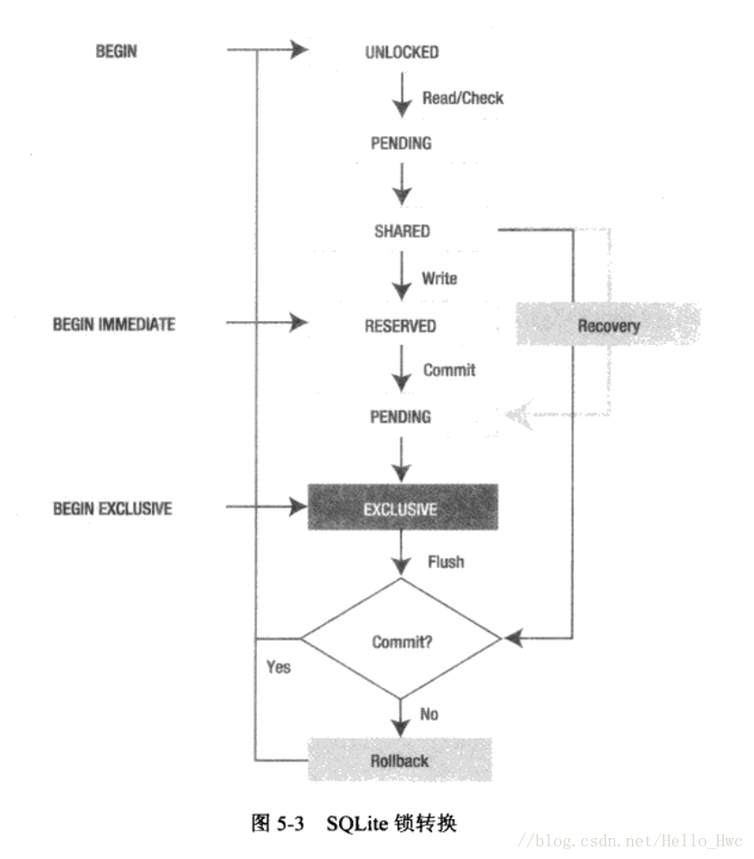

## 前言

事务定义了一组SQL语句的边界，这组SQL语句要么都执行，要么都不执行，事务保证了数据库完整性中的原子性。事务与数据库锁是紧密相关的，Sqlite用锁来保证事务的并发和执行顺序。


## 事务

在讲解事务的原理之前，我们先看看事务相关的API，主要有三个：

- `begin transaction` 开始一个事务。其中，transaction可省略，直接写`begin`即可。
- `rollback` 回滚。
- `commit` 提交

我们首先来看看回滚，假设有这样的一个Table

```
id          name        phone     
----------  ----------  ----------
10001       Leo         1234567890
```

接着，我们来试试回滚

```
//开始事务
sqlite> begin;
//插入一条数据
sqlite> insert into person(id,name,phone) values(10002,"Lina","12345671");
//查询，数据确实多了一行
sqlite> select * from person;
id          name        phone     
----------  ----------  ----------
10001       Leo         1234567890
10002       Lina        12345671  
//回滚
sqlite> rollback;
//插入的数据被删除
sqlite> select * from person;
id          name        phone     
----------  ----------  ----------
10001       Leo         1234567890
```

提交也类似，这样的语法结构即可：

```
begin;
//SQL语句
commit;
```

> 事务的存在保证了数据库的的原子性，比如在数据写入的时候出现异常（断电等原因），待写入的数据不会丢失。


## 多链接模型

常见的模型：一个数据库文件，多个连接，每个连接有自己的语句。



一些名词的解释：

- **Connection** - 连接，表示到数据库连接和事务的上下文，对应C接口中的`sqlite3`类型指针。一个数据库文件可以同时存在多个connection。
- **statement** - 语句。 语句对象表示一个编译过的SQL语句，在内部由VDBE字节码来表示。VDBE全称是（Virtual DataBase Engine）,也就是Sqlite虚拟机。一个这样的SQL语句`select * from Table`，在SQLite中是先要编译成VDBE字节码才能执行的。
- 每个连接都对应着一个**B-Tree**和**Pager**。连接直接操作B-Tree来读和写数据。当一个连接需要读取数据库文件的某一页的时候，这一页必须先加载到内存里，这时候B-Tree操作Pager进行页面读取，同时进行缓存。由于数据库要保证ACID，所以Pager还负责缓存管理以及回滚日志的维护。
- **OS Interface**。 操作系统层API，比如Windows/MacOS对于文件的操作API是不一样的，这一层进行了封装，保证上层调用的统一。
- **Journal**，日志文件，用于回滚。

> 事务是由Pager模块管理的，当一个事务开始(`begin`)后，遇到了更改数据库的语句（`update`,`insert`,`delete`）,会首先操作当前连接的Pager，然后创建回滚日志文件，等到事务提交（`commit`），Pager才会把整个事务的修改同步到数据库文件里。

**在写文件的时候，无法避免的要锁数据库文件，锁数据库文件后，其他连接就无法读/写数据库。事务这种延迟和批量写入的方式，能够最大限度的提高数据库的并发性能。**

当两个连接同时操作数据库进行读写的时候，SQLITE如何保证事务的正确性，以及如何保证读和读是可以并发的呢？**答案是不同优先级的锁**。

## 锁

大多数时候，锁的持续时间和事务是一样的，虽然并不是同时开始，但是总是一起结束。

Sqlite采用粗粒度的锁。**当一个连接尝试写数据库的时候，所有其他连接都被锁住，直到写连接结束它的事务**。Sqlite有一个加锁表，用来帮助不同的写数据库都能在最后一刻加锁。



状态:

- UNLOCKED 未加锁
- SHARED 共享锁
- RESERVED 预留锁 
- PENDING  未决锁
- EXCLUSIVE 排它锁

> **每个数据库连接同时只能处于一个状态**，多个连接可以同时处于共享锁状态，哪怕有一个共享锁没有被释放，都不允许往数据库中写入内容。

### 读

在尝试读数据库的时候，从连接UNLOCKED转为SHARED(共享锁)，由于共享所可以同时存在，其他连接也可以获取SHARED(共享锁)，从而实现读和读的并发。

锁的变化状态：

UNLOCKED -> PENDING -> SHARED -> UNLOCKED


### 写

一个连接写数据库的时候：

1. 首先由UNLOCKED转换为SHARED（共享锁）
2. 共享锁升级为预留锁，统一时间只能有一个连接处于预留锁状态，这时候Pager初始化回滚日志，用于故障恢复，当B-Tree修改页的时候，这些页都会存储到日志文件里。
3. 事务提交，锁升级为PENDING，此时阻止其他连接获取共享锁，等待已经获取共享锁的连接执行完毕。
4. 升级为EXCLUSIVE，开始实际操作数据库文件

锁状态变化：

UNLOCKED -> SHARED -> RESVERED -> PENDING-> EXCLUSIVE -> UNLOCKED

> Sqlite有一个配置是`synchronous`，这个配置保证了数据从内存中写入到了磁盘，如果配置为OFF，效率提高50倍，但是无法保证持久性。


### 等待锁

一个SELECT语句在执行的时候，必须获得数据库的共享锁，若此时正好有一个活跃的写操作，那么SELECT语句无法获取共享锁，会返回`SQLITE_BUSY`。可以设置超时时间：

```
sqlite3_busy_timeout()
```

### 死锁

两个连接A和B：

B开始事务，尝试写入，这时候获取保留锁，开始操作Pager。此时A获取共享锁，A尝试写入，尝试转换到保留锁失败，这时候A处于共享状态，等待升级为可写入状态。B commit的时候，因为共享锁的存在，所以无法进入独占锁，导致死锁。												
一个语句在遍历表的时候，同时进行写入表，也可能会造成死锁。


### 事务模式

可以以三种方式开始事务：

- `begin deferred`(延迟) 默认就是这种模式，以这种模式开始的事务一开始不获取任何锁，是处于unlocked状态的。对数据库第一次读的时候，获取共享锁，对数据库第一次写的时候，获取保留锁。
- `begin immediate`。事务开始的时候尝试获取保留锁，获取成功后别的连接就不能写了，但是可以读，commit的时候可能会返回SQLITE_BUSY，这意味着需要等待其他读操作完成。
- `begin exclusive`。事务开始的时候尝试获取独占锁，这样其他连接无法进行读写。

> 可以用事务模式来解决死锁的问题，例子中的死锁问题，A和B可以用`begin immediate`来开始事务，这样就不会存在B等待A释放共享锁。

## 事务冲突

Sqlite提供几种策略来处理

- replace 由新的一行来替换有冲突的行
- ignore 跳过有冲突的行
- fail 到有冲突的行终止命令，但是不恢复之前已经修改的记录。
- abort(默认) 终止命令，恢复命令做的修改
- rollback(最严格)，终止命令和事务，回滚整个事务

### WAL

WAL的全称是**write ahead log**，使用WAL文件能够提高数据库并发性能。

WAL文件替代了回滚日志，它的优点：

- 大多数情况下，速度有质的提升
- 更好的并发性能，由于读不会block写，写也不会block读
- 磁盘I/O操作更序列
- 使用更少的`fsync()`，所以在低质量磁盘上更不容易出问题

缺点：

- 无法改变Page的大小
- WAL在读数量远高于写数量的应用中会略慢1%-2%
- 生成额外的WAL文件

**WAL的原理**：

对数据库修改是是写入到WAL文件里的，这些写是可以并发的（WAL文件锁）。所以并不会阻塞其语句读原始的数据库文件。当WAL文件到达一定的量级时(CheckPoint)，自动把WAL文件的内容写入到数据库文件中。

当一个连接尝试读数据库的时候，首先记录下来当前WAL文件的末尾 end mark)。然后，先尝试WAL文件里查找对应的Page，通过WAL-Index来对查找加速（放在共享内存里），如果找不到再查找数据库文件。

WAL要定期同步到数据库文件里，大的WAL文件会降低读读性能。WAL越小，读性能越好，但是写性能越差，默认是1000个Page。

可以通过`sqlite3_wal_checkpoinnt()`来强制进行checkpoint。

WAL模式的数据库要求可写权限，因为wal-index文件需要在第一次访问的时候重新生成，
