## 前言

日常的应用开发中，主要用的语言是Objective(Swift)，一些特殊场景下，可能还会用到C/C++，JavaScript，Shell，Python等。

那么，一个iOS开发者为什么要了解汇编这么底层的语言呢？

> 因为看得懂汇编能够提高的代码调试和逆向能力。

本文是作者学习汇编过程中整理的笔记，分为上下两篇：上篇主要是一些基础准备，下篇介绍Objective C汇编和一些逆向的Demo。

## 命令行

Objective C源文件(.m)的编译器是Clang + LLVM，Swift源文件的编译器是swift + LLVM。

所以借助clang命令，我们可以查看一个.c或者.m源文件的汇编结果

```
clang -S Demo.m
```

这是是x86架构的汇编，对于ARM64我们可以借助`xcrun`，

```
xcrun --sdk iphoneos clang -S -arch arm64 Demo.m
```

 **本文所有的汇编代码都基于ARM64架构CPU**


## 汇编是什么?

汇编语言是一种低级编程语言，不同于Objective C这类高级语言，汇编语言直接操作硬件(CPU，寄存器，内存等)。
  
汇编语言仍然不是最低级的语言，CPU不能直接执行，需要通过[汇编器](https://en.wikipedia.org/wiki/Assembly_language#Assembler)转换成机器语言(0101)才能执行。

汇编语言由汇编指令组成，每一个汇编指令都是直接操作CPU去进行一系列操作。

一个典型的汇编语句：

```
//把整数0存储到寄存器x0
mov	x0， #0
```

## 寄存器

> ARM的全称是[Advanced RISC Machine](https://en.wikipedia.org/wiki/Arm_Holdings)，翻译过来是高级精简指令集机器。

iOS设备CPU架构都是基于ARM的，比如你多少都听过这样的名词：arm64，arm7...它们指的都是CPU指令集。iPhone 5s及以后的iOS设备的CPU都是ARM 64架构的。

ARM64常见的的通用寄存器31个64bit，命名为x0-x30，作用：

| 寄存器 | 特殊用途 | 作用 |
| :--------: | :-----: | :---- |
| SP  |  |  Stack Pointer |
| x30 | LR | Link Register |
| x29 | FP | Frame Pointer |
| x19...x28 |  | Callee-saved registers |
| x18 |  | 平台保留寄存器，应用不可以使用。 |
| x17 | IP1 | The second intra-procedure-call temporary register (can be used by call veneers and PLT code); at other times may be used as a temporary register. |
| x16 | IP0 | The first intra-procedure-call scratch register (can be used by call veneers and PLT code); at other times may be used as a temporary register. |
| x9...x15 |	 | Temporary registers |
| x8 | | 间接返回值寄存器，在一些特殊情况下，函数的返回值是通过x8返回的。 |
| x0...x7 | 	 | 用来参数传递给子程序或者从函数中返回值，也可以用来存储中间值 |

x系列寄存器是64位的，**只用低32bit的时候，称做w0~w30**。

- SP(**Stack Pointer**)， 可以把栈理解为存储数据的容器，而Stack Pointer告诉你这个容器有多高，你可以通过移动Stack Pointer来增加/减少你的容器容量。
- LR(**Link Register**，x30)， 在子程序调用的时候保存下一个要执行指令的内存地址。
- FP(**Frame Pointer**，x29)， 保存函数栈的基地址。

除此之外，还有几个特殊的寄存器

- **PC**寄存器保存**下一条**将要执行的指令的地址，正常情况下PC指令加1，顺序执行下一跳指令，PC按条件执行指令（比如依次执行指令1，指令5，指令3），是条件分支（比如if/while）的理论基础。
- **FLAGS**程序状态寄存器，保存若干flags，**数据处理的指令**会修改这些状态，**条件分支**指令会读取flag，决定跳转。
- **XZR**，和**WZR** 代表**零寄存器**。

**浮点数**

由于浮点数运算的特殊性，arm 64还有31个浮点数寄存器**q0~q31**，长度不同称谓也不同，**b，h，s，d，q**，分别代表byte(8位)，half(16位)，single(32位)，double(64位)，quad(128位)。

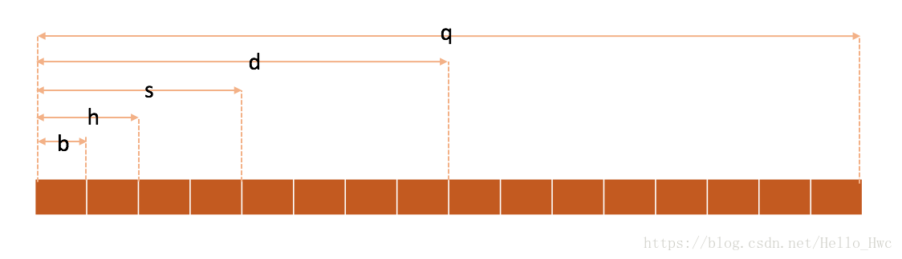


## Hello world


和任何教程一样， 先看看汇编最简单的汇编代码。新建一个helloworld.c:

```
#include <stdio.h>

int main()
{
    printf("hello， world\n");
    return 0;
}
```

然后，生成汇编文件：

```
xcrun --sdk iphoneos clang -S -arch arm64 helloworld.c
```

> **也可以在XCode中，Product -> Perform Action -> Assemble 来生成汇编文件。**

```
	.section	__TEXT，__text，regular，pure_instructions
	.ios_version_min 11， 2
	.globl	_main
	.p2align	2
_main:                                  ; @main
; BB#0:
	sub	sp， sp， #32             ; =32
	stp	x29， x30， [sp， #16]     ; 8-byte Folded Spill
	add	x29， sp， #16            ; =16
	stur	wzr， [x29， #-4]
	adrp	x0， l_.str@PAGE
	add	x0， x0， l_.str@PAGEOFF
	bl	_printf
	mov	w8， #0
	str	w0， [sp， #8]            ; 4-byte Folded Spill
	mov	 x0， x8
	ldp	x29， x30， [sp， #16]     ; 8-byte Folded Reload
	add	sp， sp， #32             ; =32
	ret

	.section	__TEXT，__cstring，cstring_literals
l_.str:                                 ; @.str
	.asciz	"hello， world\n"


.subsections_via_symbols

```

汇编代码几个规则：

1. 以`.`（点）开头的是汇编器指令

	> **汇编器指令是告诉汇编器如何生成机器码的**，阅读汇编代码的时候通常可以忽略掉。
	  
	```
	.section	__TEXT，__text，regular，pure_instructions
	```  

    表示接下来的内容在生成二进制代码的时候，应该生成到Mach-O文件`__TEXT`（Segment）中的`__text`（Section）
	
2. 以`:`（冒号）结尾的是标签(Label)

	> 标签是很有必要的，这样其他函数可以通过字符串匹配，定位到函数的具体位置，其中，以小写字母`l`开头的是本地(local)标签，只能用于函数内部。
	
去除这些无用的部分后，main函数对应的汇编代码：


>ARM中，栈内存是由高地址向低地址分配的，所以栈顶置针向低移动，就是分配临时存储空间，栈顶置针向高移动，就是释放临时存储空间。

这里我们先来看看@1和@5，这两部分是对称的，分别称为方法头([Function prologue](https://en.wikipedia.org/wiki/Function_prologue))和方法尾([Function prologue
](https://en.wikipedia.org/wiki/Function_prologue#Epilogue))。

- 在方法头部，通过向下移动栈指针sp来在栈上分配内存，把之前状态的sp和lr保存到栈最顶部的16个Byte，接着根据arm64的约定，把sp(x29)设置为栈顶部.
- 在方法尾，恢复栈上的sp和lr到寄存器，然后向上移动栈指针sp，来释放栈上的内存。

@2， 把零寄存器中的值（0）存入到sp-4Byte的位置，为返回值预留栈空间

@3，我们通过“**内存中页的地址+偏移量**”的方式找到了字符串"hello world"在内存中的位置，然后把这个值写入到x0中，作为参数传递给接下来的方法调用，接着调用`printf`

@4， arm寄存器不支持直接把值写入内存，所以首先把返回值0写入到w8中，然后把w0写入到sp+8Byte的内存中，最后把x8(存储了0)写入到x0，作为返回值。

知识点：

> - LDR (**L**oa**D** Register) 将数据从内存读取到寄存器。
> - STR (**ST**ore **R**egister) 将数据从寄存器存储到内存。

## 函数调用

新建max.c

```
#include <stdio.h>
  
int max(int a， int b){
    if(a >=b){
        return a;
    }else{
        return b;
    }
}

int main()
{
    int a = 10;
    int b = 20;
    int c = max(a，b);
    return 0;
}
```

生成汇编后，分别查看两个函数

max

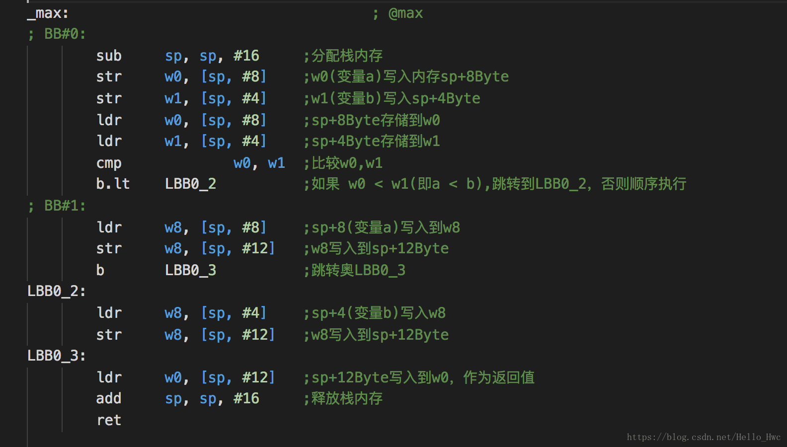

main

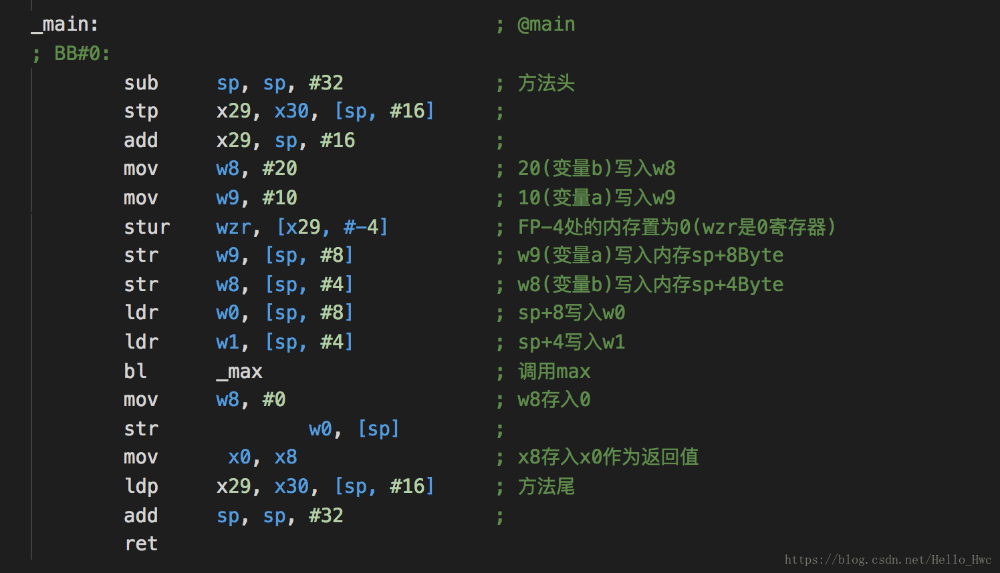


这里，我们看到了传入参数的时候，参数是放到x0，x1中的：

```
ldr     w0， [sp， #8]            ; sp+8写入w0
ldr     w1， [sp， #4]            ; sp+4写入w1
bl      _max                    ; 调用max
```

函数内部，从x0/x1中读取参数，然后把临时变量存储到栈上

```
str     w0， [sp， #8]    ;w0(变量a)写入内存sp+8Byte
str     w1， [sp， #4]    ;w1(变量b)写入sp+4Byte
``` 

函数的参数传入和返回具有以下规则：

- **当函数参数个数小于等于8个的时候，x0-x7依次存储前8个参数**
- **参数个数大于8个的时候，多余的参数会通过栈传递**
- **方法通常通过X0返回数据，如果返回的数据结构较大，则通过x8进行返回**


## Call Stack


我们再来看看hello world的汇编的方法头和方法尾：

```
//方法头
sub	sp， sp， #32             ; =32
stp	x29， x30， [sp， #16]     ; 8-byte Folded Spill
add	x29， sp， #16            ; =16

bl	_printf //子程序调用

//方法尾
ldp	x29， x30， [sp， #16]     ; 8-byte Folded Reload
add	sp， sp， #32             ; =32
```

### 方法头：

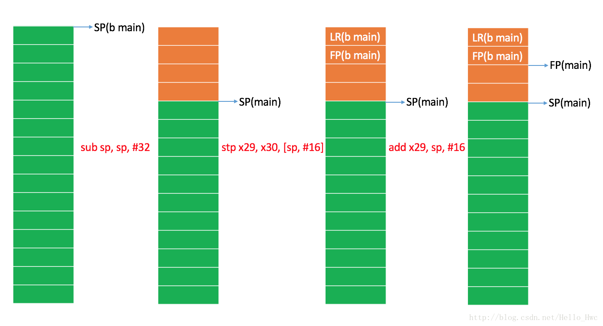

图中，绿色表示空闲的栈内存，橘色表示main函数占用的栈内存。b main的含义是before main，即main函数执行之前的状态。

从图中我们可以清楚的看到，方法头中分配了栈空间，然后保存了之前的LR和FP，接着把FP指向了当前程序的高地址。

### 子程序(printf)调用

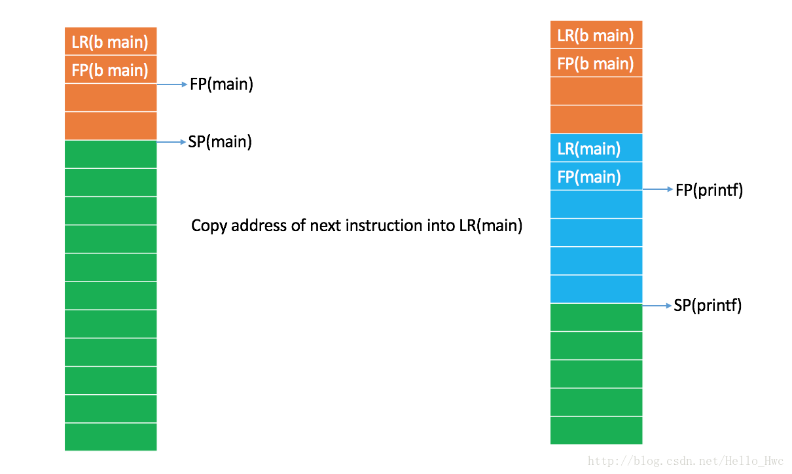

调用`bl	_printf`的时候，**bl命令首先会拷贝下一条执行的指令到LR**，这样子程序返回的时候才知道在哪条指令处继续执行。

然后可以看到，子程序`printf`的方法头也和main类似，分配空间，保存main函数的LR，FP，然后重置FP到栈高地址。

### 方法尾

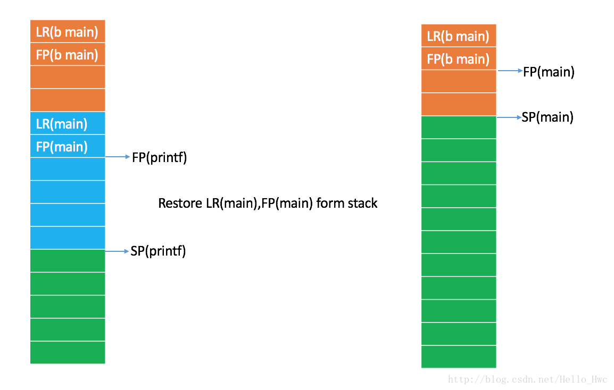

在printf返回的时候，首先从栈上恢复main函数的LR和FP，然后释放栈空间。可以从图中看到，方法返回后FP和SP都和调用printf之前一致。

从栈上恢复了LR后，此时LR中存储的时候main函数调用printf后的下一个指令地址，CPU读取LR中的指令，继续执行main函数。

## Stack backtrace

栈回溯对代码调试和crash定位有很重大的意义，通过之前几个步骤的图解，栈回溯的原理也相对比较清楚了。

1. 通过当前的SP，FP可以得到当前函数的stack frame，通过PC可以得到当前执行的地址。
2. 在当前栈的FP上方，可以得到Caller(调用者)的FP，和LR。通过偏移，我们还可以获取到Caller的SP。由于LR保存了Caller下一条指令的地址，所以实际上我们也获取到了Caller的PC
3. 有了Caller的FP，SP和PC，我们就可以获取到Caller的stack frame信息，由此递归就可以不获取到所有的Stack Frame信息。

栈回溯的过程中，我们拿到的是函数的地址，又是如何通过函数地址获取到函数的名称和偏移量的呢？

- 对于系统的库，比如`CoreFoundation`我们可以直接通过系统的符号表拿到
- 对于自己代码，则依赖于编译时候生成的dsym文件。

这个过程我们称之为`symbolicate`，对于iOS设备上的crash log，我们可以直接通过XCode的工具`symbolicatecrash`来符号化：

```
cd /Applications/Xcode.app/Contents/SharedFrameworks/DVTFoundation.framework/Versions/A/Resources
./symbolicatecrash ~/Desktop/1.crash ~/Desktop/1.dSYM > ~/Desktop/result.crash
```

当然，可以用工具`dwarfdump`去查询一个函数地址：

```
dwarfdump --lookup 0x000000010007528c  -arch arm64 1.dSYM
```


## 代码片

这一节里，我们来看看日常开发中经常遇到的代码片编译过后的汇编，在积累了足够的代码片后，再去看程序的汇编，就比较容易了。

### `if/else`

C代码

```
int a = 10;
if (a > 8){
    a = a + 1;
}
```

汇编

```
	mov	w8， #10
	cmp		w8， #8          ; =8
	b.le	LBB0_2
; BB#1:
	ldr	w8， [sp， #8]
	add	w8， w8， #1              ; =1
	str	w8， [sp， #8]
LBB0_2:
	#...	
```

`a > 8`是通过`cmp`指令实现的，比较的结果存储在`PSR`(指令状态寄存器中)，接着通过`b.le`（less or equal）读取PSR，

- 如果小于等于8，就直接跳转到`LBB0_2`中进行方法返回
- 如果大于8，则顺序执行，进入if的代码块内部，执行 a = a + 1

> 可以看到，PRS + 跳转指令(**b.le**)给予了汇编极大的灵活性，代码不再一层不变的顺序执行。

### `for`

C代码

```
int a = 3;
while(a < 10){
    a = a + 1;
}
```

汇编代码

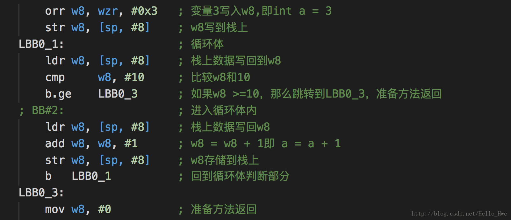

> 不难看出，for和if类似，都是通过条件判断，然后跳转到指定的符号去执行代码。


### 指针

指针在汇编的层面上是什么呢？**指针本质上就是一个变量的地址**。汇编层面上只有寄存器和内存和数据

C代码

```
void hello_word(int * a){
    *a = 10;
}

int main(){
    int * a;
    hello_word(a);
    printf("%d"，*a);
    return 0;
}
```

汇编：


咋一看什么乱七八糟的东西，这里我们把核心的几行代码抽出来：

```
mov	w9， #11			; 11写入寄存器w9
add	x10， sp， #8     	; x10中存储sp+8Byte的地址，这里x10表示的就是后续的指针变量b
mov	w11， #10 		   	; 10(变量a)写入w11
str	w11， [sp， #8]   	; w11(变量a)写入sp+8Byte处的内存，即把变量a存储到栈上，这一行
str		w9， [x10]   	; 把w9的内容写入x10寄存器所在的地址(sp+8Byte)，即 *b = 11;
```

- 可以看到，把内存地址(sp+8Byte)写入x10，就实现了指针的声明和内存分配
- 往对应内存(sp+8Byte)中写入数据，就实现了指针的赋值

### 结构体

> 结构体本质上就是按照一定规则分配的连续内存。

C代码

```
struct point{
    float x;
    float y;
};
//结构体作为返回值
struct point makePoint(float x，float y){
    struct point p;
    p.x = x;
    p.y = y;
    return p;
}
//结构体作为参数
void logPoint(struct point p){
    printf("(%.2f，%.2f)"，p.x，p.y);
}

int main(){
    struct point p = makePoint(1.5，2.3);
    logPoint(p);
    return 0;
}
```

`makePoint`汇编：

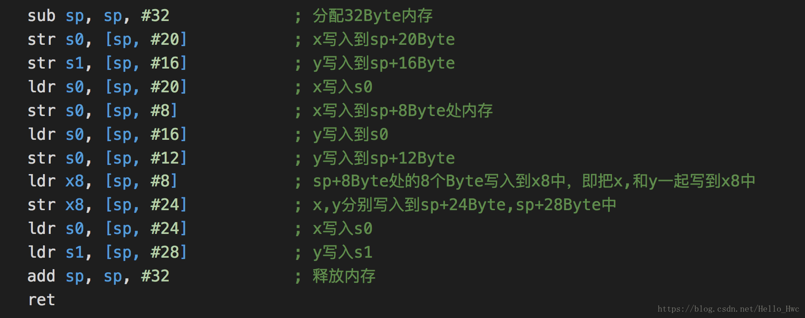

一顿寄存器和栈操作猛如虎，**本质上就是为了把x写入s0，y写入s1作为返回值返回**。

`logPoint`汇编

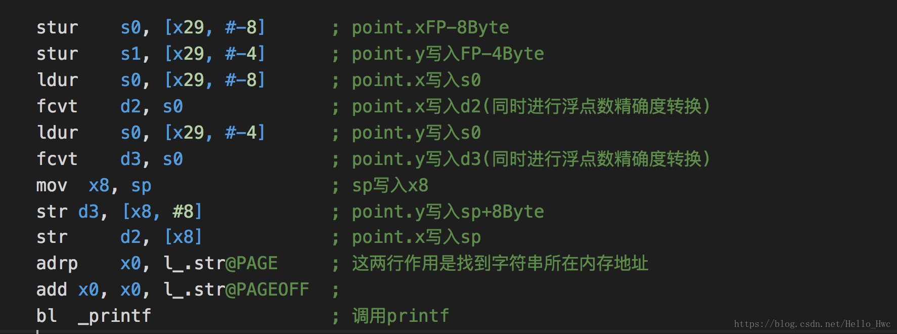

可以看到，结构体作为参数的时候，**参数是通过s0和s1传入的**。

main汇编

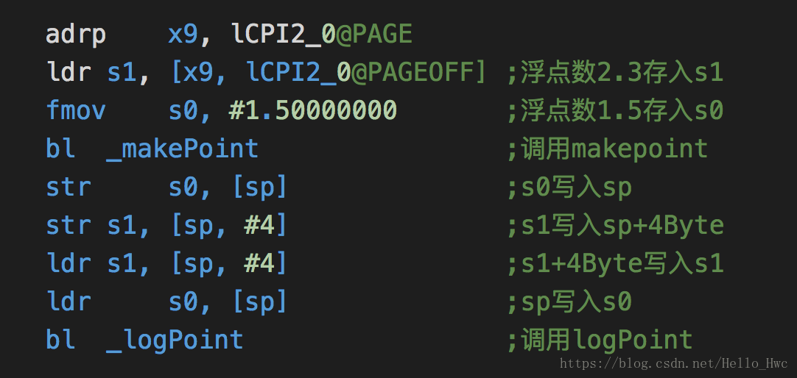

注意，**结构体过大的时候，参数和返回值通过栈来传递，这一点和函数的参数个数过多的时候类似**。


### 数组

C代码

```
#include <stdio.h>

void logArray(int intArray[]，size_t length){
    for(int i = 0;i < length;i++){
        printf("%d"，intArray[i]);
    }
}

int main(){
    int arr[3] = {1，2，3};
    logArray(arr，3);
    return 0;
}

```

`main`汇编：

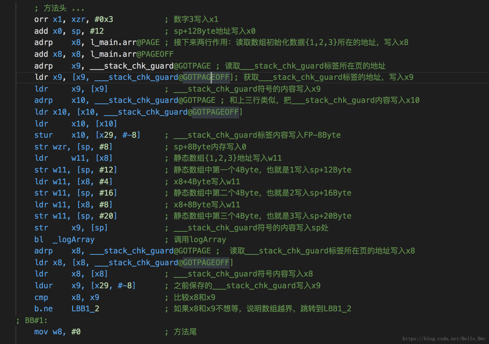

栈的使用情况：

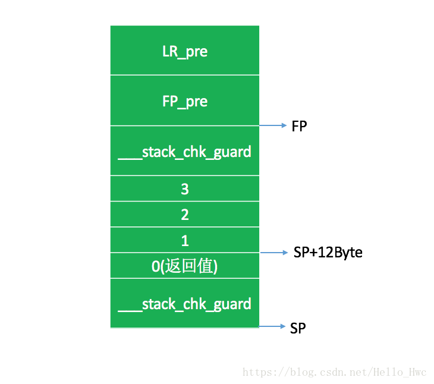

通过汇编，我们能够看到几点：

1. 数组作为函数参数的时候，是以指针的方式传入的，比如这个例子中，是把sp+12Byte的地址作为参数放到x0中，传递给logArray函数的。
2. 在编译过后，会在变量区域的上下各插入一个`___stack_chk_guard`，在方法执行完毕后，检查栈上的`___stack_chk_guard`是否被修改过了，如果被修改过了报错。
3. 初始化数组的变量是存储在代码段的常量区 

	```
		.section	__TEXT，__const
	l_main.arr:
		.long	1                       ; 0x1
		.long	2                       ; 0x2
	.long	3                       ; 0x3
	```

`logArray`汇编：

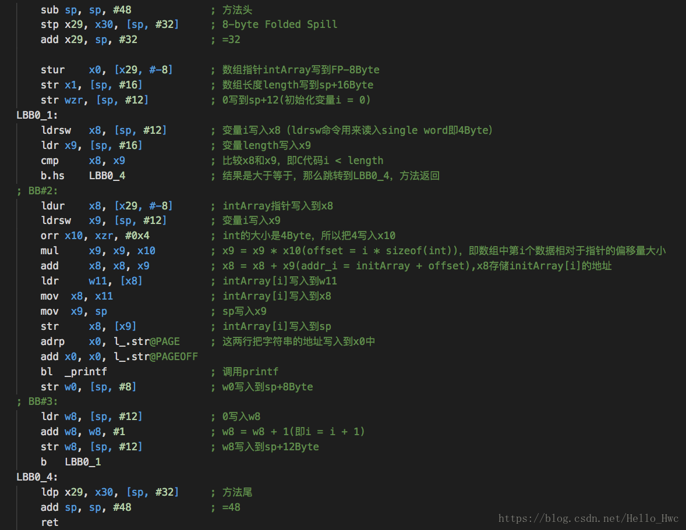

下一篇链接：iOS汇编快速入门下篇（尚未完成）

## 参考链接

- [iOS调试进阶](https://zhuanlan.zhihu.com/c_142064221)
- [iOS应用逆向工程](https://book.douban.com/subject/25826902/)
- [ios-assembly-tutorial](https://www.raywenderlich.com/37181/ios-assembly-tutorial)
- [iOS ABI Function Call Guide](https://developer.apple.com/library/content/documentation/Xcode/Conceptual/iPhoneOSABIReference/Introduction/Introduction.html)
- [Procedure Call Standard for the ARM 64-bit Architecture](https://developer.apple.com/library/content/documentation/Xcode/Conceptual/iPhoneOSABIReference/Articles/ARM64FunctionCallingConventions.html#//apple_ref/doc/uid/TP40013702-SW2)

