## 前言

符号(Symbol)是日常开发中经常接触的一个概念，虽然日常开发中直接应用的场景比较少，但符号编译期和运行时都扮演了重要的角色。

## 符号是什么

维基百科的定义

> A symbol in computer programming is a primitive data type whose instances have a unique human-readable form.

直观理解，符号是一个数据结构，包含了名称(String)和类型等元数据，符号对应一个函数或者数据的地址。

## Symbol Table

符号表存储了当前文件的符号信息，静态链接器(ld)和动态链接器(dyld)在链接的过程中都会读取符号表，另外调试器也会用符号表来把符号映射到源文件。

如果把调试符号裁剪掉(Deployment Postprocessing选择为YES)，那么文件里的断点会失效：

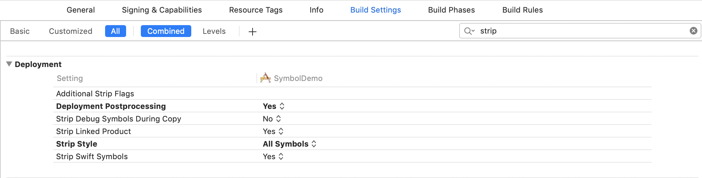

> Release模式下是可以裁剪掉符号的，因为release模式下默认有dsym文件，调试器仍然可以从中获取到信息正常工作。

符号表中存储符号的数据结构如下：

```
struct nlist_64 {
    union {
        uint32_t  n_strx; /* index into the string table */
    } n_un;
    uint8_t n_type;        /* type flag, see below */
    uint8_t n_sect;        /* section number or NO_SECT */
    uint16_t n_desc;       /* see <mach-o/stab.h> */
    uint64_t n_value;      /* value of this symbol (or stab offset) */
};
```

字符串存储在String Table里，String Table的格式很简单，就是一个个字符串拼接而成。符号的n_strx字段存储了符号的名字在String Table的下标。


## Dynamic Symbol Table

Dynamic Symbol Table是动态链接器(dyld)需要的符号表，**是符号表的子集**，对应的数据结构很简单，只存储了符号位于Symbol Table的下标：

```
➜ otool -I main 
main:
...
Indirect symbols for (__DATA,__la_symbol_ptr) 1 entries
address            index
0x000000010000c000     4 //对应符号表的idx为4的符号
....
```

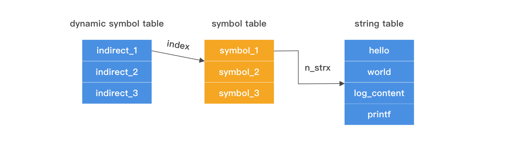

感兴趣的同学可能会问，既然Dynamic Symbol Table只存储了下标，这里otool是如何知道这个Indirect symbol属于`__DATA,__la_symbol_ptr`？

答案是用section_64的reserved字段：**如果一个section是`__DATA,__la_symbol_ptr`，那么它的reserved1字段会存储一个Dynamic Symbol Table下标。**

```
struct section_64 { /* for 64-bit architectures */
  char    sectname[16]; /* name of this section */
  char    segname[16];  /* segment this section goes in */
  uint64_t  addr;   /* memory address of this section */
  uint64_t  size;   /* size in bytes of this section */
  uint32_t  offset;   /* file offset of this section */
  uint32_t  align;    /* section alignment (power of 2) */
  uint32_t  reloff;   /* file offset of relocation entries */
  uint32_t  nreloc;   /* number of relocation entries */
  uint32_t  flags;    /* flags (section type and attributes)*/
  uint32_t  reserved1;  /* reserved (for offset or index) */
  uint32_t  reserved2;  /* reserved (for count or sizeof) */
  uint32_t  reserved3;  /* reserved */
};
```

所以，对于位于`__la_symbol_ptr`的指针，我们可以通过如下的方式来获取它的符号名：

1. 遍历load command，如果发现是`__DATA,__la_symbol_ptr`，那么读取reserved1，即`__la_symbol_ptr`的符号位于Dynamic Symbol Table的起始地址。
2. 遍历`__DATA,__la_symbol_ptr`处的指针，当前遍历的下标为idx，加上reserved1就是该指针对应的Dynamic Symbol Table下标
3. 通过Dynamic Symbol Table，读取Symbol Table的下标
4. 读取Symbol Table，找到String Table的Index
5. 找到符号名称

一张图回顾整个过程，可以看到MachO中各种下标的利用很巧妙：

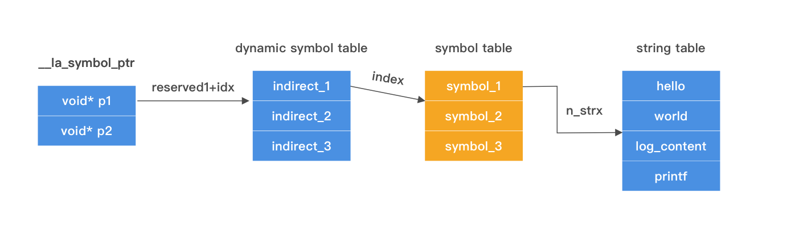

fishhook就是利用类似的原理，遍历`__la_symbol_ptr`，比较指针背后的函数符号名称，如果只指定的字符串，就替换指针的指向。

## DWARF vs DSYM

DWARF(debugging with attributed record formats)是一种调试信息的存储格式，用在Object File里，用来支持源代码级别的调试。

用Xcode编译的中间产物ViewController.o，用MachOView打开后，可以看到很多DWARF的section:

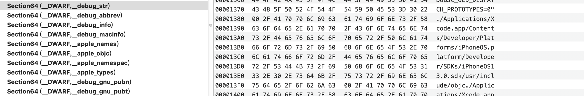

打包上线的时候会把调试符号等裁剪掉，但是线上统计到的堆栈我们仍然要能够知道对应的源代码，这时候就需要把符号写到另外一个单独的文件里，这个文件就是DSYM。

可以通过命令dwarfdump来查询dsym文件的内容，比如查找一个地址

```
dwarfdump --lookup 0x0007434d  -arch arm64 DemoApp.app.dsym
```

crash堆栈还可以直接通过Xcode内置的命令来反符号化

```
export DEVELOPER_DIR="/Applications/Xcode.app/Contents/Developer"
alias symbolicatecrash='/Applications/Xcode.app/Contents/SharedFrameworks/DVTFoundation.framework/Versions/A/Resources/symbolicatecrash'
symbolicatecrash demo.crash DemoApp.app.dsym > result.crash
```

## 裁剪

符号包含的信息太多，处于安全考虑，往往会进行最高级别的裁剪。对于.app，选择裁掉All Symbol，而动态库只能选择Non-Global Symbol，因为动态库需要把Global Symbol保留给外部链接用。

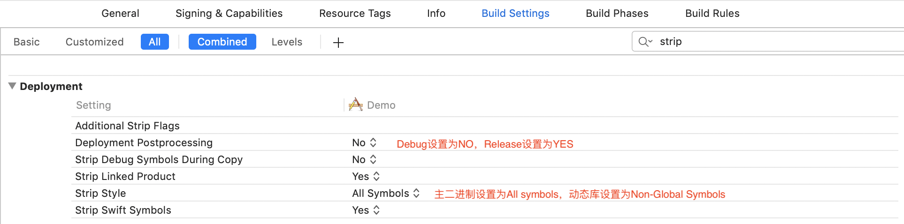

背后裁减的实际命令是`strip`，比如裁减local符号的指令是`strip -x`

## 符号生成规则

C的符号生成规则比较简单，一般的符号都是在函数名上加上下划线，比如main.c里包含mian和mylog两个C函数，对应符号如下：

```
➜ nm main.o
0000000000000000 T _main
                 U _mylog
```

C++因为支持命名空间，函数重载等高级特性，为了避免符号冲突，所以编译器对C++符号做了Symbol Mangling(不同编译器的规则不一样)。

举个例子：

```
namespace MyNameSpace {
    class MyClass{
    public:
        static int myFunc(int);
        static double myFunc(double);
    };
}
```

编译后，分别对应符号

```
➜  DemoApp nm DemoCpp.o 
0000000000000008 T __ZN11MyNameSpace7MyClass6myFuncEd
0000000000000000 T __ZN11MyNameSpace7MyClass6myFuncEi
```

其实，Symbol Mangling规则并不难，刚刚的两个符号是按照如下规则生成的：

- 以`_Z`开头
- 跟着C语言的保留字符串`N`
- 对于namespace等嵌套的名称，接下依次拼接名称长度，名称
- 然后是结束字符`E`
- 最后是参数的类型，比如int是i，double是d

Objective C的符号更简单一些，比如方法的符号是`+-[Class_name(category_name) method:name:]`，除了这些，Objective C还会生成一些Runtime元数据的符号

```
➜  DemoApp nm ViewController-arm64.o 
                 U _OBJC_CLASS_$_BTDRouteBuilder
                 U _OBJC_CLASS_$_BTDRouter
                 U _OBJC_CLASS_$_UIViewController
0000000000000458 S _OBJC_CLASS_$_ViewController
                 U _OBJC_METACLASS_$_NSObject
                 U _OBJC_METACLASS_$_UIViewController
0000000000000480 S _OBJC_METACLASS_$_ViewController
```

所以当链接的时候类找不到了，会报错符号`_OBJC_CLASS_$_CLASSNAME`找不到


当然，如果类的符号没有被裁减掉，运行时就用`_OBJC_CLASS_$_CLASSNAME`作为参数，通过dlsym来获取类指针。

## 符号的种类

按照不同的方式可以对符号进行不同的分类，比如按照可见性划分

- 全局符号(Global Symbol) 对其他编译单元可见
- 本地符号(Local Symbol) 只对当前编译单元可见

按照位置划分：

- 外部符号，符号不在当前文件，需要ld或者dyld在链接的时候解决
- 非外部符号，即当前文件内的符号

nm命令里的小写字母对应着本地符号，大写字母表示全局符号；U表示undefined，即未定义的外部符号

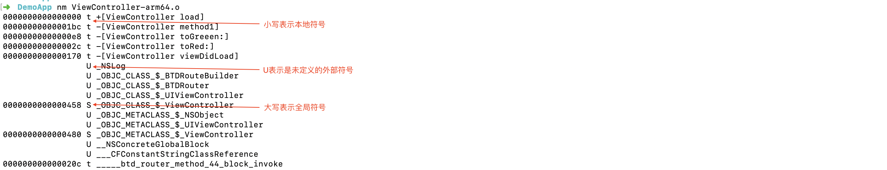

## 可见性

有个很常见的case，就是你有1000个函数，但只有10个函数是公开的，希望最后生成的动态库里不包含其他990个函数的符号，这时候就可以用clang的attribute来实现：

```
//符号可被外部链接
__attribute__((visibility("default")))
//符号不会被放到Dynamic Symbol Table里，意味着不可以再被其他编译单元链接
__attribute__((visibility("hidden")))
```

clang来提供了一个全局的开关，用来设置符号的默认可见性：

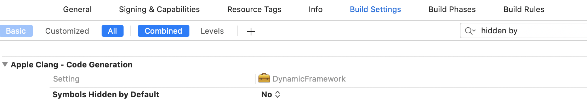

如果动态库的Target把这个开关打开，会发现动态库仍然能编译通过，但是App会报一堆链接错误，因为符号变成了hidden。


但这是一种常见的编译方式：让符号默认是Hidden的，即`-fvisibility=hidden`，然后手动为每个接口加上`__attribute__((visibility("default")))`。

```
//头文件
#define LH_EXPORT __attribute__((visibility("default")))
LH_EXPORT void method_1(void);

//实现文件
LH_EXPORT void method_1(){
    NSLog(@"1");
}
```

## ld

刚刚提到了，链接的时候ld会解决重定位符号的问题，所以ld提供了很多与符号相关的选项。

### -ObjC, -all\_load, -force\_load

ld链接静态库的时候，只有.a中的某个.o符号被引用的时候，这个.o才会被链接器写到最后的二进制文件里，否则会被丢掉，这三个链接选项都是解决保留代码的问题。

- `-ObjC` 保留所有Objective C的代码
- `-force_load` 保留某一个静态库的全部代码
- `-all_load` 保留参与链接的全部的静态库代码

> 这就是为什么一些SDK在集成进来的时候，都要求在other link flags里添加`-ObjC`。

### reexport

假设我有个动态库A，A会链接B，我希望其他链接A动态库也能直接访问到B的符号，从而隐藏B的实现，应该怎么做呢？

答案就是：reexport。

这点在libSystem上体现的尤为明显，libSystem.dylib reexport了像malloc，dyld，macho等更底层动态库的符号。

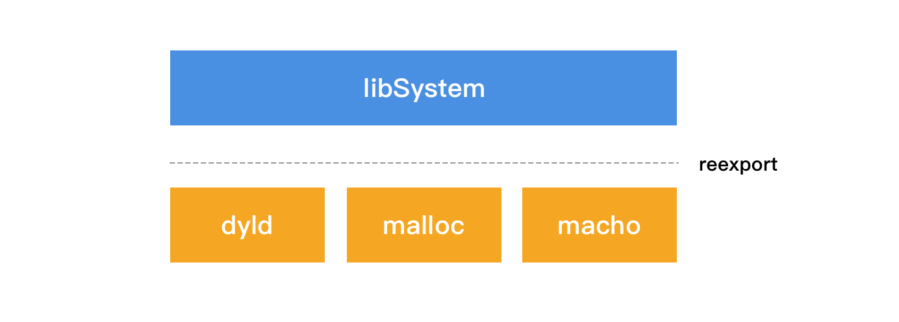

### exported_symbol

动态库因为不知道外面是如何使用的，所以最好的方式是所有头文件暴露出的符号全部导出来。从包大小的角度考虑，肯定是用到哪些符号，保留哪些符号对应的代码，ld提供了这样一个方案，通过exported_symbol来只保留特定的符号。            
            
### tbd                 

链接的过程中，只要知道哪个动态库包括哪些符号即可，其实不需要一个完整的动态库Mach-O。于是Xcode 7开始引入了tbd的概念，即Text Based Stub Library，里面包含了动态库对外提供的符号，**能大幅度减少Xcode的下载大小**。

可以在以下目录下找到tbd文件，文件格式就是普通的文本文件：

```
/Applications/Xcode.app/Contents/Developer/Platforms/iPhoneOS.platform/Developer/SDKs/iPhoneOS.sdk/System/Library/Frameworks
```

以Account.framework为例，在内部可以找到Account.tbd:

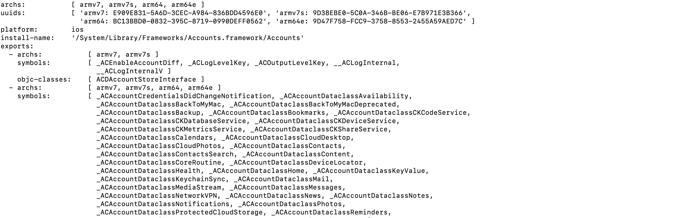

除了包括一些基本信息，如架构，uuid，类，符号等，还有个信息是install-name，这个字段存储了告诉链接器，**动态库在运行时位于系统的位置**。

另外，Xcode里还提供了TBD相关的编译选项：

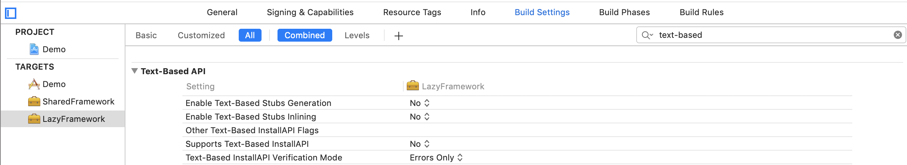


### flat_namespace

ld默认采用二级命名空间，也就是除了会记录符号名称，还会记录符号属于哪个动态库的，比如会记录下来printf来自libSystem

```
➜ xcrun dyldinfo -lazy_bind main
segment section          address    index  dylib            symbol
__DATA  __la_symbol_ptr  0x10000C000 0x0000 libSystem        _printf
```

可以强制让ld使用flat_namespace，使用一级命名空间，就是只记录下来符号的名称，运行时的时候dyld动态查找符号所处的位置。

flat_namespace容易发生符号冲突，比如运行时两个动态库有一样的符号；另外效率也要比二级命名空间低一些。

但flat_namespace可以实现**动态库依赖主二进制这种野路子**。

## 运行时

### bind

应用会访问很多外部的符号，编译的时候是不知道这些符号的运行时地址的，所以需要在运行时绑定。

```
➜ xcrun dyldinfo -bind main
bind information:
segment section          address        type    addend dylib            symbol
__DATA_CONST __got            0x100008000    pointer      0 libSystem        dyld_stub_binder
```

启动的时候，dyld会读取LINKEDIT中的opcode做绑定：

```
➜ xcrun dyldinfo -opcodes main
binding opcodes:
0x0000 BIND_OPCODE_SET_DYLIB_ORDINAL_IMM(1)
0x0001 BIND_OPCODE_SET_SYMBOL_TRAILING_FLAGS_IMM(0x00, dyld_stub_binder)
0x0013 BIND_OPCODE_SET_TYPE_IMM(1)
0x0014 BIND_OPCODE_SET_SEGMENT_AND_OFFSET_ULEB(0x02, 0x00000000)
0x0016 BIND_OPCODE_DO_BIND()
0x0017 BIND_OPCODE_DONE
```

### Lazy Symbol

多数符号在应用的生命周期内是用不到的，于是**ld会尽可能的让符号lazy_bind**，即第一次访问的时候才会绑定。比如log.c里面调用的printf就是lazy符号。

```
➜ xcrun dyldinfo -lazy_bind main
lazy binding information (from lazy_bind part of dyld info):
segment section          address    index  dylib            symbol
__DATA  __la_symbol_ptr  0x10000C000 0x0000 libSystem        _printf
```

为了支持lazy_bind，首先会在`__DATA, __la_symbol_ptr`创建一个指针，这个指针编译期会指向`__TEXT,__stub_helper`，第一次调用的时候，会通过`dyld_stub_binder`把指针绑定到函数实现，下一次调用的时候就不需要再绑定了。

而汇编代码调用printf的时候，直接是调用`__DATA, __la_symbol_ptr`指针指向的地址。

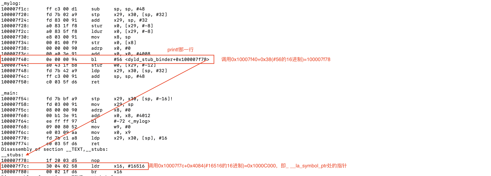

### Weak Symbol

默认情况下Symbol是strong的，weak symbol在链接的时候行为比较特殊：

- strong symbol必须有实现，否则会报错
- 不可以存在两个名称一样的strong symbol
- **strong symbol可以覆盖weak symbol的实现**

应用场景：用weak symbol提供默认实现，外部可以提供strong symbol把实现注入进来，可以用来做依赖注入。

此外还有个概念叫weak linking，这个在做版本兼容的时候很有用：比如一个动态库的某些特性只有iOS 10以上支持，那么这个符号在iOS 9上访问的时候就是NULL的，这种情况就可以用就可以用weak linking。

可以针对单个符号，符号引用加上weak_import即可

```
extern void demo(void) __attribute__((weak_import));
if (demo) {
    printf("Demo is not implemented");
}else{
    printf("Demo is implemented");
}
```

实际开发中，更多的场景是整个动态库都被弱链接，对应Xcode中的optional framework：

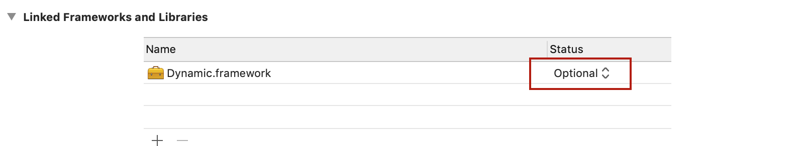

设置成optional后，链接的命令会变成`-weak_framework Dynamic`，对应在dyld bind的时候，符号也会标记为weak import，即允许符号运行时不存在

```
➜  Desktop xcrun dyldinfo -bind /Demo.app/Demo
bind information:
segment section          address        type    addend dylib            symbol
__DATA  __got            0x100003010    pointer      0 Dynamic          _demo (weak import)
```

### dlsym & dlopen

dlopen/dlsym是底层提供一组API，可以在运行时加载动态库和动态的获取符号：

```
extern NSString * effect_sdk_version(void);
```

加载动态库并调用C方法

```
void *handle = dlopen("path to framework", RTLD_LAZY);
NSString *(*func)(void) = dlsym(RTLD_DEFAULT,"effect_sdk_version");
NSString * text = func();
```


### 符号断点

可以在指定的符号上打断点

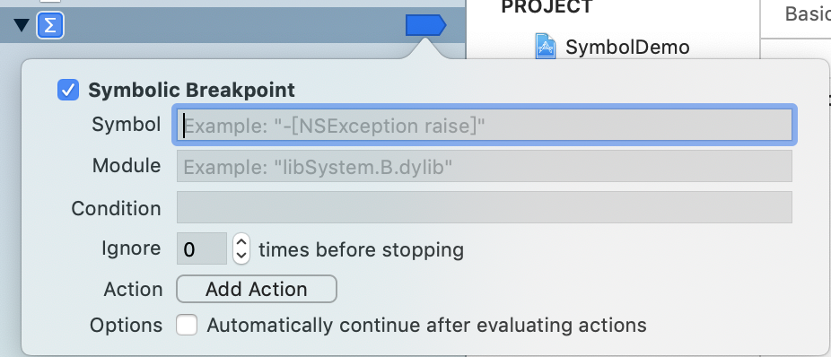

Xcode的GUI能设置的断点，都可以用lldb的命令行设置

```
(lldb) breakpoint set -F "-[UIViewController viewDidAppear:]"
Breakpoint 2: where = UIKitCore`-[UIViewController viewDidAppear:], address = 0x00007fff46b03dab
```

### lldb

运行时，还可以用lldb去查询符号相关的信息，常见的case有两个

查看某个符号的定义

```
(lldb) image lookup -t ViewController
1 match found in /Users/huangwenchen/.../SymbolDemo.app/SymbolDemo:
id = {0xffffffff00046811},
name = "ViewController",
byte-size = 8, 
decl = ViewController.h:11, 
compiler_type = "@interface ViewController : UIViewController @end"
```

查看符号的位置

```
(lldb) image lookup -s ViewController
2 symbols match 'ViewController' in /Users/huangwenchen/.../SymbolDemo.app/SymbolDemo:
        Address: SymbolDemo[0x0000000100005358] (SymbolDemo.__DATA.__objc_data + 0)
        Summary: (void *)0x000000010e74c380: ViewController        
        Address: SymbolDemo[0x0000000100005380] (SymbolDemo.__DATA.__objc_data + 40)
        Summary: (void *)0x00007fff89aec158: NSObject
```

### 基于dyld的hook

都知道C函数hook可以用fishhook来实现，但其实dyld内置了符号hook，像malloc history等Xcode分析工具的实现，就是通过dyld hook和malloc/free等函数实现的。

这里通过dyld来hook NSClassFromString，**注意dyld hook有个优点是被hook的函数仍然指向原始的实现，所以可以直接调用**。

```
#define DYLD_INTERPOSE(_replacement,_replacee) \
__attribute__((used)) static struct{\
    const void* replacement;\
    const void* replacee;\
} _interpose_##_replacee \
__attribute__ ((section ("__DATA,__interpose"))) = {\
    (const void*)(unsigned long)&_replacement,\
    (const void*)(unsigned long)&_replacee\
};

Class _Nullable hooked_NSClassFromString(NSString *aClassName){
    NSLog(@"hello world");
    return NSClassFromString(aClassName);
}
DYLD_INTERPOSE(hooked_NSClassFromString, NSClassFromString);
```

但iOS上被禁用了，只能用于MacOS或者模拟器。

## 总结

平时写代码的时候符号应用的场景并不多，但了解符号、符号表等概念，有助于理解问题的本质，也能够在做程序架构的时候多一些思路。
