## 前言

两年前曾经写过一篇关于编译的文章《[iOS编译过程的原理和应用](https://github.com/LeoMobileDeveloper/Blogs/blob/master/iOS/iOS%E7%BC%96%E8%AF%91%E8%BF%87%E7%A8%8B%E7%9A%84%E5%8E%9F%E7%90%86%E5%92%8C%E5%BA%94%E7%94%A8.md)》，这篇文章介绍了iOS编译相关基础知识和简单应用，但也很有多问题都没有解释清楚：

- Clang和LLVM究竟是什么
- 源文件到机器码的细节
- Linker做了哪些工作
- 编译顺序如何确定
- 头文件是什么？XCode是如何找到头文件的？
- Clang Module
- 签名是什么？为什么要签名

为了搞清楚这些问题，我们来挖掘下XCode编译iOS应用的细节。

## 编译器

> 把一种编程语言(原始语言)转换为另一种编程语言(目标语言)的程序叫做[编译器](https://en.wikipedia.org/wiki/Compiler)。

大多数编译器由两部分组成：前端和后端。

- 前端负责词法分析，语法分析，生成中间代码；
- 后端以中间代码作为输入，进行行架构无关的代码优化，接着针对不同架构生成不同的机器码。

> 前后端依赖统一格式的中间代码(IR)，使得前后端可以独立的变化。新增一门语言只需要修改前端，而新增一个CPU架构只需要修改后端即可。

Objective C/C/C++使用的编译器前端是[clang](https://clang.llvm.org/docs/index.html)，swift是[swift](https://swift.org/compiler-stdlib/#compiler-architecture)，后端都是[LLVM](https://llvm.org/)。

 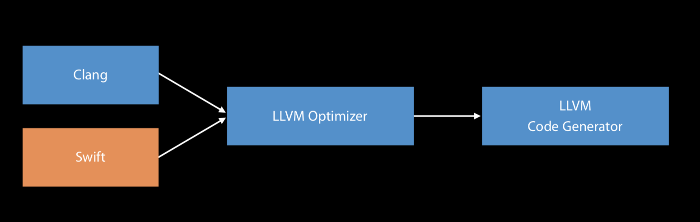

### LLVM

LLVM是一个强大的编译器开发工具套件，LLVM的核心库提供了现代化的source-target-independent[优化器](https://llvm.org/docs/Passes.html)和支持诸多流行CPU架构的代码生成器，这些核心代码是围绕着LLVM IR(中间代码)建立的。

基于LLVM，又衍生出了一些强大的子项目，其中iOS开发者耳熟能详的是：[Clang](http://clang.llvm.org/)和[LLDB](http://lldb.llvm.org/)。

### clang

clang是C语言家族的编译器前端，诞生之初是为了替代GCC，提供更快的编译速度。一张图了解clang编译的大致流程：

 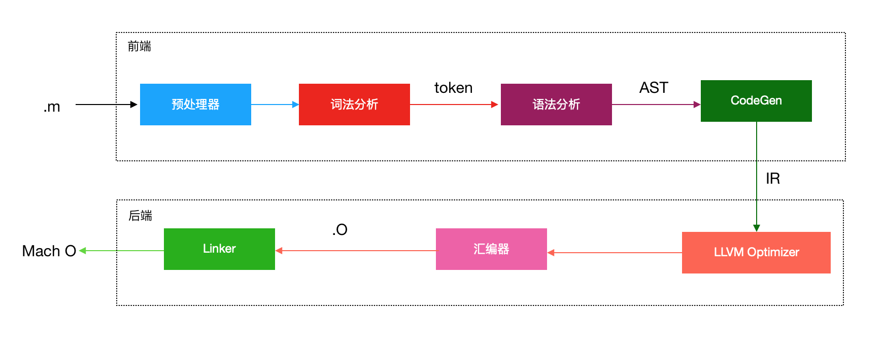


接下来，从代码层面看一下具体的转化过程，新建一个main.c:

```
#include <stdio.h>
// 一点注释
#define DEBUG 1
int main() {
#ifdef DEBUG
  printf("hello debug\n");
#else
  printf("hello world\n");
#endif
  return 0;
}
```

### 预处理(preprocessor)

**预处理会替进行头文件引入，宏替换，注释处理，条件编译(#ifdef)等操作**。

`#include "stdio.h"`就是告诉预处理器将这一行替换成头文件`stdio.h`中的内容，这个过程是递归的：因为`stdio.h`也有可能包含其头文件。

用clang查看预处理的结果：

```
xcrun clang -E main.c
```

预处理后的文件有400多行，在文件的末尾，可以找到main函数

```
int main() {
  printf("hello debug\n");
  return 0;
}
```

可以看到，在预处理的时候，注释被删除，条件编译被处理。

### 词法分析(lexical anaysis)

词法分析器读入源文件的字符流，将他们组织称有意义的词素(lexeme)序列，对于每个词素，此法分析器产生词法单元（token）作为输出。

```
$ xcrun clang -fmodules -fsyntax-only -Xclang -dump-tokens main.c
```

输出：

```
annot_module_include '#include <s'		Loc=<main.c:1:1>
int 'int'	 [StartOfLine]	Loc=<main.c:4:1>
identifier 'main'	 [LeadingSpace]	Loc=<main.c:4:5>
....
```

`Loc=<main.c:1:1>`标示这个token位于源文件main.c的第1行，从第1个字符开始。保存token在源文件中的位置是方便后续clang分析的时候能够找到出错的原始位置。

### 语法分析(semantic analysis)

词法分析的Token流会被解析成一颗抽象语法树(abstract syntax tree - AST)。

```
$ xcrun clang -fsyntax-only -Xclang -ast-dump main.c | open -f
```

main函数AST的结构如下：

```
`-FunctionDecl 0x7fcc188dc700 <main.c:4:1, line:11:1> line:4:5 main 'int ()'
  `-CompoundStmt 0x7fcc188dc918 <col:12, line:11:1>
    |-CallExpr 0x7fcc188dc880 <line:6:3, col:25> 'int'
    | |-ImplicitCastExpr 0x7fcc188dc868 <col:3> 'int (*)(const char *, ...)' <FunctionToPointerDecay>
    | | `-DeclRefExpr 0x7fcc188dc7a0 <col:3> 'int (const char *, ...)' Function 0x7fcc188c5160 'printf' 'int (const char *, ...)'
    | `-ImplicitCastExpr 0x7fcc188dc8c8 <col:10> 'const char *' <BitCast>
    |   `-ImplicitCastExpr 0x7fcc188dc8b0 <col:10> 'char *' <ArrayToPointerDecay>
    |     `-StringLiteral 0x7fcc188dc808 <col:10> 'char [13]' lvalue "hello debug\n"
    `-ReturnStmt 0x7fcc188dc900 <line:10:3, col:10>
      `-IntegerLiteral 0x7fcc188dc8e0 <col:10> 'int' 0
```

有了抽象语法树，clang就可以对这个树进行分析，找出代码中的错误。比如类型不匹配，亦或Objective C中向target发送了一个未实现的消息。

**AST是开发者编写clang插件主要交互的数据结构**，clang也提供很多API去读取AST。更多细节：[Introduction to the Clang AST](https://clang.llvm.org/docs/IntroductionToTheClangAST.html)。

### CodeGen

CodeGen遍历语法树，生成LLVM IR代码。LLVM IR是前端的输出，后端的输入。

```
xcrun clang -S -emit-llvm main.c -o main.ll
```

main.ll文件内容：

```
...
@.str = private unnamed_addr constant [13 x i8] c"hello debug\0A\00", align 1

; Function Attrs: noinline nounwind optnone ssp uwtable
define i32 @main() #0 {
  %1 = alloca i32, align 4
  store i32 0, i32* %1, align 4
  %2 = call i32 (i8*, ...) @printf(i8* getelementptr inbounds ([13 x i8], [13 x i8]* @.str, i32 0, i32 0))
  ret i32 0
}
...
```

Objective C代码在这一步会进行runtime的桥接：property合成，ARC处理等。

LLVM会对生成的IR进行优化，优化会调用相应的Pass进行处理。Pass由多个节点组成，都是[Pass](http://llvm.org/doxygen/classllvm_1_1Pass.html)类的子类，每个节点负责做特定的优化，更多细节：[Writing an LLVM Pass](https://llvm.org/docs/WritingAnLLVMPass.html)。

### 生成汇编代码

LLVM对IR进行优化后，会针对不同架构生成不同的目标代码，最后以汇编代码的格式输出：

生成arm 64汇编：

```
$ xcrun clang -S main.c -o main.s
```

查看生成的main.s文件，篇幅有限，对汇编感兴趣的同学可以看看我的这篇文章：[iOS汇编快速入门](https://github.com/LeoMobileDeveloper/Blogs/blob/master/Basic/iOS%20assembly%20toturial%20part%201.md)。

```
_main:                                  ## @main
        .cfi_startproc
## %bb.0:
        pushq   %rbp
        .cfi_def_cfa_offset 16
        .cfi_offset %rbp, -16
        movq    %rsp, %rbp
...
```

### 汇编器

汇编器以汇编代码作为输入，将汇编代码转换为机器代码，最后输出目标文件(object file)。

```
$ xcrun clang -fmodules -c main.c -o main.o
```

还记得我们代码中调用了一个函数`printf`么？通过nm命令，查看下main.o中的符号

```
$ xcrun nm -nm main.o
                 (undefined) external _printf
0000000000000000 (__TEXT,__text) external _main
```

`_printf`是一个是undefined external的。undefined表示在当前文件暂时找不到符号`_printf `，而external表示这个符号是外部可以访问的，对应表示文件私有的符号是`non-external`。

**Tips**：什么是符号(Symbols)? 符号就是指向一段代码或者数据的名称。还有一种叫做WeakSymols，也就是并不一定会存在的符号，需要在运行时决定。比如iOS 12特有的API，在iOS11上就没有。

### 链接

**连接器把编译产生的.o文件和（dylib,a,tbd）文件，生成一个mach-o文件。**

```
$ xcrun clang main.o -o main
```

我们就得到了一个mach o格式的可执行文件

```
$ file main
main: Mach-O 64-bit executable x86_64
$ ./main 
hello debug
```

在用nm命令，查看可执行文件的符号表：

```
$ nm -nm main
                 (undefined) external _printf (from libSystem)
                 (undefined) external dyld_stub_binder (from libSystem)
0000000100000000 (__TEXT,__text) [referenced dynamically] external __mh_execute_header
0000000100000f60 (__TEXT,__text) external _main
```

_printf仍然是`undefined`，但是后面多了一些信息：`from libSystem`，表示这个符号来自于`libSystem`，会在运行时动态绑定。

## XCode编译

通过上文我们大概了解了Clang编译一个C语言文件的过程，但是XCode开发的项目不仅仅包含了代码文件，还包括了图片，plist等。以的iOS App为例，我们来看看在XCode中编译一次都要经过哪些过程？

新建一个单页面的Demo工程：CocoaPods依赖AFNetworking和SDWebImage，同时依赖于一个内部Framework。按下Command+B，在XCode的Report Navigator模块中，可以找到编译的详细日志：

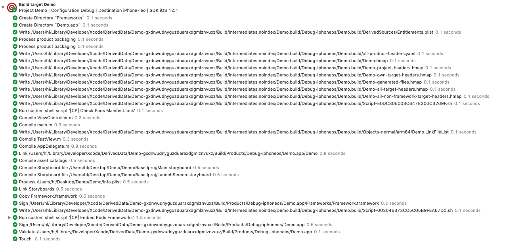

详细的步骤如下：

- 创建Product.app的文件夹
- 把Entitlements.plist写入到DerivedData里，处理打包的时候需要的信息（比如application-identifier）。
- 创建一些辅助文件，比如各种.hmap，这是headermap文件，具体作用下文会讲解。
- 执行CocoaPods的编译前脚本：检查Manifest.lock文件。
- 编译.m文件，生成.o文件。
- 链接动态库，o文件，生成一个mach o格式的可执行文件。
- 编译assets，编译storyboard，链接storyboard
- 拷贝动态库Logger.framework，并且对其签名
- 执行CocoaPods编译后脚本：拷贝CocoaPods Target生成的Framework
- 对Demo.App签名，并验证（validate）
- 生成Product.app

## 编译顺序

编译的时候有很多的Task(任务)要去执行，XCode如何决定Task的执行顺序呢？

> 答案是：依赖关系。

还是以刚刚的Demo项目为例，整个依赖关系如下：

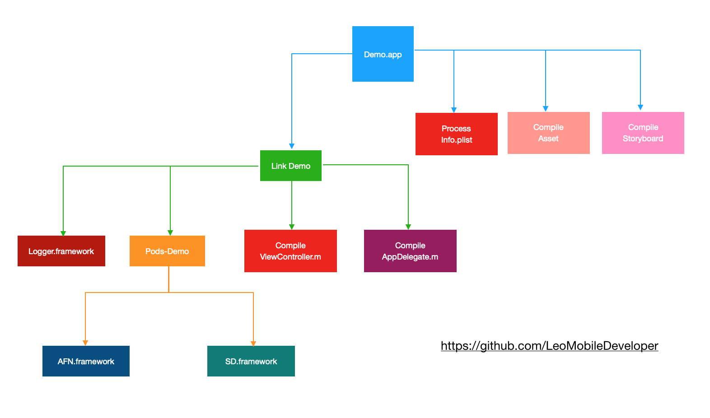

可以从XCode的Report Navigator看到Target的编译顺序：

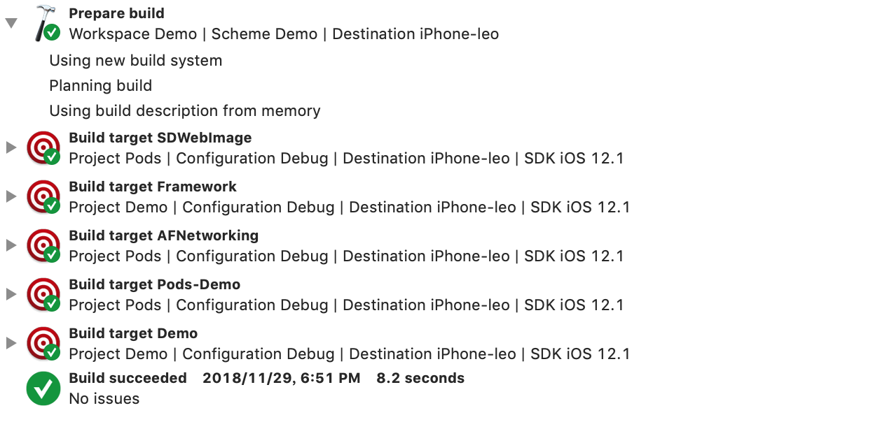

> XCode编译的时候会尽可能的利用多核性能，多Target并发编译。

那么，XCode又从哪里得到了这些依赖关系呢？

- Target Dependencies - 显式声明的依赖关系
- Linked Frameworks and Libraries - 隐式声明的依赖关系
- Build Phase - 定义了编译一个Target的每一步

## 增量编译

日常开发中，一次完整的编译可能要几分钟，甚至几十分钟，而增量编译只需要不到1分钟，为什么增量编译会这么快呢？

因为XCode会对每一个Task生成一个哈希值，只有哈希值改变的时候才会重新编译。

比如，修改了ViewControler.m，只有图中灰色的三个Task会重新执行（这里不考虑build phase脚本）。

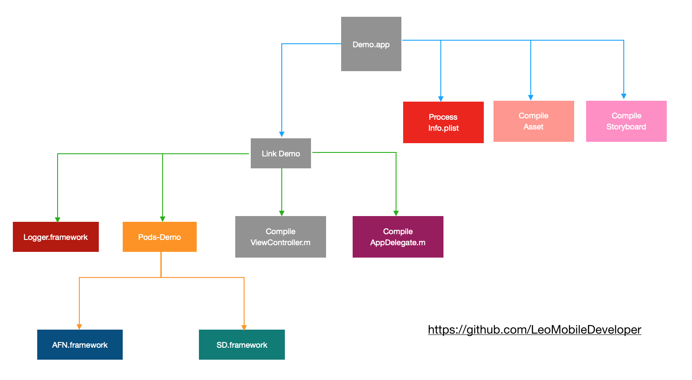

## 头文件

C语言家族中，头文件(.h)文件用来引入函数/类/宏定义等声明，让开发者更灵活的组织代码，而不必把所有的代码写到一个文件里。

头文件对于编译器来说就是一个promise。头文件里的声明，编译会认为有对应实现，在链接的时候再解决具体实现的位置。

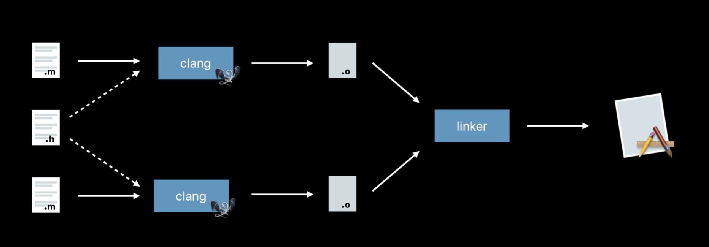

当只有声明，没有实现的时候，链接器就会报错。

> Undefined symbols for architecture arm64:  
>  "_umimplementMethod", referenced from:  
>      -[ClassA method] in ClassA.o  
> ld: symbol(s) not found for architecture arm64  
> clang: error: linker command failed with exit code 1 (use -v to see invocation)

Objective C的方法要到运行时才会报错，因为Objective C是一门动态语言，编译器无法确定对应的方法名(SEL)在运行时到底有没有实现(IMP)。

日常开发中，两种常见的头文件引入方式：

```
#include "CustomClass.h" //自定义
#include <Foundation/Foundation.h> //系统或者内部framework
```

引入的时候并没有指明文件的具体路径，编译器是如何找到这些头文件的呢？

回到XCode的Report Navigator，找到上一个编译记录，可以看到编译ViewController.m的具体日志：

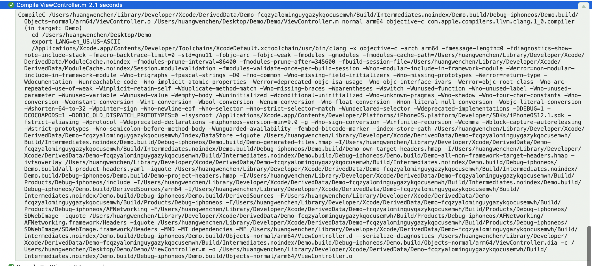

把这个日志整体拷贝到命令行中，然后最后加上`-v`，表示我们希望得到更多的日志信息，执行这段代码，在日志最后可以看到clang是如何找到头文件的：

```
#include "..." search starts here:
 /Users/.../Build/Intermediates.noindex/Demo.build/Debug-iphoneos/Demo.build/Demo-generated-files.hmap (headermap)
 /Users/.../Build/Intermediates.noindex/Demo.build/Debug-iphoneos/Demo.build/Demo-project-headers.hmap (headermap)
 /Users/.../Build/Products/Debug-iphoneos/AFNetworking/AFNetworking.framework/Headers
 /Users/.../Build/Products/Debug-iphoneos/SDWebImage/SDWebImage.framework/Headers
 
#include <...> search starts here:
 /Users/.../Build/Intermediates.noindex/Demo.build/Debug-iphoneos/Demo.build/Demo-own-target-headers.hmap (headermap)
 /Users/.../Build/Intermediates.noindex/Demo.build/Debug-iphoneos/Demo.build/Demo-all-non-framework-target-headers.hmap (headermap)
 /Users/.../Build/Intermediates.noindex/Demo.build/Debug-iphoneos/Demo.build/DerivedSources
 /Users/.../Build/Products/Debug-iphoneos (framework directory)
 /Users/.../Build/Products/Debug-iphoneos/AFNetworking (framework directory)
 /Users/.../Build/Products/Debug-iphoneos/SDWebImage (framework directory)
 /Applications/Xcode.app/Contents/Developer/Toolchains/XcodeDefault.xctoolchain/usr/lib/clang/10.0.0/include
 /Applications/Xcode.app/Contents/Developer/Toolchains/XcodeDefault.xctoolchain/usr/include
 $SDKROOT/usr/include
 $SDKROOT/System/Library/Frameworks (framework directory)
 
End of search list.

```

这里有个文件类型叫做heademap，headermap是帮助编译器找到头文件的辅助文件：存储这头文件到其物理路径的映射关系。

可以通过一个辅助的小工具[hmap](https://github.com/milend/hmap)查看hmap中的内容：

```
192:Desktop Leo$ ./hmap print Demo-project-headers.hmap 
AppDelegate.h -> /Users/huangwenchen/Desktop/Demo/Demo/AppDelegate.h
Demo-Bridging-Header.h -> /Users/huangwenchen/Desktop/Demo/Demo/Demo-Bridging-Header.h
Dummy.h -> /Users/huangwenchen/Desktop/Demo/Framework/Dummy.h
Framework.h -> Framework/Framework.h
TestView.h -> /Users/huangwenchen/Desktop/Demo/Demo/View/TestView.h
ViewController.h -> /Users/huangwenchen/Desktop/Demo/Demo/ViewController.h
```

> Tips: 这就是为什么备份/恢复Mac后，需要clean build folder，因为两台mac对应文件的物理位置可能不一样。

clang发现`#import "TestView.h"`的时候，先在headermap(Demo-generated-files.hmap,Demo-project-headers.hmap)里查找，如果headermap文件找不到，接着在own target的framework里找：

```
/Users/.../Build/Products/Debug-iphoneos/AFNetworking/AFNetworking.framework/Headers/TestView.h
/Users/.../Build/Products/Debug-iphoneos/SDWebImage/SDWebImage.framework/Headers/TestView.h
```

系统的头文件查找的时候也是优先headermap，headermap查找不到会查找own target framework，最后查找SDK目录。

以`#import <Foundation/Foundation.h>`为例，在SDK目录查找时：

首先查找framework是否存在

```
$SDKROOT/System/Library/Frameworks/Foundation.framework
```

如果framework存在，再在headers目录里查找头文件是否存在

```
$SDKROOT/System/Library/Frameworks/Foundation.framework/headers/Foundation.h
```

## Clang Module

传统的`#include/#import`都是文本语义：预处理器在处理的时候会把这一行替换成对应头文件的文本，这种简单粗暴替换是有很多问题的：

1. 大量的预处理消耗。假如有N个头文件，每个头文件又#include了M个头文件，那么整个预处理的消耗是**N*M**。
2. 文件导入后，宏定义容易出现问题。因为是文本导入，并且按照include依次替换，当第一个头文件定义了`#define std hello_world`，而第二个头文件刚好又是C++标准库，那么所有的std都会被替换。
3. 边界不明显。拿到一组.a和.h文件，很难确定.h是属于哪个.a的，需要以什么样的顺序导入才能正确编译。

[clang module](https://clang.llvm.org/docs/Modules.html)不再使用文本模型，而是采用更高效的语义模型。clang module提供了一种新的导入方式:@import，module会被作为一个独立的模块编译，并且产生独立的缓存，从而大幅度提高预处理效率，这样时间消耗从M*N变成了M+N。

XCode创建的Target是Framework的时候，默认define module会设置为YES，从而支持module，当然像Foundation等系统的framwork同样支持module。

`#import <Foundation/NSString.h>`的时候，编译器会检查`NSString.h`是否在一个module里，如果是的话，这一行会被替换成`@import Foundation`。

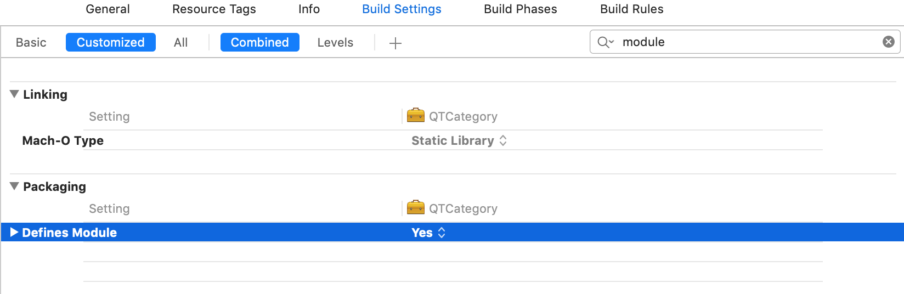

那么，如何定义一个module呢？答案是：modulemap文件，这个文件描述了一组头文件如何转换为一个module，举个例子：

```
framework module Foundation  [extern_c] [system] {
	umbrella header "Foundation.h" // 所有要暴露的头文件
 	export *
	module * {
 		export *
 	}
 	explicit module NSDebug { //submodule
 		header "NSDebug.h"
 		export *
 	}
 }
```

swift是可以直接`import`一个clang module的，比如你有一些C库，需要在Swift中使用，就可以用modulemap的方式。

## Swift编译

现代化的语言几乎都抛弃了头文件，swift也不例外。问题来了，swift没有头文件又是怎么找到声明的呢？

> **编译器干了这些脏活累活**。编译一个Swift头文件，需要解析Target中所有的Swift文件，找到对应的**声明**。

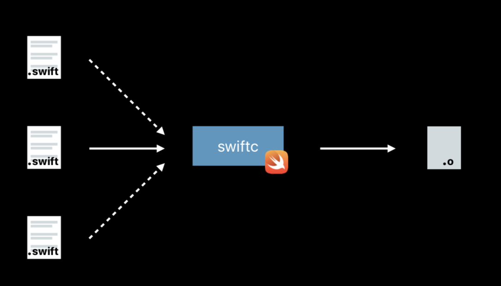

当开发中难免要有Objective C和Swfit相互调用的场景，两种语言在编译的时候查找符号的方式不同，如何一起工作的呢？

**Swift引用Objective C**：

[Swift的编译器](https://swift.org/compiler-stdlib/)内部使用了clang，所以swift可以直接使用clang module，从而支持直接import Objective C编写的framework。

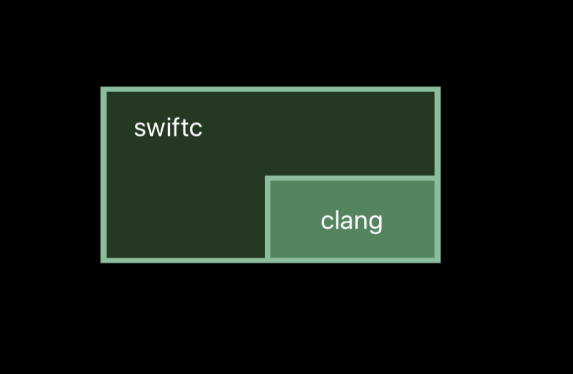

**swift编译器会从objective c头文件里查找符号**，头文件的来源分为两大类：

- `Bridging-Header.h`中暴露给swfit的头文件
- framework中公开的头文件，根据编写的语言不通，可能从modulemap或者umbrella header查找

XCode提供了宏定义`NS_SWIFT_NAME`来让开发者定义Objective C => Swift的符号映射，可以通过Related Items -> Generate Interface来查看转换后的结果：

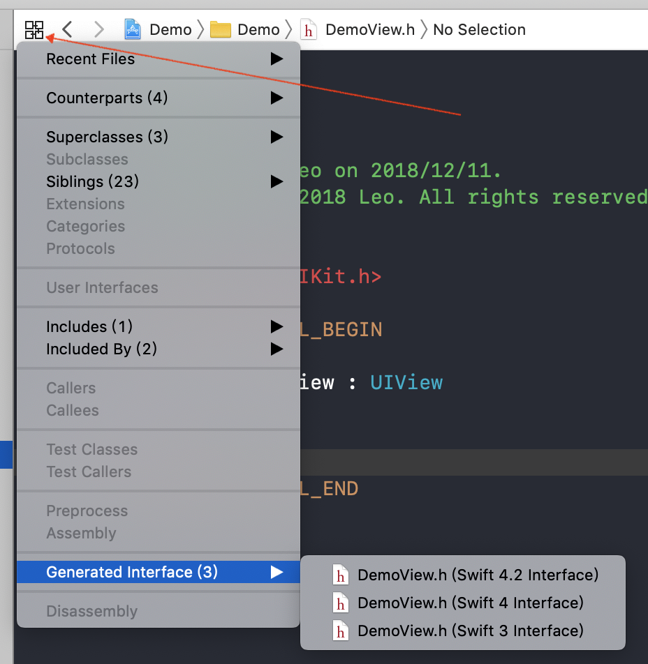

**Objective引用swift**

**xcode会以module为单位，为swift自动生成头文件，供Objective C引用**，通常这个文件命名为`ProductName-Swift.h`。

swift提供了关键词`@objc`来把类型暴露给Objective C和Objective C Runtime。

```
@objc public class MyClass
```

## 深入理解Linker

> 链接器会把编译器编译生成的多个文件，链接成一个可执行文件。链接并不会产生新的代码，只是在现有代码的基础上做移动和补丁。

链接器的输入可能是以下几种文件：

- object file(.o)，单个源文件的编辑结果，包含了由符号表示的代码和数据。
- 动态库(.dylib)，mach o类型的可执行文件，链接的时候只会绑定符号，动态库会被拷贝到app里，运行时加载
- 静态库(.a)，由ar命令打包的一组.o文件，链接的时候会把具体的代码拷贝到最后的mach-o
- tbd，只包含符号的库文件

这里我们提到了一个概念：符号(Symbols)，那么符号是什么呢？

> 符号是一段代码或者数据的名称，一个符号内部也有可能引用另一个符号。

以一段代码为例，看看链接时究竟发生了什么？

源代码：

```
- (void)log{
	printf("hello world\n");
}
```

.o文件：

```
#代码
adrp    x0, l_.str@PAGE
add     x0, x0, l_.str@PAGEOFF
bl      _printf

#字符串符号
l_.str:                                 ; @.str
        .asciz  "hello world\n"
```

在.o文件中，字符串"hello world\n"作为一个符号来引用，汇编代码读取的时候按照l_.str所在的页加上偏移量的方式读取，然后调用printf符号。到这一步，CPU还不知道怎么执行，因为还有两个问题没解决：

1. l_.str在可执行文件的哪个位置？
2. printf函数来自哪里？

再来看看链接之后的mach o文件：

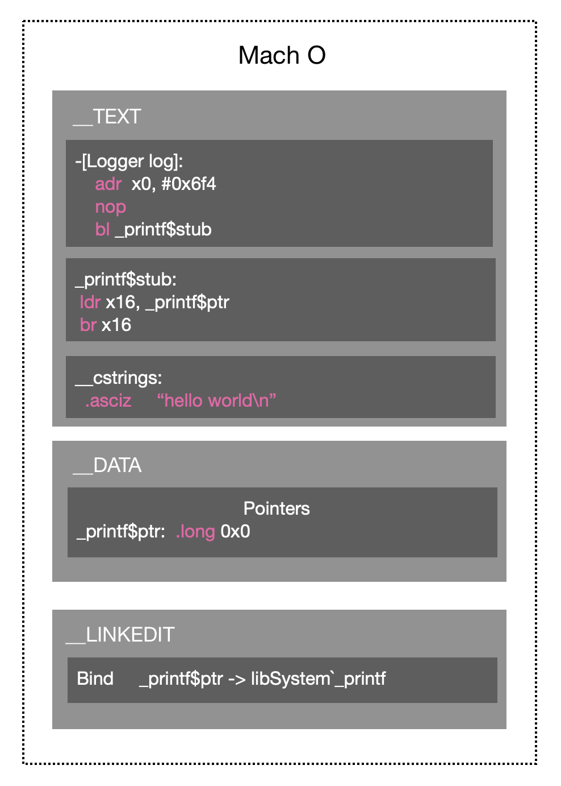

链接器如何解决这两个问题呢？

1. 链接后，不再是以页+偏移量的方式读取字符串，而是直接读虚拟内存中的抵制，解决了l_.str的位置问题。
2. 链接后，不再是调用符号_printf，而是在DATA段上创建了一个函数指针`_printf$ptr`，值为0x0，代码直接调用这个函数指针。启动的时候，dyld会把DATA段上的指针，进行动态绑定，绑定到具体虚拟内存中的`_printf`地址。更多细节，可以参考我之前的这篇文章：[深入理解iOS App的启动过程](https://blog.csdn.net/Hello_Hwc/article/details/78317863)。

> Tips: Mach-O有一个区域叫做LINKEDIT，这个区域用来存储启动的时候，dyld需要动态修复的一些数据：比如刚刚提到的printf在内存中的地址。

## 理解签名

### 基础回顾

非对称加密。在密码学中，非对称加密需要两个密钥：公钥和私钥。私钥加密的只能用公钥解密，公钥加密的只能用私钥解密。

数字签名。数字签名表示我对数据做了个标记，表示这是我的数据，没有经过篡改。

数据发送方Leo产生一对公私钥，私钥自己保存，公钥发给接收方Lina。Leo用摘要算法，对发送的数据生成一段摘要，摘要算法保证了只要数据修改，那么摘要一定改变。然后，用私钥对这个摘要进行加密，和数据一起发送给Lina。

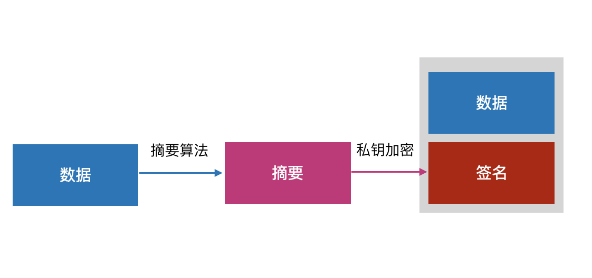

Lina收到数据后，用公钥解密签名，得到Leo发过来的摘要；然后自己按照同样的摘要算法计算摘要，如果计算的结果和Leo的一样，说明数据没有被篡改过。

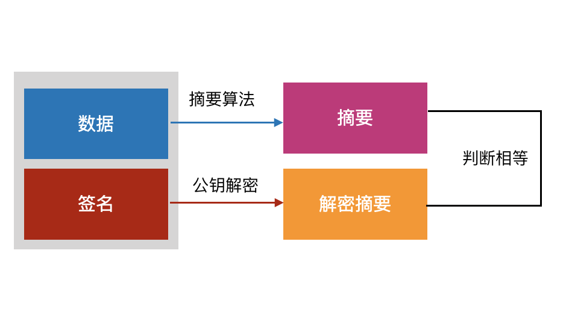

但是，现在还有个问题：Lina有一个公钥，假如攻击者把Lina的公钥替换成自己的公钥，那么攻击者就可以伪装成Leo进行通信，所以**Lina需要确保这个公钥来自于Leo**，可以通过数字证书来解决这个问题。

> 数字证书由CA（Certificate Authority）颁发，以Leo的证书为例，里面包含了以下数据：**签发者**；**Leo的公钥**；**Leo使用的Hash算法**；**证书的数字签名**；到期时间等，这些数据用CA的公钥进行加密。

有了数字证书后，Leo再发送数据的时候，把自己从CA申请的证书一起发送给Lina。Lina收到数据后，先验证证书的数字签名是否正确，如果正确说明证书没有被篡改过，然后用CA的公钥解密证书数据，根据证书的信息就可以确认这是Leo的证书，对应的公钥也是Leo的。

### iOS App签名

为什么要对App进行签名呢？**签名能够让iOS识别出是谁对签名了App，并且签名后，App没有被修改过**，

另外Apple要严格控制App的分发：

1. App来自Apple信任的开发者
2. 安装的设备是Apple允许的设备 
3. App在签名后安装包没有被篡改过

#### 证书

通过上文的讲解，我们知道数字证书里包含着申请证书设备的公钥，所以在Apple开发者后台创建证书的时候，需要上传CSR文件(Certificate Signing Request)，用keychain生成这个文件的时候，就生成了一对公/私钥：**公钥在CSR里，私钥在本地的Mac上**。Apple本身也有一对公钥和私钥：**私钥保存在Apple后台，公钥在每一台iOS设备上**。


#### Provisioning Profile

iOS App安装到设备的途径(非越狱)有以下几种：

1. 开发包(插线，或者archive导出develop包)
2. Ad Hoc
3. App Store
4. 企业证书

开发包和Ad Hoc都会严格限制安装设备，为了把设备uuid等信息一起打包进App，开发者需要配置Provisioning Profile。

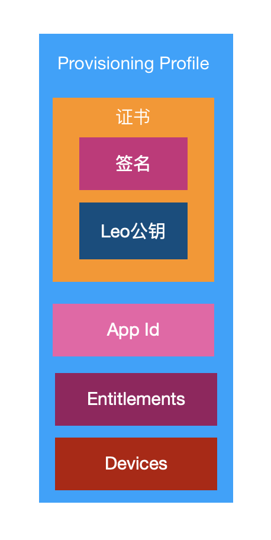

可以通过以下命令来查看Provisioning Profile中的内容：

```
security cms -D -i embedded.mobileprovision > result.plist
open result.plist
```

本质上就是一个编码过后的plist

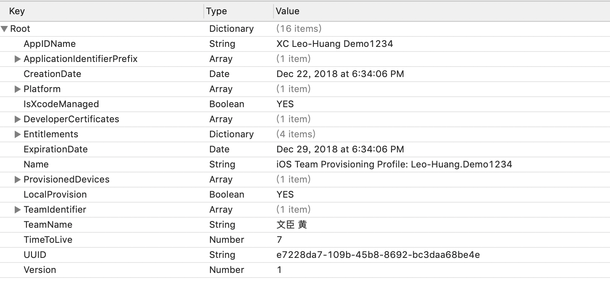


#### iOS签名

生成安装包的最后一步，XCode会调用`codesign`对Product.app进行签名。

创建一个额外的目录`_CodeSignature`以plist的方式存放安装包内每一个文件签名

```
<key>Base.lproj/LaunchScreen.storyboardc/01J-lp-oVM-view-Ze5-6b-2t3.nib</key>
<data>
T2g5jlq7EVFHNzL/ip3fSoXKoOI=
</data>
<key>Info.plist</key>
<data>
5aVg/3m4y30m+GSB8LkZNNU3mug=
</data>
<key>PkgInfo</key>
<data>
n57qDP4tZfLD1rCS43W0B4LQjzE=
</data>
<key>embedded.mobileprovision</key>
<data>
tm/I1g+0u2Cx9qrPJeC0zgyuVUE=
</data>
...
```

代码签名会直接写入到mach-o的可执行文件里，值得注意的是签名是以页(Page)为单位的，而不是整个文件签名：

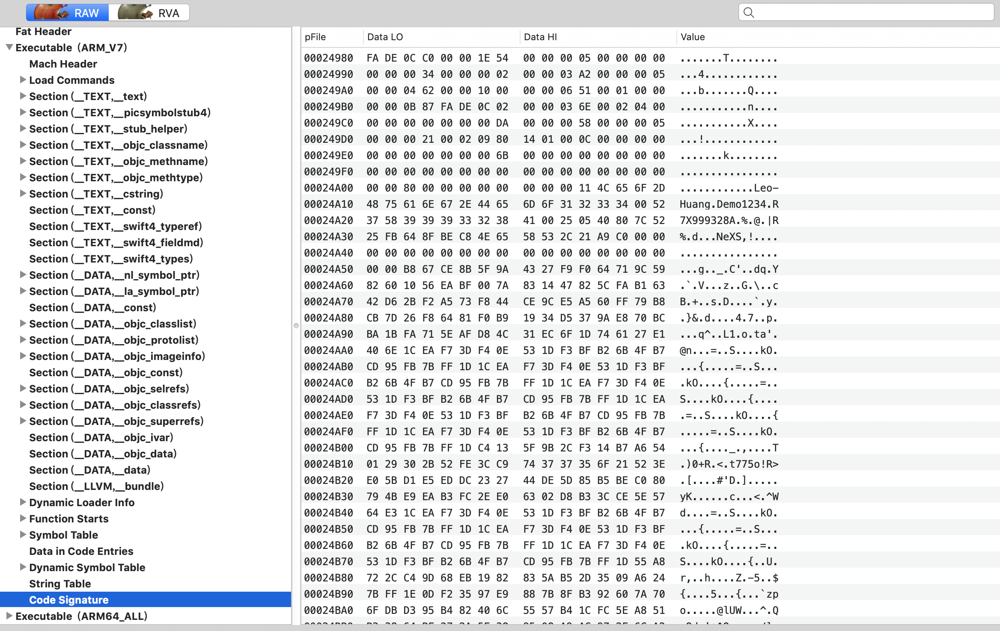


#### 验证

在安装App的时候，

- 从embedded.mobileprovision取出证书，验证证书是否来自Apple信任的开发者
- 证书验证通过后，从证书中取出Leo的公钥
- 读取`_CodeSignature`中的签名结果，用Leo的公钥验证每个文件的签名是否正确
- 文件`embedded.mobileprovision`验证通过后，读取里面的设备id列表，判断当前设备是否可安装(App Store和企业证书不做这步验证)
- 验证通过后，安装App

启动App的时候：

- 验证bundle id，entitlements和`embedded.mobileprovision`中的AppId，entitlements是否一致
- 判断device id包含在embedded.mobileprovision里
	- App Store和企业证书不做验证
- 如果是企业证书，验证用户是否信任企业证书
- App启动后，当缺页中断(page fault)发生的时候，系统会把对应的mach-o页读取物理内存，然后验证这个page的签名是否正确。
- 以上都验证通过，App才能正常启动


## 小结

如有内容错误，欢迎[issue](https://github.com/LeoMobileDeveloper/Blogs)指正。
