## Allocations

Allocations用来分析静态内存分配。

[Demo项目地址](https://github.com/LeoMobileDeveloper/Blogs/tree/master/DemoProjects/iOS/AllocationsDemo)

## Demo App

Demo是一个简单的图片应用：首页只有一个简单的入口；次级页面会读取本地页面，加滤镜，然后按照瀑布流的方式显示出来；第三个页面提供大图显示；

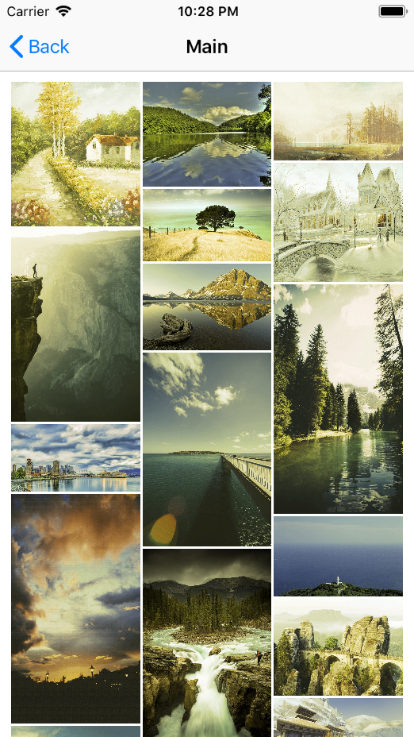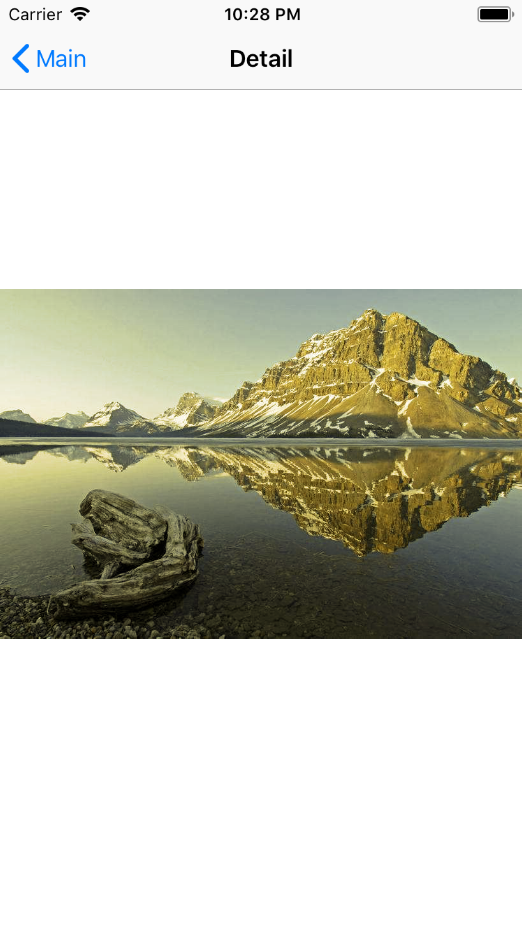

运行代码：点击Photos -> 进入main -> 点击一张图，进入详情页 -> Pop直到回到第一个页面，重复这段操作，从XCode的内存模块发现两个问题。

1. 内存峰值过大
2. 退出界面后，内存没有降低。

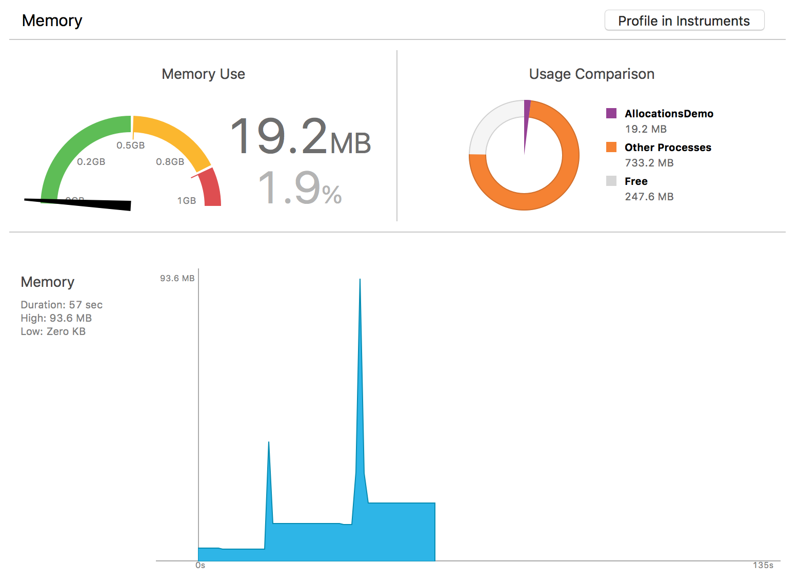


## Statistics

菜单栏选择Product -> Profile，然后选择Allocations，运行项目，按照内存飙升的路径重复操作，采集到内存数据后停止运行。

默认看到的数据是Statistics(静态分析)，点击mark 2可以更改数据分析模式。

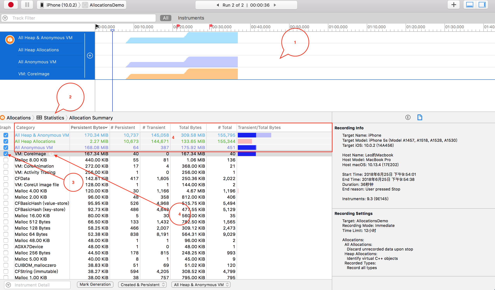

为了更好的解决问题，有必要讲解下这里的内存相关概念：

- All Heap Allocation 堆上malloc分配的内存，不包过虚拟内存区域。
- All Anonymous VM 匿名的虚拟内存区域。何为匿名呢？就是Allocations不知道是你哪些代码创建的内存，**也就是说这里的内存你无法直接控制**。像memory mapped file，CALayer back store等都会出现在这里。这里的内存有些是你需要优化的，有些不是。

表格的每一列的数据解释：

列名| 含义
---- | ---
Graph | 是否需要绘制出来（在mark 1可以看到）
Category |  类别，比如CF对象，OC对象，或者就是一块原始的内存。
Bytes | 大小
Count | 个数
Persistent Bytes | 没有释放的大小
\# Persistent | 没有释放的个数
Transient Bytes |  已经释放的大小
\# Transient | 已经释放的个数
Total Bytes |  Persistent Bytes + Transient Bytes
\# Total |  \# Transient +  \# Persistent
Events |  所有类型的事件数量
Transient/Total Bytes |  柱状图显示百分比

我们勾选前四个Graph，通过曲线的趋势，不难看出问题就出在VM CoreImage上：

我们点一下mark 4，进入详情页，然后选择一个内存对象地址，在右侧我们可以看到这个对象是如何被创建的：

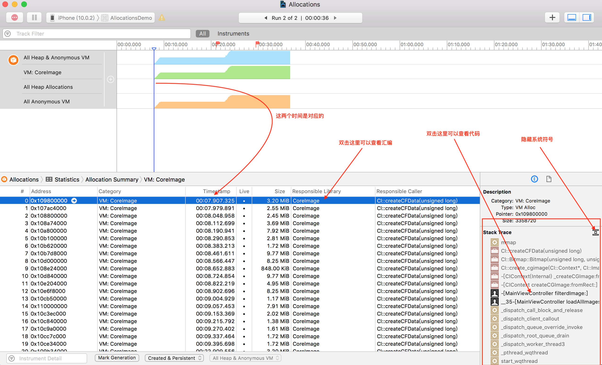

双击这一行，进入汇编界面，可以看出来，最后内存是由mmap分配的：

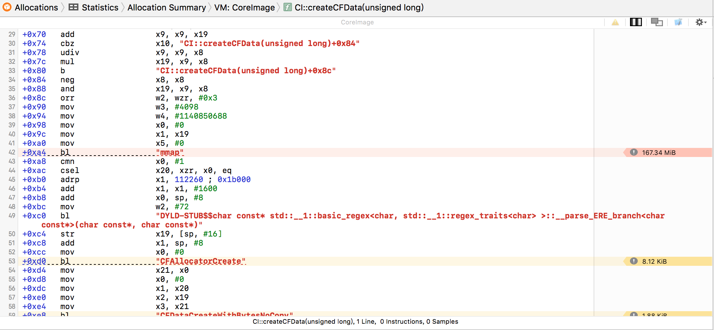

也可以双击右侧Stack Trace，看看自己的代码:

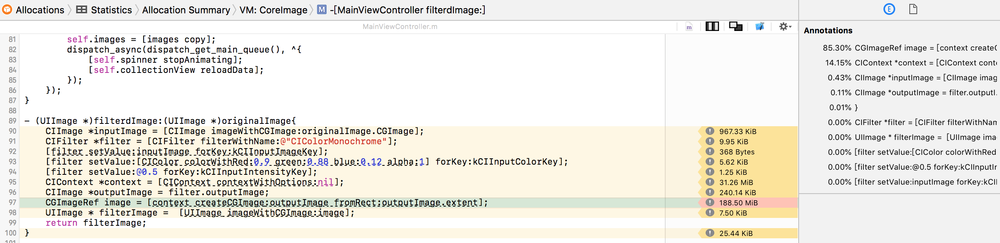


## Generation

利用Generation，我们可以对内存的增量进行分析：时间戳B相比时间戳A有那些内存增加了多少

点最下面的Mark Generation会创建一个Generation，并且在图形区域增加一个小红旗。

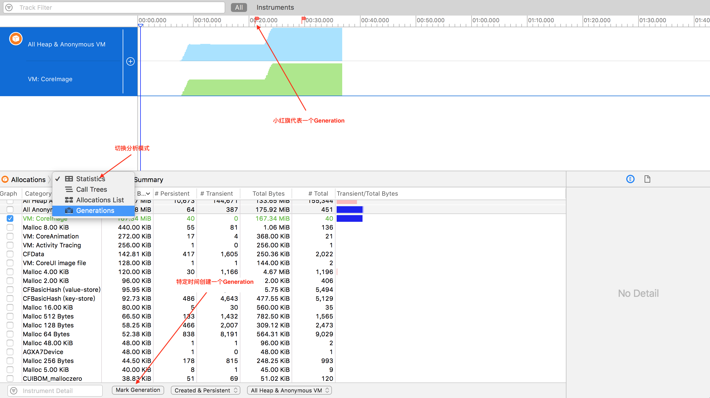

点Statictis，从下拉列表中，选择Generations，我们就可以看到内存增量主要在VM: CoreImage中，这里的每一行也可以点击查看详情，或者在右侧查看栈：

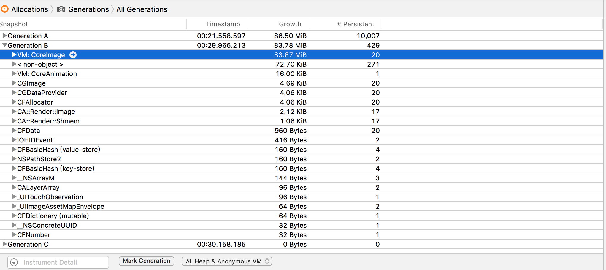

## Call Tree

按照类似的方式，这次我们选择Call Tree来直接分析代码是如何创建内存的，勾选Separator By Thread，按照线程来对内存进行分类：

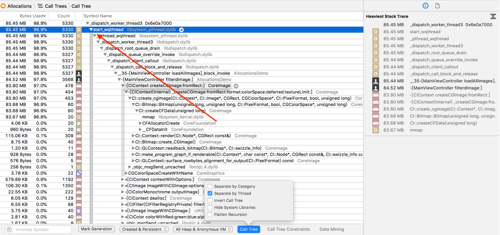

> Tips：按住Option，然后鼠标左键点击图中箭头指向的三角箭头，可以快捷展开调用栈。

也可以勾选：

- Invert Call Tree 倒置函数栈
- Hide System Libraries 隐藏系统库

这样，我们过滤掉了系统符号，同时也用更直观的方式看到了调用栈：

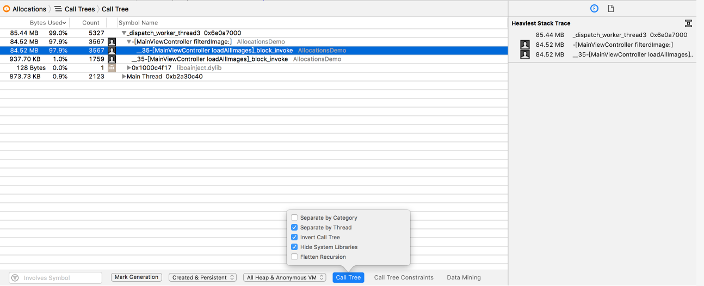

我们同样可以选择一行双击，然后可以进入XCode查看源代码或者汇编代码：

可以看到，引起内存爆增的就是这段代码

```
- (UIImage *)filterdImage:(UIImage *)originalImage{
    CIImage *inputImage = [CIImage imageWithCGImage:originalImage.CGImage];
    CIFilter *filter = [CIFilter filterWithName:@"CIColorMonochrome"];
    [filter setValue:inputImage forKey:kCIInputImageKey];
    [filter setValue:[CIColor colorWithRed:0.9 green:0.88 blue:0.12 alpha:1] forKey:kCIInputColorKey];
    [filter setValue:@0.5 forKey:kCIInputIntensityKey];
    CIContext *context = [CIContext contextWithOptions:nil];
    CIImage *outputImage = filter.outputImage;
    CGImageRef image = [context createCGImage:outputImage fromRect:outputImage.extent];
    UIImage * filterImage =  [UIImage imageWithCGImage:image];
    return filterImage;
}
```

## Allocations list

Allocations List提供了一种更纯粹的方式，让你看到内存的分配的列表，我们一般会选择内存从高到低，看看是不是有什么意外分配的大内存块：

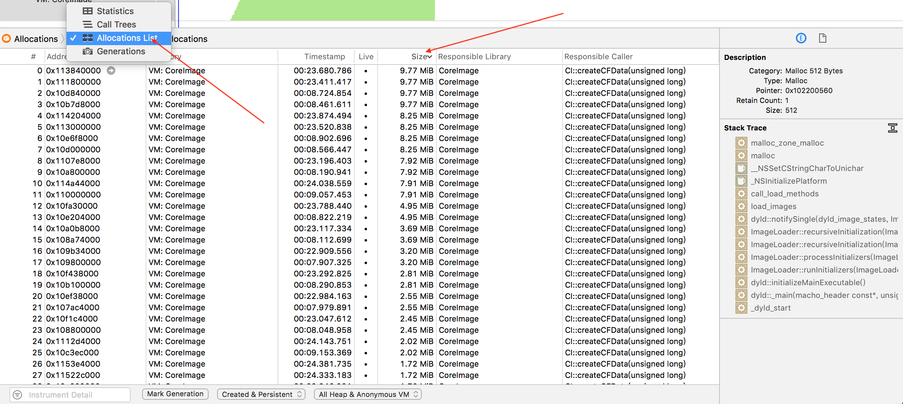

可以看到，排名前几的内存块都是VM:CoreImage，从名字也就不难看出来，这是图片引起的内存。

我们选中某一行，在右侧可以看到具体的调用栈：

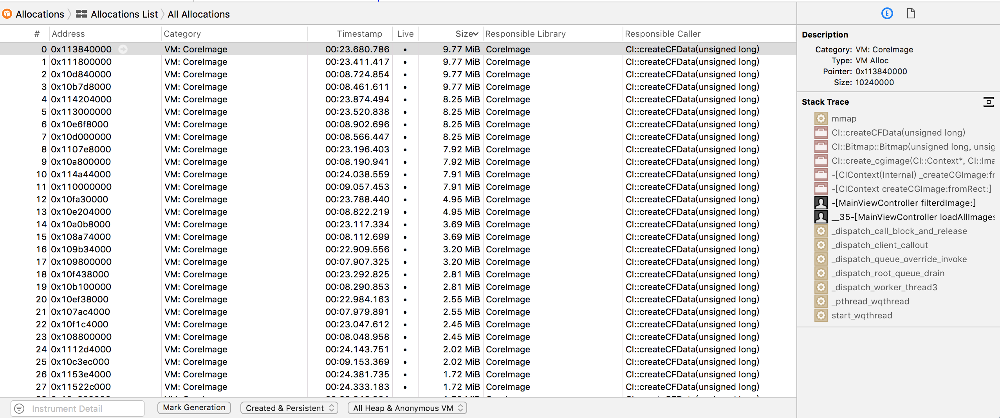


## 解决内存问题

不管是上述那种分析方式，我们都很容易找到问题出现在这段代码里：


那么，为什么这段代码分配内存后没有释放呢？如果有一些CoreFoundation或者CoreGraphics经验，很容易就知道这里应该手动释放内存，这里假设你不知道，那么怎么找到原因呢？

看看这个函数的文档文档就知道了：

```
- (nullable CGImageRef)createCGImage:(CIImage *)image
                            fromRect:(CGRect)fromRect
```

> Creates a Quartz 2D image from a region of a Core Image image object.
Renders a region of an image into a temporary buffer using the context, then creates and returns a Quartz 2D image with the results.

> **You are responsible for releasing the returned image when you no longer need it.**


所以，在创建函数后，我们进行release即可

```
CGImageRef image = [context createCGImage:outputImage fromRect:outputImage.extent];
UIImage * filterImage =  [UIImage imageWithCGImage:image];
CGImageRelease(image);
```

再观察内存：

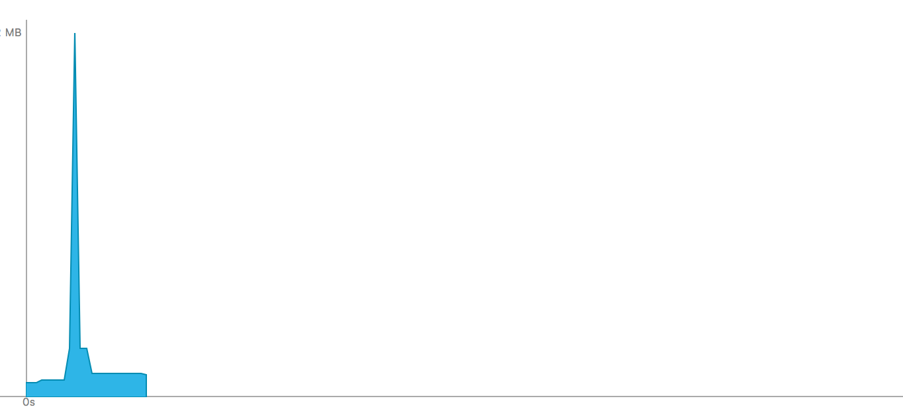


可以看到，仍然有个峰值，我们的瀑布流界面其实并不需要完整的大图塞给ImageView，一个比较常见的优化方式是对图片进行缩放，这里有两点要注意

1. 大图的缩放不要用`UIGraphicsBeginImageContextWithOptions`或者CGBitmapContextCreate，因为当图片很大的时候，这个函数很有可能创建几百M甚至上G的内存，应该用更底层的ImageIO相关的API
2. 假如ImageView的尺寸是100*100，那么为了不影响用户体验，你应该缩放到`100*UIScreem.main.scale`

缩放举例：

```
- (UIImage *)scaledImageFrom:(NSURL *)imageUrl width:(CGFloat)width{
    CGImageSourceRef source =  CGImageSourceCreateWithURL((__bridge CFURLRef)imageUrl, nil);
    CFDictionaryRef options = (__bridge CFDictionaryRef) @{
                                                           (id) kCGImageSourceCreateThumbnailWithTransform : @YES,
                                                           (id) kCGImageSourceCreateThumbnailFromImageAlways : @YES,
                                                           (id) kCGImageSourceThumbnailMaxPixelSize : @(width)
                                                           };
    
    CGImageRef scaledImageRef = CGImageSourceCreateThumbnailAtIndex(source, 0, options);
    UIImage *scaled = [UIImage imageWithCGImage:scaledImageRef];
    CGImageRelease(scaledImageRef);
    return scaled;
}
```


