## 前言

App中大多数的性能指标都和时间相关，如启动速度，列表滑动FPS，页面打开耗时等等。为了优化这些指标，我们需要了解时间都消耗在哪里。

通常我们会打开Time Profiler，通过聚合Call Stack来分析和优化代码耗时。偶尔会出现优化后Time Profiler已经没有什么高耗时的Call Stack，但列表滑动仍然掉帧，这时候应该怎么办呢？

不妨试试System Trace~

## 一个实际例子

用dyld提供的C接口来注册image加载的回调是一种常见做法，第一次注册回调的时候会立刻把当前已经加载的image回调，所以如果回调函数里有耗时操作，我们一般会在子线程注册。

模拟启动的时候注册dyld回调：

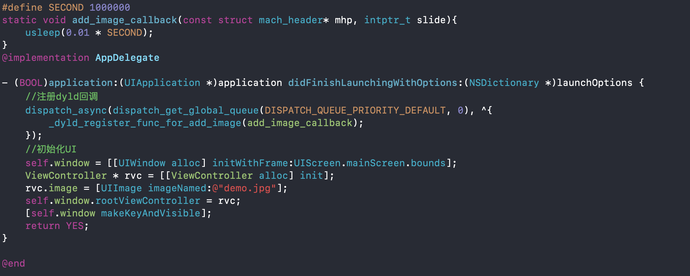

接着在真机上运行这段代码，发现在启动页面会卡很久：


为什么这里会卡很久呢？

### 试试Time Profiler?

就不具体讲解Time Profiler的用法了，相关资料网上很多，通过分析我们可以拿到如下的调用栈：

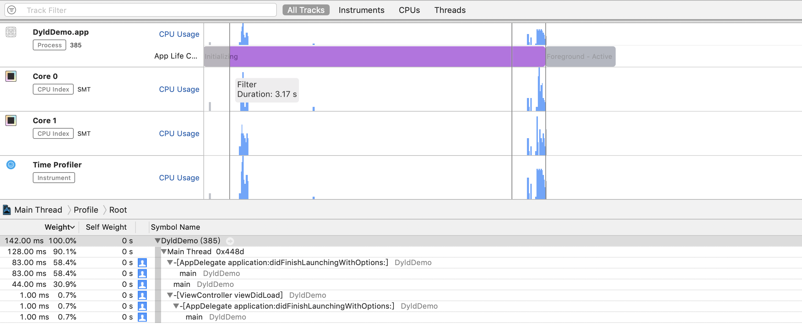

嗯～？？不对啊，明明耗时好几秒，怎么统计出来的只有堆栈142ms。可以看到Time Profiler提供的信息有限，以下两条算是比较有用的：

1. 区间选中有3.17s，但是统计到的调用栈却只有142ms
2. iPhone 6一共只有两个Core，两个Core在这段时间内，大部分时候都是空闲的。

**似乎线程在等待什么？**

### System Trace

System Trace一个比较大的优势是可以看到线程的状态，分析上面的代码(如下图)，发现主线程有一段3s左右的时间被block住了，通过右侧的调用栈能看到主线程在didFinishLaunching中调用了`imageNamed`，**后者触发了dlopen，dlopen里在等待一个互斥锁**。

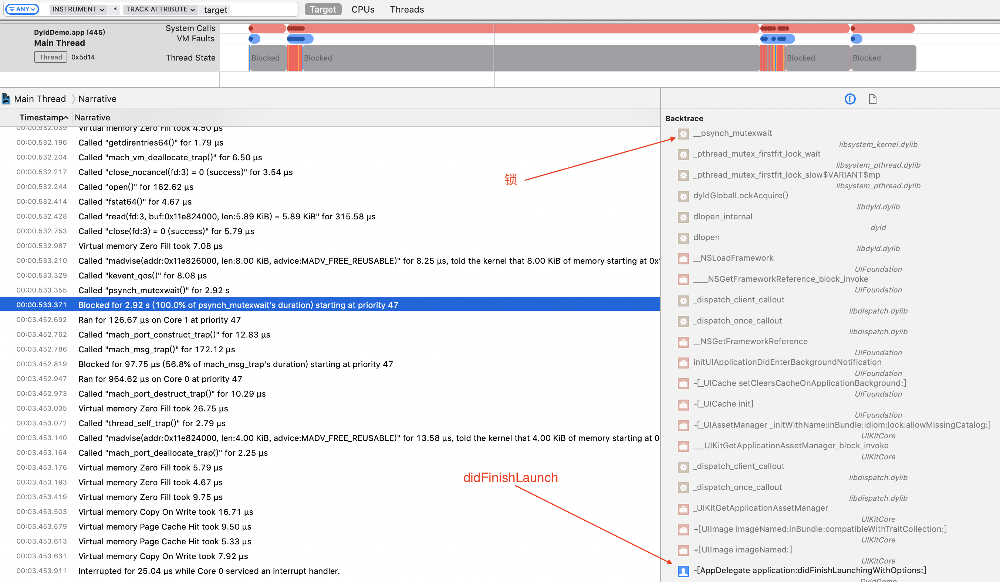

切换到Events：Thread State，可以看到线程切换的每一个事件，和状态切换的发生的原因，切换后再选中主线程被block的这段时间，观察这个事件的下一个事件，因为下个事件通常是锁被释放，线程重新进入可执行的状态。

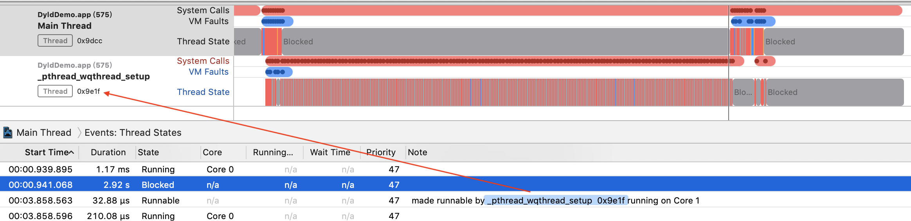

我们发现，主线程因为线程**0x9e1f**释放锁才进入了可执行的状态。这时候把线程**0x9e1f**也pin一下，观察到主线程被block这段时间，这个线程在不停的sleep 10ms左右然后继续执行代码，通过右侧的调用栈会发现，sleep的源头是在`_dyld_register_func_for_add_image`，到这里原因找到了：**子线程卡住了主线程**。

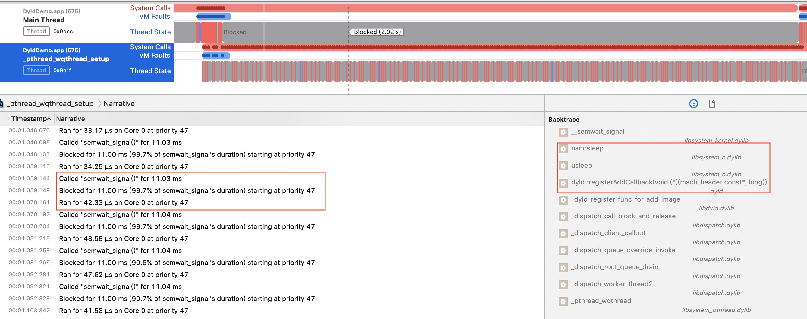

> 细心的朋友会发现，右侧的调用栈里并没有最上面C函数：`add_image_callback`，这是因为`add_image_callback`内部只调用了`usleep`，这一层调用完全没有存在的必要，所以release模式下编译器做了优化。


### 小结

通过System Trace分析，我们很容易就找到了这次启动耗时长的原因：主线程的imageNamed内部触发了dlopen，子线程在执行执行`_dyld_register_func_for_add_image`的回调，二者都需要先获取同一个互斥锁，**所以子线程卡住了主线程**。

这个例子让我们见识到了System Trace的威力，那么System Trace一般可以用来分析哪些问题呢？

- 锁的互斥，主要是主线程等子线程释放锁
- 线程优先级，抢占和高优线程超过CPU核心数量
- 虚拟内存，Page Fault的代价其实不小
- 系统调用，了解性能瓶系统正在做什么

> Tips: Runtime, dyld存在着很多隐藏的全局互斥锁，很容易踩到雷。

## Time Profiler的原理

这部分回答一个问题：为什么刚刚的代码里，Time Profiler看不出端倪？

正常Time Profiler会1ms采样一次，**默认只采集所有在运行线程的调用栈**，最后以统计学的方式汇总。比如下图中的5次采样中，method3都没有采样到，所以最后聚合到的栈里就看不到method3。

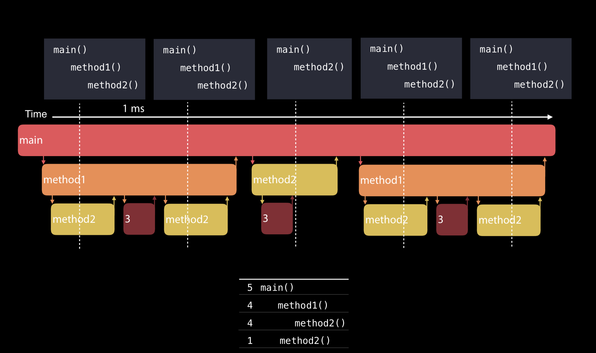

Time Profiler中的看到的时间，**并不是代码实际执行的时间，而是栈在采样统计中出现的时间**。另外，Time Profiler还有一些配置是容易忽略的，依次点击File -> Recording Options：

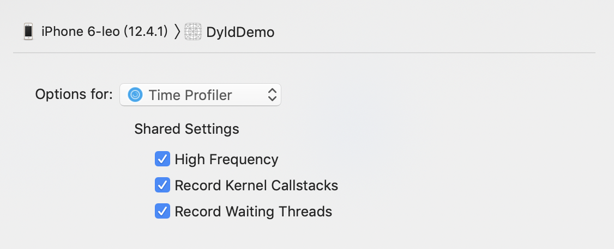

- High Frequency，降低采样的时间间隔
- Record Kernel Callstacks，记录内核的调用栈
- Record Waiting Thread，**记录被block的线程**

第三个选项比较有用，比如刚刚的代码开启Record Waiting Thread，再运行Time Profiler就会发现主线程很长一段时间在等待一个互斥锁：

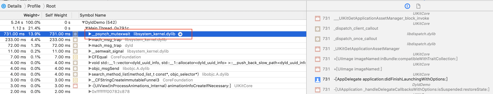

## System Trace

用好System Trace的前提是对操作系统的一些核心基础知识有基本的了解，所以这一小节会讲解下System Trace的各个模块的使用方式以及涉及到的基本原理。

### Point of Interest

有时候我们只关心某一段小段时间的性能，如何把时间段和System Trace对应起来呢？

可以通过`kdebug_signpost`相关的接口相关的接口来打一些点，这些点会在Point of Interest区域中显示，比如刚刚的代码我们想标记出来didFinishLaunch这个方法，就可以在方法的收尾添加kdebug_interval：

```
kdebug_signpost_start(10, 0, 0, 0, 0); 
kdebug_signpost_end(10, 0, 0, 0, 0); 
```
然后重新运行System Trace，即可在Point of Interest观察到该方法的执行区间

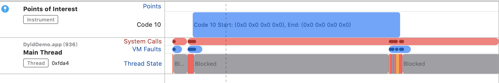

但显示Code 10明显是不友好的，可以在File -> Recording Options里做Code映射，变成可读的字符串。Color Using Last Argument可以把最后一个code映射到不同颜色，进一步提高辨识度。

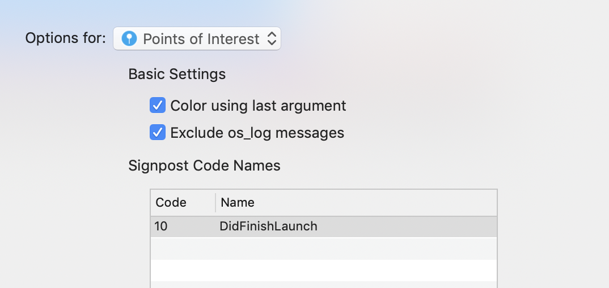

> Tips：
>  - kdebug_signpost_start的几个参数是用来做多级区分的，但整型本身不够友好，显示区间可以也可以用`os_signpost`相关的API
> - signpost配合Objective C的Swizzling往往会发挥意想不到的效果

### Thread State Trace

System Trace一个很重要的特性就是能看到线程不同的状态，以及状态之间切换的原因，通常我们会选择一个时间段，然后汇总观察结果：

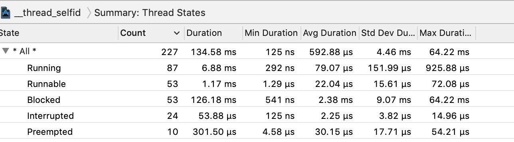

几个线程状态说明：

- Running，线程在CPU上运行
- Blocked，线程被挂起，原因有很多，比如等待锁，sleep，File Backed Page In等等。
- Runnable，线程处于可执行状态，等CPU空闲的时候，就可以运行
- Interrupted，被打断，通常是因为一些系统事件，一般不需要关注
- Preempted，被抢占，优先级更高的线程进入了Runnable状态

Blocked和Preempted是优化的时候需要比较关注的两个状态，分析的时候通常需要知道切换到这两个状态的原因，这时候要切换到Events: Thread State模式，然后查看状态切换的前一个和后一个事件，往往能找到状态切换的原因。

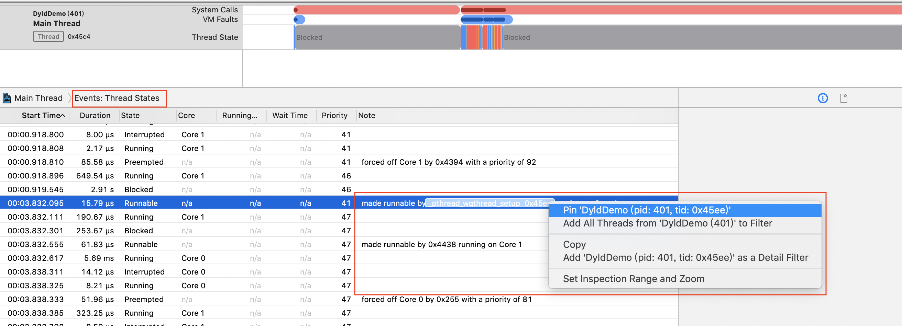

> Tips：在线程上右键，可以快速把线程设置为filter或者pin，方便分析，尤其是大型App的线程非常多的情况下。

除了Thread State Event比较有用，另外一个比较有用的是Narrative，这里会把所有的事件，包括下文的虚拟内存等按照时间轴的方式汇总：

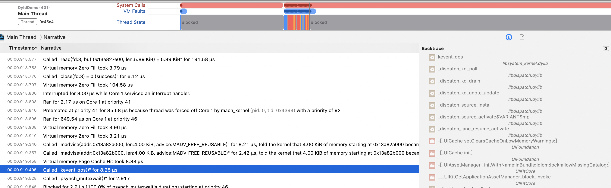

### Virtual Memory Trace

内存分为物理内存和虚拟内存，二者按照Page的方式进行映射。

可执行文件，也就是Mach-O本质上是通过mmap相关API映射到虚拟内存中的，这时候只分配了虚拟内存，并没有分配物理内存。如果访问一个虚拟内存地址，而物理内存中不存在的时候，会怎么样呢？会触发一个**File Backed Page In**，分配物理内存，并把文件中的内容拷贝到物理内存里，如果在操作系统的物理内存里有缓存，则会触发一个**Page Cache Hit**，后者是比较快的，**这也是热启动比冷启动快的原因之一**。

这种刚刚读入没有被修改的页都是Clean Page，是可以在多个进程之间共享的。所以像__TEXT段这种只读的段，映射的都是Clearn Page。

`_DATA`段是可读写的，当`_DATA`段中的页没有被修改的时候，同样也可以在两个进程共享。但一个进程要写入，就会触发一次**Copy On Write**，把页复制一份，重新分配物理内存。这样被写入的页称为Dirty Page，无法在进程之间共享。像全局变量这种初始值都是零的，对应的页在读入后会触发一次内存写入零的操作，称作**Zero Fill**。

iOS不支持内存Swapping out即把内存交换到磁盘，但却支持内存压缩（**Compress memory**），对应被压缩的内存访问的时候就需要解压缩（**Decompress memory**），所以在Virtial Memroy Trace里偶尔能看到内存解压缩的耗时。

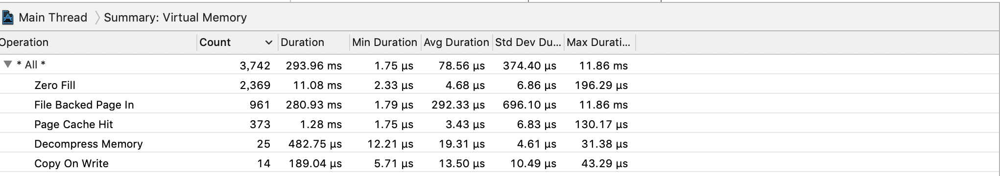

### System Load

以10ms为纬度，统计活跃的高优线程数量和CPU核心数对比，如果高于核心数量会显示成黄色，小于等于核心数量会是绿色。这个工具是用来帮助调试线程的优先级的：

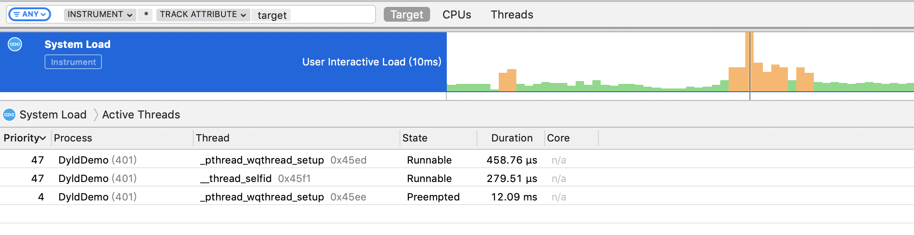

线程的优先级可以通过QoS来指定，比如GCD在创建Queue的时候指定，NSOperationQueue通过属性指定：
```
//GCD
dispatch_queue_attr_t attr = dispatch_queue_attr_make_with_qos_class(DISPATCH_QUEUE_SERIAL, QOS_CLASS_UTILITY, -1);
dispatch_queue_t queue = dispatch_queue_create("com.custom.utility.queue", attr);
//NSOperationQueue
operationQueue.qualityOfService = NSQualityOfServiceUtility
```

**选择合适的优先级，避免优先级反转，影响线程的执行效率，尤其是别让后台线程抢占主线程的时间**。延伸阅读：[libdispatch efficiency tips](https://gist.github.com/tclementdev/6af616354912b0347cdf6db159c37057)

### System Call & Context Switch

操作系统为了安全考虑，把文件读写(open/close/write/read)，锁(ulock_wait/ulock_wake)等核心操作封装到了内核里，用户态必须调用内核提供的接口才能完成对应的操作，这样的调用称作系统调用System Call。System Trace里提供了系统调用相关的Event：

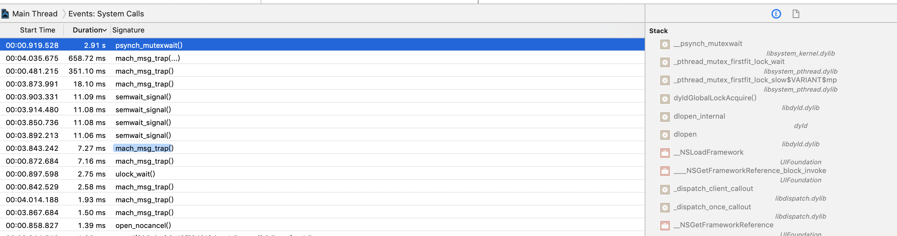

线程/进程需要轮流到CPU上执行，在切换的时候，必须把线程/进程状态保存下来，之后才能恢复，这种保存/恢复的过程称作上下文切换Context Switch，在System Trace里通常会关注下主线程是否在频繁的上下文切换：


### Thermal State

一个大家不怎么关注，但其实挺重要的性能指标是发热状态，因为发热后系统会限制CPU/GPU/IO等使用。System Trace也提供了对应的分析工具

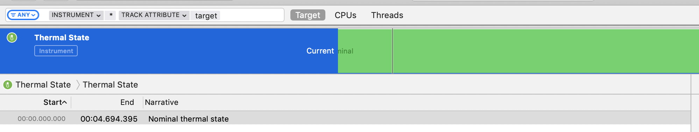

iOS 11之后，可以通过NSProcesssInfo的相关API来获取当前发热状态：

```
NSProcessInfo.processInfo.thermalState
```
一共有四种状态，正常的状态是Nominal，后面逐级严重：

- Nominal
- Fair
- Serious
- Critical

Xcode也提供了工具来模拟发热状态，让开发者可以测量不同发热情况下App的体验，在Xcode中，依次选择Window -> Device And Simulator，然后按照下图的方式开启：

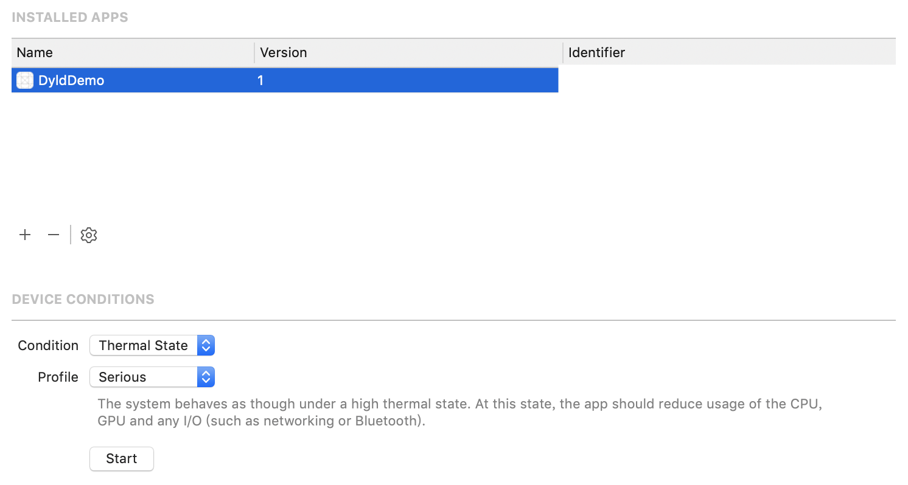

> Tips：非游戏类App一般不会引起发热，除非有一些逻辑上Bug引起死循环，或者不停发送网络请求。

## 总结

当遇到性能瓶颈的时候，优先还是建议Time Profiler，因为简单直接，排查问题效率高。如果遇到Time Profiler里采样到的时间和实际消耗的时间差距比较大的时候，或者像优化FPS这种需要精细化的了解16ms线程都在做什么的时候，可以试试System Trace，也许会有意外的收获~
 
