## Time Profiler

Time Profiler用来分析代码的执行时间，主要**用来分析CPU使用情况**。

注意：要在release模式(或者自定义的其他的打包模式)下分析，原因在release模式下：

1. 会开启编译器优化，提高代码运行效率
2. 生成调试的符号表，这样才能够在profile的时候看到代码的调用栈
3. 多数条件编译只会在debug模式下生效，release模式和生产环境是一样的。


## 原理


Time Profiler每隔1ms会对线程的调用栈采样，然后用统计学的方式去做出分析。


图中虚线是采样点，最后统计出调用栈和对应函数出现的个数。

从图中不难看出，method3并没有出现在统计结果中，也就意味着**方法运行的足够快的时候，很有可能统计不到**，但这对于分析来说并不会有太大影响，因为运行快的方法往往不会引起性能问题。

> **Tips：Time Profiler并不会精确的统计出方法的执行时间**，当线程处于挂起和等待执行的状态时候，timer profiler并不能统计到，它只能统计到真正在CPU上执行的。

## Demo

Demo工程是一个简易的相册应用，故意写的很烂，包含了三个界面：

- 第一个界面只提供一个入口
- main界面用瀑布流的方式提供图片预览，图片被加了滤镜
- detail界面可以查看大图

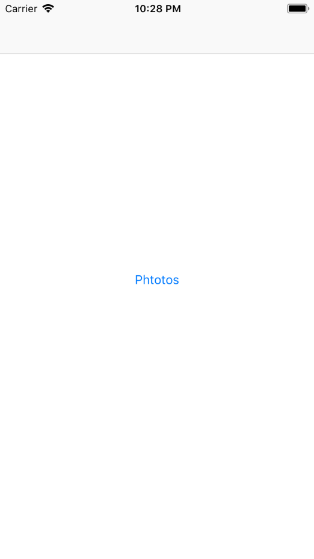

在iPhone 7上运行，在进入main界面的时候会看到明显的卡顿：

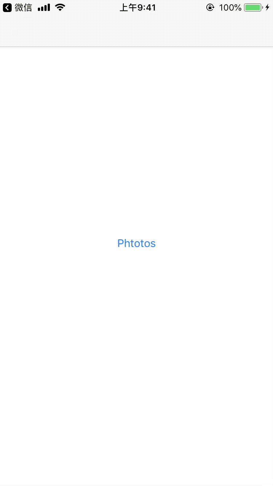


我们通过Time Profile来找到原因：Product -> Profile

这会让XCode执行一次Release的build，然后启动Instrument


我们选择Time Profiler启动，然后正常操作App，采集到了数据后，停止Instrument。

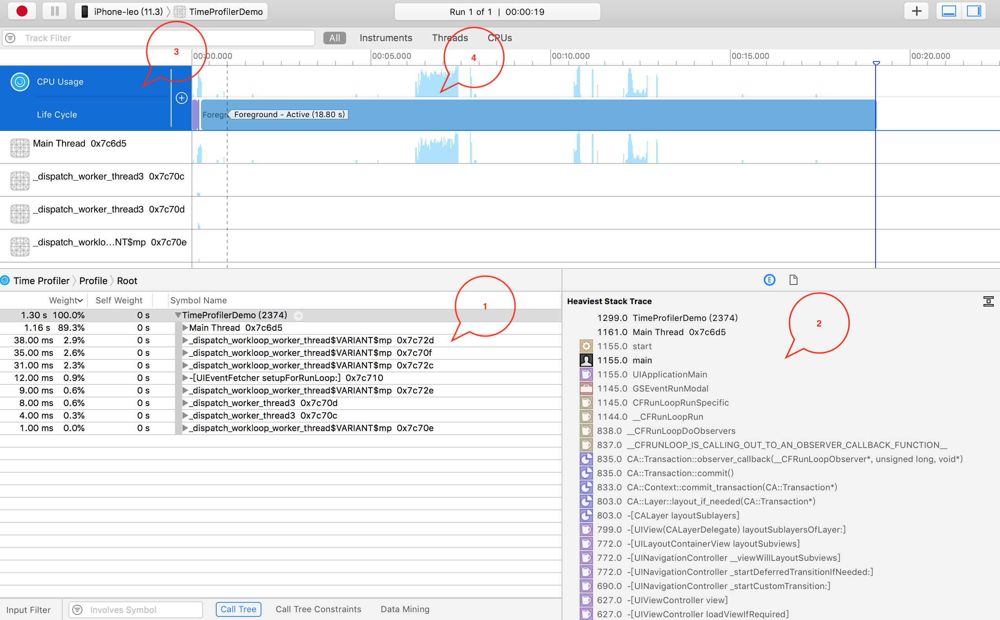

对图中的几点说明：

1. 各个线程的采集数据汇总
2. 点击1中的某一行，可以看到采集到的堆栈，注意2区域的右上角，可以选择隐藏系统的符号
3. 可以选择关注的队列/CPU等。
4. 可以用pinch手势来放大缩小时间范围，鼠标可以拖动选择一段区域

Tips:

- Weight表示占用全部的百分比
- Self Wight表示当前方法执行占用的百分比，如果看到是0，表示当前方法其实不占用什么时间，时间都是子程序调用占用的。

我们用鼠标拖动，选择选择CPU占用较高的部分，可以看到堆栈如下：

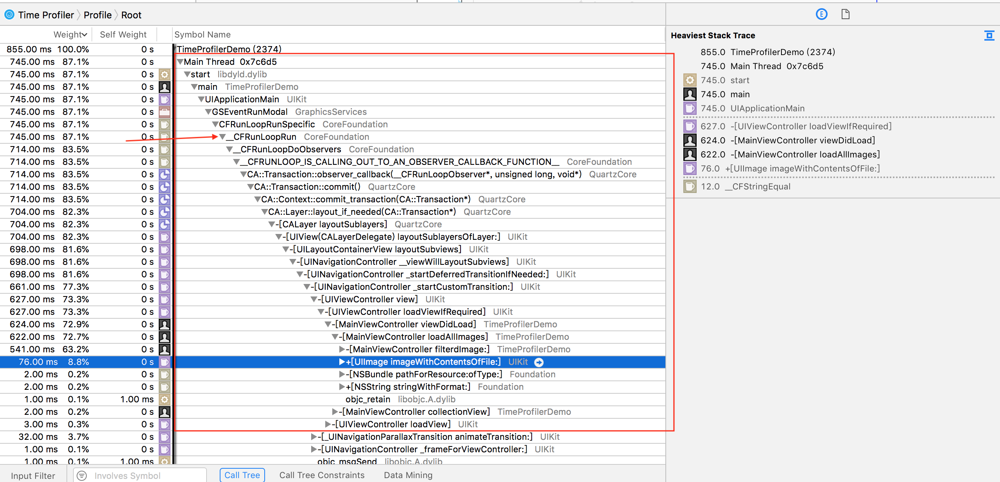

> Tips: 按住Option，然后鼠标左键点图中的箭头，可以快速展开。

从图中看到：大部分时间占用在`-[MainController loadAllImages]`这个方法：读取本地图片，然后对图加滤镜

```
- (void)loadAllImages{
    NSMutableArray * images = [NSMutableArray new];
    for (long i = 1; i < 40; i++) {
        NSString * imageName = [NSString stringWithFormat:@"image_%ld",i % 20 + 1];
        NSString * imagePath = [[NSBundle mainBundle] pathForResource:imageName ofType:@"jpeg"];
        UIImage * image = [UIImage imageWithContentsOfFile:imagePath];
        [images addObject:[self filterdImage:image]];
    }
    self.images = [images copy];
}
```

我们可以勾选以下选项，来看得更清楚一些: 

- Hide System Libraries 隐藏系统的库
- Invert Call Tree 倒置函数队战


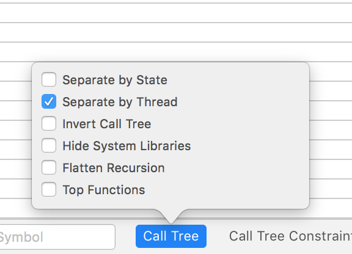


勾选后

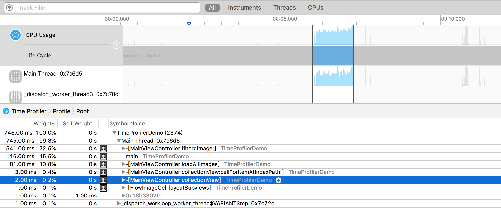

> Timer Profiler的基本debug逻辑：分析 -> 找到最大的占用函数 -> 修复 -> 继续分析....，直到完全修复。有时候自己的代码会引起系统代码卡顿，所以查看系统库的卡顿也很有必报。

可以通过双击一行，进入源代码界面，看看具体某一行的占用情况：

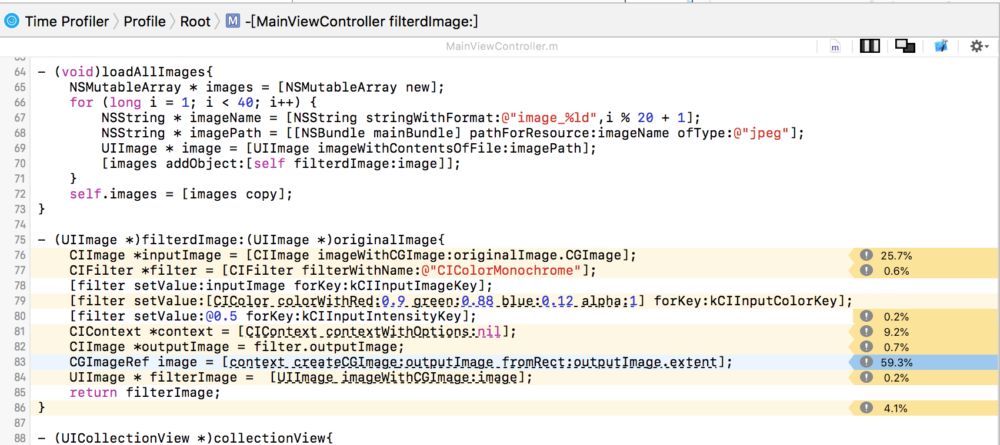

也可以选择查看次数：

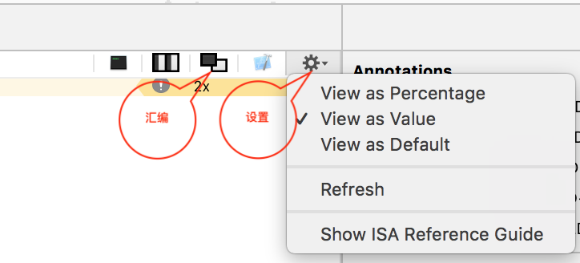

查看次数：

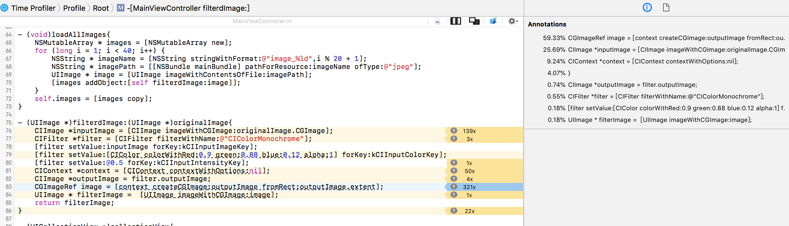

或者，查看反汇编

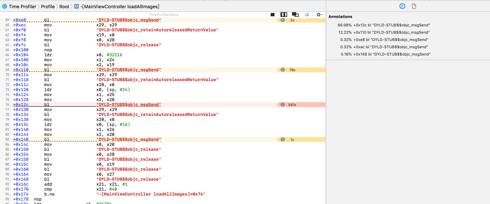


## FAQ

1. 为什么我在Time Profiler看不到类和方法的名称呢？

绝大部分原因是你的打包模式没有开启dSYM或者debug symbols

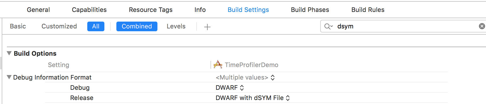

2. 为什么明明我的App很卡，可是用Time Profiler分析却找不到相关代码？

卡顿的原因主要分为两大类：CPU瓶颈和GPU瓶颈。

当界面有大量的shadow，mask或者有非常多的ViewLayer，GPU渲染纹理和定点的时候可能会有压力，这时候应该用Core Animation观察GPU的使用率。

CPU引起的卡顿大多可以通过Time Profiler找到，如果找不到可能的原因有两个：

- 代码引起了大量系统调用，占用CPU时间，这种情况你需要仔细分析Time Profiler中的系统占用。
- 频繁的锁和线程切换。因为线程被挂起的时候，time profiler无法采样到，这种情况可以通过System Trace分析。

## 资料

- [Using Time Profiler in Instruments](https://developer.apple.com/videos/play/wwdc2016/418/)
