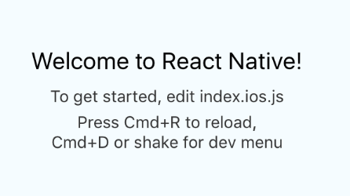
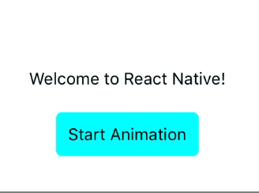
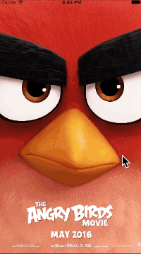
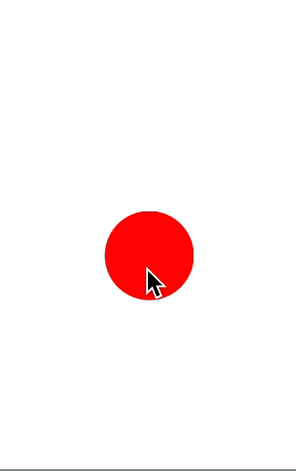
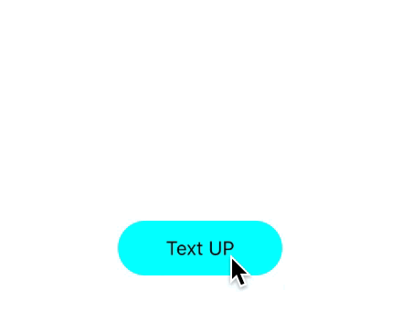
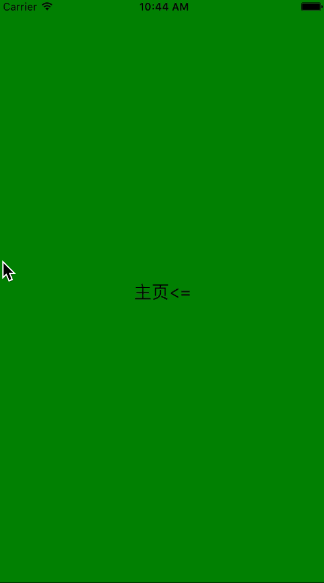

##资料

- [官方关于动画的介绍](https://facebook.github.io/react-native/docs/animations.html)
- [官方给出的复杂动画的示例](https://github.com/facebook/react-native/tree/master/Examples/UIExplorer/AnimatedGratuitousApp)
- [开源项目react-native-animatable](https://github.com/oblador/react-native-animatable)
- [React Native Animation Book](https://github.com/browniefed/react-native-animation-book)
- [可以用在实际项目里的：react-motion](https://github.com/chenglou/react-motion/)
 
----------
##概述

本文编写的时候React Native的版本是0.28,主要的动画分为两大类

- LayoutAnimation 用来实现布局切换的动画
- Animated 更加精确的交互式的动画

目前React native的release速度还是比较快的，每隔2周左右就release一次。

----------
##准备工作

本文默认读者已经

1. 安装好了React Native
2. 安装好了IDE（本文使用Atom＋Nuclide），如果没有安装过，可以参照最上面的链接进行安装
3. 使用`react-native init Demo --verbose`初始化了一个Demo项目


------
##一个简单的动画

一个最基本的Animated创建过程如下

1. 创建`Animated.Value`，设置初始值，比如一个视图的`opacity`属性，最开始设置`Animated.Value(0)`,来表示动画的开始时候，视图是全透明的。
2. AnimatedValue绑定到Style的可动画属性，比如透明度，{opacity: this.state.fadeAnim}
3. 使用`Animated.timing`来创建自动的动画,或者使用`Animated.event`来根据手势，触摸，Scroll的动态更新动画的状态（本文会侧重讲解`Animated.timing`）
4. 调用`Animated.timeing.start()`开始动画

基于上述的原理，我们来实现第一个动画。

创建一个Demo工程的时候，运行后，模拟器截图应该是酱紫的。



然后，只保留第一行文字，然后我们给这个默认的视图创建fade in动画，效果如下


代码

```
class Demo extends React.Component {
  state: { //可以不写，我这里写是为了去除flow警告
    fadeAnim: Object,
  };
  constructor(props) {
     super(props);
     this.state = {
         fadeAnim: new Animated.Value(0), //设置初始值
     };
   }
   componentDidMount() {
   Animated.timing(
     this.state.fadeAnim,//初始值
     {toValue: 1}//结束值
   ).start();//开始
   }
  render() {
    return (
      <View style={styles.container}>
      <Animated.Text style={{opacity: this.state.fadeAnim}}>//绑定到属性
          Welcome to React Native!
      </Animated.Text>
      </View>
    );
  }
}
```

<font color="red">所以说，简单的动画就是用`Animated.Value`指定初始值，然后在`Animated.timing`中设置结束值，其他的交给React native让它自动创建，我们只需要调用`start`开始动画即可。</font>

在当前版本0.27种，可动画的视图包括

* View
* Text
* Image
* createAnimatedComponent(自定义)

-------
##Animated详解

###方法

* `static decay(value, config)` 阻尼，将一个值根据阻尼系数动画到 0
* `static timing(value, config` 根据时间函数来处理，常见的比如线性，加速开始减速结束等等，支持自定义时间函数
* `static spring(value, config)` 弹性动画
* `static add(a, b) ` 将两个`Animated.value`相加，返回一个新的
* `static multiply(a, b)` 将两个`Animated.value`相乘，返回一个新的
* `static modulo(a, modulus)`，将a对modulus取余,类似操作符%
* `static delay(time)`延迟一段时间
* `static sequence(animations)` 依次开始一组动画，后一个在前一个结束后才会开始，如果其中一个动画中途停止，则整个动画组停止
* `static parallel(animations, config?) `,同时开始一组动画，默认一个动画中途停止，则全都停止。可以通过设置`stopTogether`来重写这一特性
* `static stagger(time, animations)`,一组动画可以同时执行，但是会按照延迟依次开始
* `static event(argMapping, config?)`,利用手势，Scroll来手动控制动画的状态
* `static createAnimatedComponent(Component)`,自定义的让某一个Component支持动画

###属性

* `Value`,类型是`AnimatedValue`,驱动基本动画
* `AnimatedValueXY`,类型是`AnimatedValueXY`，驱动二维动画

###AnimatedValue类型

一个AnimatedValue一次可以驱动多个可动画属性，但是一个AnimatedValue一次只能由一个机制驱动。比如，一个Value可以同时动画View的透明度和位置，但是一个Value一次只能采用线性时间函数

####方法

* `constructor(value)` 构造器
* `setValue(value)` 直接设置值，会导致动画终止
* `setOffset(offset) ` 设置当前的偏移量
* `flattenOffset() ` 将偏移量合并到最初值中，并把偏移量设为0，
* `addListener(callback) ,removeListener(id),removeAllListeners() `，增加一个异步的动画监听者
* `stopAnimation(callback?) ` 终止动画，并在动画结束后执行callback
* `interpolate(config)` <font color="red">插值</font>,在更新可动画属性前用插值函数对当前值进行变换
* `animate(animation, callback)` 通常在React Native内部使用
* `stopTracking(),track(tracking) ` 通常在React Native内部使用


###AnimatedValueXY
和AnimatedValue类似，用在二维动画，使用起来和AnimatedValue类似，这里不在介绍，[这里是文档](https://facebook.github.io/react-native/docs/animated.html#animatedvaluexy)。


-------
##一个更加复杂动画

有了上文的知识支撑，我们可以设计并实现一个更加复杂的动画了。

* 这个动画由button驱动
* 一个AnimatedValue同时驱动两三个属性，透明度，Y的位置以及scale

效果



代码(省略了import和style)

```

class Demo extends React.Component {
  state: {
    fadeAnim: Animated,
    currentAlpha:number,
  };
  constructor(props) {
     super(props);
     this.state = {//设置初值
       currentAlpha: 1.0,//标志位，记录当前value
       fadeAnim: new Animated.Value(1.0)
     };
   }
  startAnimation(){
    this.state.currentAlpha = this.state.currentAlpha == 1.0?0.0:1.0;
    Animated.timing(
      this.state.fadeAnim,
      {toValue: this.state.currentAlpha}
    ).start();
  }
  render() {
    return (
      <View style={styles.container}>
      <Animated.Text style={{opacity: this.state.fadeAnim, //透明度动画
                            transform: [//transform动画
                              {
                                translateY: this.state.fadeAnim.interpolate({
                                                  inputRange: [0, 1],
                                                  outputRange: [60, 0] //线性插值，0对应60，0.6对应30，1对应0
                                                }),
                              },
                              {
                                scale:this.state.fadeAnim
                              },
                               ],
                          }}>
          Welcome to React Native!
      </Animated.Text>
      <TouchableOpacity onPress = {()=> this.startAnimation()} style={styles.button}>
          <Text>Start Animation</Text>
      </TouchableOpacity>
      </View>
    );
  }
}


```
-------
##手动控制动画
通过上文的讲解，相信读者已经对如何用Animated创建动画有了最基本的认识。而有些时候，我们需要根据Scroll或者手势来手动的控制动画的过程。这就是我接下来要讲的。
手动控制动画的核心`是Animated.event`,
这里的Aniamted.event的输入是一个数组，用来做数据绑定
比如,
ScrollView中

```
onScroll={Animated.event(
           [{nativeEvent: {contentOffset: {x: this.state.xOffset}}}]//把contentOffset.x绑定给this.state.xOffset
)}
```
Pan手势中

```
   onPanResponderMove: Animated.event([
        null,//忽略native event
        {dx: this.state.pan.x, dy: this.state.pan.y},//dx，dy分别绑定this.state.pan.x和this.state.pan.y
      ])
```

###Scroll驱动

目标效果 - 随着ScrollView的相左滑动，最左边的一个Image透明度逐渐降低为0



核心代码

```
var deviceHeight = require('Dimensions').get('window').height;
var deviceWidth = require('Dimensions').get('window').width;
class Demo extends React.Component {
  state: {
    xOffset: Animated,
  };
  constructor(props) {
     super(props);
     this.state = {
       xOffset: new Animated.Value(1.0)
     };
   }
  render() {
    return (
      <View style={styles.container}>
        <ScrollView horizontal={true} //水平滑动
                    showsHorizontalScrollIndicator={false}
                    style={{width:deviceWidth,height:deviceHeight}}//设置大小
                    onScroll={Animated.event(
                            [{nativeEvent: {contentOffset: {x: this.state.xOffset}}}]//把contentOffset.x绑定给this.state.xOffset
                            )}
                    scrollEventThrottle={100}//onScroll回调间隔
                    >
          <Animated.Image source={require('./s1.jpg')}
                          style={{height:deviceHeight,
                                  width:deviceWidth,
                                  opacity:this.state.xOffset.interpolate({//映射到0.0,1.0之间
                                                  inputRange: [0,375],
                                                  outputRange: [1.0, 0.0]
                                                }),}}
                          resizeMode="cover"
                           />
         <Image source={require('./s2.jpg')} style={{height:deviceHeight, width:deviceWidth}} resizeMode="cover" />
         <Image source={require('./s3.jpg')} style={{height:deviceHeight, width:deviceWidth}} resizeMode="cover" />
      </ScrollView>
      </View>
    );
  }
}
```
###手势驱动
React Native最常用的手势就是[PanResponser](https://facebook.github.io/react-native/docs/panresponder.html)，

由于本文侧重讲解动画，所以不会特别详细的介绍PanResponser，仅仅介绍用到的几个属性和回调方法

```
onStartShouldSetPanResponder: (event, gestureState) => {}//是否相应pan手势
onPanResponderMove: (event, gestureState) => {}//在pan移动的时候进行的回调
onPanResponderRelease: (event, gestureState) => {}//手离开屏幕
onPanResponderTerminate: (event, gestureState) => {}//手势中断


```
其中，

* 通过event可以获得触摸de位置，时间戳等信息。
* 通过gestureState可以获取移动的距离，速度等

目标效果- View随着手拖动而移动，手指离开会到原点



核心代码

```
class Demo extends React.Component {
  state:{
    trans:AnimatedValueXY,
  }
  _panResponder:PanResponder;
  constructor(props) {
     super(props);
     this.state = {
       trans: new Animated.ValueXY(),
     };
     this._panResponder = PanResponder.create({
        onStartShouldSetPanResponder: () => true, //响应手势
        onPanResponderMove: Animated.event(
          [null, {dx: this.state.trans.x, dy:this.state.trans.y}] // 绑定动画值
        ),
        onPanResponderRelease: ()=>{//手松开，回到原始位置
          Animated.spring(this.state.trans,{toValue: {x: 0, y: 0}}
           ).start();
        },
        onPanResponderTerminate:()=>{//手势中断，回到原始位置
          Animated.spring(this.state.trans,{toValue: {x: 0, y: 0}}
           ).start();
        },
    });
   }
  render() {
    return (
      <View style={styles.container}>
          <Animated.View style={{width:100,
                                 height:100,
                                 borderRadius:50,
                                 backgroundColor:'red',
                                 transform:[
                                   {translateY:this.state.trans.y},
                                   {translateX:this.state.trans.x},
                                 ],
                                }}
                {...this._panResponder.panHandlers}
          >
          </Animated.View>
      </View>
    );
  }
}
```
-------
##LayoutAnimation

[LayoutAnimation](http://facebook.github.io/react-native/releases/0.28/docs/layoutanimation.html)在View由一个位置变化到另一个位置的时候，在下一个Layout周期自动创建动画。通常在<font color="red">setState前掉用`LayoutAnimation.configureNext`</font>

###一个简单的Demo



代码

```
class Demo extends React.Component {
  state: {
      marginBottom:number,
  };
  constructor(props) {
     super(props);
     this.state = {//设置初值
       marginBottom:0
     };
   }
  _textUp(){
    LayoutAnimation.spring();
    this.setState({marginBottom:this.state.marginBottom + 100})
  }
  render() {
    return (
      <View style={styles.container}>
      <TouchableOpacity onPress = {()=>this._textUp()}
                      style={{  width:120,
                                height:40,
                                alignItems:'center',
                                marginBottom:this.state.marginBottom,
                                justifyContent:'center',
                                backgroundColor:'#00ffff',
                                borderRadius:20}}>
          <Text>Text UP</Text>
      </TouchableOpacity>
      </View>
    );
  }
}
```
<font color="red">其实代码里只是调用了这一行`LayoutAnimation.spring();`,布局修改的时候就显得不那么生硬了</font>

###LayoutAnimation详解

####配置相关

```
//配置下一次切换的效果，其中config可配置的包括duration（时间），create（配置新的View），update（配置更新的View）
static configureNext(config, onAnimationDidEnd?) 
//configureNext的方便方法
static create(duration, type, creationProp) #

```
####属性

对应三种时间函数

```
easeInEaseOut: CallExpression #
linear: CallExpression #
spring: CallExpression #

```
-------
##Navigator转场动画

我们先创建一个默认的Navigator转场Demo
回拉的时候，前一个时图的移动距离要小于后一个视图


这时候的核心代码如下,MainScreen和DetailScreen就是带一个Button的视图

```
class Demo extends React.Component{
    render(){
      return (
        <Navigator
          style = {styles.container}
          initialRoute={{id:"main",}}
          renderScene={this.renderNav}
          configureScene={(route, routeStack) => Navigator.SceneConfigs.PushFromRight}

          />
      );
    }
    renderNav(route,nav){
        switch (route.id) {
          case 'main':
            return <MainScreen navigator={nav} title="Main"/ >;
          case 'detail':
            return (<DetailScreen navigator={nav} title="Detail"/ >);
        }
    }
 }
```
Navigator的默认的转场动画的实现都可以在这里找到[NavigatorSceneConfigs.js](https://github.com/facebook/react-native/blob/master/Libraries/CustomComponents/Navigator/NavigatorSceneConfigs.js)。

So，我们有两种方式来实现自定义的转场动画

* 彻底的按照[NavigatorSceneConfigs.js](https://github.com/facebook/react-native/blob/master/Libraries/CustomComponents/Navigator/NavigatorSceneConfigs.js)写一个转场
* 修改[NavigatorSceneConfigs.js](https://github.com/facebook/react-native/blob/master/Libraries/CustomComponents/Navigator/NavigatorSceneConfigs.js)中已配置的转场的若干属性

篇幅限制，本文只修改默认的转场

比如，我想把默认的PushFromRight动画中，第一个视图的移动距离改为全屏幕。

```
var ToTheLeftCustom = {
  transformTranslate: {
    from: {x: 0, y: 0, z: 0},
    to: {x: -SCREEN_WIDTH, y: 0, z: 0},//修改这一行
    min: 0,
    max: 1,
    type: 'linear',
    extrapolate: true,
    round: PixelRatio.get(),
  },
  opacity: {
    value: 1.0,
    type: 'constant',
  },
};

var baseInterpolators = Navigator.SceneConfigs.PushFromRight.animationInterpolators;
var customInterpolators = Object.assign({}, baseInterpolators, {
     out: buildStyleInterpolator(ToTheLeftCustom),
});
var baseConfig = Navigator.SceneConfigs.PushFromRight;
var CustomPushfromRight = Object.assign({}, baseConfig, {
     animationInterpolators: customInterpolators,
});
```

然后，修改Navigator的configScene

```
configureScene={(route, routeStack) => baseConfig}

```
这时候的动画如下



-------