前言
--
FlexBox布局是React Native的布局核心，鉴于自己对FlexBox还有很多概念不太清楚，这篇文章就当成是总结，并且分享出来给大家。

> FlexBox布局能够帮助你更好的帮助你控制控件的大小和位置，Flexbox非常适合Mobile端的适配，我想这也是FaceBook为什么选择FlexBox作为React Native布局的原因吧。

本文参考文章如下

 - [A Complete Guide to Flexbox](https://css-tricks.com/snippets/css/a-guide-to-flexbox/#flexbox-background)
 - [react-native 之布局篇](https://segmentfault.com/a/1190000002658374)

当然，React Native官网也有FlexBox相关的[文档](https://facebook.github.io/react-native/docs/flexbox.html#content)，不过讲解的内容不多。

<font color="orange">！！！！React  Native的迭代更新很快，所以如果有读者发现了本文代码不适配新版本了，欢迎issue，我会及时修改。
</font>

----------

Getting Start
------

```
react-native init  LearnFlexBox
```
运行

```
cd LearnFlexBox/
react-native run-ios
```
会看到默认的截图

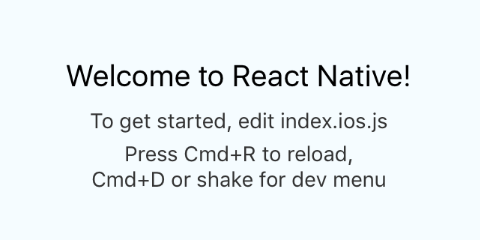

<font color="red">由于模拟器截图实在太宽，所以本文把Demo范围限定在一个小的范围内
重写Render方法</font>

```
  render() {
    return (
      <View style={styles.container}>
        <View style={styles.exampleContainer}>

        </View>
      </View>
    );
  }
```
这里的exampleContainer风格如下
```
  exampleContainer:{
    width:320,
    height:200,
    backgroundColor:'gray'
  }
```
----------

Container和Item
--------------

 - Container就是容器，有些属性是设置到Container上的例如alignItems。<font color="orange">设置到Container上的属性决定了如何布局内部的Item</font>
 - Item， 在容器中的子视图。<font color="orange">设置到Item上的属性，决定了自己在Container中的位置大小</font>

> 有过iOS或者安卓原生开发的同学应该能有个更清楚的认识，很像View和Subview的关系


----------

flexDirection
-------------
这个<font color="red">Container属性</font>决定了按照哪个方向来布局Item，默认从上到下
添加一个style

```
  exampleItem:{
    width:30,
    height:30,
    backgroundColor:'#27E6E2'
  }
```
然后，在添加三个子视图

```
<View style={styles.exampleContainer}>
  <View style={styles.exampleItem}></View>
  <View style={styles.exampleItem}></View>
  <View style={styles.exampleItem}></View>
</View>
```
然后，修改`exampleContainer`,添加一个属性`flexDirection`

```
  exampleContainer:{
    width:320,
    height:200,
    backgroundColor:'gray',
    flexDirection:'column'
  },
```
当flexDirection设置为`column`的时候效果

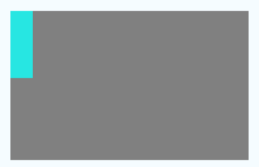

当flexDirection设置为`row`的时候

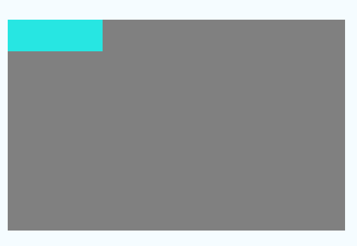

注意：<font color="red">React Native的Flexbox目前不支持row-reverse和column-reverse</font>


----------

alignItems－垂直轴上的位置关系
----------

有四个值
```
'flex-start', 'flex-end', 'center', 'stretch'
```
示例代码如下
```
<View style={{width:320,height:200,backgroundColor:'gray',alignItems:'stretch',flexDirection:'row'}}>
  <View style={{width:50,backgroundColor:'green'}}></View>
  <View style={{width:50,backgroundColor:'blue'}}></View>
  <View style={{width:50,height:50,backgroundColor:'red'}}></View>
  <View style={{width:50,height:60,backgroundColor:'orange'}}></View>
</View>
```
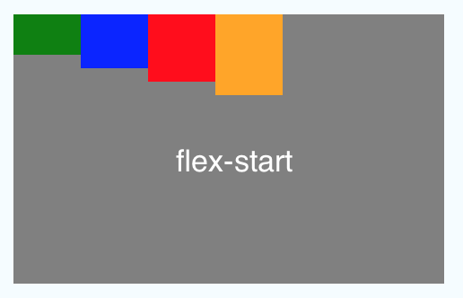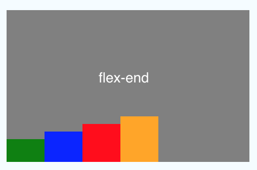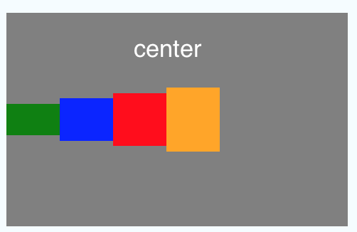

还有一种stretch表示拉伸，拉伸的时候不需要完整的设置高度宽度，比如

```
<View style={{width:320,height:200,backgroundColor:'gray',alignItems:'stretch',flexDirection:'row'}}>
  <View style={{width:50,backgroundColor:'green'}}></View>
  <View style={{width:50,backgroundColor:'blue'}}></View>
  <View style={{width:50,height:50,backgroundColor:'red'}}></View>
  <View style={{width:50,height:60,backgroundColor:'orange'}}></View>
</View>
```
效果

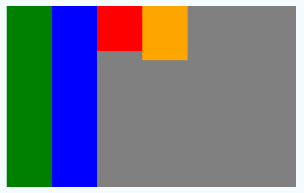


----------

alignSelf
---------
五个值，当Item有这个属性的时候，会优先读取item的alignSelf来布局，也就是说会覆盖Container的alignItems。例如

```
<View style={{width:320,height:200,backgroundColor:'gray',alignItems:'center',flexDirection:'row'}}>
  <View style={{width:50,height:30,backgroundColor:'green',alignSelf:'flex-end'}}></View>
  <View style={{width:50,height:40,backgroundColor:'blue',alignSelf:'flex-start'}}></View>
  <View style={{width:50,alignSelf:'stretch',backgroundColor:'red'}}></View>
  <View style={{width:50,alignSelf:'auto',height:60,backgroundColor:'orange'}}></View>
</View>
```
效果


----------

justifyContent－水平轴上的位置关系
------------------------
五个值

```
'flex-start','flex-end', 'center', 'space-between', 'space-around'
```
同样，我们还是举个例子，来看看实际效果
代码如下

```
<View style={{width:320,height:200,backgroundColor:'gray',justifyContent:'space-around',flexDirection:'row'}}>
  <View style={{width:50,height:30,backgroundColor:'green'}}></View>
  <View style={{width:50,height:40,backgroundColor:'blue'}}></View>
  <View style={{width:50,height:50,backgroundColor:'red'}}></View>
  <View style={{width:50,height:60,backgroundColor:'orange'}}></View>
</View>
```
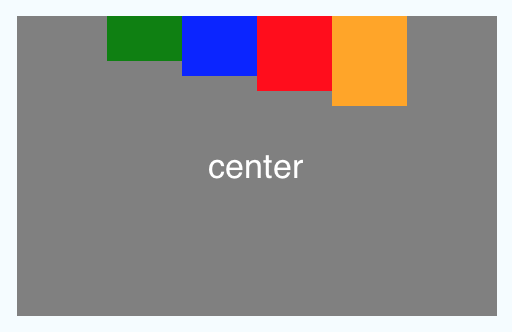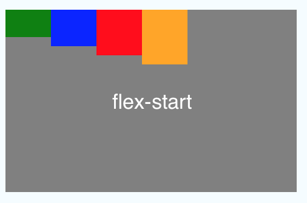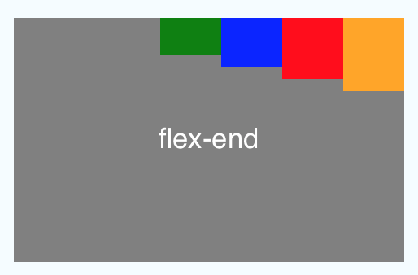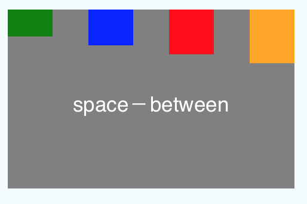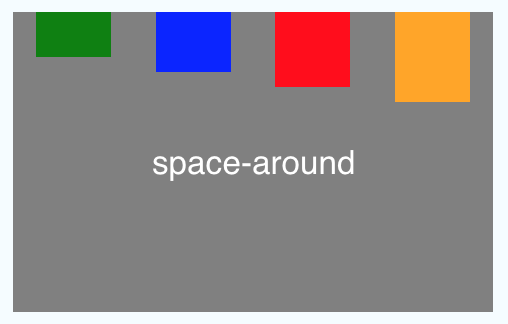

----------

flex-占据剩余空间的权重
----
例如，如下，不设置宽度，高度一样，三个item，flex都是1，那么每个item的宽度占据1/3

```
<View style={{width:320,height:200,backgroundColor:'gray',flexDirection:'row'}}>
  <View style={{flex:1,height:30,backgroundColor:'green'}}></View>
  <View style={{flex:1,height:30,backgroundColor:'blue'}}></View>
  <View style={{flex:1,height:30,backgroundColor:'red'}}></View>
</View>
```
效果


当我们固定中间宽度为50，然后两边flex都是1的时候

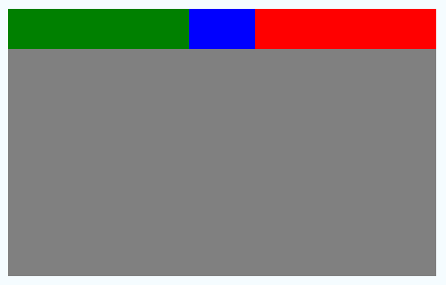


----------

flexWrap-决定在flex的方向上填满后是否换行
--------
两个值，默认不换行
```
'wrap', 'nowrap'
```
代码

```
<View style={{width:320,height:200,backgroundColor:'gray',flexDirection:'column',flexWrap:'wrap'}}>
  <View style={{width:50,height:30,backgroundColor:'green'}}></View>
  <View style={{width:50,height:40,backgroundColor:'blue'}}></View>
  <View style={{width:50,height:50,backgroundColor:'red'}}></View>
  <View style={{width:50,height:60,backgroundColor:'orange'}}></View>
  <View style={{width:50,height:70,backgroundColor:'pink'}}></View>
</View>
```
换行效果


不换行效果

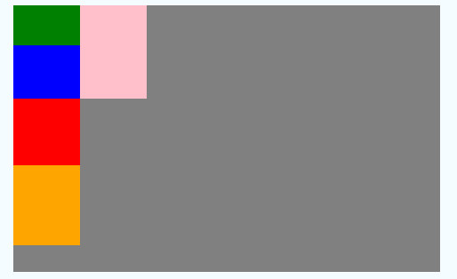

----------

top/bottom/left/right
---------------------
这个比较直观，距离上下左右的距离
例如，距离top:10,left:10

```
<View style={{width:320,height:200,backgroundColor:'gray',flexDirection:'row'}}>
  <View style={{top:10,left:10,width:30,height:50,backgroundColor:'green'}}></View>
</View>
```
效果

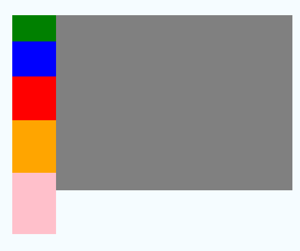


----------

padding相关
---------
与Padding相关的一共有以下几个

 - padding
 - paddingBottom
 - paddingLeft
 - paddingRight
 - paddingTop
 - paddingVertical
 - paddingHorizontal
 
例如，一个100＊100View在没有padding的时候

```
<View style={{width:320,height:200,backgroundColor:'gray',alignItems:'flex-start',paddingLeft:20,paddingTop:10}}>
  <View style={{width:100,height:100,backgroundColor:'pink'}}></View>
</View>
```
效果

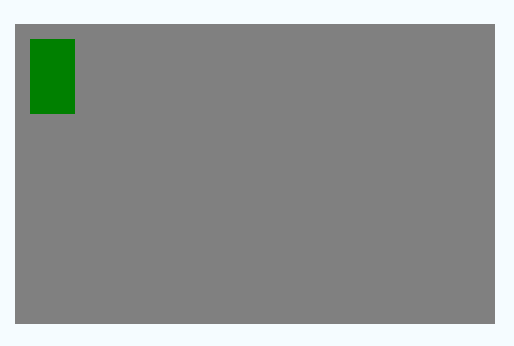

设置padding

```
<View style={{width:320,height:200,backgroundColor:'gray',alignItems:'flex-start',paddingLeft:20,paddingTop:10}}>
  <View style={{width:100,height:100,backgroundColor:'pink'}}></View>
</View>
```
效果

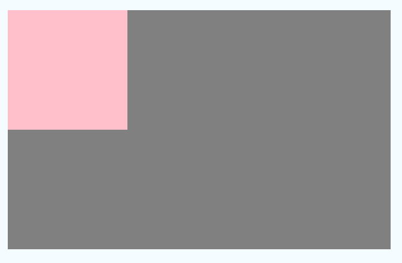

----------

Border相关
--------
几个相关的属性

 - borderWidth
 - borderTopWidth
 - borderRightWidth
 - borderLeftWidth
 - borderBottomWidth

举个例子

```
<View style={{width:320,height:200,backgroundColor:'gray',alignItems:'center',justifyContent:'center'}}>
  <View style={{width:50,height:50,backgroundColor:'pink',borderBottomWidth:3,borderColor:'white'}}></View>
</View>
```
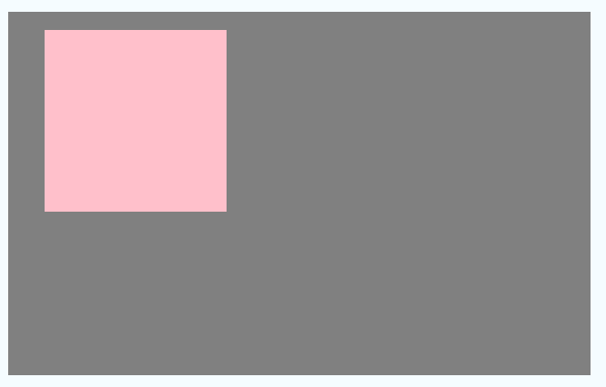

----------

margin相关
--------
于margin相关的一共有以下几个属性

 - margin
 - marginBottom
 - marginHorizontal
 - marginLeft
 - marginRight
 - marginTop
 - marginVertical

在不设置margin的情况下

```
<View style={{width:320,height:200,backgroundColor:'gray',alignItems:'center',justifyContent:'center',flexDirection:'row'}}>
  <View style={{width:30,height:40,backgroundColor:'pink' }}></View>
  <View style={{width:30,height:50,backgroundColor:'blue'}}></View>
  <View style={{width:30,height:60,backgroundColor:'green'}}></View>
</View>
```
效果

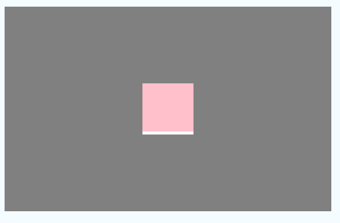

设置margin的时候

```
<View style={{width:320,height:200,backgroundColor:'gray',alignItems:'center',justifyContent:'center',flexDirection:'row'}}>
  <View style={{width:30,height:40,backgroundColor:'pink' }}></View>
  <View style={{width:30,height:50,backgroundColor:'blue',marginLeft:10,marginRight:20}}></View>
  <View style={{width:30,height:60,backgroundColor:'green'}}></View>
</View>
```
效果

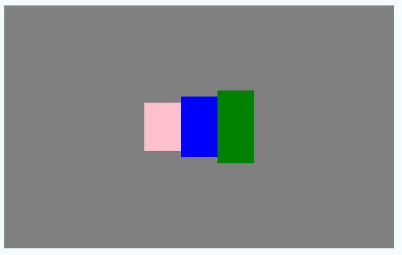

----------
