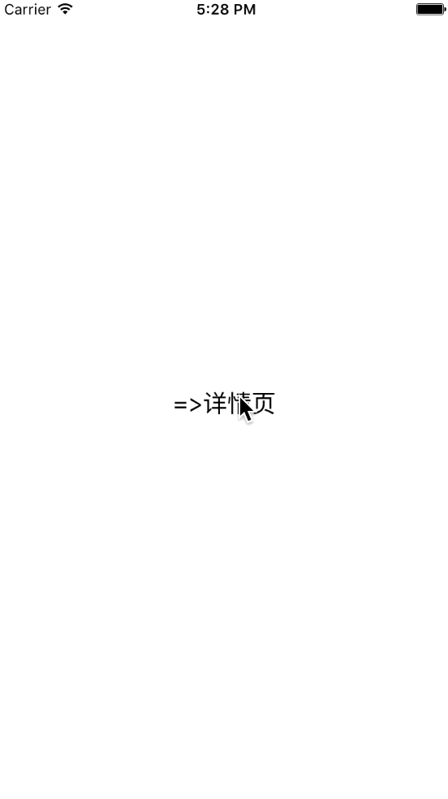
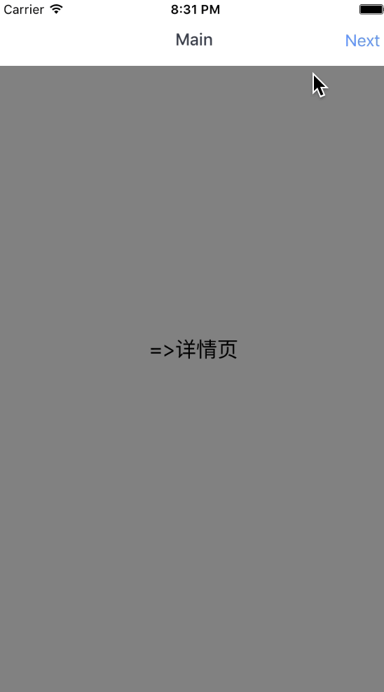

前言
--

> 除了极少数特殊设计的App，导航都是一个App重要组成的部分。导航栏能够维护一个导航堆栈，能够让用户清楚的知道<font color="orange">自己当前所处的页面和返回的页面</font>。

>在React Native中，官方推荐使用`Navigator`,因为这个能够在iOS和安卓中通用,不过在<font color="orange">现在（2016年5月18日）,Navigator 性能较差</font>。所以，对iOS应用，往往可以使用`NavigatorIOS`，你将获得系统的iOS导航栏性能和动画。但是对Android App，只能用`Navigator`。

----------

文档
--
目前的文档都可以在[这里找到](https://facebook.github.io/react-native/docs/navigator.html#content),这里我列出常用的部分。

<font color="blue">常用参数</font>

 - configureScene，类型是function，可选。通过这个参数可以修改界面在导航时候切换的动画。

```
(route, routeStack) => Navigator.SceneConfigs.FloatFromRight

```

 - initialRoute，类型是对象，表明最初的Route对象。一个Route简单来说就是一个界面，Navigator用Route来区分不同的界面。

 - navigationBar，类型是node，导航栏

 - renderScene，类型是function，必须参数，在这个方法里根据Route来渲染不同的Scene。

<font color="blue">常用函数</font>

 - push(route) ，跳转到某一个Route

 - pop()，推出当前状态

 - popToTop()，推出到第一个界面

 - popToRoute(route)，推出到某一个界面
 
----------

Getting start
-------------
创建一个工程，打开终端，到一个想要的路径，然后

```
react-native init LHWeather --verbose
```
 <font color="orange">
Tips:调用上述代码会从网络上下载几十M的数据，所以添加--verbose不会让你等的心烦意乱。
</font>
然后

```
react-native run-ios
```
会启动模拟器,如果启动成功，说明项目创建成功。

我们首先会创建一个这样效果工程



这时候的`index.ios.js` 中代码如下

```
var React = require('react');
 import {
   View,
   Text,
   StyleSheet,
   AppRegistry,
   TouchableHighlight,
   Navigator,
 } from 'react-native';

 var LHWeather  = React.createClass({
    render(){
      return (
        <Navigator
          style = {styles.container}
          initialRoute={{id:"main",}}
          renderScene={this.renderNav}
          />
      );
    },
    renderNav(route,nav){
        switch (route.id) {
          case 'main':
            return <MainScreen navigator={nav} title="Main"/ >;
          case 'detail':
            return (<DetailScreen navigator={nav} title="Detail"/ >);
        }
    }
 });

 var MainScreen = React.createClass({
   toDetail(){
     this.props.navigator.push({id:"detail"});
  },
   render(){
     return (
       <View style={styles.containView}>
         <TouchableHighlight
          style={styles.button}
          onPress={this.toDetail}
          underlayColor="#B5B5B5">
            <Text style={styles.blackText}>=>详情页</Text>
         </TouchableHighlight>
       </View>
     );
   }
 });
 var DetailScreen = React.createClass({
   toMain(){
     this.props.navigator.pop();
   },
   render(){
     return (
       <View style={styles.detailContainView}>
         <TouchableHighlight
          style={styles.button}
          onPress={this.toMain}
          underlayColor="green">
            <Text style={styles.blackText}>{'主页<='}</Text>
         </TouchableHighlight>
       </View>
     );
   }
 });
 const styles = StyleSheet.create({
   container: {
     flex: 1,
   },
   button: {
     padding: 15,
   },
   containView:{
     flex: 1,
     justifyContent: 'center',
   },
   detailContainView:{
     flex:1,
     justifyContent: 'center',
     backgroundColor:'green',
   },
   blackText:{
     fontSize:20,
     textAlign:'center',
   },
 });
 AppRegistry.registerComponent('LHWeather', () => LHWeather);

```
简单讲解下关于`Navigator`的部分

```
 <Navigator
      style = {styles.container}
      initialRoute={{id:"main",}}
      renderScene={this.renderNav}
 />
 renderNav(route,nav){
     switch (route.id) {
       case 'main':
         return <MainScreen navigator={nav} title="Main"/ >;
       case 'detail':
        return (<DetailScreen navigator={nav} title="Detail"/ >);
    }
}
```

 - 上述代码中的Route很简单，只是一个含有属性id的Object,然后，通过id来判断需要渲染成哪个Scene。
 - `navigator={nav}`用来把当前navigator的引用传递给实际要展示的Scene

----------
设置转场动画类型和手势
-------
讲上文的Navigator修改成如下

```
  <Navigator
          style = {styles.container}
          initialRoute={{id:"main",}}
          renderScene={this.renderNav}
          configureScene={(route, routeStack) => Navigator.SceneConfigs.FloatFromBottom}

      />
```
这样，转场动画会变成从底部推到顶部。可选的参数如下

```
Navigator.SceneConfigs.PushFromRight (default)
Navigator.SceneConfigs.FloatFromRight
Navigator.SceneConfigs.FloatFromLeft
Navigator.SceneConfigs.FloatFromBottom
Navigator.SceneConfigs.FloatFromBottomAndroid
Navigator.SceneConfigs.FadeAndroid
Navigator.SceneConfigs.HorizontalSwipeJump
Navigator.SceneConfigs.HorizontalSwipeJumpFromRight
Navigator.SceneConfigs.VerticalUpSwipeJump
Navigator.SceneConfigs.VerticalDownSwipeJump
```
----------
添加导航栏
-----
为Navigator继续添加一个导航栏`navigationBar`

```
  <Navigator
          style = {styles.container}
          initialRoute={{id:"main",title:"Main"}}
          renderScene={this.renderNav}
          configureScene={(route, routeStack) => Navigator.SceneConfigs.HorizontalSwipeJump}
          navigationBar={
            <Navigator.NavigationBar
              routeMapper={NavigationBarRouteMapper}
              style={styles.navBar}
           />
          }
   />
```
这里提到了另外一个控件`Navigator.NavigatorBar`,这个内嵌的NavigatorBar控件，一个属性是

 - routeMapper

<font color="orange">
这个属性的目的是告诉Navigator如何根据每个Sence渲染自己
</font>


这里的`NavigationBarRouteMapper`是

```
var NavigationBarRouteMapper = {
   //左边Button
   LeftButton: function(route, navigator, index, navState) {
     if (route.id === 'main') {
       return null;
     }
     var previousRoute = navState.routeStack[index - 1];
     return (
       <TouchableOpacity
         onPress={() => navigator.pop()}
         style={styles.navBarLeftButton}>
         <Text style={[styles.navBarText, styles.navBarButtonText]}>
           {previousRoute.title}
         </Text>
       </TouchableOpacity>
     );
   },
      //右边Button
   RightButton: function(route, navigator, index, navState) {
     if (route.id === 'detail') {
       return null;
     }
     return (
       <TouchableOpacity
         onPress={() => navigator.push({id:'detail',title:'Detail'})}
         style={styles.navBarRightButton}>
         <Text style={[styles.navBarText, styles.navBarButtonText]}>
           Next
         </Text>
       </TouchableOpacity>
     );
   },
   //标题
   Title: function(route, navigator, index, navState) {
     return (
       <Text style={[styles.navBarText, styles.navBarTitleText]}>
         {route.title}
       </Text>
     );
   },
 };
```
同时，要在StylesSheet中添加用到的Style

```
   navBar: {
  backgroundColor: 'white',
  },
  navBarText: {
    fontSize: 16,
    marginVertical: 10,
  },
  navBarTitleText: {
    color: '#373E4D',
    fontWeight: '500',
    marginVertical: 9,
  },
  navBarLeftButton: {
    paddingLeft: 10,
  },
  navBarRightButton: {
    paddingRight: 10,
  },
  navBarButtonText: {
    color: '#5890FF',
  },
```
并且import中添加

```
   TouchableOpacity,
```
这时候的效果如下



----------

添加返回图片
--------
到这里就很简单了，只需要在LeftButton中换成显示一张图片
修改navBarLeftButton的Style

```
  navBarLeftButton: {
    paddingLeft: 10,
    paddingTop:6,
  },
```
然后，添加一个Style

```
   backImage:{
     width:13,
     height:26,
   },
```
修改LeftButton

```
 <TouchableOpacity
         onPress={() => navigator.pop()}
         style={styles.navBarLeftButton}>
         <Image source={require('./back.png')} style={styles.backImage}>
         </Image>
       </TouchableOpacity>
```


----------

传递数据
----
<font color="orange">
Navigator传递数据使用Route
</font>
例如，在Main Screen中，传递data 给Route

```
toDetail(){
     this.props.navigator.push({id:"detail",title:"Detail",data:"Passed from Main screen"});
  },
```
然后，渲染的时候，传递data给DetailScreen的props

```
  case 'detail':
            return (<DetailScreen navigator={nav} title="Detail" data={route.data}/>);
```
然后，获取数据，进行渲染

```
Text style={styles.blackText}>{this.props.data}</Text>

```

----------
最后
--
附上完整代码

```
/**
 * Sample React Native App
 * https://github.com/facebook/react-native
 * @flow
 */

 var React = require('react');
 import {
   View,
   Text,
   StyleSheet,
   AppRegistry,
   TouchableHighlight,
   Navigator,
   TouchableOpacity,
   Image,
 } from 'react-native';

 var NavigationBarRouteMapper = {
   LeftButton: function(route, navigator, index, navState) {
     if (route.id === 'main') {
       return null;
     }
     var previousRoute = navState.routeStack[index - 1];
     return (
       <TouchableOpacity
         onPress={() => navigator.pop()}
         style={styles.navBarLeftButton}>
         <Image source={require('./back.png')} style={styles.backImage}>
         </Image>
       </TouchableOpacity>
     );
   },
   RightButton: function(route, navigator, index, navState) {
     if (route.id === 'detail') {
       return null;
     }
     return (
       <TouchableOpacity
         onPress={() => navigator.push({id:'detail',title:'Detail'})}
         style={styles.navBarRightButton}>
         <Text style={[styles.navBarText, styles.navBarButtonText]}>
           Next
         </Text>
       </TouchableOpacity>
     );
   },

   Title: function(route, navigator, index, navState) {
     return (
       <Text style={[styles.navBarText, styles.navBarTitleText]}>
         {route.title}
       </Text>
     );
   },
 };

 var LHWeather  = React.createClass({
    render(){
      return (
        <Navigator
          style = {styles.container}
          initialRoute={{id:"main",title:"Main"}}
          renderScene={this.renderNav}
          configureScene={(route, routeStack) => Navigator.SceneConfigs.HorizontalSwipeJump}
          navigationBar={
            <Navigator.NavigationBar
              routeMapper={NavigationBarRouteMapper}
              style={styles.navBar}
           />
          }
          />
      );
    },
    renderNav(route,nav){
        switch (route.id) {
          case 'main':
            return <MainScreen navigator={nav} title="Main"/ >;
          case 'detail':
            return (<DetailScreen navigator={nav} title="Detail" data={route.data}/>);
        }
    }
 });

 var MainScreen = React.createClass({
   toDetail(){
     this.props.navigator.push({id:"detail",title:"Detail",data:"Passed from Main screen"});
  },
   render(){
     return (
       <View style={styles.containView}>
         <TouchableHighlight
          style={styles.button}
          onPress={this.toDetail}
          underlayColor="#B5B5B5">
            <Text style={styles.blackText}>=>详情页</Text>
         </TouchableHighlight>
       </View>
     );
   }
 });
 var DetailScreen = React.createClass({
   toMain(){
     this.props.navigator.pop();
   },
   render(){
     return (
       <View style={styles.detailContainView}>
         <TouchableHighlight
          style={styles.button}
          onPress={this.toMain}
          underlayColor="green">
            <Text style={styles.blackText}>{this.props.data}</Text>
         </TouchableHighlight>
       </View>
     );
   }
 });
 const styles = StyleSheet.create({
   backImage:{
     width:13,
     height:26,
   },
   container: {
     flex: 1,
   },
   navBar: {
     backgroundColor: 'white',
   },
   button: {
     padding: 15,
   },
   containView:{
     flex: 1,
     backgroundColor:'gray',
     justifyContent: 'center',
   },
   detailContainView:{
     flex:1,
     justifyContent: 'center',
     backgroundColor:'green',
   },
   blackText:{
     fontSize:20,
     textAlign:'center',
   },
   navBar: {
    backgroundColor: 'white',
   },
  navBarText: {
    fontSize: 16,
    marginVertical: 10,
  },
  navBarTitleText: {
    color: '#373E4D',
    fontWeight: '500',
    marginVertical: 9,
  },
  navBarLeftButton: {
    paddingLeft: 10,
    paddingTop:6,
  },
  navBarRightButton: {
    paddingRight: 10,
  },
  navBarButtonText: {
    color: '#5890FF',
  },
 });

 AppRegistry.registerComponent('LHWeather', () => LHWeather);

```


----------


