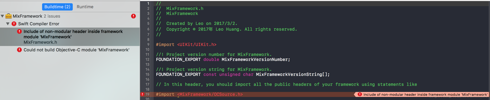
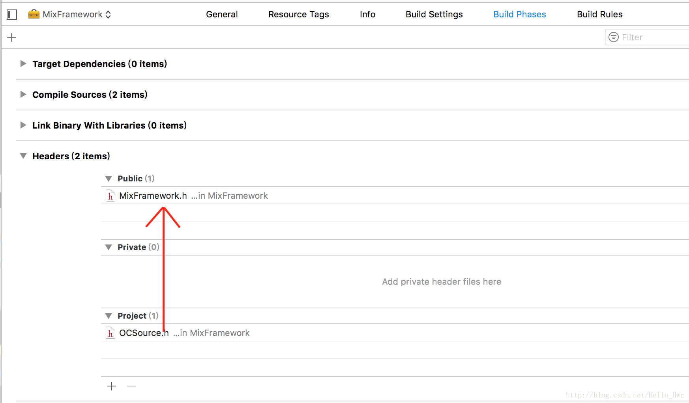
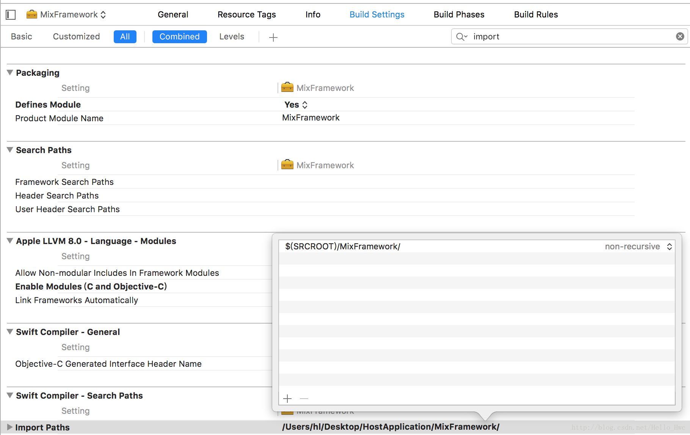
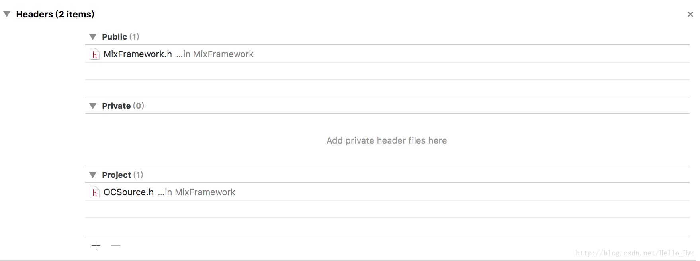

## 前言

为什么要写这样一篇文章，因为昨天和一个朋友讨论到Swift和Objective C如何混合开发Framework，中途发现了很多有意思的坑。

用Swift封装OC的库是一件比较常见的事情，毕竟对于大多数公司来说，老的代码都是用OC写的，而且经过多次迭代，这些OC的代码已经被验证了是稳定的，用Swift重写代价太大。这就引入了一个需求：

- 用Swift和OC来混编一个Framework。

如果你之前没有用Swift和Objective C混合开发，建议看看这篇文档：

- [Swift and Objective-C in the Same Project](https://developer.apple.com/library/content/documentation/Swift/Conceptual/BuildingCocoaApps/MixandMatch.html)

这篇文档很详细的讲解了如何运用Objective C和Swift进行混合开发App和Framework。于是，我们先按照文档来写一个混编的Framework

----
## 按照文档一步一步来
新建一个基于单页面工程，然后新建一个一个Target，选中Cocoa Touch Framework。然后，分别新建一个Swift文件和Objective C类，注意Target Member Ship选中Framework。类的内容如下：

OCSource.h

```
#import <Foundation/Foundation.h>

@interface OCSource : NSObject
- (void)functionFromOC;
@end

```

OCSource.m

```
#import "OCSource.h"

@implementation OCSource

- (void)functionFromOC{
    NSLog(@"%@",@"Log from objective c in framework");
}
@end


```
### Swift调用OC

新建SwiftSource.swift

```
open class SwiftIt{
    public init(){}
    let ocObject = OCSource()
    public func encapsulate(){
        ocObject.functionFromOC()
    }
}
```
然后，按照文档中，**为了让Swift文件访问Objective C文件**，我们应该在umbrella header，也就是`MixFramework.h`中，暴露所需要的header。

也就是，`MixFramework.h`,

```
#import <MixFramework/OCSource.h>
```

然后，自信满满的点击build。

**Boom～～～**，编译不通过。



> 原因：OCSource.h默认编译的时候是Project权限. 为了在umbrella header中使用，要把这个文件的权限改成Public

按照图中的方式拖过去即可。




嗯，现在build，可以看到build成功了。

## OC调用Swift

在SwiftSource.swift中，增加一个类，

```
open class ClassForOC:NSObject{
    public static let textForOC = "textForOC"
}
```

然后，为了在OC中调用Swift的方法，我们需要导入头文件，这时候，OCSource.m文件内容如下

```
#import "OCSource.h"
#import <MixFramework/MixFramework-Swift.h>

@implementation OCSource

- (void)functionFromOC{
    NSLog(@"%@",[ClassForOC textForOC]);
}
@end
```
**然后，build，发现成功了，很开心。**

-----
## 外部调用

在ViewController.swift中，我们调用Framework中的内容。

```
import MixFramework
class ViewController: UIViewController {
    var t = SwiftIt()
    override func viewDidLoad() {
        super.viewDidLoad()
        t.encapsulate()
        // Do any additional setup after loading the view, typically from a nib.
    }

    override func didReceiveMemoryWarning() {
        super.didReceiveMemoryWarning()
        // Dispose of any resources that can be recreated.
    }
}

```
然后运行，发现控制台打印出

```
2017-03-02 16:08:24.000 HostApplication[19524:167669] textForOC
```

嗯，framework打包成功了。

----
## 问题

通常，我们希望暴露给外部的接口是**纯Swift，而OC文件的具体接口应该隐藏**，这就是我标题中的优雅两个字的含义。

如果你好奇，你会发现，在ViewController.swift中你可以这么调用

```
    var s = OCSource()
```

也就是说，OC的内容也暴露出来了，**这破坏了Framework的封装特性**。

通过查看MixFramework的编译结果，发现最后暴露出的接口是这样子的

```
import Foundation
import MixFramework.OCSource
import MixFramework
import MixFramework.Swift
import SwiftOnoneSupport
import UIKit

//
//  MixFramework.h
//  MixFramework
//
//  Created by Leo on 2017/3/2.
//  Copyright © 2017年 Leo Huang. All rights reserved.
//

//! Project version number for MixFramework.
public var MixFrameworkVersionNumber: Double
open class ClassForOC : NSObject {

    public static let textForOC: String
}

open class SwiftIt {

    public init()

    public func encapsulate()
}


```

这一行，把OC对应的实现暴露出来了

```
import MixFramework.OCSource
```

----

## 优雅的解决方案

不再通过umbrella header的方式让framework中的Swift调用OC方法。而是通过**modulemap**。

新建一个`module.modulemap`文件，内容如下

```

module OCSource [system] {
    //由于module.modulemap和OCSource.h是在同一个文件夹的，如果不是同一个，路径要写全
    header "OCSource.h"
    export *
}
```




这里的#(SRCROOT)是XCode的宏，会自动替换成项目所在的根目录，这里输入的路径是module.modulemap文件所在的路径。

然后，删除`MixFramework.h`(umbrella header)中#import 的OC header。

把OCSource.h的权限改回默认的project。




再编译，发现OC的类被隐藏了。

----------
## 总结

如果你要开发一个framework，一定要想清楚哪些接口暴露出去，哪些封装起来，framework不是简单把一包文件加个壳子。

