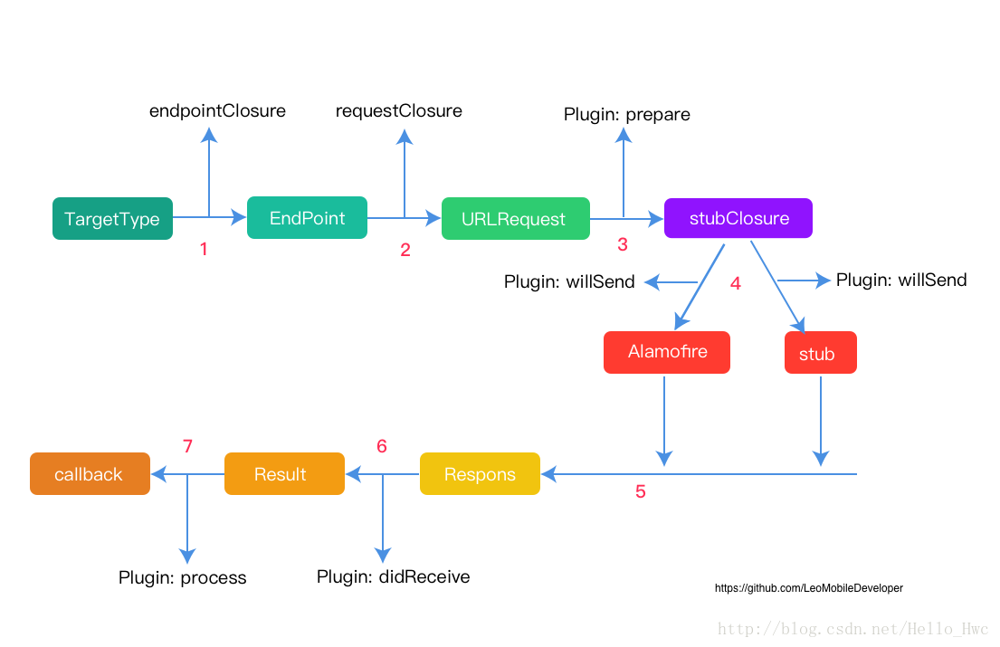
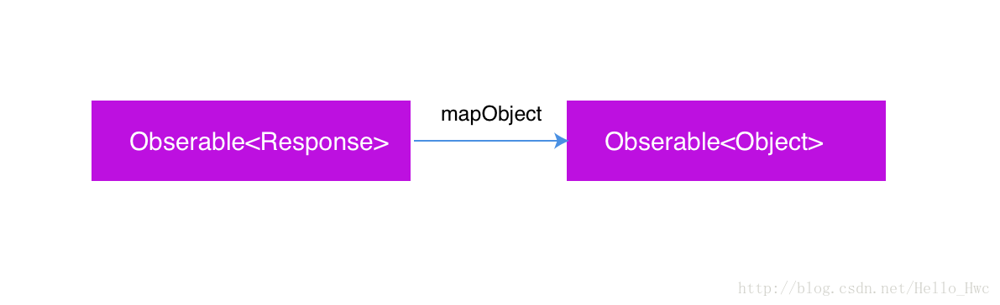

## 前言

> Moya是一个基于Alamofire开发的，轻量级的Swift网络层。Moya的可扩展性非常强，可以方便的RXSwift，PromiseKit和ObjectMapper结合。

如果你的项目刚刚搭建，并且是纯Swift的，非常推荐以Moya为核心去搭建你的网络层。另外,如果你对Alamofire的源码感兴趣，推荐我之前的一篇博客：

- [Alamofire的设计之道](http://blog.csdn.net/hello_hwc/article/details/72853786)

> Moya除了依赖Alamofire，还依赖[Result](https://github.com/antitypical/Result)。Result用一种枚举的方式提供函数处理结果：
> 
> - `.success(let data)` // 成功，关联值是数据
> - `.falure(let error)` // 失败, 关联值是错误原因

**本文的讲解顺序：Moya的实现原理 -> Moya的设计理念 -> Moya与RxSwift，ObjectMapper一起工作**


--
## 接口

> 分析任何代码都是从它的接口开始的。

我们先来看看通过Moya如何去写一个网络API请求。Moya中，通过协议[TargetType](https://github.com/Moya/Moya/blob/master/Sources/Moya/TargetType.swift)来表示这是一个API请求。

协议要求提供以下属性，

```
public protocol TargetType {
    var baseURL: URL { get }
    var path: String { get }
    var method: Moya.Method { get }
    var parameters: [String: Any]? { get } //参数
    var parameterEncoding: ParameterEncoding { get } //编码方式
    var sampleData: Data { get }//stub数据
    var task: Task { get }//请求类型，Data/Downlaod/Upload
    var validate: Bool { get } //是否需要对返回值验证，默认值false
}
```

通过枚举来管理一组API，比如

```
public enum GitHub {
    case zen
    case userProfile(String)
}
extension GitHub: TargetType {
    public var baseURL: URL { return URL(string: "https://api.github.com")! }
    public var path: String {
        switch self {
        case .zen:
            return "/zen"
        case .userProfile(let name):
            return "/users/\(name.urlEscaped)"
        }
    }
    //....
}
```

> 当然也可以让你的Class/Stuct来实现TargetType协议，使用枚举可以方便的管理一组API，优点是方便复用baseURL,method等，缺点是不得不写大量的Switch语句

然后，在进行API请求的时候，要创建`MoyaProvider`，接着调用Request方法进行实际的请求

```
let provider = MoyaProvider<GitHub>()
provider.request(.zen) { result in
    if case let .success(response) = result {
     
    }    
}
```

> 可以看到，Moya通过协议来定义一个网络请求，并且属性都是只读的。协议意味着是依赖于抽象，而不是具体的实现，这样更易控制藕合，并且容易扩展；只读的意味着不可变状态，不可变状态会让你的代码行为可预测。 

---
## 模块
通过功能划分，Moya大致分为几个模块

- **Request**，包括TargetType，Endpoint，Cancellable集中类型
- **Provider**，网络请求的枢纽，Provider会把`TargetType`转换成`Endpoint`再转换成`URLRequest`交给Alamofire去实际执行
- **Response**，回调给上层的数据结构，支持`filter`，`mapJSON`等方法
- **Alamofire封装**，通过桥接的方式对上层隐藏alamofire的细节
- **Plguins**，插件。moya提供了插件来给给外部。包括四个方法，这里知道方法就好，后文会具体的讲解插件的方法在何时工作。

	```
	public protocol PluginType {
        func prepare(_ request: URLRequest, target: TargetType) -> URLRequest
        func willSend(_ request: RequestType, target: TargetType)
        func didReceive(_ result: Result<Moya.Response, MoyaError>, target: TargetType)
        func process(_ result: Result<Moya.Response, MoyaError>, target: TargetType) -> Result<Moya.Response, MoyaError>
    }
	```

---
## 原理

为了更好的讲解Moya的处理流程，我画了一张图（用Sketch画的）：



第一眼看到这张图的时候，你肯定是困惑的，我们来一点点讲解图中的过程。通过上文的讲解我们知道，[Provider](https://github.com/Moya/Moya/blob/master/Sources/Moya/MoyaProvider.swift)这个类是网络请求的枢纽，它接受一个TargetType(请求)，并且通过闭包的方式给上层回调。

那么，我们来看看[Provider](https://github.com/Moya/Moya/blob/master/Sources/Moya/MoyaProvider.swift)的初始化方法：

```
public init(endpointClosure: @escaping EndpointClosure = MoyaProvider.defaultEndpointMapping,
            requestClosure: @escaping RequestClosure = MoyaProvider.defaultRequestMapping,
            stubClosure: @escaping StubClosure = MoyaProvider.neverStub,
            manager: Manager = MoyaProvider<Target>.defaultAlamofireManager(),
            plugins: [PluginType] = [],
            trackInflights: Bool = false) {
  //...
}
```

初始化的时候的几个参数：

- `endpointClosure` 作用是把TargetType转换成EndPoint，EndPoint是Moya网络请求的一个中间态。
- `requestClosure` 作用是把Endpoint转换成URLRequest
- `stubClosure` 是用来桩测试的，也就是模拟服务端假数据，这里先不管。
- `manager`，实际请求的Alamofire的SessionManager
- `plugins`, 插件
- `trackInflights`，是否要跟踪重复网络请求

----
### Request


在Moya中，请求是按照如图的方式进行转换的。其中,TargetType到Endpoint的转换是通过闭包`endpointClosure`来完成的。闭包的输入是TargetType，输出是`EndPoint`

```
public typealias EndpointClosure = (Target) -> Endpoint<Target>
```

在初始化Provider的时候，`endpointClosure`有默认参数，可以看到默认实现只是由Target创建了一个Endpoint

```
public final class func defaultEndpointMapping(for target: Target) -> Endpoint<Target> {
    return Endpoint(
        url: url(for: target).absoluteString,
        sampleResponseClosure: { .networkResponse(200, target.sampleData) },
        method: target.method,
        parameters: target.parameters,
        parameterEncoding: target.parameterEncoding
    )
}
```

接着，通过`requestClosure`将Endpoing映射到URLRequest。这是你最后修改Request的机会，同样它也有默认参数。

```

public final class func defaultRequestMapping(for endpoint: Endpoint<Target>, closure: RequestResultClosure) {
    if let urlRequest = endpoint.urlRequest {//urlReuqest有效，就以success执行闭包
        closure(.success(urlRequest))
    } else {//无效，以faliure执行闭包
        closure(.failure(MoyaError.requestMapping(endpoint.url)))
    }
}
```

**为什么要用闭包进行TargetType->Endpoint->URLRequest映射呢？**

> **为了在灵活性和易用性之间进行平衡**。

对于大部分API请求来说，使用Moya提供的默认闭包映射足以，这样大多数时候根本不需要关心着两个闭包的内容。但是有时候，有一些额外需求，比如对所有API请求增加额外的`HTTP Header`，moya通过闭包的方式开发者可以去修改这些内容。

```
let endpointClosure = { (target: MyTarget) -> Endpoint<MyTarget> in
    let defaultEndpoint = MoyaProvider.defaultEndpointMapping(for: target)
    return defaultEndpoint.adding(newHTTPHeaderFields: ["APP_NAME": "MY_AWESOME_APP"])
}
```

**为什么要引入`requestClosure`，把底层的URLRequest暴露给外部？**

> 我想有几点原因
> 
> - 有些信息只有`URLRequest`创建之后才能知晓，比如cookie。
> - `URLRequest`属性很多，大多不常用，比如`allowsCellularAccess`，没必在Moya这一层封装。
> - Endpoint到URLRequest的映射是通过闭包回调的方式进行的，意味着你可以异步回调。

**为什么要引入`Endpoint`，不直接映射成`URLRequest`?也就是说，两步闭包映射变成一步**

> 为了保证TargetType维持不可变状态（属性全都是只读），同时给外部友好的API。通过Endpoint你可以方便的：添加新的参数,添加HttpHeader....


---
### Stub
这里我们先不管流程图中的Plugins（插件），先顺着流程走，接下来我们到了一个叫做stub的模块。stub是一个测试相关的概念，通过stub你可以返回一些假数据。

> Moya的stub原理很简单，如果Provider决定Stub，那么就返回Endpoint中的假数据；否则就进行实际的网络请求。

Moya通过`StubClosure`闭包开决定stub的模式：

```
public typealias StubClosure = (Target) -> Moya.StubBehavior
```

模式分为三种

```
public enum StubBehavior {
    case never //不Stub
    case immediate //立刻返回数据
    case delayed(seconds: TimeInterval)//延时返回数据
}
```
返回数据的时候，就是简单的根据EndPoint中的假数据闭包：

```
switch endpoint.sampleResponseClosure() {
	case .networkResponse(let statusCode, let data):
	    let response = Moya.Response(statusCode: statusCode, data: data, request: request, response: nil)
	    completion(.success(response))
	    //...
}
```

默认的Endpoint的`sampleResponseClosure`。

```
sampleResponseClosure: { .networkResponse(200, target.sampleData) },
```

Moya采用了这种简单粗暴，但是效果却很好的stub方式。

**这里很多人肯定会问，假如我不用Moya，我还想返回假数据，我该咋么做呢？**

> 答案是[URLProtocol](https://developer.apple.com/documentation/foundation/urlprotocol)。通过[URLProtocol](https://developer.apple.com/documentation/foundation/urlprotocol)可以拦截网络请求，你可以把网络请求重定向到假数据。
> 
> 对于NSURLConnection发起的请求可以直接拦截。在拦截NSURLSession的时候有一点tricky，因为URLSession支持的拦截是通过[URLSessionConfiguration](https://developer.apple.com/documentation/foundation/urlsessionconfiguration)的属性[protocolClasses](https://developer.apple.com/documentation/foundation/urlsessionconfiguration/1411050-protocolclasses)来决定的，一般的做法是hook URLSession的初始化方法`init(configuration: URLSessionConfiguration, delegate: URLSessionDelegate?, delegateQueue: OperationQueue?)`，然后把想要的拦截Protocol注册到URLSessionConfiguration中。

----
### Plugin

> Plugin提供了一种插件的机制让你可以在网络请求的关键节点插入代码，比如显示小菊花扽等。


这里我们再看一下这张图，可以清楚的看到四个plugin方法作用的时机。

> Note：Plugin没有用范型编程，所以不要尝试在plugin中进行JSON解析然后传递给上层。

Moya提供了四种Plugin：

- [AccessTokenPlugin](https://github.com/Moya/Moya/blob/master/Sources/Moya/Plugins/AccessTokenPlugin.swift) OAuth的Token验证
- [CredentialsPlugin](https://github.com/Moya/Moya/blob/master/Sources/Moya/Plugins/CredentialsPlugin.swift) 证书
- [NetworkActivityPlugin](https://github.com/Moya/Moya/blob/master/Sources/Moya/Plugins/NetworkActivityPlugin.swift) 网络请求状态
- [NetworkLoggerPlugin](https://github.com/Moya/Moya/blob/master/Sources/Moya/Plugins/NetworkLoggerPlugin.swift) 网络日志

---
### Response

> Moya并没有对Response进行特殊处理，仅仅是把Alamofire层面返回的数据封装成`Moya.Response`，然后再调用`convertResponseToResult`进一步封装成`Result<Moya.Response, MoyaError>`类型交给上层

```
public func convertResponseToResult(_ response: HTTPURLResponse?, request: URLRequest?, data: Data?, error: Swift.Error?) ->
    Result<Moya.Response, MoyaError> {
        switch (response, data, error) {
        case let (.some(response), data, .none):
            let response = Moya.Response(statusCode: response.statusCode, data: data ?? Data(), request: request, response: response)
            return .success(response)
        case let (_, _, .some(error)):
			//....
        }
}

```
如果你要对Response进一步转换成JSON，可以用Response的方法，比如：

```
func mapJSON(failsOnEmptyData: Bool = true) throws -> Any {/* */}
```

> 到这里，Moya做的事情已经很清晰了：提供一种面向协议的接口来进行网络请求的编写；提供灵活的闭包接口来自定义请求；提供插件来让客户端在各个节点去介入网络请求；返回原始的请求数据给层。

Moya最大的优点:

- **纯粹的轻量级网络层。** 

----
### Cancel

网络API请求应该是可以被取消的。也就是说，在发起一个API请求后，客户端应该能够有一个数据结构能够取消这个请求。Moya返回协议`Cancellable`给客户端

```
public protocol Cancellable {
    var isCancelled: Bool { get }
    func cancel()
}
```

> 这符合《最少知识原则》。客户端不知道请求是什么，它唯一能做的就是`cancel`。

在内部实现中，引入了一个`CancellableWrapper`来进行实际的Cancel动作包装，返回的实际实现协议的类型就是它

```
internal class CancellableWrapper: Cancellable {
    internal var innerCancellable: Cancellable = SimpleCancellable()

    var isCancelled: Bool { return innerCancellable.isCancelled }

    internal func cancel() {
        innerCancellable.cancel()
    }
}

internal class SimpleCancellable: Cancellable {
    var isCancelled = false
    func cancel() {
        isCancelled = true
    }
}
```

**为什么要用一个CancellableWrapper进行包装呢？** 

原因是：

- 对于没有实际发出的请求（参数错误），cancel动作直接用`SimpleCancellable`即可。
- 对于实际发出的请求请求，cancel则需要取消实际的网络请求。

```
let cancellableToken = CancellableWrapper()
if error{ //参数出错
	return cancellableToken
}
cancellableToken.innerCancellable = CancellableToken(request:request)
```

而`CancellableToken`中，取消网络请求：

```
public final class CancellableToken: Cancellable{
	//...
    fileprivate var lock: DispatchSemaphore = DispatchSemaphore(value: 1)
    public func cancel() {
        _ = lock.wait(timeout: DispatchTime.distantFuture)
        defer { lock.signal() }
        guard !isCancelled else { return }
        isCancelled = true
        cancelAction()
    }
    init(request: Request) {
        self.request = request
        self.cancelAction = {
            request.cancel()
        }
    }
    //...
}
```
> 这里用到了信号量，为了防止两个线程同时执行cancel操作。

---
### Alamofire封装
Moya采用桥接的方式，把Alamofire的API细节进行封装，详细的封装细节可见[Moya+Alamofire.swift](https://github.com/Moya/Moya/blob/master/Sources/Moya/Moya%2BAlamofire.swift)。总的来说，采用了两种方式：

简单的类型桥接

```
//用typealias进行桥接
public typealias Method = Alamofire.HTTPMethod
public typealias ParameterEncoding = Alamofire.ParameterEncoding
```

协议桥接

Alamofire对外的接口是[Request](https://github.com/Alamofire/Alamofire/blob/master/Source/Request.swift)类型。而Moya需要在Plugin中对Reuqest进行暴露，用协议怼Request进行了桥接

```
public protocol RequestType {
    var request: URLRequest? { get }
    func authenticate(user: String, password: String, persistence: URLCredential.Persistence) -> Self
    func authenticate(usingCredential credential: URLCredential) -> Self
}

internal typealias Request = Alamofire.Request
extension Request: RequestType { }
```

然后，暴露给外部的接口变成了：

```
func willSend(_ request: RequestType, target: TargetType)
```

> 采用桥接的方式对外隐藏了细节，这样即使有一天Moya的底层依赖不再是Alamofire，对上层也没有任何影响。

## 设计原则

moya的很多设计原则是值得借鉴的，这些原则在软件开发领域是通用的。

### 面向协议

> Swift是一个面向协议的语言。(这句话我好像在博客里写过好多遍了)

比如：

```
protocol TargetType {} //表示这是一个API请求
public protocol Cancellable{}//唯一确定请求，只有一个接口用来取消
public protocol RequestType{}//对外提供的请求类型，隐藏Alamofire的细节
public protocol PluginType{} //插件类型
```

面向协议的最大优点是：

- 协议是建立的是一个抽象的依赖关系。

同时，Swift协议支持扩展，你可以通过协议扩展为协议中的方法提供默认实现

```
public extension TargetType {
    var validate: Bool {
        return false
    }
}
```
### 不可变状态

> 不可变状态会让你的代码可预测，可测试。

不可变状态是函数式编程里的一个核心概念。在Moya中，很多状态都是不可变的。典型的是：

```
public protocol TargetType {
    var baseURL: URL { get } //只读
    var path: String { get } //只读
    //...
}
```

同样，还体现在Endpoint中：

```
open class Endpoint<Target> {
    open let url: String //常量
    open let method: Moya.Method
    //...
    //不修改自身，而是返回一个新的实例
	 open func adding(newHTTPHeaderFields: [String: String]) -> Endpoint<Target> {
	    return adding(httpHeaderFields: newHTTPHeaderFields)
	}
}
```

### 高阶函数

> Swift中，函数是一等公民，意味着你可以把它作为函数的参数和返回值。当一个函数作为函数参数或者返回值的时候，称之为高阶函数。

**高阶函数让你的代码可以输入/输出逻辑，这样就增加了灵活性。**

比如在Provider初始化的时候传入的三个闭包：

```
endpointClosure: = MoyaProvider.defaultEndpointMapping,
requestClosure: = MoyaProvider.defaultRequestMapping,
stubClosure: = MoyaProvider.neverStub,
```

> 高阶函数配合函数默认值，是Swift开发中进行接口暴露的常用技巧。

### 插件

插件是我认为Moya这个框架最吸引我的地方。


> 通过在各个节点暴露出插件的接口，让Moya的日志，授权，小菊花等功能无需耦合到核心代码里，同时也给外部足够的灵活性，能够插入任何想要的代码。

### 类型安全

> 使用枚举来保证类型安全是Swift中常用技巧。

比如：

```
//返回假数据
public enum EndpointSampleResponse {
    case networkResponse(Int, Data)
    case response(HTTPURLResponse, Data)
    case networkError(NSError)
}

```
### 错误处理

Moya的错误处理主要采用了两种方式：

抛异常：

```   
public func filterSuccessfulStatusAndRedirectCodes() throws -> Response {
    return try filter(statusCodes: 200...399)
}
```

Result类型：

```
func convertResponseToResult(****) -> Result<Moya.Response, MoyaError> {
    return .success(response) 
    return .failure(error)
}
```

> 在Swift中，通过Result类型来处理异步错误是一个很常见也很有效的做法。

使用Result类型最大的好处是可以不用每一步都处理错误。

比如，类似这个链式调用，每一步都有可能出错，通过Result类型，我们可以在最后统一处理错误。

```
provider.request(...).filter().mapJSON.filter().{ result in
    switch result {
        case let .success(moyaResponse):
    
        case let .failure(error):
    }
 }

```

- 延伸阅读： [详解Swift中的错误处理](http://blog.csdn.net/hello_hwc/article/details/63685843)

---

## RxSwift

> [RxSwift](https://github.com/ReactiveX/RxSwift)是一个响应式编程框架，它是语言层面的扩展，改变的是你写代码的方式，与具体业务细节无关。

如果你对RxSwift并不熟悉，推荐我之前的一篇博客：[RxSwift使用教程](http://blog.csdn.net/hello_hwc/article/details/51859330)。另外，我还维护了一个[awesome-rxswift](https://github.com/LeoMobileDeveloper/awesome-rxswift)列表。

Moya核心代码并没有支持RxSwift，那样就与另外一个框架耦合在一起了。Moya采用了扩展的方式，让Moya支持RxSwift，具体代码参见[RxMoya](https://github.com/Moya/Moya/tree/master/Sources/RxMoya)。

在扩展中，提供了`RxMoyaProvider`类：

```
class RxMoyaProvider<Target>: MoyaProvider<Target>
```

在请求的时候，不再通过闭包进行回调，而是返回`Observable<Response>`（一个可监听的信号源）。

```
open func request(_ token: Target) -> Observable<Response> {
    return Observable.create { observer in 
    	//...
    }
}
```
然后，通过extension扩展ObservableType为Response提供各种响应式处理方法

```
extension ObservableType where E == Response {
	 public func mapJSON(failsOnEmptyData: Bool = true) -> Observable<Any>
	 public func filter(statusCode: Int) -> Observable<E>
}
```

---
## ObjectMapper

> [ObjectMapper](https://github.com/Hearst-DD/ObjectMapper) 是一个用来做把JSON转换成Struct/Class的Swift框架。

实际开发中，先把JSON转换成对象再进行下一步UI操作是很常见的事情。结合RxSwift，我们可以很容易的把ObjectMapper插入响应式处理的一个节点中：

```
extension ObservableType where E == Response {
	public func mapObject<T: Mappable>(_ type: T.Type) -> Observable<T> {
		return flatMap { response -> Observable<T> in
			return Observable.just{/* 这里引入ObjectMapper进行JSON解析*/}
		}
	}
}
```
通过这个方法，可以进行信号中包含的信息转换：



于是，通过RxSwift和ObjectMapper，就可以这么处理：

```
rxRrovider.request(.targetType)
  .mapObject(YouClass.type)
  .subscribe { event -> Void in
    switch event {
    case .next(let object):
      self.object = object
    case .error(let error):
      print(error)
    default:
      break
    }
  }.addDisposableTo(disposeBag)
```

---
