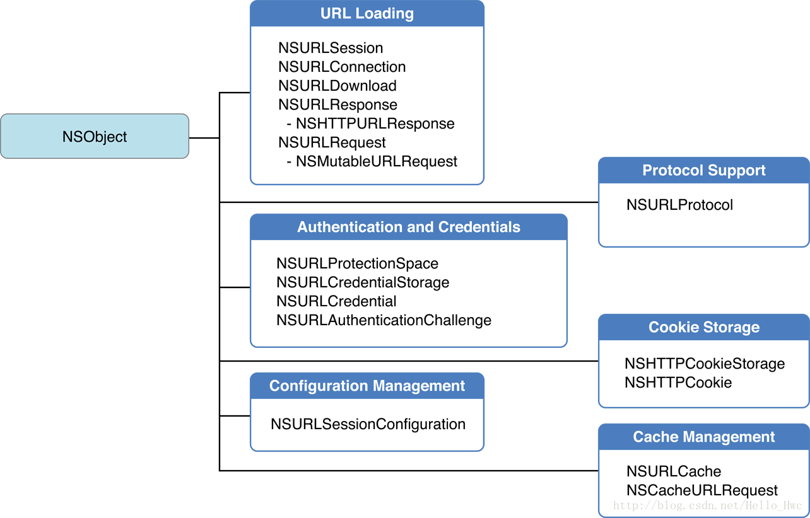
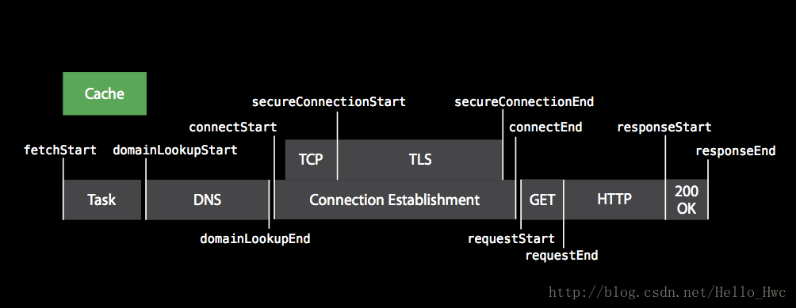
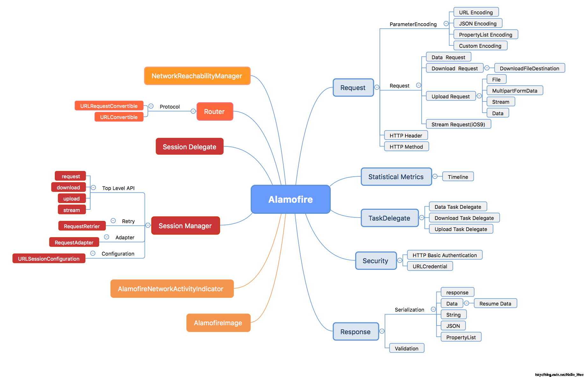
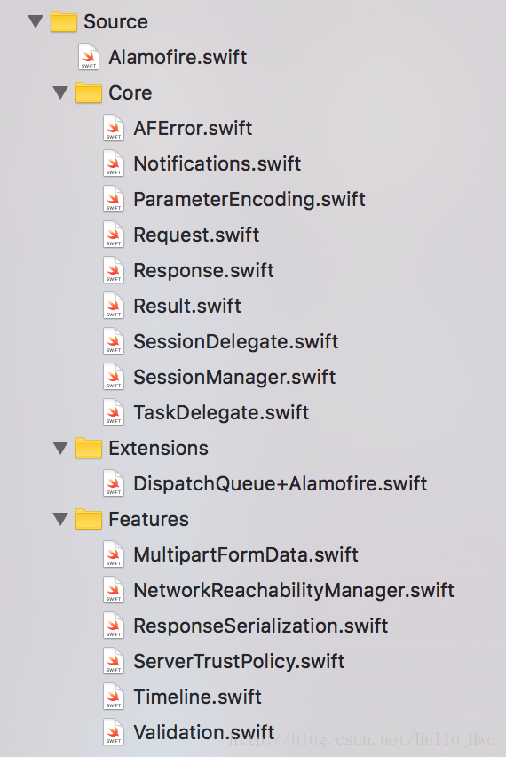
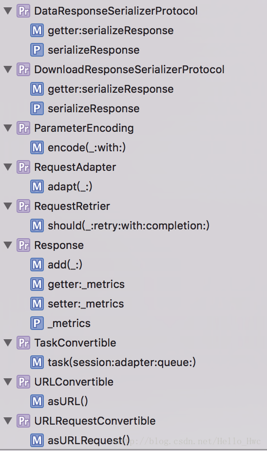
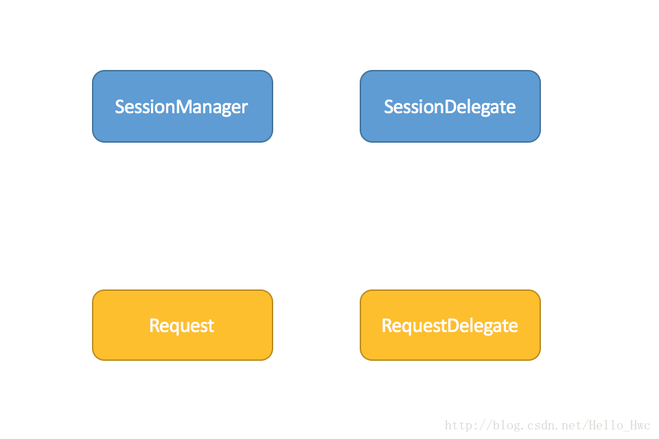

## 前言

[Alamofire](https://github.com/Alamofire/Alamofire)：一个由Swift编写的优雅的网络开发框架。

大部分用Swift编写的App的网络模块都是基于Alamofire的。作为Swift社区最活跃的几个项目之一，有许多开发者在不断的对其进行完善，所以学习这种优秀的开源代码对深入理解Swift的特性很有帮助。

本文很长，大到整个框架的设计，小到某些基础功能的使用都会涉及。

---
## URL Loading System

iOS的网络开发（URL Loading System）的类层次如下：



从图中可以看出，整个框架包括URL Loading相关的核心类和五种辅助类。其中，五种辅助类划分如下

- Configuration 配置信息，比如Cookie的存储策略，TLS版本等等。
- Authentication and Credentials 授权和证书
- Protocol support 用做proxy来拦截或特殊处理某些URL
- Cookie Storage 管理Cookie
- Cache Management 管理缓存

Alamofire就是建立在`NSURLSession`上的封装。

`NSURLSession`是在2013年推出的新API，并且Apple在2015年废弃了`NSURLConnection`。如果你的App还在用以`NSURLConnection`建立的网络层（比如AFNetworking 2.x），那么你真的应该考虑升级到NSURLSession（比如AFNetworking 3.x），废弃的API也许还能正常工作，但是Apple已对其不再维护，当然也就不支持HTTP 2.0等新特性。

关于NSURLSesson的基础使用，我之前有过几篇博客，可以在这个链接找到：

- [博客iOS网络开发分类](http://blog.csdn.net/Hello_Hwc/article/category/2885601)

那么，用NSURLSession来进行HTTP/HTTPS请求的时候，实际的过程如何呢？



- 建立`NSURLSessionTask`，并且`resume`.
- 检查cache策略，如果有需要从本地cache中直接返回数据
- 通过DNS进行域名查找
- 建立TCP连接
- 如果是HTTPS，进行TLS握手（如有资源需要认证访问，可能需要客户端提供证书，用户名密码等信息）
- 请求开始，收到HTTP的Response
- 接收HTTP的Data

> Tips: 理解HTTP/HTTPS的请求过程很重要，因为往往你需要统计API请求在哪个阶段出了问题，然后对症下药，提高用户体验。


----
## API设计

> 衡量一个框架好坏最重要的因素就是是否容易使用。

那么，如何定义容易使用呢？

> 根据二八原则，对于一个框架的使用百分之八十的时候都是很基础的功能使用，当这些基础的功能使用是容易的，我们认为这个框架是容易使用的。

我们来对比一下，同样GET一个URL，然后把数据解析成JSON。使用NSURLSession层次的API如下

```
guard let url = URL(string: "https://raw.githubusercontent.com/LeoMobileDeveloper/React-Native-Files/master/person.json") else {
    return;
}
let dataTask = URLSession.shared.dataTask(with: url) { (data, response, error) in
    guard let data = data else{
        return;
    }
    do{
        let json = try JSONSerialization.jsonObject(with: data, options: .allowFragments)
        print(json)
    }catch let error{
        print(error)
    }
};
dataTask.resume()
```

使用Alamofire

```
Alamofire.request("https://raw.githubusercontent.com/LeoMobileDeveloper/React-Native-Files/master/person.json").responseJSON { (response) in
    if let JSON = response.result.value {
        print("JSON: \(JSON)")
    }
}
```
> Tips: 这里的`Alamofire.request`指的是module(模块) Alamofire的一个全局方法`request`调用。

可以看到，使用系统的API，我们不得不先创建URL，然后建立DataTask，并且Resume。接着在callback里去解析JSON。由于Swift是一种强类型的语言，我们不得不进行大量的逻辑判断和try-catch。

而Alamofire把这些步骤简化成了一个静态的方法调用，并且用**链式**的方式来处理异步的Response解析。由于是链式的，你可以用链式的方式实现很多逻辑，比如验证返回值：

```
Alamofire.request("https://httpbin.org/get")
    .validate(statusCode: 200..<300) //返回值验证
    .responseData { response in //解析返回的数据
        switch response.result {
        case .success:
            print("Validation Successful")
        case .failure(let error):
            print(error)
        }
    }
```

用链式的方式进行异步处理是一个很好的实践，延伸阅读可以参考：[PromiseKit](https://github.com/mxcl/PromiseKit)，[RxSwift](https://github.com/ReactiveX/RxSwift)。

链式的异步处理有很多优点：

- **优雅的处理大量的callback**
- **代码更容易理解，更容易维护**
- **不需要在每一步都进行错误检查**

### 80%情况下的API调用

Alamofire是采用静态方法的方式来提供80%情况下的API，这些全局方法可以在[Alamofire.swift](https://github.com/Alamofire/Alamofire/blob/master/Source/Alamofire.swift)找到，以`request`为例：

```
@discardableResult //关键词告诉编译器，即使返回值不被持有，也别报警告
public func request(
    _ url: URLConvertible,
    method: HTTPMethod = .get,
    parameters: Parameters? = nil,
    encoding: ParameterEncoding = URLEncoding.default,
    headers: HTTPHeaders? = nil)
    -> DataRequest
{
    return SessionManager.default.request(
        url,
        method: method,
        parameters: parameters,
        encoding: encoding,
        headers: headers
    )
}
```
我们来分析下这个简单却又精炼的方法，方法的几个参数

- url 请求的URL，协议URLConvertible类型（Alamofire用extension的方式为URL,String,URLComponents实现了这个协议）
- method 请求的HTTP方法，默认为GET
- parameters 请求的参数，默认为nil
- encoding,，参数编码类型，默认URLEncoding.default，也就是根据HTTP方法的类型决定参数是query或者body里
- headers, HTTP Header

返回值是一个`DataRequest`实例，这个实例就是异步调用链的头部。

> Tips: **用默认参数来实现默认配置是一个很好的实践。**

### 如何实现链式调用

```
open class Request {
    var validations: [() -> Void] = []
	public func validate(_ validation: @escaping Validation) -> Self {
        let validationExecution: () -> Void = {/**/}
        validations.append(validationExecution)
        return self
    }
}

```
从代码中，我们可以比较清楚的看出链式调用的原理：

> **函数的参数是闭包类型，方法体把这个闭包类型输入存储起来，并且返回Self。在合适的时候执行闭包即可实现异步的链式调用。**

----
## 整体架构

Alamofie的整体功能图如下：



其中

- 这三个模块比较独立：[AlamofireImage](https://github.com/Alamofire/AlamofireImage) 和 [AlamofireNetworkActivityIndicator](https://github.com/Alamofire/AlamofireNetworkActivityIndicator) 是基于Alamofire开发的独立的库，分别用来做图片和网络状态小菊花，`NetworkReachabilityManager`也是先对独立的用来检测蜂窝移动，WIFI等网络变化的。


我们先从一个API调用切入，来分析各个模块的作用：

```
Alamofire.request(/**/).validate(/**/).responseJSON {/**/}
```

#### 初始化SessionManager的单例`default`

```
//整理后代码
self.delegate = SessionDelegate()
self.session = URLSession(configuration: configuration, delegate: delegate, delegateQueue: nil)
```
在初始化`SessionManager`代码里，提供了一个默认的SessionDelegate，并且初始化了一个URLSession，这个URLSession的delegate是SessionDelegate。

> **通过这个初始化，我们知道URLSession的几个代理事件都是传递给SessionManager的SessionDelegate了。**

#### 执行全局方法`Alamofire.request`

方法体中调用SessionManager.default单例的实例方法来创建`DataRequest`。这一步做了如下动作：

- 根据传入的url，parameters等参数创建`URLRequest`
- 根据`URLRequest`和`SessionManager`的属性`session（URLSession）`,`adapter`(请求适配器)，`queue`(GCD queue)创建`URLSessionDataTask`
- 根据基类`Request`提供的方法，创建子类`DataRequest`实例,并且为子类`DataRequest`初始化一个`DataTaskDelegate`。

> 每一个DataRequest对应一个DataTaskDelegate，每一个TaskDelegate有一个OperationQueue，这个queue在初始化的时候是挂起状态的，并且是一个串行队列(maxConcurrentOperationCount = 1)。

```
open class Request{
    init(session: URLSession, requestTask: RequestTask, error: Error? = nil) {
    self.session = session
    switch requestTask {
    case .data(let originalTask, let task):
        taskDelegate = DataTaskDelegate(task: task)
        self.originalTask = originalTask
        //省略
    }
    delegate.error = error
    delegate.queue.addOperation { self.endTime = CFAbsoluteTimeGetCurrent() } //加入统计请求结束的Operation
    }
}
```
- 按需执行DataTask的resume方法

#### 执行DataTask.validate

内容很简单，就是把传入的闭包保存起来，等待后续执行，并且返回Self

#### 执行DataTask.responseJSON

在这个方法里，创建一个NSOperation加入到`DataTaskDelegate`的queue中，**这个queue在创建之初是刮挂起状态的，所以提交的任务不会执行**。

#### URLSession收到数据

首先SessionDelegate代理方法被调用：

```
open func urlSession(_ session: URLSession, dataTask: URLSessionDataTask, didReceive data: Data) {
	if let dataTaskDidReceiveData = dataTaskDidReceiveData {//有自定义实现
            dataTaskDidReceiveData(session, dataTask, data)
        } else if let delegate = self[dataTask]?.delegate as? DataTaskDelegate {//走默认实现
            delegate.urlSession(session, dataTask: dataTask, didReceive: data)
        }
}
```
在这个代理方法里，根据存储的字典 `URLSessionTask -> TaskDelegate` 找到这个task的`DataTaskDelegate`,调用其方法

```
 func urlSession(_ session: URLSession, dataTask: URLSessionDataTask, didReceive data: Data) {
	//整理后代码
	mutableData.append(data) //存储数据到内存
   progressHandler.queue.async { progressHandler.closure(self.progress) } //回调progressHandler
}
```

#### URLSession完成Task

首先调用SessionDelegate中的URLSession的代理方法

```
open func urlSession(_ session: URLSession, task: URLSessionTask, didCompleteWithError error: Error?) {
//整理后代码

//执行response的validation
request.validations.forEach { $0() } 
//唤起queue，来执行提交的任务
strongSelf[task]?.delegate.queue.isSuspended = false
strongSelf[task] = nil
}
```
由于queue被唤起，所以之前提交的完成callback会被执行。

### 执行网络请求完成的callback

```
//序列化请求结果，这里的responseSerializer为DataResponseSerializerProtocol协议类型
let result = responseSerializer.serializeResponse(
                self.request,
                self.response,
                self.delegate.data,
                self.delegate.error
            )
//建立Response对象
var dataResponse = DataResponse<T.SerializedObject>(
    request: self.request,
    response: self.response,
    data: self.delegate.data,
    result: result,
    timeline: self.timeline
)
//增加统计相关信息
dataResponse.add(self.delegate.metrics)

//执行传入的必报，也就是responseJSON函数传入的闭包
(queue ?? DispatchQueue.main).async { completionHandler(dataResponse) }
```

---
## 模块功能

> 软件设计有一个非常重要的原则就是：单一功能原则。

Alaofire的文件划分如下：



我们来分析Alamofire的各个模块负责的功能：

- SessionManager 整个Alamofire框架的核心枢纽，封装了`URLSession`。负责提供外部调用的API，处理请求适配器，请求的重拾。
- SessionDelegate SessionManager的代理，封装了`URLSessionDelegate`。负责对Task的回调事件提供默认实现（转发给TaskDelegate进行实际处理），并且以闭包的方式暴露给外部，让外部可以自定义实现。
- TaskDelegate 对URLSessionTask的回调进行实际的处理，并且执行task的完成回调用
- Request 是URLSessionTask的封装，是暴露给上层的请求任务
	- ParameterEncoding 对参数进行Encoding(JSON，query等)
- Response 代表返回数据序列化后的结果
	- ResponseSerializer 对返回的数据进行序列化（JSON,property list等）
- ServerTrustPolicyManager/ServerTrustPolicy 对TLS等过程中发生的认证进行处理
- Timeline 纯粹的用来进行网络请求过程的数据统计


----
## 线程

Alamofire的线程处理都是采用GCD和NSOperation，并没有使用底层的Thread。

### SessionManager

每一个SessionManager有一个常量属性

```
let queue = DispatchQueue(label: "org.alamofire.session-manager." + UUID().uuidString)
```

这个queue用来做task的初始化工作，也做了比如文件创建等

```
//task初始化
return task = queue.sync { session.downloadTask(with: urlRequest) }
//创建目录
try fileManager.createDirectory(at: directoryURL, withIntermediateDirectories: true, attributes: nil)

```

### URLSession

Session是这样被初始化的：

```
self.session = URLSession(configuration: configuration, delegate: delegate, delegateQueue: nil)
```
delegateQueue是URLSession的各种回调函数被调用的串行队列，这里传入nil，表示由系统自动为我们创建回调队列。

### GlobalQueue

关于全局队列，有如下使用

```
//重试
DispatchQueue.utility.after{}

//初始化上传的MultipartFormData
DispatchQueue.global(qos: .utility).async
```

### TaskDelegate

每一个Task有一个TaskDelegate，每一个TaskDelegate有一个常量属性queue

```
self.queue = {
            let operationQueue = OperationQueue()

            operationQueue.maxConcurrentOperationCount = 1
            operationQueue.isSuspended = true
            operationQueue.qualityOfService = .utility

            return operationQueue
        }()
```
这个queue有一点黑科技，在创建的时候是挂起的，然后不断的往里塞任务：比如responseJSON等。然后等Task完成的时候，再唤起queue，执行这些任务。

还是举一个例子，我们来看看队列之前的切换：

```
Alamofire.request(/**/).validate(/**/).responseJSON {/**/}
```

- **主队列**调用request方法
- **sync**到**SessionManager的queue**上创建URLSessionDataTask
- **主队列**调用validate方法和responseJSON保存相关闭包
- **URLSession**中由系统自动创建的queue收到delegate事件回调
- 收到URLSessionTask完成的回调，**TaskDelegate**的queue被唤起
- **异步到主队列**执行responseJSON中传入的闭包

当然，上述的队列使用不包括以参数方式传递进入的，比如responseJSON，就可以指定这个闭包执行的队列

```
  public func responseJSON(
        queue: DispatchQueue? = nil,
        options: JSONSerialization.ReadingOptions = .allowFragments,
        completionHandler: @escaping (DataResponse<Any>) -> Void)
        -> Self{}
```

----
## 错误处理

### 数据结构

AlamoFire的错误处理是采用了**带关联值枚举**，在Swift开发中，枚举是最常见的用来处理错误的。

在关联值枚举中，Alamofire还定义了内部类型，来对错误类型进行二次分类。代码如下：

```
public enum AFError: Error {
	public enum ParameterEncodingFailureReason {/*省略*/}
	public enum MultipartEncodingFailureReason {/*省略*/}
	public enum ResponseValidationFailureReason {/*省略*/}
	public enum ResponseSerializationFailureReason {/*省略*/}
	
	//枚举的可能值
	case invalidURL(url: URLConvertible)
    case parameterEncodingFailed(reason: ParameterEncodingFailureReason)
    case multipartEncodingFailed(reason: MultipartEncodingFailureReason)
    case responseValidationFailed(reason: ResponseValidationFailureReason)
    case responseSerializationFailed(reason: ResponseSerializationFailureReason)
}

```

我们来分析为什么要这样定义这些错误类型，一个典型的网络库的请求数据流如下：

其中，在调用`URLSession`相关的API之前，我们要先创建`URLRequest`，然后交给`URLSession`去做实际的HTTP请求，然后拿到HTTP请求的二进制数据，根据需要转换成字符串/JSON等交给上层。


所以，Alomofire的错误处理思想是：

> 根据错误发生的位置进行一级分类，再用嵌套类型对错误进行二次分类。

除了错误定义之外，开发者抓到错误能有友善的描述信息也是很重要的，这就是。Swift提供`LocalizedError`

```
extension AFError: LocalizedError {
    public var errorDescription: String? {
  		/*省略*/
    }
}
extension AFError.ParameterEncodingFailureReason {
    var localizedDescription: String {
      /*省略*/
    }
}

```

Swift错误处理延伸阅读： [详解Swift中的错误处理](http://blog.csdn.net/hello_hwc/article/details/63685843)

---
## 继承
NRULSessionTask是由继承来实现的，继承关系如下

- URLSessionTask — Task的基类
	- URLSessionDataTask - 拉取URL的内容NSData
		- URLSessionUploadTask — 上传数据到URL，并且返回是NSData
	- URLSessionDownloadTask - 下载URL的内容到文件
	- URLSessionStreamTask — 建立TCP/IP连接

仿照这种关系，Alamofire的Request也是类似的继承关系：

- Request — Task的基类
	- DataRequest - 拉取URL的内容NSData
		- UploadRequest — 上传数据到URL，并且返回是NSData
	- DownloadRequest - 下载URL的内容到文件
	- StreamRequest — 建立TCP/IP连接

其实原因和很简单：**父类提供基础的属性和方法来给子类复用。**

在Request中，除了继承，还使用了聚类的方式：由父类提供接口，初始化子类

```
    init(session: URLSession, requestTask: RequestTask, error: Error? = nil) {
        self.session = session

        switch requestTask {
        case .data(let originalTask, let task):
            taskDelegate = DataTaskDelegate(task: task)
            self.originalTask = originalTask
			/**/
        }
    }

```

---
## 协议

> Swift是面向协议编程的语言。

Alamofire的很多设计都是以协议为中心的，



以ParameterEncoding协议：

定义如下：

```
public protocol ParameterEncoding {
    func encode(_ urlRequest: URLRequestConvertible, with parameters: Parameters?) throws -> URLRequest
}
```

接口依赖于这个协议类型

```
public func request(
    _ url: URLConvertible,
    method: HTTPMethod = .get,
    parameters: Parameters? = nil,
    encoding: ParameterEncoding = URLEncoding.default,
    headers: HTTPHeaders? = nil)
    -> DataRequest
{
	/*略*/
}
```

这样在传入的时候，只要是这个协议类型都可以，不管是struct，enum或者class。

Alamofire实现了三种Encoding方式：

```
public struct URLEncoding: ParameterEncoding {}
public struct JSONEncoding: ParameterEncoding {}
public struct PropertyListEncoding: ParameterEncoding {}
```

### 扩展性

由于提供的接口是协议类型的，于是你可以方便直接把一个实例当作url，并且自定义encodeing方法

```
enum API:URLConvertible{
	case login
	public func asURL() throws -> URL {
        //Return login URL
    }
}
class CustomEncoding: ParameterEncoding{/*/*}
```
然后，你就可以这么调用了

```
Alamofire.request(API.login, method: .post, encoding: CusomEncoding())
```

> 可以看到，使用协议提供的接口是抽象的接口，与具体的class/enum/struct无关，也就易于扩展

----
## 代理

代理是CocoaTouch一个很优秀的设计模式，它提供了一种盲通信的方式把相关的任务划分到不同的类中。

在Alamofire中，最主要的就是这两对代理关系：



由于Delegate的存在，

- SessionManager只需要关注URLSession的封装即可，session层面的事件回调交给由SessionDelegate处理
- Request只需要关注URLSessionTask的封装，task层面的任务交给RequestDelegate处理。

这样，保证了各个模块之间的功能单一，不会互相耦合。

----
## 类型安全
Swift本身是一种类型安全的语言，这意味着如果编译器发现类型不对，你的代码将编译不通过。

URLRequest有一个属性是HTTPMethod

```
var httpMethod: String? { get set }
```

它的类型是String类型，这意味着你可以随意的赋值，编译器缺不会提示你你的输入可能又问题。

```
request.httpMethod = "1234"
```

考虑到HTTPMethod无非也就是那几种，很适合用enum来做，Alamofire对其进行了封装

```
public enum HTTPMethod: String {
    case options = "OPTIONS"
    case get     = "GET"
    case head    = "HEAD"
    case post    = "POST"
    case put     = "PUT"
    case patch   = "PATCH"
    case delete  = "DELETE"
    case trace   = "TRACE"
    case connect = "CONNECT"
}
```

然后，上层的方法提供的接口是枚举类型：


```
public func request(
    _ url: URLConvertible,
    method: HTTPMethod = .get, //这里
    parameters: Parameters? = nil,
    encoding: ParameterEncoding = URLEncoding.default,
    headers: HTTPHeaders? = nil)
    -> DataRequest
{
	/*略*/
}
```

这样，编译器就能够进行合理的检查，也不容易出错了。

----
## 版本与平台适配
Alamofire适配的平台有ios/osx/tvos/watchos，适配的最低iOS版本是iOS 8。 那么，就出现了一个问题

- 有些平台没有对应的API
- 有些API是高版本的系统才有的

举个例子：

```
func streamTask(with service: NetService) -> URLSessionStreamTask
```

Alamofire采用如下方式进行适配：

### `@avialable` - 用来标记适配系统版本（for编译器）

比如，这个函数被标记为iOS 9.0后可用，如果直接在target iOS 8的调用，则会报错。可以在`if #available{}`中调用

```
@discardableResult
@available(iOS 9.0, macOS 10.11, tvOS 9.0, *)
public func stream(withHostName hostName: String, port: Int) -> StreamRequest {
    return SessionManager.default.stream(withHostName: hostName, port: port)
}
```

### `#if ... #endif` - 用作条件编译（for编译器）

例如：在watchOS上不编译

```
#if !os(watchOS)
@discardableResult
@available(iOS 9.0, macOS 10.11, tvOS 9.0, *)
public func stream(withHostName hostName: String, port: Int) -> StreamRequest {
    return SessionManager.default.stream(withHostName: hostName, port: port)
}
#endif
```

### `#available` - 满足平台和系统要求才调用（for 编译器，运行时）

```
extension Response {
    mutating func add(_ metrics: AnyObject?) {
        #if !os(watchOS)
            guard #available(iOS 10.0, macOS 10.12, tvOS 10.0, *) else { return }
            guard let metrics = metrics as? URLSessionTaskMetrics else { return }

            _metrics = metrics
        #endif
    }
}
```

----
## 总结

Alamofire是一个优雅的Swift开源库，它的代码真的很优雅，强烈建议对Swift感兴趣并且想深入学习的同学用几天的空余时间去研究下，多问自己几个问题：

- 为什么这里要用protocol而不用继承？
- 为什么这里要用struct而不用class

总之，多问为什么，然后找到答案，就会很有收获。

本文同步放到我的[github](https://github.com/LeoMobileDeveloper/Blogs)上，如有问题欢迎issue。
