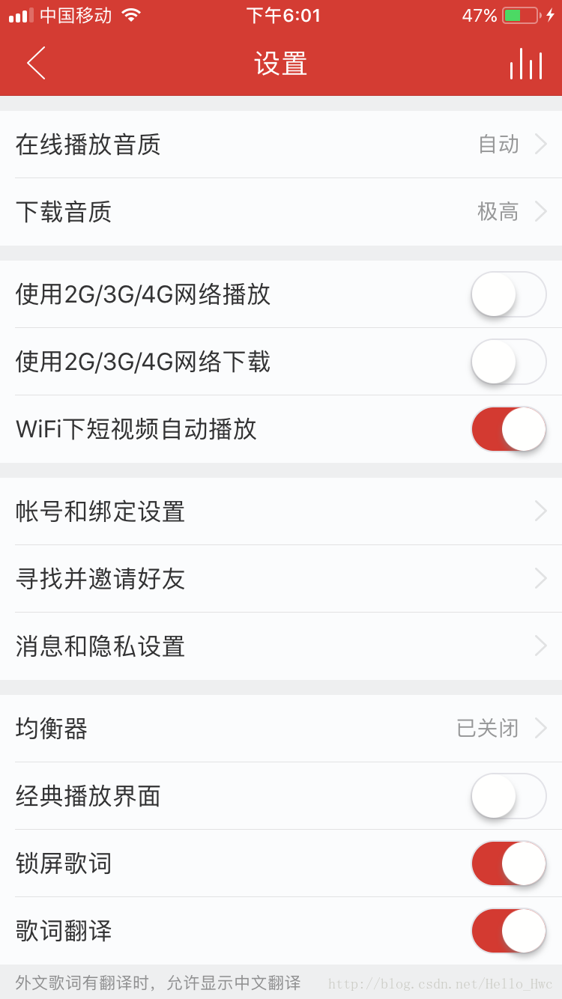
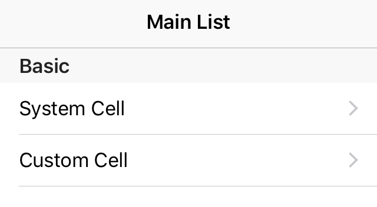

## 前言

UITableView（UITableViewController）是iOS开发使用频率最高的一个组件。

不管是使用UITableView还是还是UITableViewController，在开发的时候，我们都需要实现两个协议：

- `UITableViewControllerDataSource`
- `UITableViewControllerDelegate`

这两个协议的代码不是写在Controller里就是写在ViewModel里，并且这些方法很难复用。关于Controller瘦身的更多细节，可以参我之前的一篇博客：

- [MVVM与Controller瘦身实践](http://blog.csdn.net/hello_hwc/article/details/73089418)

是否有一种更好的方式来开发TableView呢？如果是Model驱动，而不是代理方法驱动的就好了，如果是Model驱动，开发的时候只需要：

- 创建Row和Section对应的Model
- 由一个Manager去管理这些Model，并且对Client隐藏DataSource和Delegate方法
- 把TableView绑定到Manager

基于这些理念，开发了一个model-driven-tableView框架，

- [MDTable](https://github.com/LeoMobileDeveloper/MDTable)

---
## 问题

### 重复代码
Delegate/DataSource中，有许多重复的代码。比如：

```
-(NSInteger)numberOfSectionsInTableView:(UITableView *)tableView{
    return 1;
}
-(NSInteger)tableView:(UITableView *)tableView numberOfRowsInSection:(NSInteger)section{
    return _dataArray.count;
}
-(CGFloat)tableView:(UITableView *)tableView heightForRowAtIndexPath:(NSIndexPath *)indexPath{
    return 80.0;
}
```

这些代码的逻辑其实是一样的，一个section，一个数组作为Model，row的数量就是数组元素的个数。但是，很多时候我们都是在一个一个Controller之间进行copy/paste。

### Render代码

通常，在`cellForRowAtIndexPath`或者`willDisplay`中，我们会对Cell进行重新配置，保证cell在复用的时候显示正确。于是，对Cell进行配置的代码耦合到了ViewController里，

```
- (UITableViewCell *)tableView:(UITableView *)tableView cellForRowAtIndexPath:(NSIndexPath *)indexPath{
    YourCustomCell * cell = [tableView dequeueReusableCellWithIdentifier:@"cell"];
    if (cell == nil) {
        cell = [[YourCustomCell alloc] initWithStyle:UITableViewCellStyleDefault reuseIdentifier:@"cell"];
    }
    cell.leftLabel.text = titleArray[indexPath.row];
    cell.infoIcon.image = [UIImage imageNamed:imageArray[indexPath.row]];
    cell.rightLabel.text = rightArray[indexPath.row];
    return infoCell;
}
```

### 大量的if/else
当Cell的种类多了起来，或者点击cell的动作复杂起来，你会发现代码里充斥着各种各样的if/else（switch也一样）。大量的if/else导致代码难以阅读和维护。

```
- (NSInteger)tableView:(UITableView *)tableView numberOfRowsInSection:(NSInteger)section {
    if (section == 0) {
    }else if(section == 1){
    }else{
    }
}

- (UITableViewCell *)tableView:(UITableView *)tableView cellForRowAtIndexPath:(NSIndexPath *)indexPath {
    if (indexPath.section == 0) {
    }else if(indexPath.section == 1){
    }else{
    }
}
```

这种情况，在设置界面尤其明显，比如这是网易云音乐的设置界面：



思考一下，如果让你来写，你会怎么写？

----
## 解决方案

### 基类
继承是一个实现代码复用的解决方案，通过在基类中实现-子类重写的方式进行服复用。

比如：

```
@interface SingleSectionTableViewController : UITableViewController
@property (strong, nonatomic)NSMutableArray * dataArray;
@end
@implementation SingleSectionTableViewController

#pragma mark - Table view data source

- (NSInteger)numberOfSectionsInTableView:(UITableView *)tableView {
    return 1;
}
- (NSInteger)tableView:(UITableView *)tableView numberOfRowsInSection:(NSInteger)section {
    return self.dataArray.count;
}
- (UITableViewCell *)tableView:(UITableView *)tableView cellForRowAtIndexPath:(NSIndexPath *)indexPath {
    [NSException raise:@"Com.table.exception" format:@"You must override this method"];
    return nil;
}
@end

```
当然，除了这些，你还可以在基类中配置好你的下拉刷新和上拉加载等逻辑。

---
### CellModel
在`cellForRowAtIndexPath`中，写了大量的cell render代码，从MVVM的角度来看，我们可以通过建立CellModel的方式把这部分代码抽离出来。

> 在开发的时候，要始终牢记单一功能原则。Cell是一个纯粹的View层，那么其对业务应该尽可能的少知道。

我们来看看，引入了CellModel后，如何进行代码的编写：

Model

```
@interface Person : NSObject
@property (assign, nonatomic) NSUInteger age;
@property (copy, nonatomic) NSString * name;
@property (copy, nonatomic) NSString * city;
@end
```

ViewModel

```
@interface CustomCellModel : NSObject
- (instancetype)initWithModel:(Person *)person;
@property (strong, nonatomic) Person * person;
@property (assign, nonatomic) NSString * nameText;
@property (assign, nonatomic) NSString * ageText;
@end

@implementation CustomCellModel
- (instancetype)initWithModel:(Person *)person{
    if (self = [super init]) {
        self.person = person;
        self.nameText = person.name;
        self.ageText = [NSString stringWithFormat:@"%ld",(long)person.age];
    }
    return self;
}
@end
```

View

```
@interface CustomTableViewCell : UITableViewCell
@property (strong, nonatomic) UILabel * nameLabel;
@property (strong, nonatomic) UILabel * ageLabel;
@property (strong, nonatomic) CustomCellModel * cellModel;
- (void)bindWithCellModel:(CustomCellModel *)cellModel;
@end

@implementation CustomTableViewCell
- (void)bindWithCellModel:(CustomCellModel *)cellModel{
    self.cellModel = cellModel;
    self.nameLabel.text = cellModel.nameText;
    self.ageLabel.text = cellModel.ageText;
}
@end
```

这时候，Controller中的代码

```
- (UITableViewCell *)tableView:(UITableView *)tableView cellForRowAtIndexPath:(NSIndexPath *)indexPath {
    CustomTableViewCell * cell = [tableView dequeueReusableCellWithIdentifier:@"cell" forIndexPath:indexPath];
    Person * model = [self.dataArray objectAtIndex:indexPath.row];
    CustomCellModel * cellModel = [[CustomCellModel alloc] initWithModel:model];
    [cell bindWithCellModel:cellModel];
    return nil;
}

```

可以看到，引入了Cell Model后，

- View和Model十分纯粹，view只做展示，Modle只做业务的模型化
- ViewModel层作为View与Model的枢纽，把Model层的数据转换成View层需要显示用的数据
- Controller根据Model合成ViewModel，并且绑定给View

> 当代码和业务复杂起来的时候，你会发现引入了ViewModel让你的工程更清晰，也更容易测试和维护

Note：MVVM中有两个原则一定要遵守，否则就不是MVVM

- View持有ViewModel的引用，反之不持有
- ViewModel持有Model的引用，反之不持有

---
### Dispatch
还记得那令人恶心的一大堆`if/else`么？那么，iOS开发中有什么更好的方式来实现这个机制呢？

这里，以selector的方式来解决`didClickRowAtIndexPath`.

定义一个协议，来表示ViewModel可以用来进行方法dispatch

```
@protocol CellActionDispatchable <NSObject>
@property (copy, nonatomic) NSString * selNameForDidSelected;
@end
```

然后，让ViewModel遵循这个协议，并且提供SEL的name：

```
@interface CustomCellModel : NSObject<CellActionDispatchable>
@property (copy, nonatomic) NSString * selNameForDidSelected;
@end
```
然后，在`didSelectRowAtIndexPath`中，执行这个SEL

```
- (void)tableView:(UITableView *)tableView didSelectRowAtIndexPath:(NSIndexPath *)indexPath{
    [tableView deselectRowAtIndexPath:indexPath animated:true];
    id<CellActionDispatchable> cellModel = [self.dataArray objectAtIndex:indexPath.row];
    NSString * selName = cellModel.selNameForDidSelected;
#pragma clang diagnostic push
#pragma clang diagnostic ignored "-Warc-performSelector-leaks"
    [self performSelector:NSSelectorFromString(selName) withObject:indexPath];
#pragma clang diagnostic pop
}
```

---
### 抽离数据源
这部分参考自：

- objc.io: [更轻量的 View Controllers](https://objccn.io/issue-1-1/)

抽离数据源是通过把对应的通用逻辑抽离出来，比如对于一个单一的ArrayDataSource：

```
@implementation SingleSectionDataSource

+ (instancetype)dataSourceWithData:(NSArray *)dataArray
                   reuseIdentifier:(NSString *)reuseIdentifier
                          onRender:(void (^)(UITableViewCell *, id))renderBlock{
    SingleSectionDataSource * ds = [[SingleSectionDataSource alloc] init];
    ds.dataArray = dataArray;
    ds.renderBlock = renderBlock;
    ds.reuseIdentifier = reuseIdentifier;
    return ds;
}

- (NSInteger)tableView:(UITableView *)tableView numberOfRowsInSection:(NSInteger)section{
    return self.dataArray.count;
}

- (UITableViewCell *)tableView:(UITableView *)tableView cellForRowAtIndexPath:(NSIndexPath *)indexPath{
    UITableViewCell * cell = [tableView dequeueReusableCellWithIdentifier:self.reuseIdentifier forIndexPath:indexPath];
    if (self.renderBlock) {
        id item = [self itemAtIndexPath:indexPath];
        self.renderBlock(cell, item);
    }
    return cell;
}

- (id)itemAtIndexPath:(NSIndexPath *)indexPath{
    return self.dataArray[indexPath.row];
}
@end
```

然后，就可以这么使用：

```
// self.navigationItem.rightBarButtonItem = self.editButtonItem;
self.customDataSource = [SingleSectionDataSource dataSourceWithData:dataArray
                                                    reuseIdentifier:"cell"
                                                           onRender:^(UITableViewCell *, id item) {
                                                               
                                                           }];
self.tableView.dataSource = self.customDataSource;
```


---
## MDTable

> 因为并没有让我满意的解决TableView代码问题的框架，所以我就尝试自己开发了个(Swift)。

MDTable是一个模型驱动的框架。使用MDTable，你的Controller会变得非常简洁，框架本身帮你处理了那些胶水代码。

比如一个这样的界面



只需要六行代码：

```
let row0_0 = SystemRow(title: "System Cell", accessoryType: .disclosureIndicator)
let row0_1 = SystemRow(title: "Custom Cell", accessoryType: .disclosureIndicator)
let section0 = SystemSection(rows: [row0_0,row0_1]])
section0.titleForHeader = "Basic"
    
tableManager = TableManager(sections: [section0,section1])
tableView.md_bindTo(manager: tableManager)
```

> 其中：SystemRow和SystemSection是MDTable提供的对UITableViewCell对应的Modle封装。

可以看到，这是一个完全由Model驱动的框架。之前分散在DataSource/Delegate中的方法，变成了紧凑的声明式的Model。

### 自定义Cell

在MDTable中，自定义Cell你需要一个数据结构来表示Row对应的Model。实现协议`TableRow`即可

```
class CustomXibRow: TableRow{
    //协议要求的最少需要的属性
    var rowHeight: CGFloat = 80.0
    var reuseIdentifier: String = "CustomXibRow"
    var initalType: TableRowInitalType = .(xibName: "CusomCellWithXib")
    // 可选的点击事件（可选的协议属性，用来提供各种动作）
    var didSelectRowAt: (UITableView, IndexPath) -> Void
}
```

然后，定义你的cell（XIB和纯代码均可）,需要继承自`SystemTableViewCell`,重写render方法

```
class CusomCellWithXib: SystemTableViewCell{    
    override func render(with row: TableRow) {
        guard let row = row as? CustomXibRow else{
            return;
        }
 		 //Render the cell 
    }
}
```

然后，使用CustomXibRow即可：

```
let row = CustomXibRow()
let section = SystemSection(rows: row)
tableManager = TableManager(sections: [section])
tableView.md_bindTo(manager: tableManager)
```

### 其他

#### 动态行高

由于rowHeight可以是一个计算属性，你只需要在rowHeight中动态计算即可：

- 示例代码：[Dynamic Height](https://github.com/LeoMobileDeveloper/MDTable/blob/master/MDTableExample/CustomCodeRow.swift)

```
var rowHeight: CGFloat{
    get{
        let attributes = [NSFontAttributeName: CustomCellWithCodeConfig.font]
        let size = CGSize(width: CustomCellWithCodeConfig.cellWidth, height: .greatestFiniteMagnitude)
        let height = (self.title as NSString).boundingRect(with: size,
                                                           options: [.usesLineFragmentOrigin],
                                                           attributes: attributes,
                                                           context: nil).size.height
        return height + 8.0
    }
}
```

#### 编辑／重新排序

比如，常见的Swipe-To-Delete。

- 示例代码：[Edit](https://github.com/LeoMobileDeveloper/MDTable/blob/master/MDTableExample/EditableTableViewController.swift)


让你的数据结构实现`EditableRow`协议。比如

```
class SwipteToDeleteRow: SystemRow, EditableRow{
    var titleForDeleteConfirmationButton: String? = "Delete"
    var editingStyle:UITableViewCellEditingStyle = UITableViewCellEditingStyle.delete
}
```

创建一个TableEditor，来管理编辑

```
let tableEditor = SystemTableEditor()
tableEditor.editingStyleCommitForRowAt = { (tableView, style, indexPath) in
    if style == .delete{
        self.tableManager.delete(row: indexPath)
        tableView.deleteRows(at: [indexPath], with: .automatic)
    }
}
```
然后，把editor绑定到Manager即可

```
tableManager = TableManager(sections: [section],editor:tableEditor)
```

重新排序和编辑类似

示例代码：[Reorder](https://github.com/LeoMobileDeveloper/MDTable/blob/master/MDTableExample/ReorderTableViewController.swift)


#### Index Title

由于MDTable抽象了Section为Model。所以，实现Index Title非常简单

```
 let section = SystemSection(rows: rows)
 section.sectionIndexTitle = secionTitle
```
#### MDTable的优点

- 把TableView模型化为两个协议:TableRow和TableSection
- 简化开发的代码，不再需要大量的delegate/dataSource方法
- 把点击事件等抽象到了每一个Row，把命令式的代码，改成了声明式的
- 代码逻辑划分更清楚，cell层完全独立

---
## 总结

TableView的deleage/dataSource方法让开发变的很灵活，却也让代码变的很丑陋。MDTable是笔者一次封装实践，源码地址：

- [MDTable](https://github.com/LeoMobileDeveloper/MDTable)
