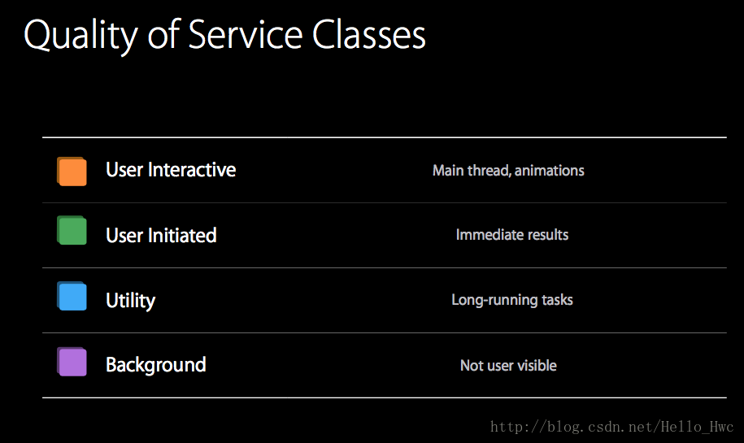
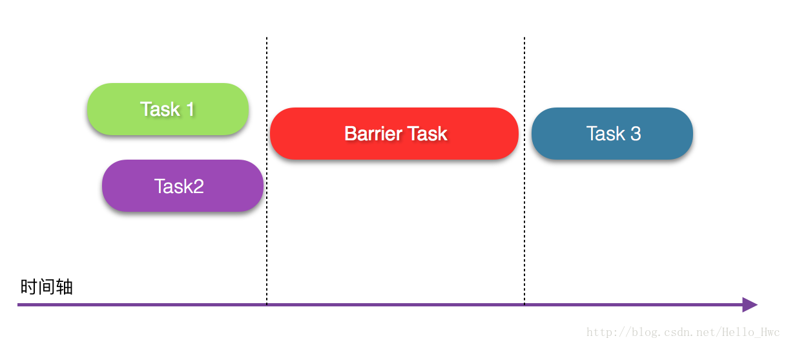
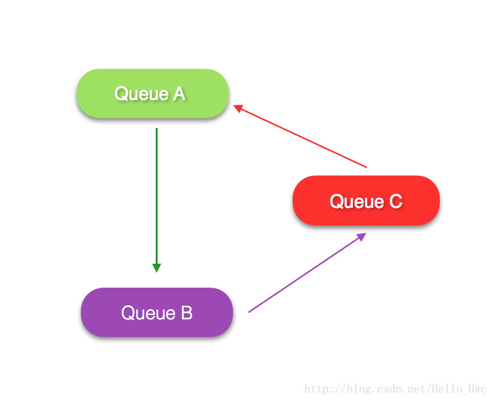

## 前言
我们首先来看一张图：


我觉得这张动图很好的诠释了《把一个线程用到死的》核心价值观。

很多程序都有一个主线程。对于iOS/MacOS开发来说，这个线程就是UI线程，在这个线程上会做一些用户交互/渲染相关的事情。把过多的任务放在主线程，会导致主线程卡顿，进而用户看到的就是App响应慢，列表滚动的时候掉帧。

把任务分散到多个线程执行有很多种技术，在iOS/MacOS App开发中，最简单直观的就是GCD（又叫[Dispatch](https://developer.apple.com/reference/dispatch)）了。Swift 3把冗长的GCD API进行了精简和优化，所以很多时候，我们都可以使用GCD来进行多线程开发。

本文使用到的playground可以在我的github上下载到。如果你不熟悉Playground的基本操作，欢迎阅读的上一篇文章

- [Swift Playground精讲](http://blog.csdn.net/hello_hwc/article/details/53966889)

本文很长，讲解范围从基础的概念，到async/sync,QoS,Sources,Group,Semaphore,Barrier,再到最后的同步和死锁，建议读者有选择的阅读。

----
## Dispatch是啥
> Dispatch comprises language features, runtime libraries, and system enhancements that provide systemic, comprehensive improvements to the support for concurrent code execution on multicore hardware in macOS, iOS, watchOS, and tvOS.

大致的意思是

> Dispatch结合语言特性，运行时，和系统的特点，提供了系统的，全面的高层次API来提升多核多线程编程的能力。

Dispatch会自动的根据CPU的使用情况，创建线程来执行任务，并且自动的运行到多核上，提高程序的运行效率。对于开发者来说，**在GCD层面是没有线程的概念的，只有队列（queue）**。任务都是以block的方式提交到对列上，然后GCD会自动的创建线程池去执行这些任务。在

对于Swift 3来说，Dispatch是一个module.你可以通过`import`进行导入

```
import Dispatch
```
这里，我们新建一个playgorund来运行本文的释例代码，并且命名为`Dispatch.playground`

关于Swift3.0 中GCD 的改变，参见

- swift-evolution: [0088-libdispatch-for-swift3](https://github.com/apple/swift-evolution/blob/master/proposals/0088-libdispatch-for-swift3.md)


------
## DispatchQueue

[DispatchQueue](https://developer.apple.com/reference/dispatch/dispatchqueue)是一个类似线程的概念，这里称作对列队列是一个FIFO数据结构，意味着先提交到队列的任务会先开始执行）。`DispatchQueue`背后是一个由系统管理的线程池。

最简单的，可以按照以下方式初始化一个队列

```
//这里的名字能够方便开发者进行Debug
let queue = DispatchQueue(label: "com.Leo.demoQueue")
```
这样初始化的队列是一个默认配置的队列，也可以显式的指明对列的其他属性

```
let label = "com.leo.demoQueue"
let qos =  DispatchQoS.default
let attributes = DispatchQueue.Attributes.concurrent
let autoreleaseFrequency = DispatchQueue.AutoreleaseFrequency.never
let queue = DispatchQueue(label: label, qos: qos, attributes: attributes, autoreleaseFrequency: autoreleaseFrequency, target: nil)
```
这里，我们来一个参数分析他们的作用

- `label` 队列的标识符，方便调试
- `qos` 队列的[quality of service](http://developer.apple.com/reference/dispatch/dispatchqos)。用来指明队列的“重要性”，后文会详细讲到。
- `attributes` 队列的属性。类型是`DispatchQueue.Attributes`,是一个结构体，遵循了协议[OptionSet](https://developer.apple.com/reference/swift/optionset)。意味着你可以这样传入第一个参数[.option1,.option2]
- `autoreleaseFrequency`。顾名思义，自动释放频率。有些队列是会在执行完任务后自动释放的，有些比如Timer等是不会自动释放的，是需要手动释放。


----
## 队列分类

从**创建者**来讲，队列可以分为两种，其中系统创建的队列又分为两种

- 系统创建的队列
	- 主队列(对应主线程)
	- 全局队列
- 用户创建的队列

主队列/全局队列可以这样获取

```
let mainQueue = DispatchQueue.main
let globalQueue = DispatchQueue.global()
let globalQueueWithQos = DispatchQueue.global(qos: .userInitiated)
```

从任务的执行情况来讲，可以分为

- 串行(serial)
- 并行(concurrent)

这里我们用一张图，来讲解下什么是串行队列和并行队列。

在Swfit 3.0中，创建一个串行/并行队列

```
let serialQueue = DispatchQueue(label: "com.leo.serialQueue")
let concurrentQueue = DispatchQueue(label: "com.leo.concurrentQueue",attributes:.concurrent)

```
----
## async

- `async` 提交一段任务到队列，并且**立刻返回**

举个例子：

我们新建一个方法来模拟一段很长时间的任务，比如读一张很大的图

```
public func readDataTask(label:String){
    NSLog("Start sync task%@",label)
    sleep(2)
    NSLog("End sync task%@",label)
}
```

Tips：如果代码运行在Playground里，记得在最上面加上这两行。

```
import PlaygroundSupport
PlaygroundPage.current.needsIndefiniteExecution = true
```

然后，我们来看看在serial和concurrent队列上，任务的执行情况。

```
let serialQueue = DispatchQueue(label: "com.leo.serialQueue")
print("Main queue Start")
serialQueue.async {
    readDataTask(label: "1")
}
serialQueue.async {
    readDataTask(label: "2")
}
print("Main queue End")
```
会看到Log

```
Main queue Start
Main queue End
2017-01-04 22:51:40.909 GCD[28376:888938] Start task: 1
2017-01-04 22:51:42.979 GCD[28376:888938] End task: 1
2017-01-04 22:51:42.980 GCD[28376:888938] Start task: 2
2017-01-04 22:51:45.051 GCD[28376:888938] End task: 2
```
也就是说，任务的执行是

> 主线程按照顺序提交任务1，任务2到`serialQueue`，瞬间执行完毕，并没有被阻塞。
> 在`serialQueue`上先执行任务1，任务1执行完毕后再执行任务2.

再来看看concurrent队列

```
print("Main queue Start")
let concurrentQueue = DispatchQueue(label: "com.leo.concurrent", attributes: .concurrent)
concurrentQueue.async {
    readDataTask(label: "3")
}
concurrentQueue.async {
    readDataTask(label: "4")
}
print("Main queue End")
```
Log如下

```
Main queue Start
Main queue End
2017-01-04 23:06:36.659 GCD[28642:902085] Start task: 3
2017-01-04 23:06:36.659 GCD[28642:902070] Start task: 4
2017-01-04 23:06:38.660 GCD[28642:902085] End task: 3
2017-01-04 23:06:38.668 GCD[28642:902070] End task: 4
```

可以看到：
> 主线程依然没有被阻塞。
> 在`concurrentQueue`队列上，两个任务按照**提交的次序开始，两个任务并发的执行了**。

----
## sync

- `async` 提交一段任务到队列，并且**阻塞当前线程，任务结束后当前线程继续执行**


我们把上文的代码改成sync

```
let serialQueue = DispatchQueue(label: "com.leo.queue")
print("Main queue Start")
serialQueue.sync {
    readDataTask(label: "1")
}
print("Main queue End")
```
这时候Log如下

```
Main queue Start
2017-01-04 23:21:29.422 GCD[28796:912732] Start task: 1
2017-01-04 23:21:31.423 GCD[28796:912732] End task: 1
Main queue End
```
> sync是一个**强大但是容易被忽视的函数**。使用sync，可以方便的进行线程间同步。但是，有一点要注意，**sync容易造成死锁**，这个后文会讲到。


----
## QoS
QoS的全称是quality of service。在Swift 3中，它是一个结构体，用来制定队列或者任务的**重要性**。

> 何为重要性呢？就是当资源有限的时候，优先执行哪些任务。这些优先级包括CPU时间，数据IO等等，也包括ipad muiti tasking（两个App同时在前台运行）。

通常使用QoS为以下四种



从上到下优先级依次降低。

依次含义如下，

- `User Interactive` 和用户交互相关，比如动画等等优先级最高。**比如用户连续拖拽的计算**
- `User Initiated` 需要立刻的结果，**比如push一个ViewController之前的数据计算**
- `Utility` 可以执行很长时间，再通知用户结果。**比如下载一个文件，给用户下载进度**。
- `Background` 用户不可见，比**如在后台存储大量数据**

通常，你需要问自己以下几个问题

- 这个任务是用户可见的吗？
- 这个任务和用户交互有关吗？
- 这个任务的执行时间有多少？
- 这个任务的最终结果和UI有关系吗？

在GCD中，指定QoS有以下两种方式
方式一，创建一个指定QoS的queue

```
let backgroundQueue = DispatchQueue(label: "com.leo.backgroundQueu", qos: .background)
backgroundQueue.async {
    //在QoS为background下运行
    
}
```

方式二，在提交block的时候，指定QoS

```
queue.async(qos: .background) {
    //在QoS为background下运行
}
```
----
## DispatchWorkItem

上文提到的方式，我们都是以block（或者叫闭包）的形式提交任务。`DispatchWorkItem `则把任务封装成了一个对象。

比如，你可以这么使用

```
let item = DispatchWorkItem { 
    //任务
}
DispatchQueue.global().async(execute: item)
```

也可以在初始化的时候指定更多的参数

```
let item = DispatchWorkItem(qos: .userInitiated, flags: [.enforceQoS,.assignCurrentContext]) { 
    //任务
}
```
其中

- 第一个参数表示QoS。
- 第二个参数类型为`DispatchWorkItemFlags`。指定这个任务的配饰信息
- 第三个参数则是实际的任务block

DispatchWorkItemFlags的参数分为两组

执行情况

```
- barrier
- detached 
- assignCurrentContext
```
QoS覆盖信息

```
- noQoS //没有QoS
- inheritQoS //继承Queue的QoS
- enforceQoS //自己的QoS覆盖Queue
```

Tips：**Swift 3中，提交一个block的任务，通常也可以传入`DispatchWorkItem `对象**

----
### after（延迟执行）

- GCD可以通过`asyncAfter`和`syncAfter`来提交一个**延迟执行的任务**

比如

```
let deadline = DispatchTime.now() + 2.0
NSLog("Start")
DispatchQueue.global().asyncAfter(deadline: deadline) { 
    NSLog("End")
}
```
可以看到，两秒后打印了End

```
2017-01-05 22:42:04.781 GCD[1617:36711] Start
2017-01-05 22:42:06.972 GCD[1617:36768] End
```

延迟执行还支持一种模式`DispatchWallTime`

```
let walltime = DispatchWallTime.now() + 2.0
NSLog("Start")
DispatchQueue.global().asyncAfter(wallDeadline: walltime) { 
    NSLog("End")

}
```
这里的区别就是

- DispatchTime 的精度是纳秒
- DispatchWallTime 的精度是微秒

------
## DispatchSource
> DispatchSource provides an interface for monitoring low-level system objects such as Mach ports, Unix descriptors, Unix signals, and VFS nodes for activity and submitting event handlers to dispatch queues for asynchronous processing when such activity occurs.
> 
> DispatchSource提供了一组接口，用来提交hander监测底层的事件，这些事件包括Mach ports，Unix descriptors，Unix signals，VFS nodes。

这一组事件包括：

| Protocol           |含义  |
|:-------------:| :-----:|
| DispatchSourceUserDataAdd | 用户自定义数据add|
| DispatchSourceUserDataOr      |   用户自定义数据Or |
| DispatchSourceMachSend      |    Mach端口发送 |
| DispatchSourceMachReceive      |    Mach端口接收 |
| DispatchSourceMemoryPressure      |   内存压力 |
| DispatchSourceProcess      |    进程事件 |
| DispatchSourceRead      |   读数据 |
| DispatchSourceSignal      |    信号 |
| DispatchSourceTimer      |    定时器 |
| DispatchSourceFileSystemObject      |    文件系统 |
| DispatchSourceWrite      |    写数据 |

本文只会涉及到timer和userData,其余的平实开发几乎用不到。

>Tips: `DispatchSource`这个class很好的体现了Swift是一门面向协议的语言。这个类是一个工厂类，用来实现各种source。比如DispatchSourceTimer（本身是个协议）表示一个定时器。

### DispatchSourceProtocol
基础协议，所有的用到的`DispatchSource`都实现了这个协议。这个协议的提供了公共的方法和属性：

- [官方文档](http://developer.apple.com/reference/dispatch/dispatchsourceprotocol)

由于不同的source是用到的属性和方法不一样，这里只列出几个公共的方法

```
- activate //激活
- suspend //挂起
- resume //继续
- cancel //取消(异步的取消，会保证当前eventHander执行完)
- setEventHandler //事件处理逻辑
- setCancelHandler //取消时候的清理逻辑
```

### DispatchSourceTimer

在Swift 3中，可以方便的用GCD创建一个Timer(新特性)。[DispatchSourceTimer](https://developer.apple.com/reference/dispatch/DispatchSourceTimer)本身是一个协议。

比如，写一个timer，1秒后执行，然后10秒后自动取消，允许10毫秒的误差

```
PlaygroundPage.current.needsIndefiniteExecution = true

public let timer = DispatchSource.makeTimerSource()

timer.setEventHandler {
    //这里要注意循环引用，[weak self] in
    print("Timer fired at \(NSDate())")
}
timer.setCancelHandler {
    print("Timer canceled at \(NSDate())" )
}
timer.scheduleRepeating(deadline: .now() + .seconds(1), interval: 2.0, leeway: .microseconds(10))
print("Timer resume at \(NSDate())")
timer.resume()
DispatchQueue.main.asyncAfter(deadline: .now() + .seconds(10), execute:{
    timer.cancel()
})

```
其中参数

- `deadline` 表示开始时间
- `leeway` 表示能够容忍的误差。


会看到Log

```
Timer resume   at 2017-01-06 04:30:22 +0000
Timer fired    at 2017-01-06 04:30:23 +0000
Timer fired    at 2017-01-06 04:30:25 +0000
Timer fired    at 2017-01-06 04:30:27 +0000
Timer fired    at 2017-01-06 04:30:29 +0000
Timer fired    at 2017-01-06 04:30:31 +0000
Timer canceled at 2017-01-06 04:30:32 +0000
```

DispatchSourceTimer也支持只调用一次。

```
func scheduleOneshot(deadline: DispatchTime, leeway: DispatchTimeInterval = default)
```

------
## DispatchGroup

> [DispatchGroup](http://developer.apple.com/reference/dispatch/dispatchgroup)用来管理一组任务的执行，然后监听任务都完成的事件。比如，多个网络请求同时发出去，等网络请求都完成后reload UI。

我们先来实现多网络请求同步的模型。

首先写一个函数，模拟异步网络请求

```
public func networkTask(label:String, cost:UInt32, complete:@escaping ()->()){
    NSLog("Start network Task task%@",label)
    DispatchQueue.global().async {
        sleep(cost)
        NSLog("End networkTask task%@",label)
        DispatchQueue.main.async {
            complete()
        }
    }
}

```
这个函数有三个参数

- label 表示id
- cost 表示时间消耗
- complete 表示任务完成后的回调

然后，我们模拟两个耗时2秒和4秒的网络请求

```
PlaygroundPage.current.needsIndefiniteExecution = true

let group = DispatchGroup()

group.enter()
networkTask(label: "1", cost: 2, complete: {
    group.leave()
})

group.enter()
networkTask(label: "2", cost: 4, complete: {
    group.leave()
})

group.notify(queue: .main, execute:{
    print("All network is done")
})
```

然后，看到Log

```
2017-01-06 12:42:13.559 Dispatch[4590:109934] Start network Task task1
2017-01-06 12:42:13.559 Dispatch[4590:109934] Start network Task task2
2017-01-06 12:42:15.631 Dispatch[4590:109986] End networkTask task1
2017-01-06 12:42:17.635 Dispatch[4590:109983] End networkTask task2
All network is done
```

### wait

DispatchGroup支持阻塞当前线程，等待执行结果

```
PlaygroundPage.current.needsIndefiniteExecution = true

NSLog("Group created")
let group = DispatchGroup()
group.enter()
networkTask(label: "1", cost: 2, complete: {
    group.leave()
})

group.enter()
networkTask(label: "2", cost: 4, complete: {
    group.leave()
})
NSLog("Before wait")
//在这个点，等待三秒钟
group.wait(timeout:.now() + .seconds(3))
NSLog("After wait")
group.notify(queue: .main, execute:{
    print("All network is done")
})
```
比如，我们在提交完第二个任务后，等待3秒中。

```
PlaygroundPage.current.needsIndefiniteExecution = true

NSLog("Group created")
let group = DispatchGroup()
group.enter()
networkTask(label: "1", cost: 2, complete: {
    group.leave()
})

group.enter()
networkTask(label: "2", cost: 4, complete: {
    group.leave()
})
NSLog("Before wait")
//在这个点，等待三秒钟
group.wait(timeout:.now() + .seconds(3))
NSLog("After wait")
group.notify(queue: .main, execute:{
    print("All network is done")
})

```
会看到log

```
2017-01-06 12:49:49.014 Dispatch[4709:118164] Group created
2017-01-06 12:49:49.021 Dispatch[4709:118164] Start network Task task1
2017-01-06 12:49:49.021 Dispatch[4709:118164] Start network Task task2
2017-01-06 12:49:49.021 Dispatch[4709:118164] Before wait
2017-01-06 12:49:51.095 Dispatch[4709:118208] End networkTask task1
2017-01-06 12:49:52.022 Dispatch[4709:118164] After wait
2017-01-06 12:49:53.095 Dispatch[4709:118210] End networkTask task2
All network is done
```
----
## Semaphore

> DispatchSemaphore provides an efficient implementation of a traditional counting semaphore, which can be used to control access to a resource across multiple execution contexts.
> 
> [DispatchSemaphore](https://developer.apple.com/reference/dispatch/DispatchSemaphore)是传统计数信号量的封装，用来控制资源被多任务访问的情况。

简单来说，如果我只有两个usb端口，如果来了三个usb请求的话，那么第3个就要等待，等待有一个空出来的嘶吼，第三个请求才会继续执行。

我们来模拟这一情况:

```
public func usbTask(label:String, cost:UInt32, complete:@escaping ()->()){
    NSLog("Start usb task%@",label)
    sleep(cost)
    NSLog("End usb task%@",label)
    complete()
}
```
很简单，打印log，休眠，然后调用complete给出回调。

```
PlaygroundPage.current.needsIndefiniteExecution = true


let semaphore = DispatchSemaphore(value: 2)
let queue = DispatchQueue(label: "com.leo.concurrentQueue", qos: .default, attributes: .concurrent)

queue.async {
    semaphore.wait()
    usbTask(label: "1", cost: 2, complete: { 
        semaphore.signal()
    })
}

queue.async {
    semaphore.wait()
    usbTask(label: "2", cost: 2, complete: {
        semaphore.signal()
    })
}

queue.async {
    semaphore.wait()
    usbTask(label: "3", cost: 1, complete: {
        semaphore.signal()
    })
}
```

Log

```
2017-01-06 15:03:09.264 Dispatch[5711:162205] Start usb task2
2017-01-06 15:03:09.264 Dispatch[5711:162204] Start usb task1
2017-01-06 15:03:11.338 Dispatch[5711:162205] End usb task2
2017-01-06 15:03:11.338 Dispatch[5711:162204] End usb task1
2017-01-06 15:03:11.339 Dispatch[5711:162219] Start usb task3
2017-01-06 15:03:12.411 Dispatch[5711:162219] End usb task3

```

> Tips：在serial queue上使用信号量要注意死锁的问题。感兴趣的同学可以把上述代码的`queue`改成serial的，看看效果。

----
## Barrier
> barrier翻译过来就是屏障。在一个并行queue里，很多时候，我们提交一个新的任务需要这样做。
> 
> - queue里之前的任务执行完了新任务才开始
> - 新任务开始后提交的任务都要等待新任务执行完毕才能继续执行

**以barrier flag提交的任务能够保证其在并行队列执行的时候，是唯一的一个任务。（只对自己创建的队列有效，对gloablQueue无效）**

典型的场景就是往`NSMutableArray`里`addObject`。

我们写个例子来看看效果

```
PlaygroundPage.current.needsIndefiniteExecution = true

let concurrentQueue = DispatchQueue(label: "com.leo.concurrent", attributes: .concurrent)
concurrentQueue.async {
    readDataTask(label: "1", cost: 3)
}

concurrentQueue.async {
    readDataTask(label: "2", cost: 3)
}
concurrentQueue.async(flags: .barrier, execute: {
    NSLog("Task from barrier 1 begin")
    sleep(3)
    NSLog("Task from barrier 1 end")
})

concurrentQueue.async {
    readDataTask(label: "2", cost: 3)
}
```
然后，看到Log

```
2017-01-06 17:14:19.690 Dispatch[15609:245546] Start data task1
2017-01-06 17:14:19.690 Dispatch[15609:245542] Start data task2
2017-01-06 17:14:22.763 Dispatch[15609:245546] End data task1
2017-01-06 17:14:22.763 Dispatch[15609:245542] End data task2
2017-01-06 17:14:22.764 Dispatch[15609:245546] Task from barrier 1 begin
2017-01-06 17:14:25.839 Dispatch[15609:245546] Task from barrier 1 end
2017-01-06 17:14:25.839 Dispatch[15609:245546] Start data task3
2017-01-06 17:14:28.913 Dispatch[15609:245546] End data task3
```

执行的效果就是：barrier任务提交后，等待前面所有的任务都完成了才执行自身。barrier任务执行完了后，再执行后续执行的任务。

用一张图来表示：



---
## UserData
`DispatchSource`中UserData部分也是强有力的工具，这部分包括两个协议，两个协议都是用来合并数据的变化，只不过一个是按照`+(加)`的方式，一个是按照`|(位与)`的方式。

- DispatchSourceUserDataAdd 
- DispatchSourceUserDataOr

> 在使用这两种Source的时候，GCD会帮助我们自动的将这些改变合并，然后在**适当的时候（target queue空闲）的时候**，去回调`EventHandler`,从而避免了频繁的回调导致CPU占用过多。


比如，对于`DispatchSourceUserDataAdd`你可以这么使用，

```
let userData = DispatchSource.makeUserDataAddSource()
var globalData:UInt = 0
userData.setEventHandler {
    let pendingData = userData.data
    globalData = globalData + pendingData
    print("Add \(pendingData) to global and current global is \(globalData)")
}
userData.resume()
let serialQueue = DispatchQueue(label: "com")
serialQueue.async {
    for var index in 1...1000{
        userData.add(data: 1)
    }
    for var index in 1...1000{
        userData.add(data: 1)
    }
}
```
然后，你会发现Log类似
```
Add 32 to global and current global is 32
Add 1321 to global and current global is 1353
Add 617 to global and current global is 1970
Add 30 to global and current global is 2000
```

-----

## Synchronization

通常，在多线程同时会对一个变量(比如`NSMutableArray`)进行读写的时候，我们需要考虑到线程的同步。举个例子：比如线程一在对NSMutableArray进行addObject的时候，线程二如果也想`addObject`,那么它必须等到线程一执行完毕后才可以执行。

实现这种同步有很多种机制：

比如用互斥锁：

```
let lock = NSLock()
lock.lock()
//Do something
lock.unlock()
```
使用锁有一个不好的地方就是：`lock`和`unlock`要配对使用，不然极容易锁住线程，没有释放掉。

使用GCD，队列同步有另外一种方式 - `sync`，讲属性的访问同步到一个queue上去，就能保证在多线程同时访问的时候，线程安全。

```
class MyData{
    private var privateData:Int = 0
    private let dataQueue = DispatchQueue(label: "com.leo.dataQueue")
    var data:Int{
        get{
            return dataQueue.sync{ privateData }
        }
        set{
            dataQueue.sync { privateData = newValue}
        }
    }
}
```

----
## 死锁
GCD对线程进行了很好的封装，但是仍然又可能出现死锁。所谓死锁，就是线程之间相互等待对方执行，才能继续执行，导致进入了一个死循环的状态。

最简单的死锁，在main线程上sync自己。

```
DispatchQueue.main.sync {
    print("You can not see this log")
}
```
> 原因也比较好理解，在调用sync的时候，main队列被阻塞，等到代码块执行完毕才会继续执行。因为main被阻塞，就导致了代码块无法执行，进而形成死锁。

还有一种死锁，简单的代码如下

```
queueA.sync {
    queueB.sync {
        queueC.sync {
            queueA.sync {
                
            }
        }
    }
}

```
死锁的原因很简单，形成了一个相互阻塞的环。




