## 前言
Apple今年推出了Swift3.0，较2.3来说，3.0是一次重大的升级。关于这次更新，在[这里](http://swift.gg/2016/07/27/swift3-changes/)都可以找到，最主要的还是<font color="red">提高了Swift的性能，优化了Swift API的设计（命名）规范</font>。

前段时间对之前写的一个项目[ImageMaskTransition](https://github.com/LeoMobileDeveloper/ImageMaskTransition)做了简单迁移，先保证能在3.0下正常运行，只用了不到30分钟。总的来说，这次迁移还是非常轻松的。但是，有一点要注意：3.0的API设计规范较2.3有了质变，建议做迁移的开发者先看下WWDC的[Swift API Design Guidelines](Swift%20API%20Design%20Guidelines)。后面有时间了，我有可能也会总结下。

----------
## 内存分配
通过查看Github上[Swift的源代码](https://github.com/apple/swift)语言分布
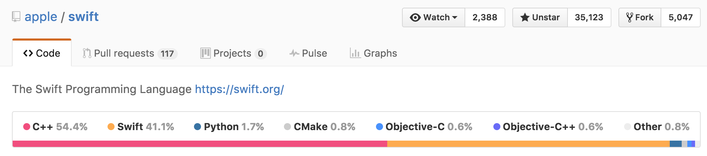

可以看到

 - Swift语言是用C++写的
 - Swift的核心Library是用Swift自身写的。

对于C++来说，内存区间如下

 - 堆区
 - 栈区
 - 代码区
 - 全局静态区

Swift的内存区间和C++类似。也有存储代码和全局变量的区间，这两种区间比较简单，本文更多专注于以下两个内存区间。

 - Stack（栈），存储值类型的临时变量，函数调用栈，引用类型的临时变量指针
 - Heap（堆），存储引用类型的实例


----------

## 栈
在栈上分配和释放内存的代价是很小的，因为栈是一个简单的数据结构。通过移动栈顶的指针，就可以进行内存的创建和释放。但是，栈上创建的内存是有限的，并且往往在编译期就可以确定的。

举个很简单的例子：当一个递归函数，陷入死循环，那么最后函数调用栈会溢出。


例如，一个没有引用类型Struct的临时变量都是在栈上存储的

```
struct Point{
    var x:Double // 8 Bytes
    var y:Double // 8 bytes
}
let size = MemoryLayout<Point>.size
print(size) // 16
let point1 = Point(x:5.0,y:5.0)
let instanceSize = MemoryLayout<Point>.size(ofValue: point1)
print(instanceSize) //16
```

那么，这个内存结构如图
<div align="center">
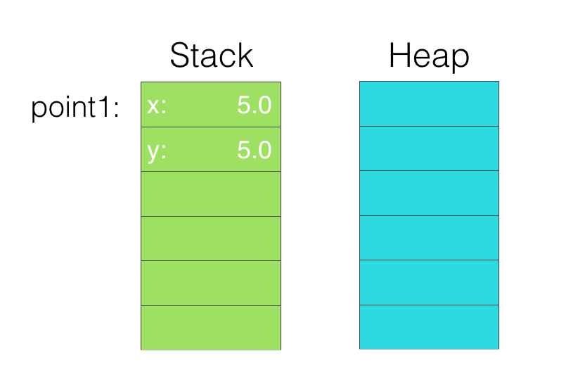
</div>

<font color="orange">Tips: 图中的每一格都是一个Word大小，在64位处理器上，是8个字节</font>

## 堆
在堆上可以动态的按需分配内存，每次在堆上分配内存的时候，需要查找堆上能提供相应大小的位置，然后返回对应位置，标记指定位置大小内存被占用。

在堆上能够动态的分配所需大小的内存，但是由于每次要查找，并且要考虑到多线程之间的线程安全问题，所以性能较栈来说低很多。

比如，我们把上文的`struct`改成`class,`

```
class PointClass{
    var x:Double = 0.0
    var y:Double = 0.0
}
let size2 = MemoryLayout<PointClass>.size
print(size2) //8 
let point2 = Point(x:5.0,y:5.0)
let instanceSize = MemoryLayout<Point>.size(ofValue: point2)
print(instanceSize) //8
```
这时候的内存结构如图

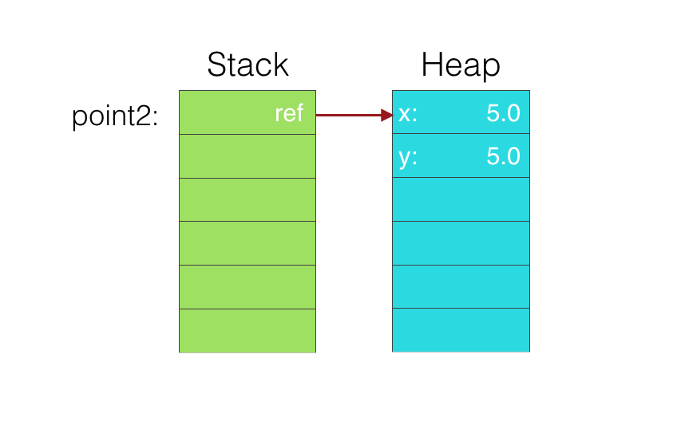

<font color="orange">Tips: 图中的每一格都是一个Word大小，在64位处理器上，是8个字节</font>

----------

## Memory Alignment（内存对齐）
和C/C++/OC类似，Swift也有Memory Alignment的概念。举个直观的例子
我们定义这样两个Struct

```
struct S{
    var x:Int64
    var y:Int32
}
struct SReverse{
    var y:Int32
    var x:Int64
}
```
然后，用MemoryLayout来获取两个结构体的大小

```
let sSize = MemoryLayout<S>.size //12
let sReverseSize = MemoryLayout<SReverse>.size //16
```
可以看到，只不过调整了结构体中的声明顺序，其占用的内存大小就改变了，这就是内存对齐。

我们来看看，内存对齐后的内存空间分布：


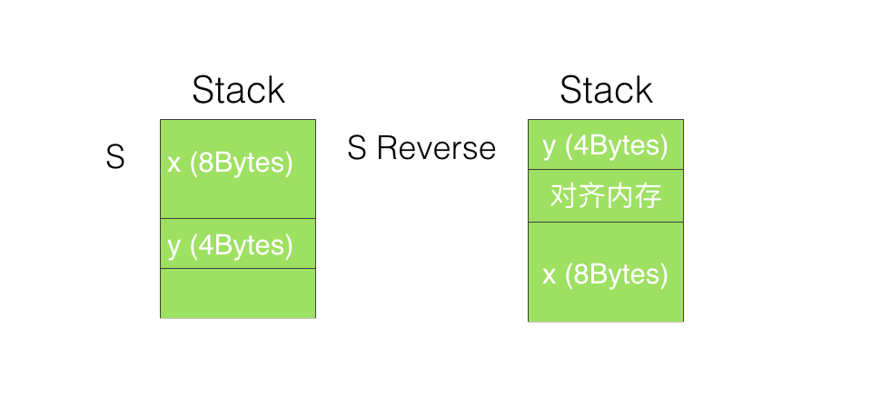

内存对齐的原因是，
> 现代CPU每次读数据的时候，都是读取一个word（32位处理器上是4个字节，64位处理器上是8个字节）。

内存对齐的优点很多

 - 保证对一个成员的访问在一个Transition中，提高了访问速度，同时还能保证一次操作的原子性。除了这些，内存对齐还有很多优点，可以看看这个[SO答案](http://stackoverflow.com/a/381368/3940672)

----------

## 自动引用计数(ARC)
提到[ARC](https://developer.apple.com/library/content/documentation/Swift/Conceptual/Swift_Programming_Language/AutomaticReferenceCounting.html)，不得不先讲讲Swift的两种基本类型：

 - 值类型，在赋值的时候，会进行值拷贝
 - 引用类型，在赋值的时候，只会进行引用（指针）拷贝

比如，如下代码

```
struct Point{ //Swift中，struct是值类型
    var x,y:Double
}
class Person{//Swift中，class是引用类型
    var name:String
    var age:Int
    init(name:String,age:Int){
        self.name = name
        self.age = age
    }
}
var point1 = Point(x: 10.0, y: 10.0)
var point2 = point1
point2.x = 9.0
print(point1.x) //10.0

var person1 = Person(name: "Leo", age: 24)
var person2 = person1
person2.age = 25
print(person1.age)//9.0
```
我们先看看对应内存的使用

值类型有很多优点，其中主要的优点有两个

 - <font color="red">线程安全</font>，每次都是获得一个copy，不存在同时修改一块内存 
 - <font color="red">不可变状态</font>，使用值类型，不需要考虑别处的代码可能会对当前代码有影响。也就没有side effect。

ARC是相对于引用类型的。
> ARC是一个内存管理机制。当一个引用类型的对象的reference count(引用计数)为0的时候，那么这个对象会被释放掉。

我们利用XCode 8和iOS开发，来直观的查看下一个值类型变量的引用计数变化。

新建一个iOS单页面工程，语言选择Swift，然后编写如下代码


然后，当断点停在24行处的时候，Person的引用计数如下

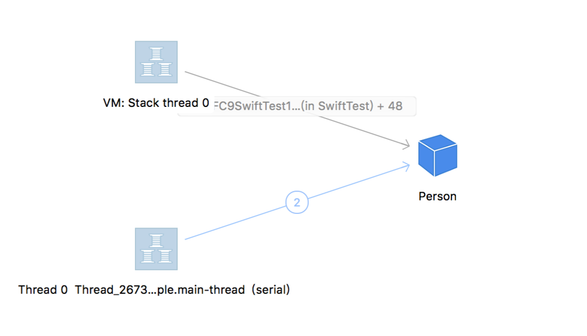

这里，底部的`thread_2673`是主线程堆Person对象的持有，是iOS系统默认添加。所以,` var leo = Person(name: "Leo", age: 25)`这一行后，准确的说是引用计数<font color="red">加</font>一，并不是引用计数<font color="red">为</font>一。当然，这些系统自动创建的也会自动销毁，我们无须考虑。

可以看到，person唯一的引用就是来自`VM:Stack thread`，也就是栈上。
因为引用计数的存在，Class在堆上需要额外多分配一个Word来存储引用计数：
<div align="center">
<br/>
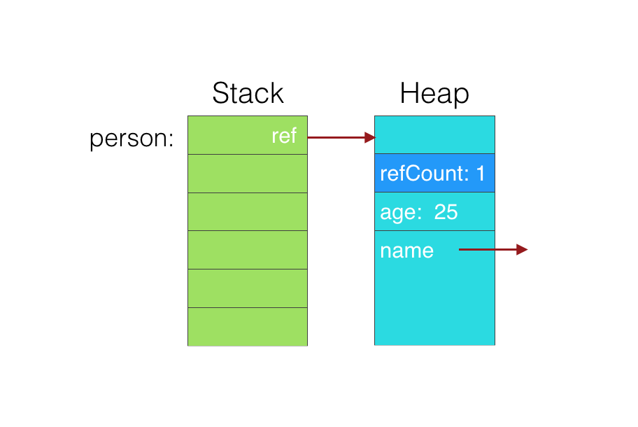
<br/>
&nbsp
</div>
当栈上代码执行完毕，栈会断掉对Person的引用，引用计数也就减一，系统会断掉自动创建的引用。这时候，person的引用计数位0，内存释放。

------
## 方法调度(method dispatch)

Swift的方法调度分为两种

 - 静态调度 static dispatch. 静态调度在执行的时候，会直接跳到方法的实现，静态调度可以进行inline和其他编译期优化。
 - 动态调度 dynamic dispatch. 动态调度在执行的时候，会根据运行时(Runtime)，采用table的方式，找到方法的执行体，然后执行。动态调度也就没有办法像静态那样，进行编译期优化。

### Struct
对于Struct来说，方法调度是静态的。

```
struct Point{
    var x:Double // 8 Bytes
    var y:Double // 8 bytes
    func draw(){
        print("Draw point at\(x,y)")
    }
}
let point1 = Point(x: 5.0, y: 5.0)
point1.draw()
print(MemoryLayout<Point>.size) //16
```

可以看到，由于是Static Dispatch，在编译期就能够知道方法的执行体。所以，在Runtime也就不需要额外的空间来存储方法信息。编译后，方法的调用，直接就是变量地址的传入，存在了代码区中。

如果开启了编译器优化，那么上述代码被优化成Inline后，

```
let point1 = Point(x: 5.0, y: 5.0)
print("Draw point at\(point1.x,point1.y)")
print(MemoryLayout<Point>.size) //16
```

### Class
Class是Dynamic Dispatch的，所以在添加方法之后，Class本身在栈上分配的仍然是一个word。堆上，需要额外的一个word来存储Class的Type信息，在Class的Type信息中，存储着virtual table(V-Table)。根据V-Table就可以找到对应的方法执行体。

```
class Point{
    var x:Double // 8 Bytes
    var y:Double // 8 bytes
    init(x:Double,y:Double) {
        self.x = x
        self.y = y
    }
    func draw(){
        print("Draw point at\(x,y)")
    }
}
let point1 = Point(x: 5.0, y: 5.0)
point1.draw()
print(MemoryLayout<Point>.size) //8
```
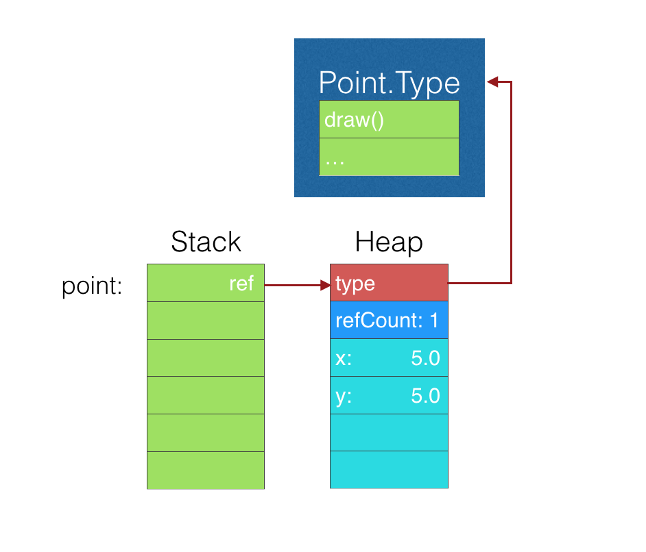

### 继承
因为Class的实体会存储额外的Type信息，所以继承理解起来十分容易。子类只需要存储子类的Type信息即可。
例如

```
class Point{
    var x:Double // 8 Bytes
    var y:Double // 8 bytes
    init(x:Double,y:Double) {
        self.x = x
        self.y = y
    }
    func draw(){
        print("Draw point at\(x,y)")
    }
}
class Point3D:Point{
    var z:Double // 8 Bytes
    init(x:Double,y:Double,z:Double) {
        self.z = z
        super.init(x: x, y: y)
    }
    override func draw(){
        print("Draw point at\(x,y,z)")
    }
}
let point1 = Point(x: 5.0, y: 5.0)
let point2 = Point3D(x: 1.0, y: 2.0, z: 3.0)
let points = [point1,point2]
points.forEach { (p) in
    p.draw()
}
//Draw point at(5.0, 5.0)
//Draw point at(1.0, 2.0, 3.0)
```
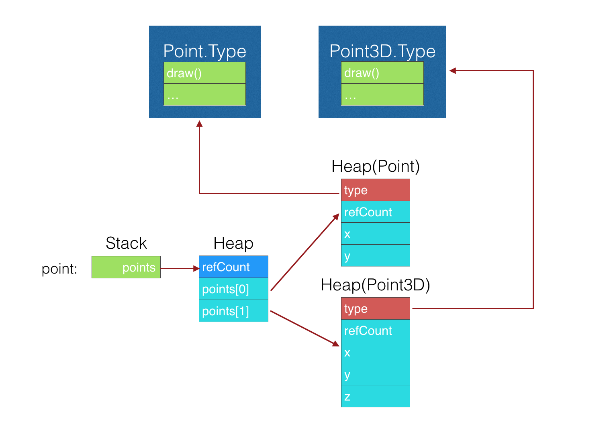

### 协议

我们首先看一段代码

```
struct Point:Drawable{
    var x:Double // 8 Bytes
    var y:Double // 8 bytes
    func draw(){
        print("Draw point at\(x,y)")
    }
}
struct Line:Drawable{
    var x1:Double // 8 Bytes
    var y1:Double // 8 bytes
    var x2:Double // 8 Bytes
    var y2:Double // 8 bytes
    func draw(){
        print("Draw line from \(x1,y1) to \(x2,y2)")
    }
}
let point = Point(x: 1.0, y: 2.0)
let memoryAsPoint = MemoryLayout<Point>.size(ofValue: point)
let memoryOfDrawable = MemoryLayout<Drawable>.size(ofValue: point)
print(memoryAsPoint)
print(memoryOfDrawable)

let line = Line(x1: 1.0, y1: 1.0, x2: 2.0, y2: 2.0)
let memoryAsLine = MemoryLayout<Line>.size(ofValue: line)
let memoryOfDrawable2 = MemoryLayout<Drawable>.size(ofValue: line)
print(memoryAsLine)
print(memoryOfDrawable2)
```
可以看到，输出

```
16 //point as Point
40 //point as Drawable
32 //line as Line
40 //line as Drawable
```
16和32不难理解，Point含有两个Double属性，Line含有四个Double属性。对应的字节数也是对的。那么，两个40是怎么回事呢？而且，对于Point来说，40-16=24,多出了24个字节。而对于Line来说，只多出了40-32=8个字节。

这是因为Swift对于协议类型的采用如下的内存模型 - Existential Container。
<div align="center">
<Br/>
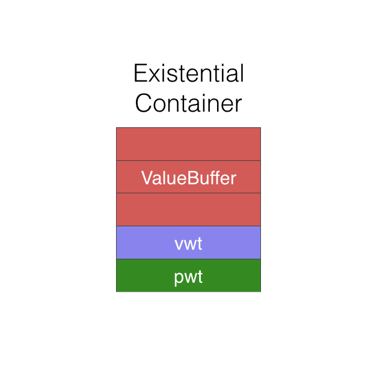
<Br/>
&nbsp
</div>
Existential Container包括以下三个部分：

 - 前三个word：Value buffer。用来存储Inline的值，如果word数大于3，则采用指针的方式，在堆上分配对应需要大小的内存
 - 第四个word：Value Witness Table(VWT)。每个类型都对应这样一个表，用来存储值的创建，释放，拷贝等操作函数。
 - 第五个word：Protocol Witness Table(PWT)，用来存储协议的函数。

那么，内存结构图，如下

<Br/>
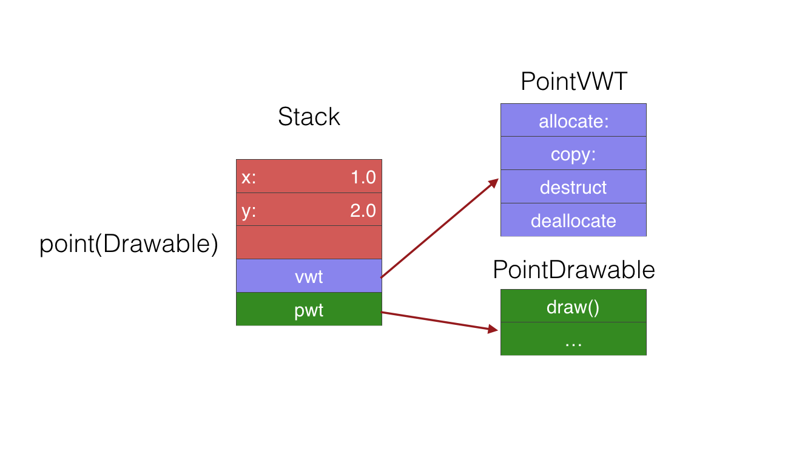
<Br/>


<Br/>

### 范型

范型让代码支持<font color="orange">静态多态</font>。比如：

```
func drawACopy<T : Drawable>(local : T) {
  local.draw()
}
drawACopy(Point(...))
drawACopy(Line(...))
```

那么，范型在使用的时候，如何调用方法和存储值呢？

<div align="center">
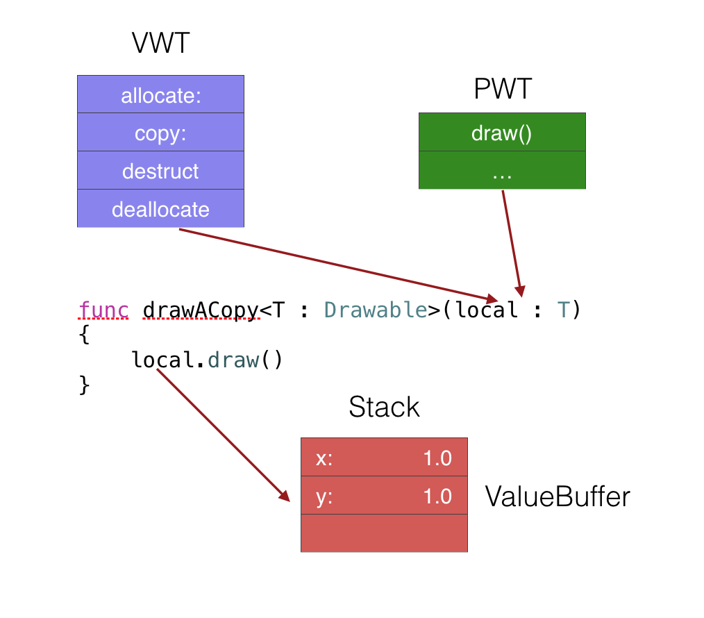
<Br/>
<p>[ 范型 ]</p>
</div>

范型并不采用Existential Container，但是原理类似。

1. VWT和PWT作为隐形参数，传递到范型方法里。
2. 临时变量仍然按照ValueBuffer的逻辑存储 - 分配3个word，如果存储数据大小超过3个word，则在堆上开辟内存存储。

#### 范型的编译器优化

<font color="red">1. 为每种类合成具体的方法</font>
比如

```
func drawACopy<T : Drawable>(local : T) {
  local.draw()
}
```
在编译过后，实际会有两个方法

```
func drawACopyOfALine(local : Line) {
  local.draw()
}
func drawACopyOfAPoint(local : Point) {
  local.draw()
}
```

然后,

```
drawACopy(local: Point(x: 1.0, y: 1.0))
```

会被编译成为

```
func drawACopyOfAPoint(local : Point(x: 1.0, y: 1.0))
```

Swift的编译器优化还会做更多的事情，上述优化虽然代码变多，但是编译器还会对代码进行压缩。所以，实际上，并不会对二进制包大小有什么影响。

----------
## 参考资料

 - [WWDC 2016 - Understanding Swift Performance](https://developer.apple.com/videos/play/wwdc2016/416)
 - [WWDC 2015 - Optimizing Swift Performance](https://developer.apple.com/videos/play/wwdc2015/409)
 -  [Does Swift guarantee the storage order of fields in classes and structs?](http://stackoverflow.com/a/39302927/3940672)


----------
