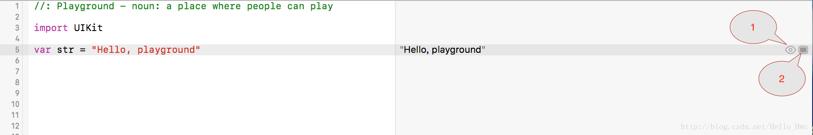
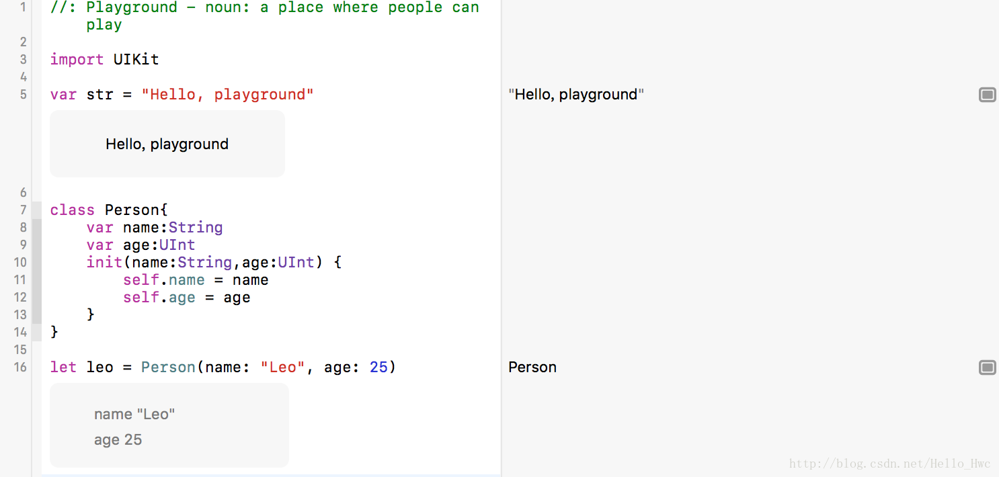
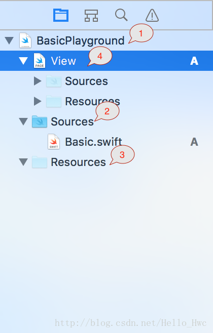
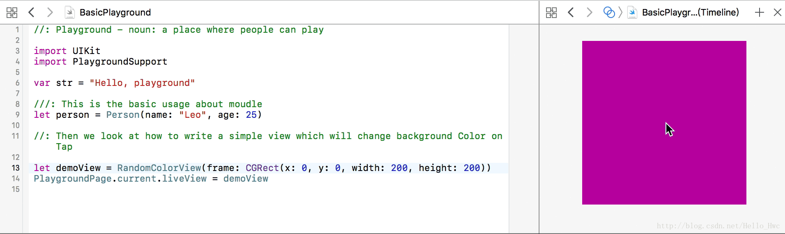
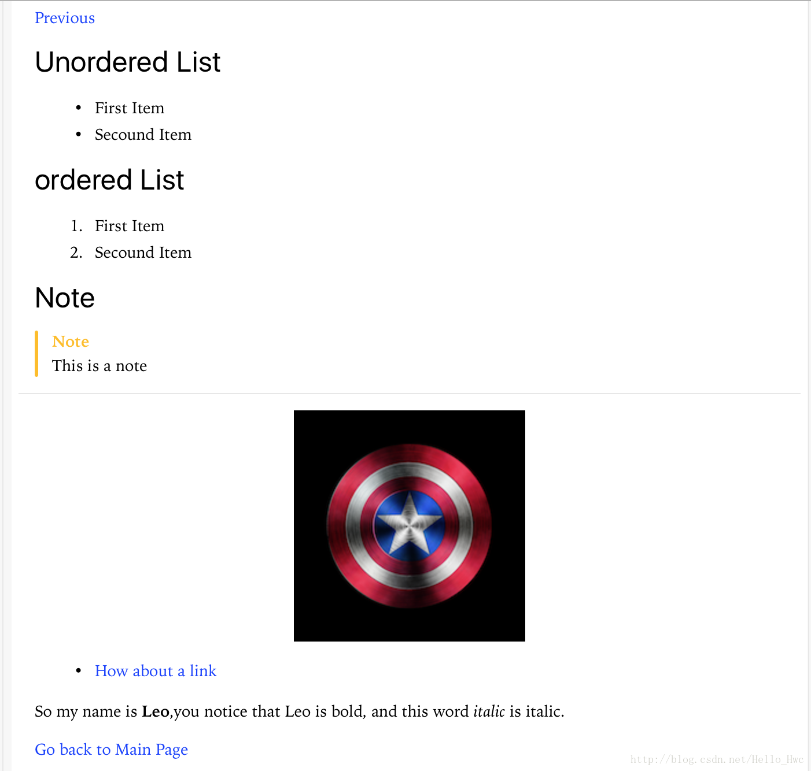

## Playground是啥？
> Playground是一个强大的工具。对于Swift初学者来说，它简单易用，可以实时预览代码效果，非常适合学习Swift这门语言。在日常开发中，playground可以进行快速的原型开发和试错。当然，playground支持markup标注，用来Swift相关的书籍也不错。

## 基础讲解

### 工欲善其事，必先利其器
首先，我们先来熟悉下Playground的IDE，这是官方给出的《牛顿碰撞试验》的例子，来讲解UIKit Dynamic Animation。官方可下载的还是swift 2的版本，我把这个版本转成Swift 3，放到[我的Github](https://github.com/LeoMobileDeveloper/Blogs/tree/master/DemoProjects/Playgrounds)上了。


我们先来看看这些部分分别代表什么？

1. 这里是import导入的module。除了iOS／Mac OS中常见的UIKit，AppKit，Accelerate等，还有一些专门为Plagyround编写的module，其中最常用的就是PlaygroundSupport`。
2. 注释部分。playground支持类似[Markdown](https://en.wikipedia.org/wiki/Markdown)的语法，可以让你的代码看起来像是写书一样，图文并茂。
3. 实际的代码部分。几乎所有iOS／Mac OS可以做的事情，你都可以在playground中实现。比如写一个动画，异或实现一个Sprite简单游戏。
4. 辅助编辑区域。在这里可以看到代码执行的情况和变量的值。
5. Timeline区域。Timeline区域对于可视开发十分有用，这个后文也会降到。显示Timeline区域可以使用快捷键

当然，playground还有其他操作区域。后面用到的时候，我们再来讲解。

## 第一个例子
本文用到的两个playground

- [BasicPlayground.playground](https://github.com/LeoMobileDeveloper/Blogs/tree/master/DemoProjects/Playgrounds/BasicPlayground.playground)
- [NewtonsCradle.playground](https://github.com/LeoMobileDeveloper/Blogs/tree/master/DemoProjects/Playgrounds/NewtonsCradle.playground)


打开XCode->Get started with a playground。新建一个Playground，命名为**BasicPlayground**，这个完整的文件可以在这里下载到。
最开始，这个Playground文件很简单。当我们把鼠标移动到辅助窗口的“hello playground”上面的时候，这时候的效果如下



注意到最右侧的两个按钮，其中

1. 表示**Quick Look**。点击的时候可以预览这个变量的值或者视图(View/ViewController)的效果。
2. 表示**Show Result**。选中后，代码的下一行inline的显示对应的值。

这里，我们选中**Show Result**。

然后，我们创建一个基本类型，`Person`,并且创建一个变量

```
class Person{
    var name:String
    var age:UInt
    init(name:String,age:UInt) {
        self.name = name
        self.age = age
    }
}

let leo = Person(name: "Leo", age: 25)
```
这时候，我们选中**Show result**，效果如下



等等，为什么右侧的辅助编辑窗口显示的是Person，而不是直观的信息？原因是，这个类并没有实现协议`CustomStringConvertible`，这个协议决定了一个类的实例如何被Log。

于是，我们新建一个`extension`，让这个类遵循协议`CustomStringConvertible`，

```
extension Person:CustomStringConvertible{
    var description: String{
        get{
            return "\(name) is \(age) years old"
        }
    }
}

```
这时候，右侧的result area窗口显示的内容就容易理解多了。

## 模块划分
和其他工程一样，Playground也支持模块划分。



通常，你的Playground工程划分如下：

1. Main Plaground。这里就是我们运行上文提到的代码的地方
2. 源文件文件夹。我们不能把代码都堆积到Main Playground中，否则丑陋而且难以维护
3. 资源文件夹。图片，plist，json等资源文件放到这里
4. Playground Page。一个child playground。有它自己的工程目录。

这里，我们把Person类的定义和extension转移到Basic.swift中。

```
import Foundation

public class Person{
    public var name:String
    public var age:UInt
    public init(name:String,age:UInt) {
        self.name = name
        self.age = age
    }
}

extension Person:CustomStringConvertible{
    public var description: String{
        get{
            return "\(name) is \(age) years old"
        }
    }
}

```
Tips

- Playground的Source文件如果要暴露给其他Module，需要声明为`public`。


## 常用方法
### PlaygroundSupport

```
//表示当前的Playground对应的Page
public static let current: PlaygroundSupport.PlaygroundPage

//是否需要无限之行，比如写一个交互式的View，那么在执行到最底部之后，仍然要继续执行。
public var needsIndefiniteExecution: Bool

//Page的LiveView，这个View会接受触摸等事件，如果liveView不为空，会自动设置needsIndefiniteExecution为true
public var liveView: PlaygroundLiveViewable?

```
举个例子：
我们在Source文件夹中，新建（command + N）一个`Utils.swift`。然后，写入一个工具方法来产生随机的方法

```
extension UIColor{
    public static func random()->UIColor{
        return UIColor(colorLiteralRed:Float.random0To1, green: Float.random0To1, blue:Float.random0To1, alpha: 1.0)
    }
}
extension Float{
    public static var random0To1:Float{
        get{
            let random = Float(arc4random() % 255)/255.0;
            return random
        }
    }
}
```

Tips:

- Swift语言中，extension是一个强大的工具，上述`random`如果写成全局方法，维护和使用起来肯定没有`UIColor.random`来的方便

然后，新建一个`RandomColorView.swift`，随着点击，能够改变自己的颜色。

```
import Foundation
import UIKit

public class RandomColorView : UIView{
    public override init(frame: CGRect) {
        super.init(frame: frame)
        self.backgroundColor = UIColor.random()
        let tap = UITapGestureRecognizer(target: self, action: #selector(RandomColorView.handleTap(tap:)));
        addGestureRecognizer(tap)
    }
    func handleTap(tap:UITapGestureRecognizer){
        backgroundColor = UIColor.random()
    }
    required public init?(coder aDecoder: NSCoder) {
        fatalError("init(coder:) has not been implemented")
    }
}
```
然后，在`BasicPlayground`加入如下代码

```
let demoView = RandomColorView(frame: CGRect(x: 0, y: 0, width: 200, height: 200))
PlaygroundPage.current.liveView = demoView
```
然后，

效果



---
## Markup语法
Playground支持强大的markup语法，如果你之前用过markdown。你会发现这些语法非常熟悉。可以有以下两种方式书写marup块，就是在普通注释后面加一个冒号.

一行markup

```
//: 开启一行markup
```

markup块

```
/*：

*／
```
先看一个常见的用法

```
//: [Previous](@previous)

/*:
 # Usage 
 
 ## Unordered List
 - First Item
 - Secound Item
 
 ## ordered List
  1. First Item
  2. Secound Item
 
 ## Note
 > This is a note
 ---
 
 ## Image
 
 
 ## Link
 * [How about a link](https://github.com/LeoMobileDeveloper)
 
 ## Bold/italic
 So my name is **Leo**,you notice that Leo is bold, and this word *italic* is italic.
 
 [Go back to Main Page](MainPage)
*/
```
这时候，选择**Editor** -> **Show Rendered Markup**,效果如下



我们来一点点讲解细节

- `#`和Markdown一样，用来表示标题。两个表示次级标题，以此类推。
- ``表示图片，括号中前面是路径，后面是描述
- `>`表示备注
- `-`和`*`都可以表示列表，`1. `表示有序列表
- `[How about a link](https://github.com/LeoMobileDeveloper)` 表示链接
- `**Leo**`表示加粗，`*italic*`表示斜体

其中，页面间跳转这里提一下

```
[Previous](@previous) - 跳转到上一页
[Next](@next) - 跳转到下一页
[Go back to Main Page](MainPage) - 跳转到某一页，括号里是页面的名字。

```
> 总的来说，语法和Markdown极为相似。篇幅限制，更多可参考[官方文档](https://developer.apple.com/library/content/documentation/Xcode/Reference/xcode_markup_formatting_ref/index.html#//apple_ref/doc/uid/TP40016497)

## 总结
总的来说，Playground非常适合

- 学习Swift这门语言
- 算法编写
- 快速原型开发
- 编写图文并茂的代码讲解，比如playground book

## Playground资源

- [swift-summary](https://github.com/jakarmy/swift-summary) 官方Swift语言教材的Playground总结版本。
- [Awesome-Swift-Playgrounds](https://github.com/uraimo/Awesome-Swift-Playgrounds) 优秀的Playground列表
