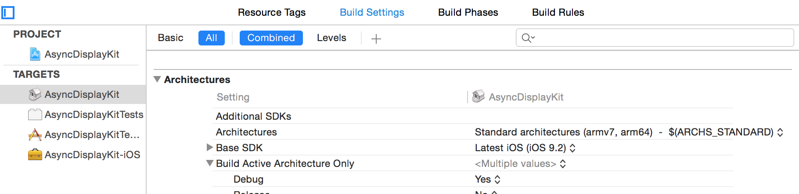
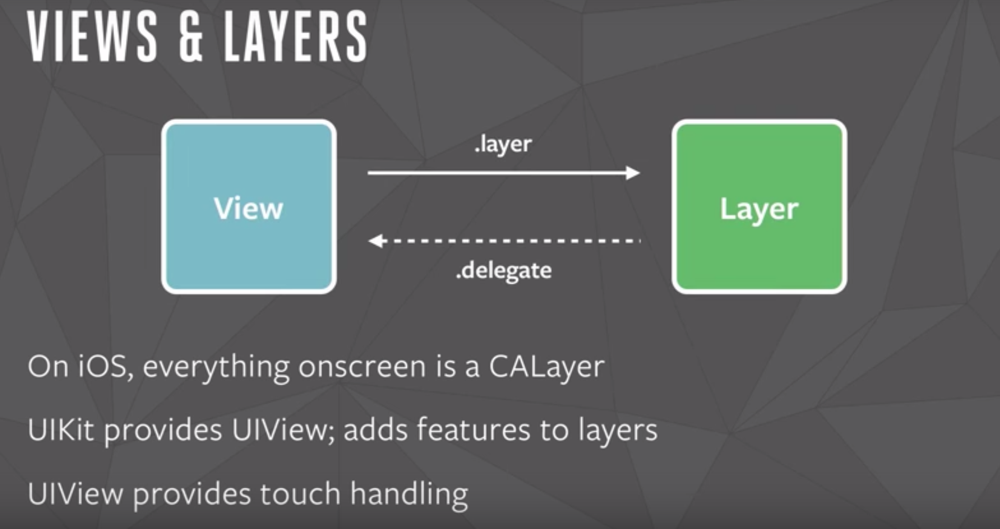
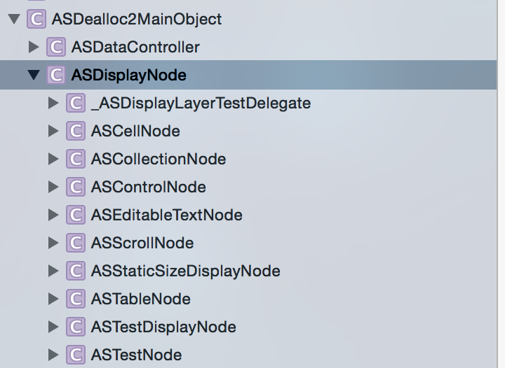
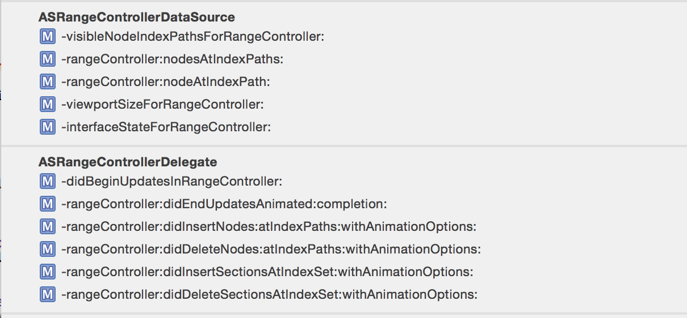

这个源码解析系列的文章

* [AsnycDispalyKit](http://blog.csdn.net/hello_hwc/article/details/51383470)
* [SDWebImage](http://blog.csdn.net/hello_hwc/article/details/51404322)
* [Mantle](http://blog.csdn.net/hello_hwc/article/details/51548128)
* [Alamofire](http://blog.csdn.net/hello_hwc/article/details/72853786)


----------

前言
--

>最近心血来潮，想研究下FaceBook的AsnycDispalyKit的源代码，学习一些界面优化的技术以及编码风格。这篇文章，会详细的<font color="red">记录下我认为对新手有用的部分</font>。后面有空的时候，继续研究其他几个iOS开发很流行的库－AFNetworking,SDWebImage,MBProgressHud,Mantle等`。AsnycDisplayKit是一个非常庞大的库，所以我尽量捞干的讲。

关于AsyncDisplayKit

* [文档](http://asyncdisplaykit.org/docs/getting-started.html)
* [源代码](https://github.com/facebook/AsyncDisplayKit)

<font color="red">如果只是想优化界面，那么可以用AsyncDisplayKit来重写哪些性能要求比较高的部分</font>

对了，阅读[YYKit](https://github.com/ibireme/YYKit)的作者ibireme的《[iOS 保持界面流畅的技巧](http://blog.ibireme.com/2015/11/12/smooth_user_interfaces_for_ios/)》一文对我的启发很大，建议读者可以看看他的文章，真的写得很好,是国内少有的iOS开发大神。

----
界面顿卡的原因
--
iOS的屏幕是<font color="orange">60fps</font>，也就是说，每一帧的间隔是<font color="orange">1/60s</font>，大概<font color="orange">16.7ms</font>。
每一帧显示需要三步

* CPU计算好视图（UIView）的大小，位置，对图片进行解码，绘制好纹理交给GPU
* GPU根据纹理，顶点进行空间变换，渲染后放到帧缓冲区
* 每当帧信号到达的时候，从帧缓冲区取一帧，显示到屏幕上

也就是说，整个<font color="orange">CPU＋GPU</font>处理的时间是16.7ms，如果超过这个时间，那么当前绘制的一帧就没办法放到帧缓冲区，帧信号到达的时候，取的还是上一帧的数据。也就是造成了界面没有变化，显示顿卡。也就是说，为了解决顿卡，一般要从CPU和GPU两个角度来考虑

<font color="red">CPU限制</font>

* 对象的创建，释放，属性调整。这里尤其要提一下属性调整，CALayer的属性调整的时候是会创建<font color="orange">隐式动画的</font>，是比较损耗性能的。
* 视图和文本的布局计算，AutoLayout的布局计算都是在主线程上的，所以占用CPU时间也很多 。
* 文本渲染，诸如UILabel和UITextview都是在主线程渲染的
* 图片的解码，这里要提到的是，UIImage只有在交给GPU之前的一瞬间，CPU才会对其解码。

<font color="red">GPU限制</font>

* 视图的混合，比如一个界面十几层的视图叠加到一起，GPU不得不计算每个像素点药显示的像素
* 视图的Mask，比如圆角什么的，会触发离屏渲染，占用GPU时间。
* 半透明，GPU不得不进行数学计算，如果是不透明的，CPU只需要取上层的就可以了
* 浮点数像素

AsnycDisplayKit通过很多技巧来解决这些问题，后文我会一点点分析如何实现的。


----
AsyncDisplayKit是啥
--
>这是Facebook推出的一个框架，用在Paper的App中。用来保证复杂的界面交互的时候，也不会掉帧。
>通过名字就可以看出来，AsyncDisplay就是异步加载控件。了解UIKit的同学都知道，UIKit的中的UIView和CALayer的布局和渲染都是在主线程上进行的，当界面复杂的时候，也就会占用大量时间导致掉帧。这个框架是建立在UIKit之上的，对UIView进行了进一步的封装－Node。Node支持异步的绘制UIView。Asnyc有一个原则

* 能放到后台执行的代码就尽量放到后台，不能放到后台执行的代码就尽量优化（比如用Runloop对任务进行拆分）

------
ASDealloc2MainObject
--
这个类中，AsnycDisplayKit重新定义了Release和Reatin方法来让一个类支持自己引用计数，可以强制的让对象在<font color="red">主线程dealloc</font>，不过这个文件是MRC的，也就是要在build setting中添加`-fno-objc-arc`。

>那么，为什么要强制的在主线程dealloc呢？因为UIKit的对象不是线程安全的，只能在主线程上进行dealloc

Tips：

1.可以在文件中，添加如下代码

```
#if __has_feature(objc_arc)
#error This file must be compiled without ARC. Use -fno-objc-arc.
#endif
```
来让编译器检查本文件只能在MRC条件下编译。
关于如何重写Release和Reatian，可以在这个文件里找到[_AS-objc-internal.h](https://github.com/facebook/AsyncDisplayKit/blob/master/AsyncDisplayKit/Private/_AS-objc-internal.h)。

2.由于Define只是在编译期进行简单替换，可以通过#defeine的方式为类条件添加代码


-----
大量的断言和宏定义
---
通过阅读源代码可以发现，代码中使用了大量的宏和断言

```
- (void)dealloc
{
  ASDisplayNodeAssertMainThread();
  //Other codes
}
```
其中`ASDisplayNodeAssertMainThread()`为宏定义，

```
  #define ASDisplayNodeAssertWithSignal(condition, description, ...) NSAssert(condition, description, ##__VA_ARGS__)
 #define ASDisplayNodeAssertMainThread() ASDisplayNodeAssertWithSignal([NSThread isMainThread], nil, @"This method must be called on the main thread")

```
对于断言和宏定义使用很少的同学，可以看看这个头文件，会对你很有帮助。

> Tips：
合理的使用断言NSAssert，能够让你的代码在更早的地方出现问题，方便发现问题进行调试。在XCode 中，NSAssert默认只会在Debug模式下起作用，在release模式下不会起作用

--------
Objective C++
--
在AsyncDisplay中，可以看到很多.mm后缀的文件，例如


>Objective C++和Objective C类似，它的文件组成由一个.h和一个.mm组成，你可以使用C＋＋的语法，例如命名空间，由于编译过后会被链接到OC runtime，所以，也可以使用OC的类。

简单来说，利用Objective C＋＋，可以使用C＋＋和OC来混合编程


------
clang 
--
新手开发往往忽略了开发中很重要的一个环节-<font color="orange">编译</font>,iOS开发的编译器是－[clang](https://zh.wikipedia.org/wiki/Clang)＋[llvm](https://zh.wikipedia.org/wiki/LLVM)。通过编译器，往往可以

* 修改编译器的警告模式，开启全部警告
* 忽略某一个编译器的警告
* 条件编译代码，和if else很像

所以，如果读到这里，还是对iOS的编译环节没有一个清楚的认识，建议看看clang和LLVM的wiki。另外，研究下XCode中build settings下所有的内容，还有，我之前的[这篇博客](http://blog.csdn.net/hello_hwc/article/details/46425503)也介绍了Clang的警告相关



举例看看这个库中是如何使用的

1.[pragma once](https://zh.wikipedia.org/wiki/Pragma_once),让一个文件在一个单独的编译中只包含一次，类似ifndef...define...endif或者import

2.在看看处理警告

```
#pragma clang diagnostic push
#pragma clang diagnostic ignored "-Wdeprecated-declarations"
  if ([_asyncDelegate respondsToSelector:@selector(collectionView:didEndDisplayingNodeForItemAtIndexPath:)]) {
    [_asyncDelegate collectionView:self didEndDisplayingNodeForItemAtIndexPath:indexPath];
  }
#pragma clang diagnostic pop
```
这简单提一下，编译的过程会有一个类似编译状态的堆栈，先压栈保存当前的状态，然后忽略`-Wdeprecated-declarations`这个警告，在编译完这段代码之后，再出栈恢复之前的状态

3.开启所有的警告 -Wall

----------

ASDisplayNode
--
这里不得不提到了，UIView和CALayer的关系




* 所有视图可见的部分，本质上都是CALayer显示的
* CALayer不能接受触摸，UIView相当于是CALayer的代理，用来接受触摸，响应responser，以及发出各种通知。
* 在性能要求较高的地方，往往使用Layer，因为Layer更加轻量级

AsnycDisplayKit仿照这种代理关系，对UIView进行了进一步的封装－ASDisplayNode。其中，Node是可以<font color="red">异步绘制的，也可以是layerBased</font>


ASDisplayNode的继承方式如下



可以看到，类似于UIView与UILabel的关系，`ASDisplayNode`是AsyncDisplayKit中可视部分node的基类。

----
异步渲染
---

<font color="red" size="4">displaysAsynchronously;</font>

这个属性用来决定是否是异步绘制的，异步绘制的流程如下

* 当一个View被添加到View的层次结构中，`needsDisplay` 会返回true
* 在布局结束后，Core Animation会调用`_ASDisplayLayer`的display方法，在`displayQueue`队列上添加一个绘制任务s
* 当绘制实际执行的时候，会调用代理方法-drawRect:或者-display
* 一个绘制任务会被添加到asyncdisplaykit_async_transaction中，绘制都结束后，回调完成block

简单来讲<font color="red">将绘制封装成任务，提交到displayQueue(后台队列)执行</font>

我们来看下，AsyncDisPlayKit异步渲染的一段代码[_ASDisplayLayer.h](https://github.com/facebook/AsyncDisplayKit/blob/master/AsyncDisplayKit/Details/_ASDisplayLayer.h)

```
- (void)_hackResetNeedsDisplay
{
  ASDisplayNodeAssertMainThread(); //断言在主线程
  // Don't listen to our subclasses crazy ideas about setContents by going through super
  super.contents = super.contents; //设置当前的contents为super.conents
}

- (void)display
{
  [self _hackResetNeedsDisplay]; //先在主线程上设置当前的contents为super.contents

  ASDisplayNodeAssertMainThread();//保证在主线程
  if (self.isDisplaySuspended) {//检查display是否被挂起，如果被挂起则返回，不需要展示
    return;
  }

  [self display:self.displaysAsynchronously];//根据displaysAsynchronously属性来判断是否需要异步展示
}

- (void)display:(BOOL)asynchronously//绘制任务交给代理－代理设计模式
{
  [self _performBlockWithAsyncDelegate:^(id<_ASDisplayLayerDelegate> asyncDelegate) {
    [asyncDelegate displayAsyncLayer:self asynchronously:asynchronously];
  }];
}
```
然后我们再看看代理是如何异步绘制的,代码在这个文件[ASDisplayNode+AsyncDisplay.mm](https://github.com/facebook/AsyncDisplayKit/blob/master/AsyncDisplayKit/Private/ASDisplayNode%2BAsyncDisplay.mm),这个方法 `- (void)displayAsyncLayer:(_ASDisplayLayer *)asyncLayer asynchronously:(BOOL)asynchronously`
代码较长，我挑出核心部分来讲解，其中display的核心就是这个

```
//这个block用来进行实际的绘制
 asyncdisplaykit_async_transaction_operation_block_t displayBlock = [self _displayBlockWithAsynchronous:asynchronously isCancelledBlock:isCancelledBlock rasterizing:NO];

//省略中间代码
[transaction addOperationWithBlock:displayBlock queue:[_ASDisplayLayer displayQueue] completion:completionBlock];

```
而`addOperationWithBlock`,就是把绘制任务，添加到后台GCD任务组里

```
- (void)addOperationWithBlock:(asyncdisplaykit_async_transaction_operation_block_t)block
                        queue:(dispatch_queue_t)queue
                   completion:(asyncdisplaykit_async_transaction_operation_completion_block_t)completion
{
  ASDisplayNodeAssertMainThread();
  ASDisplayNodeAssert(_state == ASAsyncTransactionStateOpen, @"You can only add operations to open transactions");

  [self _ensureTransactionData];

  ASDisplayNodeAsyncTransactionOperation *operation = [[ASDisplayNodeAsyncTransactionOperation alloc] initWithOperationCompletionBlock:completion];
  [_operations addObject:operation];
  dispatch_group_async(_group, queue, ^{
    @autoreleasepool {
      if (_state != ASAsyncTransactionStateCanceled) {
        operation.value = block();
      }
    }
  });
}
```


----
layerBacked
-----
对于，那些不需要接受触摸，不需要响应UIView的各种通知的Node，可以把layerBacked设置为true。这样，AsyncDisplayKit会自动使用Layer作为Node的backed。上文也提到了Layer相对于UIView的各种优点，这里不再赘述

------

SubTree预合成
----

<font color="red" size="4">shouldRasterizeDescendants来决定,所谓预合成，就是几个Layer合并成一个Layer来处理</font>

这个属性，用来决定是否需要将子Node都绘制到当前context中，也就是预合成.

预合成的优点

* 占用更少的内存，因为子Layer不需要单独被创建出来
* CPU不需要再为子Layer计算布局，大小
* GPU在渲染的时候，只需要绘制一层纹理，不需要进行混合

预合成的代码，可以参考[ASDisplayNode+AsyncDisplay.mm](https://github.com/facebook/AsyncDisplayKit/blob/master/AsyncDisplayKit/Private/ASDisplayNode%2BAsyncDisplay.mm)中的`_recursivelyRasterizeSelfAndSublayersWithIsCancelledBlock`这个方法，当预合成开启的时候，会<font color="red">递归</font>的检查subnode，绘制到当前ImageContext中。关闭的时候，每一个subnode维护自己的Context

---
预加载
---
所谓预加载，就是在视图尚未出现在屏幕上的时候，进行<font color="red">网络请求，布局计算，图片解码，后台视图渲染</font>。然后，随着屏幕滚动，预先加载的内容就不需要再占用时间进行计算了，直接拿过来显示就可以了。

根据预加载的程度，AsyncDisplayKit把显示区域划分成几个类型

* Visible Range,在屏幕上的区域
* Display Range,被认为是将要展示的区域，这个区域会进行布局计算，图片解码，后台渲染等预加载
* Fetch Data Range，进行预先数据获取的区域（网络或者磁盘）


关于预加载，可以参考[ASTableView](https://github.com/facebook/AsyncDisplayKit/blob/master/AsyncDisplayKit/ASTableView.h)的代码，
Range的定义

```
typedef NS_ENUM(NSInteger, ASLayoutRangeType) {
  ASLayoutRangeTypeDisplay,
  ASLayoutRangeTypeFetchData,
  ASLayoutRangeTypeCount
};

```

AsyncDispaly主要用三个类实现预加载


* [ASDataController](https://github.com/facebook/AsyncDisplayKit/blob/eed812dcdf1b046dd3bac01cdc9181ceeaa11261/AsyncDisplayKit/Details/ASDataController.h) 用来在后台处理数据
* [ASRangeController](https://github.com/facebook/AsyncDisplayKit/blob/eed812dcdf1b046dd3bac01cdc9181ceeaa11261/AsyncDisplayKit/Details/ASRangeController.h),用在ASTableview和ASCollectionView中，管理区域的变化。
* [ASFlowLayoutController](https://github.com/facebook/AsyncDisplayKit/blob/eed812dcdf1b046dd3bac01cdc9181ceeaa11261/AsyncDisplayKit/Details/ASFlowLayoutController.h),用来获取当前屏幕上处在各个区域的cell的indexPath


这里面的代码逻辑和架构设计都十分复杂，感兴趣的同学可以研究下源代码。
这里，我列出来`ASTableivew`的初始化代码

```
  _layoutController = [[ASFlowLayoutController alloc] initWithScrollOption:ASFlowLayoutDirectionVertical];
  
  _rangeController = [ASDisplayNode shouldUseNewRenderingRange] ? [[ASRangeControllerBeta alloc] init]
                                                                : [[ASRangeControllerStable alloc] init];
  _rangeController.layoutController = _layoutController;
  _rangeController.dataSource = self;
  _rangeController.delegate = self;
  
  _dataController = [[dataControllerClass alloc] initWithAsyncDataFetching:NO];
  _dataController.dataSource = self;
  _dataController.delegate = _rangeController;
  
  _layoutController.dataSource = _dataController
```

看起来是不是很有趣呢？

1. _rangeController持有_layoutController的一个引用
2. _layoutController的数据源是_dataController
3. _dataController的代理又是_rangeController

其中，_layoutController的核心是这个方法 - <font color="red">根据rangeType来获取对应的indexSet</font>

```
- (NSSet *)indexPathsForScrolling:(ASScrollDirection)scrollDirection rangeType:(ASLayoutRangeType)rangeType

```
_dataController的数据源是self(ASTableview),也就是它依赖ASTableivew为自己提供数据，然后Delegate是_rangeController，也就是说，可以这么理解<font color="red">_dataController作为一个桥梁，由ASTableview提供数据，并且提供接口给ASTableview调用，回调给_rangeController</font>。

通过阅读` ASDataController`的接口可以看到，这个类主要就是用来处理数据的,处理ASTable的插入删除reload等，比如

```
- (void)insertRowsAtIndexPaths:(NSArray<NSIndexPath *> *)indexPaths withAnimationOptions:(ASDataControllerAnimationOptions)animationOptions;

- (void)deleteRowsAtIndexPaths:(NSArray<NSIndexPath *> *)indexPaths withAnimationOptions:(ASDataControllerAnimationOptions)animationOptions;

- (void)reloadRowsAtIndexPaths:(NSArray<NSIndexPath *> *)indexPaths withAnimationOptions:(ASDataControllerAnimationOptions)animationOptions;

```

_rangeController的dataSrouce和delegate都是self，也就是它是直接和ASTableview打交道的，而代理和数据源如下图,通过名字就可以看出来，rangeController用来实际的管理区域的变化。并且回调给ASTableview



<font size=3>这么设计的最大的优点是什么？ － 解耦,让不同的类分别处理某一块逻辑，这样代码的逻辑清楚，方便测试，方便后期维护</font>

------
布局计算
-----
通常开发iOS的时候，布局有两种

1. AutoLayout
2. 手动计算位置大小(layoutSubViews,或者viewDidLayoutSubviews里调整位置)

AutoLayout有一个明显的缺点：Layout计算在主线程，并且随着视图量级的增加，AutoLayout占用的时间成指数级别上升。手动调整布局虽然性能上好一些，但是缺需要大量的计算。

AsyncDisplay定义了自己的布局引擎，采用了[CSS Box](http://www.w3schools.com/css/css_boxmodel.asp)模型。CSS的box模型布局更加灵活。

那么，AsyncDisplayKit如何实现了Box的模型呢？

主要由协议[ASLayoutAble](https://github.com/facebook/AsyncDisplayKit/blob/6d1c52b04264fb9fd8e783247ff4c929acb715ff/AsyncDisplayKit/Layout/ASLayoutable.h)来定义一个node是可以Layout，
```
@protocol ASLayoutable <ASStackLayoutable, ASStaticLayoutable, ASLayoutablePrivate>
//包括相对于前一个node的距离，后一个的距离，自己的position等信息，用来计算位置
@end
```

------
Runtime的使用
----
这个术语老生常谈的了，Runtime在很多开源库，包括很多项目开发的时候都会用到，并不是什么黑科技。只是利用好OC的语言特性罢了。比如[ASInternalHelpers.mm](https://github.com/facebook/AsyncDisplayKit/blob/master/AsyncDisplayKit/Private/ASInternalHelpers.mm)里利用Runtime去检查子类是否重写了一个Selector

```
BOOL ASSubclassOverridesSelector(Class superclass, Class subclass, SEL selector)
{
  Method superclassMethod = class_getInstanceMethod(superclass, selector);
  Method subclassMethod = class_getInstanceMethod(subclass, selector);
  IMP superclassIMP = superclassMethod ? method_getImplementation(superclassMethod) : NULL;
  IMP subclassIMP = subclassMethod ? method_getImplementation(subclassMethod) : NULL;
  return (superclassIMP != subclassIMP);
}

```
又比如，[ASBasicImageDownloader.mm](https://github.com/facebook/AsyncDisplayKit/blob/master/AsyncDisplayKit/Details/ASBasicImageDownloader.mm)利用Runtime动态为类NSURLRequest“添加“属性

```
@interface NSURLRequest (ASBasicImageDownloader)
@property (nonatomic, strong) ASBasicImageDownloaderContext *asyncdisplaykit_context;
@end

@implementation NSURLRequest (ASBasicImageDownloader)
static const char *kContextKey = NSStringFromClass(ASBasicImageDownloaderContext.class).UTF8String;
- (void)setAsyncdisplaykit_context:(ASBasicImageDownloaderContext *)asyncdisplaykit_context
{
  objc_setAssociatedObject(self, kContextKey, asyncdisplaykit_context, OBJC_ASSOCIATION_RETAIN_NONATOMIC);
}
- (ASBasicImageDownloader *)asyncdisplaykit_context
{
  return objc_getAssociatedObject(self, kContextKey);
}
@end
```

------
Runloop的使用
---

问：Runloop和Runtime有啥关系？

答：没啥关系。


>Runloop是一个和线程相关的技术，Runloop和线程一一绑定的。App启动的时候，默认启动一个main runloop来接收iOS系统的触摸，各种事件，响应端口来处理各种硬件相关。底层的Runloop实现就是一个for循环，不断的接受处理任务，没有任务的时候进行休眠。

通常，Runloop的使用场景有四个

<font color="orange">

1. 监听Main Runloop的状态，在主线程空闲的时候或者合适的时候去执行一些任务。
2. 把任务拆分成一个个小任务，依次提交到Runloop里执行。而不是一个大任务去执行。大任务的执行会导致占用线程时间过多，导致之前所说的掉帧。
3. 创建一个后台等待执行任务的线程，并且开启Runloop来等待任务。
4. 根据Runloop的Mode来提交不同的任务，然后根据状态在Mode之前切换

</font>

Cocoa Touch的很多技术都和Runloop相关，比如CATransaction，NSTimer，AutoReleasePool等，对了，像这样的代码

```
dispatch_async(dispatch_get_main_queue(), ^ {
    [self presentViewController:vc animated:YES completion:nil];
});
```
是会推迟到下一个Runloop执行的。

AsyncDisplayKit中，是如何使用Runloop的呢？关于Runloop的核心使用代码，都可以在这个文件里找到
[_ASAsyncTransactionGroup.m](https://github.com/facebook/AsyncDisplayKit/blob/master/AsyncDisplayKit/Details/Transactions/_ASAsyncTransactionGroup.m)，它使用Runloop的模式是我上文提到的场景1，也就是监听MainRunloop的状态，在适当的时候，去更新UI。

对于Runloop理解比较差的同学，可以看看我之前写的这篇文章《 [iOS SDK详解之Runloop](http://blog.csdn.net/hello_hwc/article/details/49992863)。

监听Main Runloop的状态，

```
+ (void)registerTransactionGroupAsMainRunloopObserver:(_ASAsyncTransactionGroup *)transactionGroup
{
  ASDisplayNodeAssertMainThread();
  static CFRunLoopObserverRef observer;
  ASDisplayNodeAssert(observer == NULL, @"A _ASAsyncTransactionGroup should not be registered on the main runloop twice");
  // defer the commit of the transaction so we can add more during the current runloop iteration
  CFRunLoopRef runLoop = CFRunLoopGetCurrent();
  CFOptionFlags activities = (kCFRunLoopBeforeWaiting | // before the run loop starts sleeping
                              kCFRunLoopExit);          // before exiting a runloop run
  CFRunLoopObserverContext context = {
    0,           // version
    (__bridge void *)transactionGroup,  // info
    &CFRetain,   // retain
    &CFRelease,  // release
    NULL         // copyDescription
  };

  observer = CFRunLoopObserverCreate(NULL,        // allocator
                                     activities,  // activities
                                     YES,         // repeats
                                     INT_MAX,     // order after CA transaction commits
                                     &_transactionGroupRunLoopObserverCallback,  // callback
                                     &context);   // context
  CFRunLoopAddObserver(runLoop, observer, kCFRunLoopCommonModes);
  CFRelease(observer);
}

```
当调用这个方法的时候，每当Runloop进入`kCFRunLoopBeforeWaiting`或者`kCFRunLoopExit`的时候，`_transactionGroupRunLoopObserverCallback`回调就会执行。

<font color="orange">
Tips:之所以监听kCFRunLoopBeforeWaiting和kCFRunLoopExit是因为正常的UIKit就是监听Main Runloop，然后选择在Runloop这个时候进行渲染和界面的更新。AsyncDisplayKit同样监听这两个状态，但是优先级更低，所以会等到UIKit渲染结束了然后自己才会渲染。
</font>

在来看看这个回调

```
static void _transactionGroupRunLoopObserverCallback(CFRunLoopObserverRef observer, CFRunLoopActivity activity, void *info)
{
  ASDisplayNodeCAssertMainThread();
  _ASAsyncTransactionGroup *group = (__bridge _ASAsyncTransactionGroup *)info;
  [group commit];
}
```

可以看到，在监听到这两个状态的时候，AsyncDisplaykit调用了`commit`,来更新当前的状态转换组。<font color="red">也就是根据Runloop的状态来找到适合更新UI的机会－主线程相对空闲的时候</font>。


------
总结
-----
ASDisplay接近200个源文件，实在太大了，本文也只是管中窥豹，简单的记录下我的理解，而且它还在更新。对了,<font color="red">对于大多数开发者来说，目标是开发稳定流畅的App，所以不要重新造轮子</font>。

后面有时间继续看开源代码写博客吧，React Native的博客写起来也好慢，慢慢来吧


