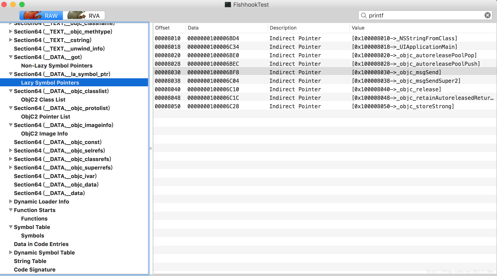
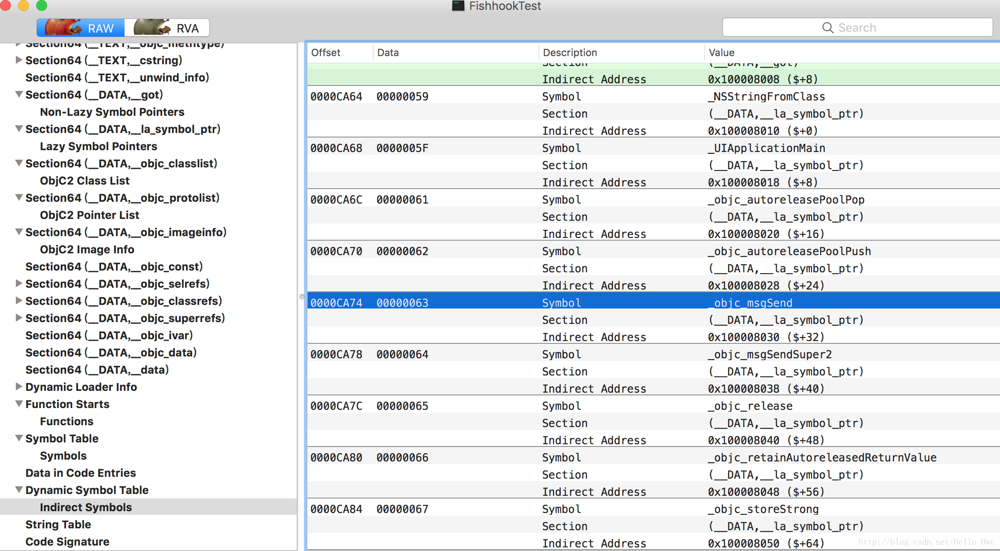
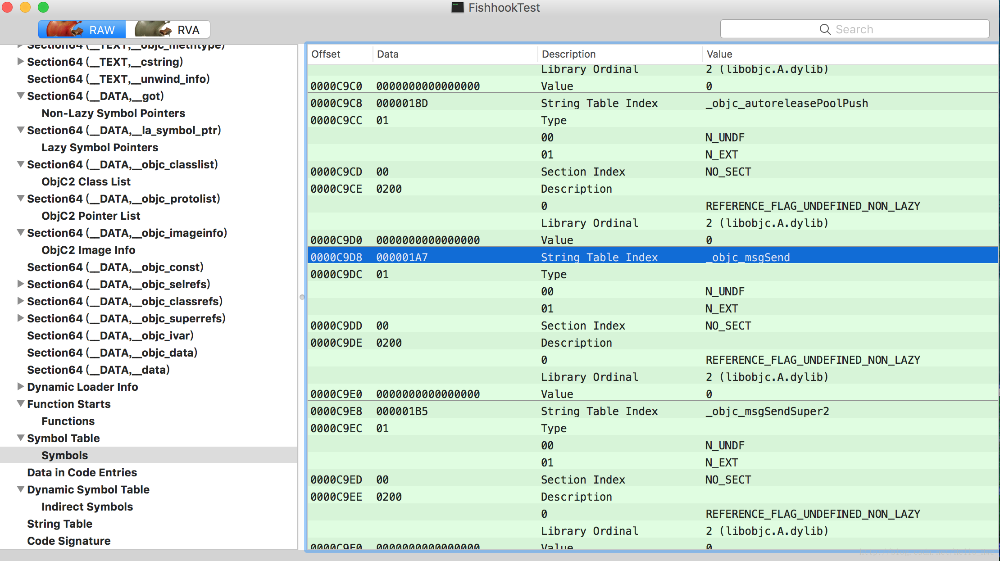
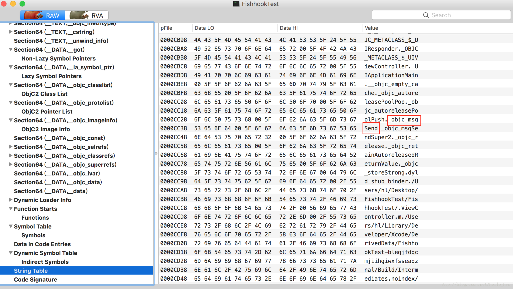
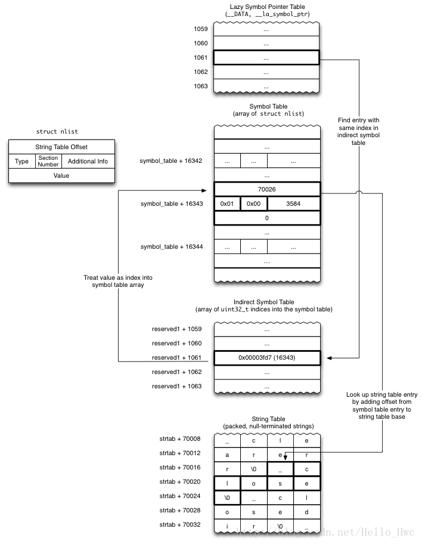

## Fishhook

[Fishhook](https://github.com/facebook/fishhook)是FaceBook出品的，可以重新绑定在iOS中运行的Mach-O中的符号工具，简单来说，就是可以Hook C函数。它的接口就一个：

```
struct rebinding {
  const char *name; //字符串名称
  void *replacement; //替换后的方法
  void **replaced; //原始的方法（通常要存储下来，在替换后的方法里调用）
};

//两个参数分别是rebinding结构体数组，以及数组的长度
int rebind_symbols(struct rebinding rebindings[], size_t rebindings_nel);

```

实现也就不到两百行，本文就一步步揭开这个方法背后的黑魔法。

> !!! 如果读者对dyld和Mach-O两个名词感到陌生，建议先看我的上一篇文章《[深入理解iOS App的启动过程](http://blog.csdn.net/hello_hwc/article/details/78317863)》


## 原理

在讲解具体过程之前，首先介绍一个概念：[PIC](https://en.wikipedia.org/wiki/Position-independent_code)(Position Indepent Code)，位置无关代码。

> 使用PIC的Mach-O文件，在引用符号（比如printf）的时候，并不是直接去找到符号的地址（编译期并不知道运行时printf的函数地址），而是通过在`__DATA` Segment上创建一个指针，等到启动的时候，dyld动态的去做绑定（bind），这样`__DATA` Segment上的指针就指向了`printf`的实现。

- 知道这一点很关键，因为这是fishhook能够工作的核心原理，finshhook就是通过`rebind_symbols`修改`__DATA`Segment上的符号指针指向，来动态的hook C函数。

在`__DATA`段中，有两个Sections和动态符号绑定有关：

- `__nl_symbol_ptr` 存储了`non-lazily`绑定的符号，这些符号在mach-o加载的时候绑定。
- `__la_symbol_ptr` 存储了`lazy`绑定的符号（方法），这些方法在第一调用的时候，由`dyld_stub_binder`来绑定，所以你会看到，每个mach-o的`non-lazily`绑定符号都有`dyld_stub_binder`。

通过dyld相关的API，我们可以很容易的访问到这些Symbols指针，但是并不知道这些指针具体代表哪种函数。

**所以，要解决的问题就是找到这些指针代表的字符串，和当前的要替换的进行比较，如果一样替换当前指针的实现即可。**

接下来，我们就来看看，如何通过一系列操作来找到这些指针代表的字符串。

### 准备工作

新建一个iOS单页面工程，添加一个C函数,然后，编译生成.app文件，在.app文件中获取可执行文件，用MachOView打开，选中`__la_symbol_ptr`，接下来我们就看看如何找到`objc_msgSend`的符号。




### 遍历存储Symbols的两个Section

其中，表示Section Header的数据结构如下，这里我们用到的是reserved1字段。由于是遍历，所以我们知道index，比如1061

```
struct section { /* for 32-bit architectures */
	char		sectname[16];	/* name of this section */
	char		segname[16];	/* segment this section goes in */
	uint32_t	addr;		/* memory address of this section */
	uint32_t	size;		/* size in bytes of this section */
	uint32_t	offset;		/* file offset of this section */
	uint32_t	align;		/* section alignment (power of 2) */
	uint32_t	reloff;		/* file offset of relocation entries */
	uint32_t	nreloc;		/* number of relocation entries */
	uint32_t	flags;		/* flags (section type and attributes)*/
	uint32_t	reserved1;	/* reserved (for offset or index) */
	uint32_t	reserved2;	/* reserved (for count or sizeof) */
};
```

### 读取Indirect Symbol Table

**Indirect Symbol Table**位于`__LINKEDIT`段，存储了间接寻址`Symbol Table`的数组下标，数据类型为`unit31_t`。

通过上一步得到的index+reversed1为下标，我们访问**Indirect Symbol Table**，找到`objc_msgSend`的信息：



这里可以看到，图中选中的一行中，Data是00000063，换算成16进制就是99。

### 读取Symbol Table

**Symbol Table**位于`__LINKEDIT`段，存储了符号的信息，数据类型为`nlist`。

通过Indirect Symbol Table，我们知道`objc_msgSend`在Symbol Table的下标是99。



`nlist`的数据结构如下：

```
//32位
struct nlist {
	union {
#ifndef __LP64__
		char *n_name;	/* for use when in-core */
#endif
		uint32_t n_strx;	/* index into the string table */
	} n_un;
	uint8_t n_type;		/* type flag, see below */
	uint8_t n_sect;		/* section number or NO_SECT */
	int16_t n_desc;		/* see <mach-o/stab.h> */
	uint32_t n_value;	/* value of this symbol (or stab offset) */
};
//64位
struct nlist_64 {
    union {
        uint32_t  n_strx; /* index into the string table */
    } n_un;
    uint8_t n_type;        /* type flag, see below */
    uint8_t n_sect;        /* section number or NO_SECT */
    uint16_t n_desc;       /* see <mach-o/stab.h> */
    uint64_t n_value;      /* value of this symbol (or stab offset) */
};
```
通过这个数据结构，我们可以获取到`uint32_t n_strx;`，这个下标将在下一步用到。

### 读取String Table

根据上一步获取到偏移量+String Table的基础偏移量，我们就能知道这个符号对应的字符串名称了。



### 小结

上述的四个步骤，总结一下如图（图片来自官方）：



到这里，我们只要遍历所有的`__nl_symbol_ptr`和`__la_symbol_ptr`中的指针，就能够获得到其对应的字符串，也就是说，这是一个遍历匹配的过程。

### 何时绑定

利用dyld相关接口，我们可以注册image装载的监听方法：

```
extern void _dyld_register_func_for_add_image(void (*func)(const struct mach_header* mh, intptr_t vmaddr_slide));
```

> **调用`_dyld_register_func_for_add_image`注册监听方法后，当前已经装载的image(动态库等)会立刻触发回调，之后的image会在装载的时候触发回调。dyld在装载的时候，会对符号进行**

Fishhook就是利用了`_dyld_register_func_for_add_image`,在回调函数中进行Symbols替换。


### 源代码细节

#### 数据结构

Fishhook采用链表的方式来存储每一次调用`rebind_symbols`传入的参数，每次调用，就会在链表的头部插入一个节点，链表的头部是：`_rebindings_head`。

> `_rebindings_head->next`就可以判断是否是第一次调用`rebind_symbols`方法。

```
struct rebindings_entry {
  struct rebinding *rebindings;
  size_t rebindings_nel;
  struct rebindings_entry *next;
};
```

#### 对外接口

接着，我们再来看看`rebind_symbols`这个对外的接口，其中应用到的C函数作用如下：

- `_dyld_image_count(void)` 当前dyld装载的image数量
- `_dyld_get_image_header(unit32_t image_index)` 返回image对应的Mach Header地址
- `_dyld_get_image_vmaddr_slide(unit32_t image_index)` 虚拟内存中的地址偏移量

```
int rebind_symbols(struct rebinding rebindings[], size_t rebindings_nel) {
  //往链表的头部插入一个节点
  int retval = prepend_rebindings(&_rebindings_head, rebindings, rebindings_nel);
  if (retval < 0) {//插入失败，直接返回
    return retval;
  }
  if (!_rebindings_head->next) {//第一次调用，注册回调方法
    _dyld_register_func_for_add_image(_rebind_symbols_for_image);
  } else {
    //遍历已经加载的image，进行实际的hook
    uint32_t c = _dyld_image_count();
    for (uint32_t i = 0; i < c; i++) {
      _rebind_symbols_for_image(_dyld_get_image_header(i), _dyld_get_image_vmaddr_slide(i));
    }
  }
  return retval;
}
```

#### 具体的Hook过程

1. 遍历Load Command，找到`__LINKEDIT`段，stab symbol table和symbol

	```
	segment_command_t *cur_seg_cmd;//当前指针
	segment_command_t *linkedit_segment = NULL;//__LINKEDIT段
	struct symtab_command* symtab_cmd = NULL;//symbol table
	struct dysymtab_command* dysymtab_cmd = NULL;//indirect symbol table
	uintptr_t cur = (uintptr_t)header + sizeof(mach_header_t);
	for (uint i = 0; i < header->ncmds; i++, cur += cur_seg_cmd->cmdsize) {
		cur_seg_cmd = (segment_command_t *)cur;
		if (cur_seg_cmd->cmd == LC_SEGMENT_ARCH_DEPENDENT) {//找到__LINKEDIT段
		  if (strcmp(cur_seg_cmd->segname, SEG_LINKEDIT) == 0) {
		    linkedit_segment = cur_seg_cmd;
		  }
		} else if (cur_seg_cmd->cmd == LC_SYMTAB) {
		  symtab_cmd = (struct symtab_command*)cur_seg_cmd;
		} else if (cur_seg_cmd->cmd == LC_DYSYMTAB) {
		  dysymtab_cmd = (struct dysymtab_command*)cur_seg_cmd;
		}
	}
	```

	几个宏定义，可以在`<mach-o/loader.h>`中找到

	```
	#define	SEG_LINKEDIT	"__LINKEDIT"	/* the segment containing all structs */
	#define	LC_SYMTAB	0x2	/* link-edit stab symbol table info */
	#define	LC_DYSYMTAB	0xb	/* dynamic link-edit symbol table info */
	```

2. 找到symbol和string table的base地址

	```
	uintptr_t linkedit_base = (uintptr_t)slide + linkedit_segment->vmaddr - 	linkedit_segment->fileoff;
 	nlist_t *symtab = (nlist_t *)(linkedit_base + symtab_cmd->symoff);
 	char *strtab = (char *)(linkedit_base + symtab_cmd->stroff);
	```
3. 获取indriect table的数据(uint32_t类型的数组)

	```	
	uint32_t *indirect_symtab = (uint32_t *)(linkedit_base + dysymtab_cmd-	>indirectsymoff);
	```

4. 再一次遍历laod command,这一次遍历`__DATA`段中的Sections,对`S_LAZY_SYMBOL_POINTERS`和`S_NON_LAZY_SYMBOL_POINTERS`段中的指针进行rebin，调用函数`perform_rebinding_with_section`

	```
	  cur = (uintptr_t)header + sizeof(mach_header_t);
	  for (uint i = 0; i < header->ncmds; i++, cur += cur_seg_cmd->cmdsize) {
	    cur_seg_cmd = (segment_command_t *)cur;
	    if (cur_seg_cmd->cmd == LC_SEGMENT_ARCH_DEPENDENT) {
	      if (strcmp(cur_seg_cmd->segname, SEG_DATA) != 0 &&
	          strcmp(cur_seg_cmd->segname, SEG_DATA_CONST) != 0) {
	        continue;
	      }
	      for (uint j = 0; j < cur_seg_cmd->nsects; j++) {
	        section_t *sect =
	          (section_t *)(cur + sizeof(segment_command_t)) + j;
	        if ((sect->flags & SECTION_TYPE) == S_LAZY_SYMBOL_POINTERS) {
	          perform_rebinding_with_section(rebindings, sect, slide, symtab, strtab, indirect_symtab);
	        }
	        if ((sect->flags & SECTION_TYPE) == S_NON_LAZY_SYMBOL_POINTERS) {
	          perform_rebinding_with_section(rebindings, sect, slide, symtab, strtab, indirect_symtab);
	        }
	      }
	    }
	  }
	```
5. **`perform_rebinding_with_section`**，进行section中的symbol rebind。

	```
	static void perform_rebinding_with_section(struct rebindings_entry *rebindings,
	                                           section_t *section,
	                                           intptr_t slide,
	                                           nlist_t *symtab,
	                                           char *strtab,
	                                           uint32_t *indirect_symtab) {
	  //读取indirect table中的数据(uint32_t)的数组                                 
	  uint32_t *indirect_symbol_indices = indirect_symtab + section->reserved1;
	  void **indirect_symbol_bindings = (void **)((uintptr_t)slide + section->addr);
	  //遍历indirect table
	  for (uint i = 0; i < section->size / sizeof(void *); i++) {
	    //读取indirect table中的数据
	    uint32_t symtab_index = indirect_symbol_indices[i];
	    if (symtab_index == INDIRECT_SYMBOL_ABS || symtab_index == INDIRECT_SYMBOL_LOCAL ||
	        symtab_index == (INDIRECT_SYMBOL_LOCAL   | INDIRECT_SYMBOL_ABS)) {
	      continue;
	    }
	    //以symtab_index作为下标，访问symbol table
	    uint32_t strtab_offset = symtab[symtab_index].n_un.n_strx;
	    //获取到symbol_name
	    char *symbol_name = strtab + strtab_offset;
	    if (strnlen(symbol_name, 2) < 2) {
	      continue;
	    }
	    //遍历最初提到链表，来一个个hook
	    struct rebindings_entry *cur = rebindings;
	    while (cur) {
	      for (uint j = 0; j < cur->rebindings_nel; j++) {//每一个链表的结点包括一个hook的C数组
	        if (strcmp(&symbol_name[1], cur->rebindings[j].name) == 0) {//如果名称一致
	          //如果没有被替换，并且数据合法，则进行替换
	          if (cur->rebindings[j].replaced != NULL &&
	              indirect_symbol_bindings[i] != cur->rebindings[j].replacement) {
	            *(cur->rebindings[j].replaced) = indirect_symbol_bindings[i];
	          }
	          indirect_symbol_bindings[i] = cur->rebindings[j].replacement;
	          goto symbol_loop;
	        }
	      }
	      cur = cur->next;
	    }
	  symbol_loop:;
	  }
	}
	
	```

## 局限性

Fishhook能够工作的原理还是PIC(Position Independ Code)，从dyld的角度来说，就是mach-o外部符号（像printf引用其他动态库）绑定的过程。对于内部符号，fishhook是无法进行hook的。

比如，我们在代码里写一个C函数，

```
void LeoTestCFunction(){
    
}
int main(int argc, char * argv[]) {
    @autoreleasepool {
        LeoTestCFunction();
        return UIApplicationMain(argc, argv, nil, NSStringFromClass([AppDelegate class]));
    }
}
```
然后，编译，用MachOView打开可执行文件，发现不管是lazy还是non lazy的symbols里，都没有这个`LeoTestCFunction`符号。


原因也很简单

> LeoTestCFunction是内部函数，编译后，函数的实现会在mach-o的`__TEXT`（代码段）里。编译后，当前调用处的指针，是直接指向代码段中的地址的。这个地址是由mach-o的base+offset获得的，其中offset是一定的。dyld在装载的时候，只需要对这些符号进行rebase即可（修改地址为newbae+offset）。


