## 断点

> In software development, a breakpoint is an intentional stopping or pausing place in a program, put in place for debugging purposes

简单来说，断点就是故意让程序暂停在某一个点，从而我们可以进行代码调试。

- Condition & Action
- Exception
- Symbolic
- WatchPoint
- Swift Error
- 汇编
- Other

断点可以用XCode GUI设置，也可以用lldb命令，本文只关注GUI部分，LLDB的命令会在之后的文章里讲到。

你可以在这里找到我的iOS代码调试系列的全部文章：[Blogs](https://github.com/LeoMobileDeveloper/Blogs)。

## Condition & Action

- Conditon，配置断点触发的条件
- Action，配置断点触发时候触发的行为

断点代码

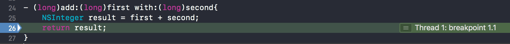

右键一个断点，可以设置断点在什么时候触发，比如这里设置`first > 5`

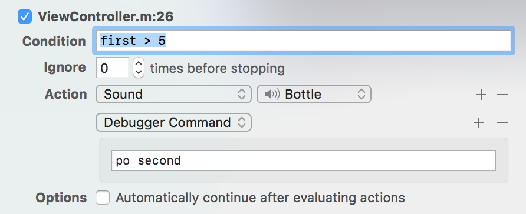

可以在Action中添加Debugger的命令，所有lldb相关的代码都可以在这里执行，比如

```
po second
```

除了lldb代码，还可以添加这几种Action


- Ignore times before stopping 设置在断点触发前忽略的次数
- Automatically continue after evaluating actions，勾选后，在断点触发并且执行actions完毕，会继续执行下去，而不会停在这里。

> Tips：不要在条件断点设置的时候分析App的性能，因为condtion & actions可能会很耗时。

## Exception

除了普通断点，异常断点是日常开发中用到的第二多的，经常可以通过这个断点来发现很多代码里的问题。

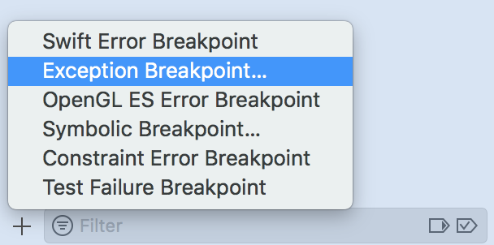

异常断点会在Objective C或者C++异常出现的时候触发，异常断点是对两个符号断点的简化

```
objc_exception_thorw
__cxa_throw
```

异常断点同样是可编辑的

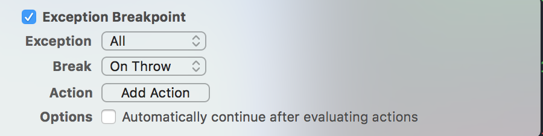

- 可以配置只捕获C++/Objective C异常
- 可以配置在异常抛出和捕获的时候触发

比如这段代码，感兴趣的同学可以试试On Throw和On Catch的区别

```
@try{
    [@"12" performSelector:@selector(abcd)];
}@catch(NSException * ex){
    NSLog(@"%@",ex);
}
```

另外，建议为异常断点添加一个action，打印出函数栈

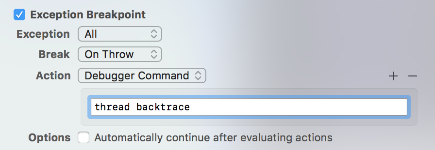

**!!!注意**，像C数据越界这种crash是不会触发异常断点的

```
int arr[5] = {1, 2, 3, 4, 5};
arr[6] = 10;
```

这种crash可以参考这个后续的Diagnostics一文内容。

## Symbolic

有些时候，无法在代码的某一行用鼠标打断点，这时候符号断点就派上用场了，仍然是通过左下角的加号

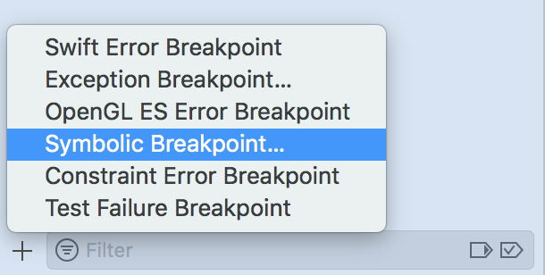

接着，我们希望在所有的UIViewController的`viewWillAppear:`触发

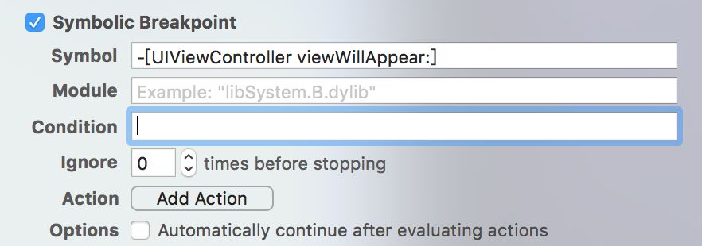

这时候运行代码，会在`viewWillAppear`停下来

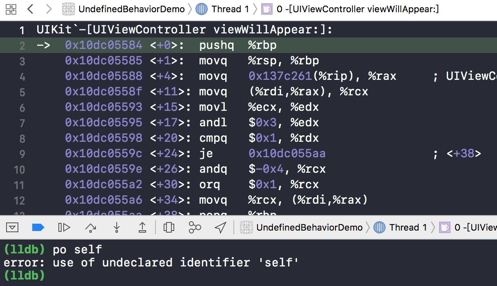

**注意**：当符号断点停在系统动态库内部的时候，是无法获取到符号的。

这时候我想设置条件应该怎么办呢？比如我想在类名是`ViewController`的时候停下来

> **答案是读寄存器**。

我们都知道，Objective C方法最后执行的时候会变成`objc_msgSend(self,cmd,...)`。

也就是说，第一个参数就是self的地址，而根据函数的寄存器传参规则，这里第一个通用寄存器保存了参数self

- 对于arm64(真机)来说，第一个寄存器是$x0
- 对于x86（模拟器）来说，第一个寄存器是$rdi

所以，我们可以这么写Condition

```
(BOOL)[(NSObject *)$rdi isKindOfClass:[ViewController class]]
```

更多的关于寄存器和汇编，参考我这篇文章：[iOS汇编快速入门上篇](https://github.com/LeoMobileDeveloper/Blogs/blob/master/Basic/iOS%20assembly%20toturial%20part%201.md)


## WatchPoint

> 当需要某一个变量或者地址的内容变化的时候触发断点，这时候你需要watchpoint。

在需要监听的上下文打一个普通断点，然后右键想要监听的变量

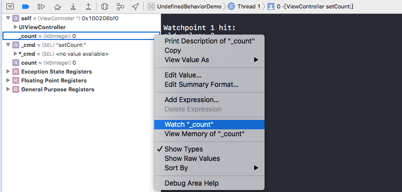

然后，当变量变化的时候，断点会触发

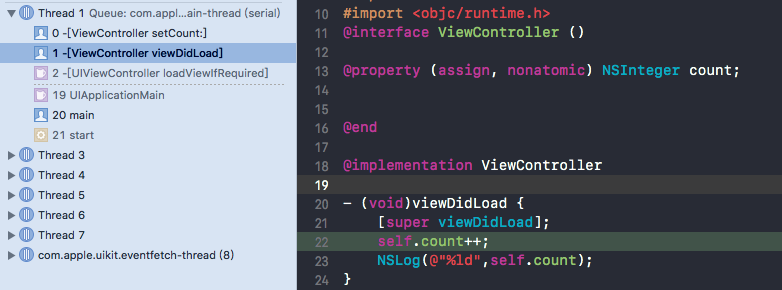

同时，能够在终端中看到log：

```
Watchpoint 1 hit:
old value: 0
new value: 1
```

这样只会监听地址写入，如果需要监听地址读取，那么需要lldb命令：

```
watchpoint set variable -w read_write _count
```

## 汇编

在调试的时候，我们可以查看当前的汇编代码

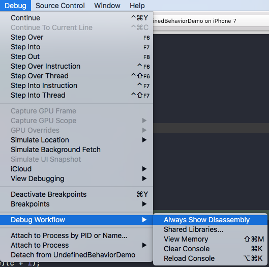

代码停下来的时候，可以看到汇编代码

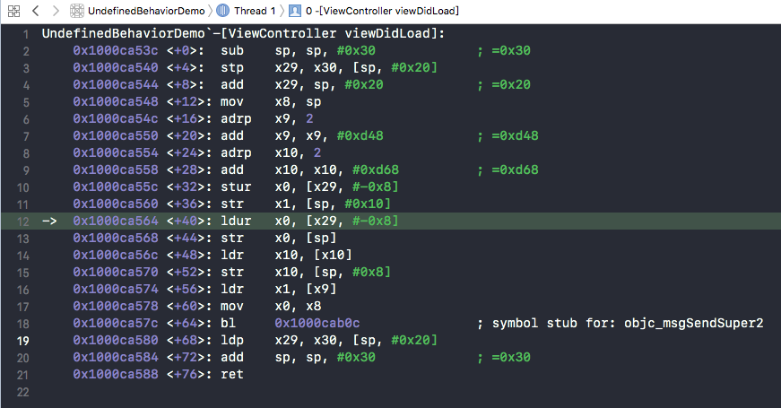

> 为什么汇编代码很有用呢？因为有些时候crash在一些动态库里，你不知道具体的符号表，但是通过阅读汇编代码，查看寄存器的状态，你可以找到一些crash的蛛丝马迹。

除了汇编之外，XCode还支持查看内存，DEBUG -> Debug Workflow -> View Memory。

> 查看内存有个快捷键：Shift + Command + M

在箭头处输入想要查看的内存地址，就可以查看对应的内存。

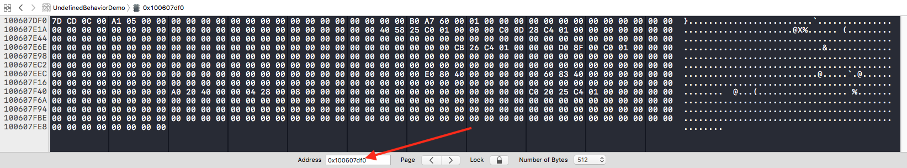

## Swift Error

> Swift的Error和Objective C/C++的异常并不是一回事。

Swift抛出的Error可以通过Swift Error断点调试，还是在左下角的加号

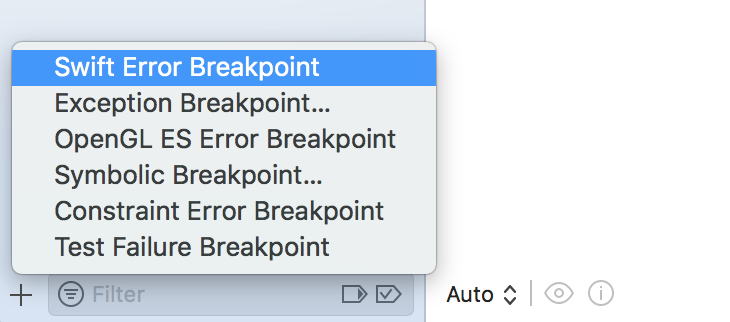

断点可以指定在哪一种Error上触发

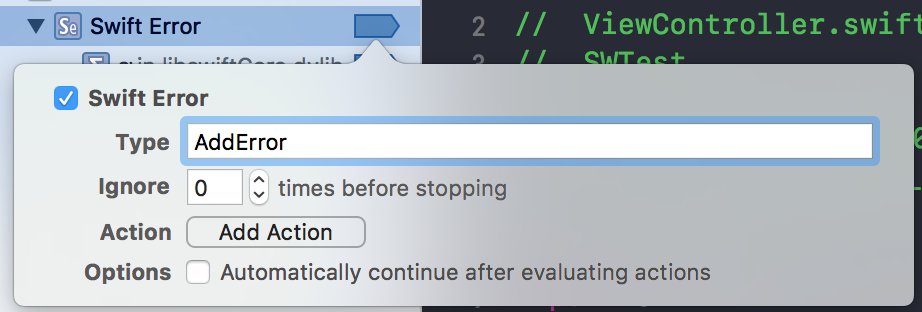

举例：

```
enum AddError: Error{
    case overflow
}
func add(input:Int) throws ->  Int {
    guard input < 100 else {
        throw AddError.overflow
    }
    return input + 1;
}
```

方法调用

```
do{
    _ = try add(input: 100)
}catch let error{
    print(error)
}
```

会停在

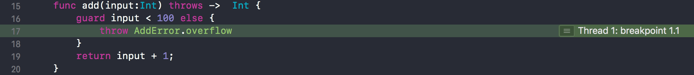

## Other

除了这几种断点之外，还有两种

- Constraint Error Breakpoint 在AutoLayout约束异常的时候触发
- Test Failure Breakpoint 测试用例失败的时候触发

