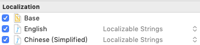
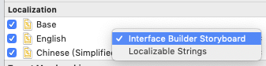

## 前言

有些Bug真的是毁三观的，因为按照官方文档，代码就应该是可以正常运行的，但是事实却偏偏不是，这个文件就是用来记录那些神奇的系统Bug。


### tableHeaderView第一次点击无响应


描述：

1. tableView的tableHeaderView可以正常点击
2. 向上滚动TableView，再向下滚动，直到返回顶部
3. tableHeaderView上的所有控件第一次无法点击，第二次就好了

原因：因为需要限制顶部的滚动区域，所以做了如下操作

```
- (void)scrollViewDidScroll:(UIScrollView *)scrollView {
    if (scrollView.contentOffset.y < 0) {
        [scrollView setContentOffset:CGPointZero];
    }
}
```

解决办法：

```
- (void)scrollViewDidScroll:(UIScrollView *)scrollView {
    if (scrollView.contentOffset.y < 0) {
        id<UIScrollViewDelegate> deleagte = scrollView.delegate;
        scrollView.delegate = nil;
        [scrollView setContentOffset:CGPointZero];
        scrollView.delegate = deleagte;
    }
}
```

### Storyboard本地化

描述：有个需求是本地化LaunchScreen,.storyboard上的文字,最初的方案是本地化字符串：

 
 
然后，修改对应strings文件中的内容。

现象：简体中文本地化失败，始终读取的是英文。

解决方案：改用本地化storyboard文件本身，这里选择Interface Builder Storyboard。

 
