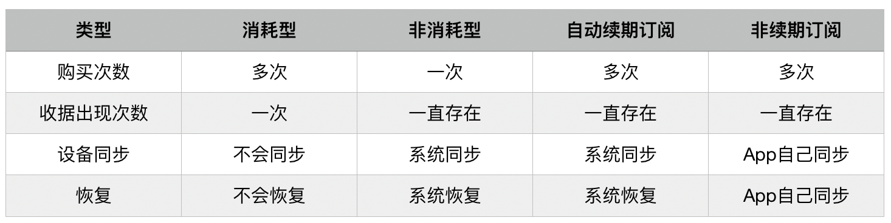
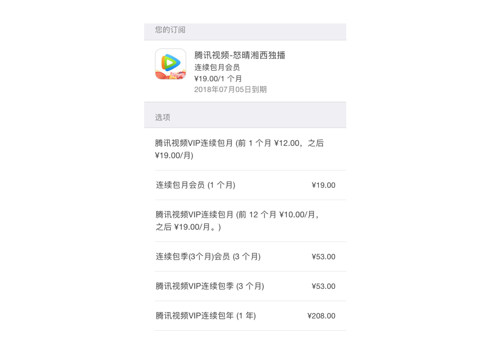
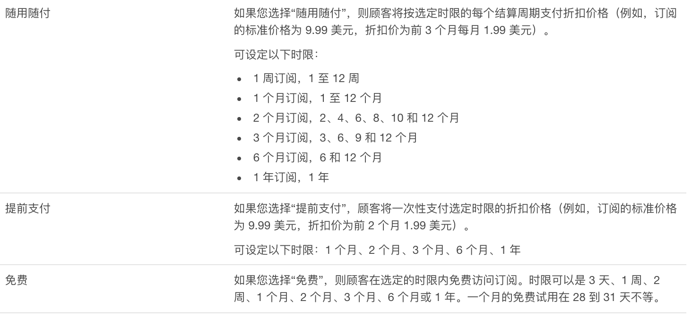
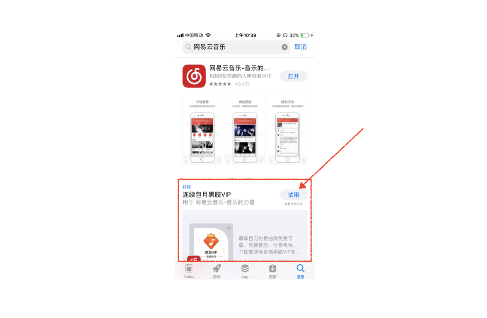
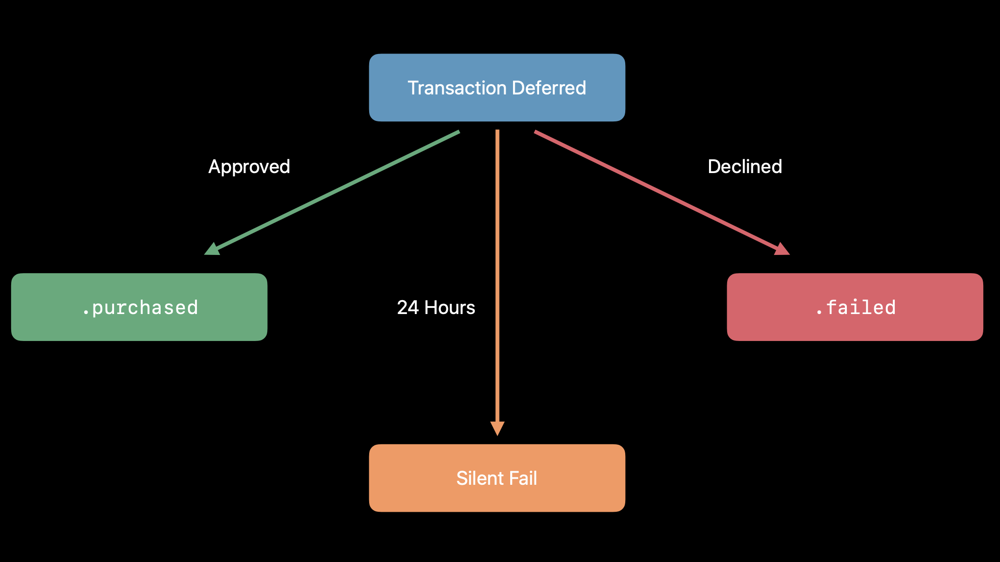
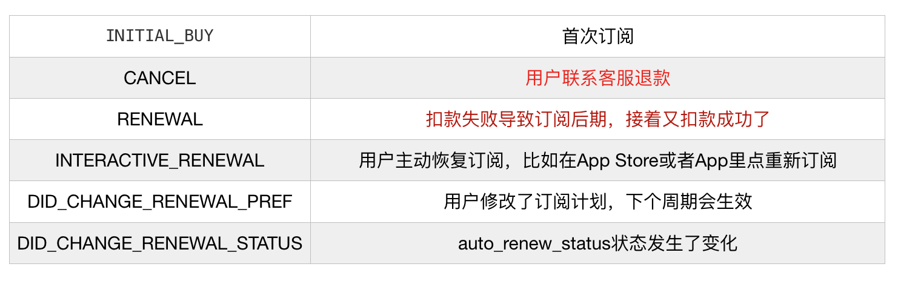
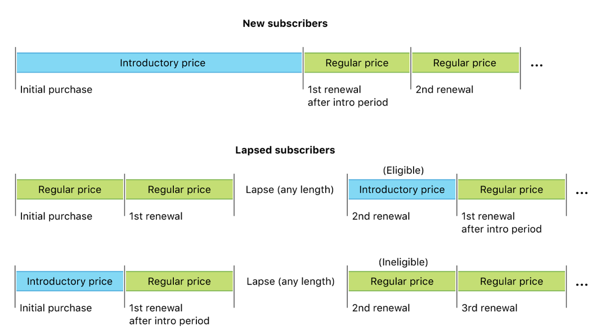
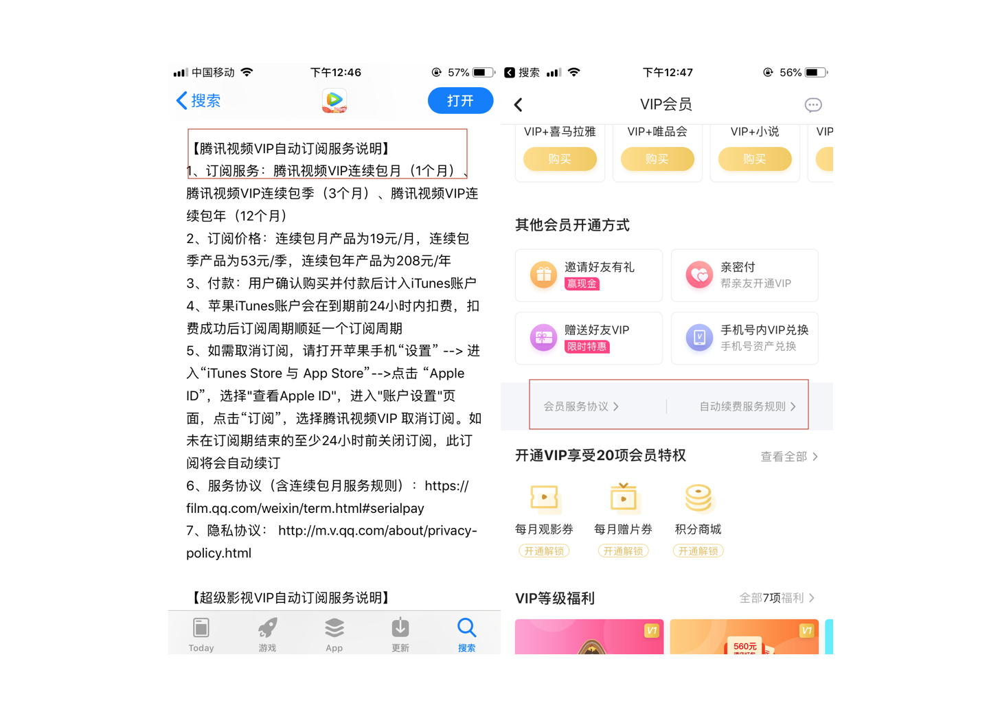

## 前言

上一份工作中，断断续续开发和维护了两年左右的内购，换工作后短期内应该不会做相关业务了，所以趁着“记忆”还是热乎的，写下这篇文章。

希望读者通过阅读本文能够解决一些问题或者找到一些产品灵感，本文主要包括三个方面：

1. 内购的基本概念；
2. 代码层面如何开发，坑和对应的解决方案；
3. 应用审核和后续运营的注意事项；

友情提示：本文很长～

## 授之以渔

以下官方资料，建议开发内购的同学**静下心**来通读一遍，能避免很多隐形的坑，产品设计的时候也能给出更好的建议：

- [In-App Purchase](https://developer.apple.com/in-app-purchase/)
- [In-App Purchase Programming Guide](https://developer.apple.com/library/archive/documentation/NetworkingInternet/Conceptual/StoreKitGuide/Introduction.html?language=objc#//apple_ref/doc/uid/TP40008267)
- [Receipt Validation Programming Guide](https://developer.apple.com/library/archive/releasenotes/General/ValidateAppStoreReceipt/Introduction.html?language=objc#//apple_ref/doc/uid/TP40010573)
- [Best Practices and What’s New with In-App Purchases](https://developer.apple.com/videos/play/wwdc2018/704/)
- [Subscriptions](https://developer.apple.com/app-store/subscriptions/)
- [App Store Connect Guide](https://help.apple.com/app-store-connect/#/devb57be10e7)
- [App Store Review Guidelines](https://developer.apple.com/cn/app-store/review/guidelines/)

## 概念

既然提到购买，那必然有“商品”，商品也有一些描述信息(metadata)，比如名称，价格，优惠信息等。和微信支付宝等方式不同，内购的商品需要到iTunes Connect后台建立，并且通过App Store的审核后才能售卖。

内购商品一共有四种类型：

- **消耗型**。可以购买多次，多次结果累加，并且在App内作为“货币”消耗。典型的是虚拟货币，用户先通过IAP购买**虚拟货币**，再消耗虚拟货币购买商品。
- **非消耗型**。只能购买一次，可跨设备使用，**业务场景较少**。典型的是图书App中的一本电子书，或者游戏中的一个关卡。
- **自动续期订阅**。和时间相关的服务，在有效期内用户可享受服务，要到期的时候自动扣费。典型的是**连续包月的会员**。
- **非续期订阅**。和时间相关的服务，但是不会自动扣费。典型的是**一个月会员**。

> 这里有个小坑是类似“一个月会员”这种有时间段的商品，应该用非续期订阅，而不是用消耗型先买App内货币，再用货币购买，不然审核会被拒。

对比



### 订阅

这里着重提一下订阅，因为在四种模式中，订阅是一种增加用户粘性，同时提高收入的业务模式。订阅模式已经存在很多年了，美国科技巨头Netflix就是靠着订阅模式起家。

Apple也在主推订阅模式，所以普通的内购商品手续费是30%，而订阅超过一年的用户，手续费则降低到15%。

一个订阅商品要处在一个群组里，**一个群组里，用户一次只能订阅一个商品**，以腾讯视频为例：



可以为订阅配置等级，类似会员的订阅等级往往都是相同的，因为他们提供的服务是一样的。**相同等级切换的时候，会在当前订阅周期结束的时候生效**。比如，1月10日订阅的连续包月，1月15日从包月切换到了包年，那么在2月10日的时候会扣掉一年的钱。

那么什么时候订阅等级不同呢？**当提供的服务内容不同时，可用不同的订阅等级**。比如：黄金会员，铂金会员，钻石会员。不同等级之间的订阅切换有所不同：

- 升级。用户购买服务级别高于当前订阅的订阅。他们的订阅服务会立即升级，并会获得原始订阅的按比例退款。
- 降级。用户选择服务级别低于当前订阅的订阅。订阅会继续保持不变，直到下一个续订日期，然后以较低级别和价格续订。
- 跨级。用户切换到相同级别的新订阅。如果两个订阅的持续时间相同，新订阅会立即生效。如果持续时间不同，新订阅会在下一个续订日期生效。

#### Introductory Offers

可以为订阅配置[推介促销优惠](https://developer.apple.com/cn/app-store/subscriptions/?cid=win-back-subscribers-asc-w-cn#offering-introductory-prices)**来吸引新的订阅用户**，对iOS 10+有效。

推荐促销一共有以下三种类型：

 

三种优惠中，推荐的是**免费试用**：比如第一个月免费，第二个月开始扣费。注意，你应该用优质的产品或者服务去留住这些新增的订阅用户，而不是期望用户忘记取消，好的产品靠的是硬实力，而不是投机取巧。

每个订阅群组的**新顾客和重新订阅的顾客均可享受一次折扣价或免费试用**。服务端验证收据后，以下两个字断有一个为true的时候，表示用户正在享受对应的优惠：

- `is_in_intro_offer_period` 是否在享受折扣价
- `is_trial_period` 是否是免费试用

注意：当过去收据中`is_trial_period`或者`is_in_intro_offer_period`为true的时候，用户不再有享受优惠的权益，即刚刚说的一个组里只能享受一次优惠。

#### Subscribe Offer

很长一段时间Apple只开放了[推介促销](https://developer.apple.com/cn/app-store/subscriptions/?cid=win-back-subscribers-asc-w-cn#offering-introductory-prices)一种优惠方式，导致内购相关的产品方案很僵化。但在2019年3月，随着iOS **12.2**一起发布了一种新的促销方式：订阅优惠(Subscribe Offer)。

[Subscribe Offer](https://developer.apple.com/cn/app-store/subscriptions/?cid=win-back-subscribers-asc-w-cn#subscription-offers)用来为那些已经订阅过的用户提供优惠，并且为**哪些用户提供优惠是开发者自己可控的**，这样开发者就可以自定策略来提高留存，或者赢回已经取消订阅的用户。


### App Store推广

在iOS 11以后，App Store多了一个入口，可以让开发者在App Store上推广IAP项目，以网易云音乐为例：



这个推广位的逻辑是：

- 当用户已经下载了App，会直接打开App，然后通过StoreKit相关API通知App用户点击了这个IAP商品
- 当用户没有下载App，会先下载App，接着通过StoreKit相关API通知App用户点击了这个IAP商品。

有些同学会问，一个还没下载就让用户付钱的位置，能有几个用户会真正产生付费？

下面，我就来讲讲这个位置为什么很重要：

1. **降低搜索结果中竞品的位置，提高下载量**。App Store七成左右的下载来自搜索，而搜索结果的前三个会分走七成的流量。有了这个推广“占坑”，你的潜在用户将更少的下载竟品App。
2. **用优惠的运营方式吸引和转化付费用户**。比如网易云音乐使用的连续包月的免费试用，用户会有一种**免费用会员的心理**，然后通过内容留住这么部分用户，从而提高付费用户数量。

## 开发

You talk too much，show me the code。

### 原理

IAP的大致原理：用户在App中通过StoreKit发起购买请求，接着App Store扣款产生一个receipt(收据)给App，App把收据发送给Server，Server验证收据后向用户交付对应的虚拟内容。


不难看出，**IAP的枢纽是App**，这也是让无数开发者头疼的地方。实践证明，这种架构设计容易发生丢单(花钱不到账)或者无法购买。当然，对于个人开发者来说这种模式是友好的，因为他们不需要搭个服务器，然后码一遍服务端的代码了。

以一次完整的购买为例，看看都经过了哪些步骤：


1. App通过SKProductRequest来请求商品
2. 通过`SKProductsRequestDelegate`中的代理方法，获得SKProduct
3. 用SKProduct生成SKMutablePayment，添加到SKPaymentQueue里
4. 通过`SKPaymentTransactionObserver`中的代理方法，获得正在购买的回调
5. 通过`SKPaymentTransactionObserver`中的代理方法，获得正在购买成功的回调
6. App用本地的收据和用户id等信息，通知服务端IAP购买成功
7. 服务端发送收据到App Store，验证收据
8. App Store返回验证收据的结果
9. 服务端为用户交付产品
10. 服务单通知客户端结果
11. 客户端完成`SKPaymentTransaction`

### SKPaymentQueue

StoreKit提供的核心API是`SKPaymentQueue`，应该在**App启动的时候**(通常是`didFinishLaunch`方法)设置`SKPaymentQueue`的delegate：

```
[SKPaymentQueue defaultQueue].delegate = YourIAPManager
```

发起购买的时候要判断当前设备是否可以购买：

```
[SKPaymentQueue canMakePayments]
```

### 订单

上面的这种架构模式是：支付成功 -> 生成订单，服务端只有购买已经发生了，才会参与到流程里。

而通常的支付系统的设计是：生成订单 -> 支付成功 -> 完成订单。IAP也可以以同样的方式来设计，只需要在2，3步之前，向服务端发送一个API，生成一笔待支付订单，然后在第6步完成订单的时候，带着这个订单id即可。


这种方式的优点：

1. 服务端动态可控是否可以发生购买，比如下架某一个商品，直接后端下架即可，无需从iTunes Connect里下架。
2. 发生丢单的时候，服务端会有创建订单的日志，有助于后期定位问题，


**坑**：

正常一笔IAP购买，创建一次订单，完成订单的时候，要么成功，要么失败。但有些时候IAP会返回两次结果，先回调一次失败(Cancel)，再回调一次成功。服务端在设计的时候要能处理这种情况。

这种情况发生在**App Store的policy更新**时，用户在App内发起购买需要先跳转到App Store同意策略，这时候会立刻回调一个`SKErrorPaymentCancelled`，接着付款成功回调一个购买成功。


### Transaction

将SKMutablePayment添加到SKPaymentQueue后，StoreKit会生成一个`SKPaymentTransaction`，当你认为这笔交易已经完成的时候，要调用代码来结束这个`transaction`。

```
if(succeedToDeliverProduct){
	[[SKPaymentQueue defaultQueue] finishTransaction:transaction];
}
```

transaction有以下几种状态：

- purchasing 购买中
- purchased 购买成功
- failed 购买失败
- restored 之前购买的恢复成功
- deferred 购买处于待定状态，比如小孩子购买，需要家长同意。

三种场景：

1. 正常购买成功：purchasing -> purchased
2. 购买失败：purchasing -> failed
3. 非消耗型/自动续期订阅恢复：purchasing -> restored

有个特殊的场景：ask to buy，这是iOS的家长监管功能，小孩子在购买的时候需要家长同意，这时候状态改变是：purchasing -> deferred。

然后根据家长的处理结果，deferred状态进行如下转换：



注意:

1. transaction并不一定在一次App周期内完成，会有“App内点购买 -> 杀掉App -> 付款成功”的情况，这时候第二次App启动的时候，StoreKit会通过`SKPaymentTransactionObserver`的代理方法通知App。
2. 收到`.purchased`的回调后，不要立刻`finishTransaction`，要等到购买的服务已经交付的时候再调用，防止用户扣款了，产品却没有到账。

### 用户系统映射

IAP购买是以SKPaymentTransaction为枢纽，而App往往也有一套自己的用户系统，神奇的是Apple并**没有一套可靠机制去把用户id绑定到Transaction上**，上次去Apple交流的时候和Apple的工程师求证过，他们给的回答是：“这点需要开发者自己解决”。

最后采用的方案是：**applicationName + KeyChain**。

发起IAP购买的时候，先把pid->uid的映射关系存储到内存和keychain里，这里的pid表示`SKProduct.productIdentifier`:

```
//Memory
self.ongoingPayments[pid] = uid

//KeyChain
NSInteger ts = [[NSDate date] timeIntervalSince1970];
NSDictionary * metadata = @{ IAP_KEY_UID: uid, IAP_Key_TS: @(ts)};
NSData * data = [NSKeyedArchiver archivedDataWithRootObject:metadata];
[KeychainWrapper updatePassword:data forUser:pid];
```

把userId作为applicationName（也可以携带orderId等信息）：

```
SKMutablePayment *payment = [SKMutablePayment paymentWithProduct:product];
payment.quantity = 1;
payment.applicationUsername = userId;
[[SKPaymentQueue defaultQueue] addPayment:payment];
```

实践中发现，applicationName这个参数在回调的时候有可能为nil，所以采用策略如下：

1. 尝试从applicationName中读取uid，如果uid为nil，则继续下一步
2. 尝试从内存中根据productId来恢复uid，如果恢复失败，则继续下一步
3. 尝试从keyChain中恢复uid，检查`transactionDate`和keyChain里记录的购买开始时间戳在允许范围内，如果恢复失败，则继续下一步
4. 如果App内有IAP找回功能，这笔订单放到待找回列表里；如果App没有提供找回功能，继续下一步。
5. 认为当前用户的uid是发生IAP购买的uid，如果当前用户已退出登录，那么下一个登陆的uid认为是购买的uid

> **ApplicationName是唯一能用来携带信息的字断**，如果这个字断丢失，我们无法做到100%的uid匹配。

### 订阅

微信/支付宝的订阅逻辑：Server和微信/支付宝签约，签约会有一个签约ID，接下来Server需要扣款的时候就调用微信/支付宝的API扣款即可。但IAP的[订阅](https://developer.apple.com/cn/app-store/subscriptions/)不一样，IAP的订阅是App和apple“签约”，这个签约id是

```
transaction.originalTransaction.transactionIdentifier 
```

对应收据中`original_transaction_id`字段，App第一次购买的时候，Server把`original_transaction_id`绑定到`uid`上，表明这个用户和苹果“签约”了。后续通过收据中的`original_transaction_id`即可找到uid。

在续费的前10天，Apple会进行续费的前期检查，尽量确保用户能够正常扣款。如果前期检查出了问题，会提醒用户应该处理对应的问题。

在续费的**前24小时，Apple会尝试扣款**，Apple会尝试几次扣款，如果一直扣款失败会停止扣款，订阅被动取消。注意，如果是支付相关的问题，Apple可能会进行长达60天的尝试，可以通过收据中的`is_in_billing_retry_period`判读Apple是否还在尝试中。

> **主流App内的会员开通页都是H5，方便进行各种营销活动**。

### 首次购买

客户端：客户端发起购买，流程和正常的消耗型购买一样，通过SKPaymentObserver协议收到回调后，上传收据到服务端。

服务端：服务端把收到的**收据和password**发送给Apple验证，password可以在iTunes Connect后台生成，验证收据有效后，把`original_transaction_id`绑定到uid上。

### 续费

服务端：记录下来最后一个收据，在订阅过期时间`expires_date`前24小时，定时用最后一条收据轮询，如果用户续费未成功，检查`is_in_billing_retry_period`，如果这个为true，那么放到下个轮训队列里继续检查，直到`is_in_billing_retry_period`为false，表示Apple已经放弃了扣款。

客户端：每一次续费，StoreKit都会收到一个Transaction回调，客户端需要把对应的收据上传。注意：这次上传应该**不需要鉴权**，随着时间推移，续费时可能已经切换了用户。

### Server To Server Notification

针对订阅，Apple提供了一种**实时的**Server To Server的通信机制，在订阅的关键节点上，会通过HTTP POST的方式来通知我们的Server。

唯一要做的是[在iTunes Connect配置](https://help.apple.com/app-store-connect/?lang=zh-cn#/dev0067a330b)给App Store POST的URL，然后就可以接受到实时的通知了。

通知的字段可以在[官方文档](https://developer.apple.com/documentation/storekit/in-app_purchase/enabling_status_update_notifications)里找到，这里介绍下有哪几种类型的通知：



几点说明：

1. 扣款失败导致过期，不会有任何通知
2. 正常扣款续订，不会有任何通知
3. 服务端最好处理`CANCEL`类型。因为IAP存在黑产：比如买了一年会员，然后打电话给苹果客服退款，如果服务端不处理，这一年会员是生效的。

> 消耗型的IAP购买无法知道退款，所以实际Apple支付的钱要比服务端记录的流水少几个点。

### 推介促销

在iTunes Connect后台配置了推介促销后，可以在代码中通过`SKProduct`的属性来获商品配置的取推介促销的详情：

```
@property(nonatomic, readonly) SKProductDiscount *introductoryPrice;
```

至于是否有推介促销的资格由服务端来判断，判断根据：

- 订阅的新用户有资格
- 订阅的老用户过期后续订且之前没有享受过订阅



所以，这块的开发逻辑是：

1. 客户端向服务端请求用户是否有推介促销资格，然后展示对应的UI。
2. 用户通过App进行IAP购买，APP收到收据后，发送给服务端验证。
3. 服务端根据`is_in_intro_offer_period`和`is_trial_period`判断是否享受优惠
4. 客户端收到回调，更新UI。

### 订阅促销

订阅促销同样需要在iTunes Connect后台配置，一个商品最多可以配置10个促销。拉取SKProduct的时候，这些促销信息就会在SKProduct的属性`discounts`中返回

```
@property(nonatomic, readonly) NSArray<SKProductDiscount *> *discounts;
```

为了开发订阅促销，你还需要在[iTunes Connect后台创建一个密钥](https://help.apple.com/app-store-connect/#/dev689c93225)，**注意这个密钥不要保存在客户端，如果丢失了要及时[revoke](https://help.apple.com/app-store-connect/#/dev689c93225?sub=dev4587a2b9c)，避免被人薅羊毛**。创建后会生成一对key-value的数据：

- keyIdentifier
- `PKCS#8`格式的密钥

#### 签名

服务端用密钥[生成签名](https://developer.apple.com/documentation/storekit/in-app_purchase/generating_a_signature_for_subscription_offers)，签名算法需要的参数

- appBundleID 应用的bundleId
- keyIdentifier 标示用的是哪一个密钥
- productIdentifier 商品Id
- offerIdentifier 促销Id
- applicationUsername 可选参数，可用来传用户Id
- nonce 有效期24小时的唯一Id，注意必须是小写
- timestamp 服务器时间戳，时间戳24小时内的优惠是有效的

> Tips: nonce的存在是为了防止重放攻击

算法过程：

1. 先对以上参数以字符串`\u2063`作为分隔符按顺序拼接：

    ```
    appBundleId + '\u2063' + keyIdentifier + '\u2063' + productIdentifier + '\u2063' + offerIdentifier + '\u2063' + applicationUsername + '\u2063' + nonce + '\u2063' + timestamp
    ```

2. 对拼接好的字符串做签名：使用ECDSA算法，SHA-256哈希和iTunes Connect后台生成的密钥
3. 对二进制数据做base64，返回给App

> 本文末尾有签名的python代码。

#### 技术方案

服务端：记录下来用户订阅状态(可以用Server to server通知)，能判断出用户是否适合订阅促销。通常还有个运营配置后台，配置每个商品带有的优惠方案，可以用算法为不同用户采用不同的优惠策略。**这块特别适合做AB Test，从实践中选择一种最合适的方案。**

客户端：根据服务端的订阅优惠信息来展示UI。用户购买的时候，要先发送一个API，向服务端请求签名`signature`，服务端把签名用的nonce，timestamp，signature等信息返回给客户端，接着初始化一个SKPaymentDiscount，赋值给SKMutablePayment即可。

### App Store推广

为了支持App Store推广，需要实现`SKPaymentTransactionObserver`中的一个方法

```
- (BOOL)paymentQueue:(SKPaymentQueue *)queue shouldAddStorePayment:(SKPayment *)payment forProduct:(SKProduct *)product{
	 //收到这个方法的回调后，保存下来App Store里点击的SKPayment和SKProduct，接着跳转到购买页面完成购买。
	 //返回NO告诉StoreKit不要把购买添加到SKPaymentQueue中
    return NO;
}
```

推广的商品要提交审核，按照[官方文档](https://developer.apple.com/cn/app-store/promoting-in-app-purchases/)在iTunes Connect里配置下就好了。

测试的时候，通过URL Scheme来测试：

```
itms-services://?action=purchaseIntent&bundleId=com.example.app&productIdentifier=product_name
```

> App Store推广需要审核，这个审核周期可能会很长，所以建议提交审核的时候，在备注里提醒审核人员有推广的商品，让他们一起审核。

### 测试

Apple有两套内购Server：sandbox和production。**只有从App Store上下载的才会走production环境，可以App审核通过后，用redeem码兑换来测试真金白银购买**。平时插线和testflight的包都是走sandbox。想要在sandbox购买需要先在iTunes Connect中注册“沙箱技术测试员”，当然如果Apple Id在内部测试组里，也可以直接走sandbox购买。

sandbox账户可以单独登陆，测试起来方便些：


再提下自动续期订阅的测试，在sandbox环境自动续期订阅会加速，且**每天最多自动续费6次**，对照表如下：


> Tips: 订阅测试需要一批新的沙箱技术测试账号，因为**首次订阅这个case只有新的Apple Id能满足**。

### 找回

IAP依赖iOS和App Store交互，所以经常会出现用户扣钱了，但是没有到账。所以不少App内会提供找回的功能，找回的策略：

1. 调用`SKReceiptRefreshRequest`刷新收据，刷收据的原因是有时候本地收据和App Store上的不一致，注意`SKReceiptRefreshRequest`会让用户输入Apple Id的密码。
2. 刷完收据后，把本地收据发送给服务端，服务端验证收据中的内容，如果有未到账的，充值即可。
3. 客户端后续收到了SKPaymentTransaction回调后，正常发送给服务端，如果订单已经被找回了，服务端通知客户端收据已被验证，客户端`finishedTransaction`即可。

## 注意事项

### 日志

IAP购买最好记录下来详细的操作日志，可以选择购买出错的用户上报，做统计分析。支持按照特定设备回捞，方便针对特定用户定位，不然用户打电话过来找你，你会一头雾水。

### 沙盒环境

**审核人员购买的时候走的是沙盒环境**。所以服务端验证收据会用App Store的生产环境验证，如果发现是沙盒的收据(状态码**21007**)，要再去App Store的sandbox验证一次。如果收据有效，要让充值正常到账，避免审核人员无法正常审核，导致App被拒。

> 这个设计其实很不合理，因为没有扣钱，却要在我们自己的生产环境充值到账，导致支付系统对账的时候流水对不上。所以服务端的同学在处理sandbox订单的时候要标记为不对账，或者sandbox产生充值的账户，直接标记为测试账户。

### 未登录购买

IAP审核要求在**未登录的时候可以购买**，但是大家都有一套自己的用户系统，未登录产生充值行为会有点麻烦。所以，需要有一套**匿名用户**系统，Server用deviceId来生成用户id.

### 商品审核

通常，一种类型的内购商品的第一次审核的时候一定会跟着版本审核一起。之后再提交内购商品的时候，就可以单独审核了。

但要注意，如果提交内购商品和App版本审核不巧凑在了一起，要保证审核的时候审核人员能够看到对应的待审商品，不然会有可能导致App和IAP商品一起被拒。

### metadata

App集成订阅的需要提供一些metadata信息，这也是审核需要的：

- App Store的描述信息里加上《自动续费服务说明》
- App内的充值界面提供两个链接：会员服务协议，自动续费服务规则。



### 改信息

IAP商品改价格是不需要审核的，但是会有一段时间才会生效。快的时候二十分钟，最慢的时候等了24个小时。

运营活动往往有时效性，所以不建议通过改价格的方式来进行日常运营。以一个月会员为例，可以申请两个，一个正常价格，一个活动价格。在运营活动开始的时候，直接**切换商品**，做到无缝衔接。

> iTunes Connect是可以给运营开账号的，这部分工作不要揽到开发手里。

### 退款

买了内购商品后，是可以打电话给Apple客服退款的，但这时候App内对应的虚拟商品已经交付，利用这个漏洞，就可以薅羊毛了。

收据中有个字段是：`cancellation_date`，可以用这个字段来判断用户退款了。但只有非消耗型，自动续期订阅，非自动续期订阅可以判断，**消耗型无解**。


## 附录

订阅促销签名的python代码

首先从iTunes Connect后台下载`.p8`格式的密钥，转换成`.cer`，方便后续用python读取：

```
openssl pkcs8 -nocrypt -in SubscriptionKey_xxxxxxxx.p8 -out cert.der -outform der
```

详细代码：

```
import json
import uuid
import time
import hashlib
import base64

from ecdsa import SigningKey
from ecdsa.util import sigencode_der

bundle_id = 'com.myapp'
key_id = 'XWSXTGQVX2'
product = 'com.myapp.product.a'
offer = 'REFERENCE_CODE' # This is the code set in ASC
application_username = 'user_name' # Should be the same you use when
                                   # making purchases
nonce = uuid.uuid4()
timestamp = int(round(time.time() * 1000))

payload = '\u2063'.join([bundle_id, 
                         key_id, 
                         product, 
                         offer, 
                         application_username, 
                         str(nonce), # Should be lower case
                         str(timestamp)])

# Read the key file
with open('cert.der', 'rb') as myfile:
  der = myfile.read()

signing_key = SigningKey.from_der(der)

signature = signing_key.sign(payload.encode('utf-8'), 
                             hashfunc=hashlib.sha256, 
                             sigencode=sigencode_der)
encoded_signature = base64.b64encode(signature)

print(str(encoded_signature, 'utf-8'), str(nonce), str(timestamp), key_id)

```

- 代码引用自：[iOS Subscription Offers](https://www.revenuecat.com/2019/03/12/subscription-offers)


