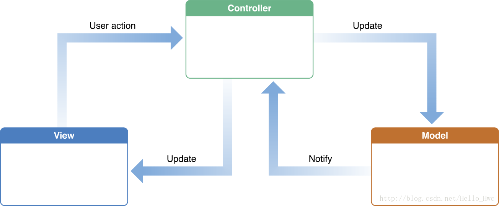
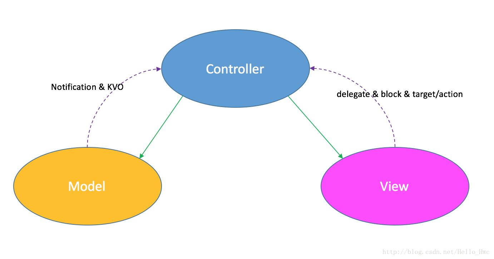
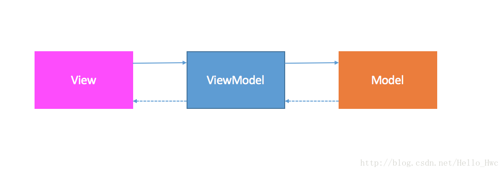
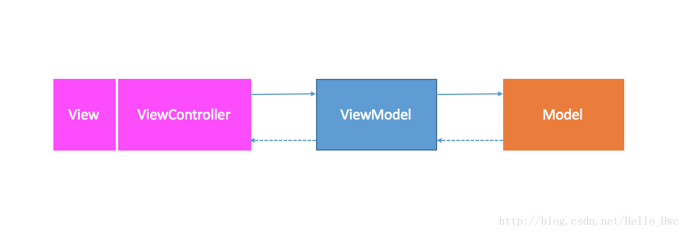
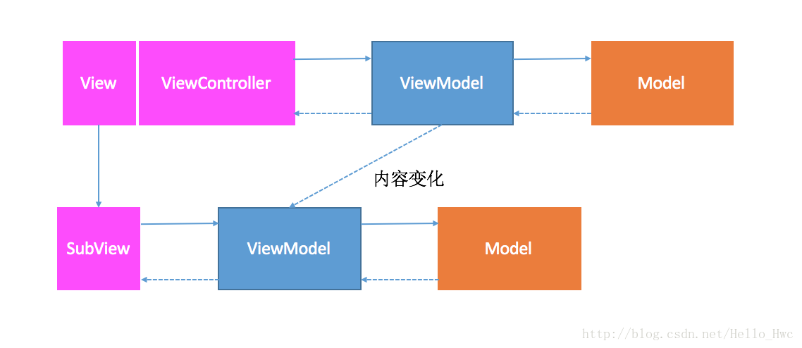
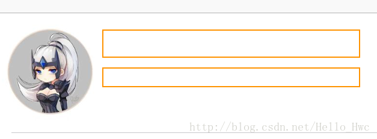
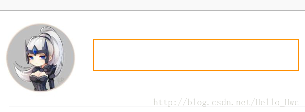
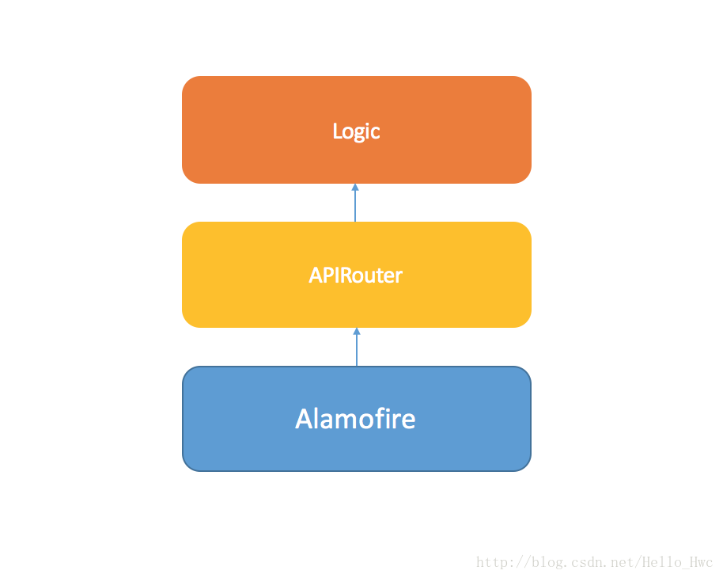
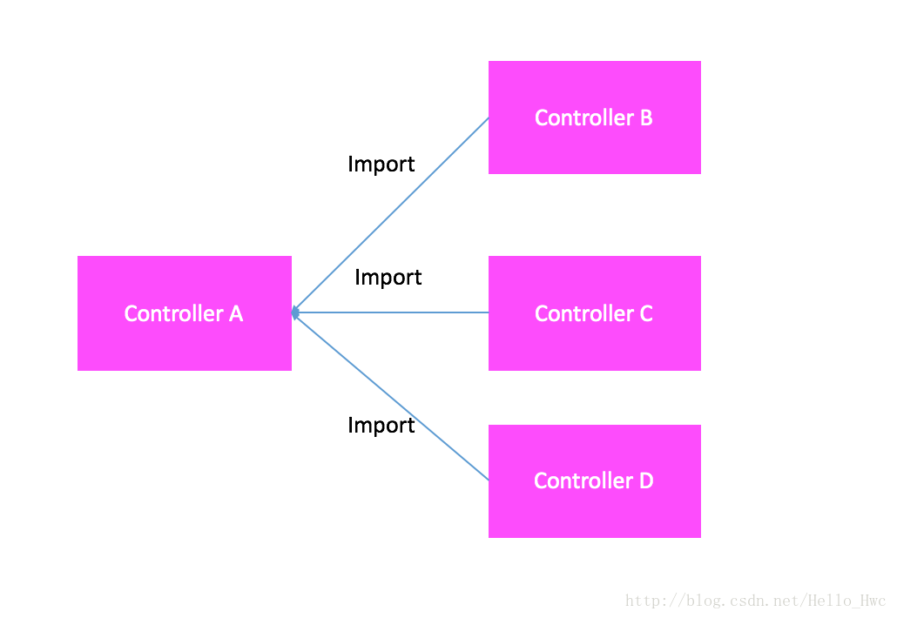
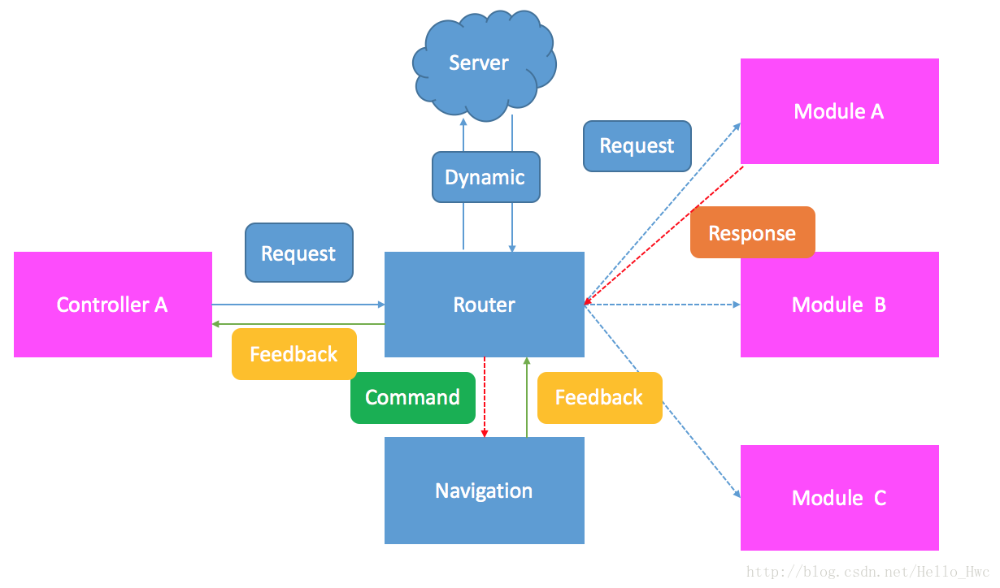

## 前言


MVC是一个做iOS开发都知道的设计模式，也是Apple官方推荐的设计模式。实际上，Cocoa Touch就是按照MVC来设计的。

这里，我们先不讲MVC是什么，我们先来谈谈软件设计的一些原则或者说理念。在开发App的时候，我们的基本目标有以下几点：

- **可靠性** - App的功能能够正常使用
- **健壮性** - 在用户非正常使用的时候，app也能够正常反应，不要崩溃
- **效率性** - 启动时间，耗电，流量，界面反应速度在用户容忍的范围以内

上文三点是表象层的东西，是大多数开发者或者团队会着重注意的。除了这三点，还有一些目标是工程方面的也是开发者要注意的：

- **可修改性/可扩展性** - 软件需要迭代，功能不断完善
- **容易理解** - 代码能够容易理解
- **可测试性** - 代码能够方便的编写单元测试和集成测试
- **可复用性** - 不用一次又一次造轮子

于是，软件设计领域有了几大通用设计原则来帮助我们实现这些目标：

> 单一功能原则，最少知识原则，聚合复用原则，接口隔离原则，依赖倒置原则，里氏代换原则，开-闭原则

这里的每一个原则都可以写单独的一篇文章，本文篇幅有限，不多讲解。

基于这些设计目标和理念，软件设计领域又有了**设计模式**。MVC/MVVM都是就是设计模式的一种。


---
## MVC

### 历史
二十世纪世纪八十年代，[Trygve Reenskaug](https://en.wikipedia.org/wiki/Trygve_Reenskaug)在访问[Palo Alto](https://en.wikipedia.org/wiki/PARC_(company))(施乐帕克)实验室的时候，第一次提出了MVC，并且在[Smalltalk](https://en.wikipedia.org/wiki/Smalltalk)-76进行了实践，大名鼎鼎的施乐帕克实验室有很多划时代的研发成果：个人电脑，以太网，图形用户界面等。


在接下来的一段时间内，MVC不断的进化，基于MVC又提出了诸如MVP（[model–view–presenter](https://en.wikipedia.org/wiki/Model%E2%80%93view%E2%80%93presenter)），MVVM（[model–view–viewmodel](https://en.wikipedia.org/wiki/Model%E2%80%93view%E2%80%93viewmodel)）等设计模式。

----

### 组件
MVC设计模式按照职责将应用中的对象分成了三部分：Model，View，Controller。MVC除了将应用划分成了三个模块，还定义了模块之间的**通信方式**。



#### **Model**

Model定义了你的应用是什么(**What**)。Model通常是纯粹的NSObject子类（Swift中可以是Struct/Class），仅仅用来表示数据模型。

#### **Controller**

Controller定义了Model如何显示给用户(**How**)，并且View接收到的事件反馈到最后Model的变化。Controller层作为MVC的枢纽，往往要承担许多Model与View同步的工作。

#### **View**

View是Model的最终呈现，也就是用户看到的界面。

----

### **优点**

MVC设计模式是是一个成熟的设计模式，也是Apple推荐的的设计模式，即使是刚入行的iOS开发者也多少了解这个设计模式，所以对于新人来说上手迅速，并且有大量的文档和范例来供我们参考。

在MVC模式中，**View层是比较容易复用的**，对应Cocoa中的`UIView`及其子类。所以，github的iOS开源项目中，View层也是最多的。

Model层涉及到了应用是什么，**这一层非常独立**，但是往往和具体业务相关，所以很难跨App服用。

既然只有Model-View-Controller三个组件，那么剩余的逻辑层代码就比较清楚了，全部堆积到Controller。


----
### **通信**

> MVC不仅定义了三类组件，还定义了组件之间通信的方式。

MVC三个组件之间的通信方式如图



Controller作为枢纽，它指向view和Model的线都是绿色的，意味着Controller可以**直接访问**（以引用的方式持有）Model和View。


View指向Controller的是虚线，虚线表示View到Controller的通信是**盲通信**的，原因也很简单：View是纯粹的展示部分，它不应该知道Controller是什么，它的工作就是拿到数据渲染出来。

那么，何为**盲通信**呢？简单来说当消息的发送者不知道接受者详细信息的时候，这样的通信就是盲通信。Cocoa Touch为我们提供了诸如**delegate(dataSource)**，**block**，**target/action**这些盲通信方式。

Model指向Controller的同样也是虚线。原因也差不多，Model层代表的数据层应该与Controller无关。当Model改变的时候，通过KVO或者Notification的方式来通知Controller应当更新View。


这里有一点要提一下：**UIViewController往往用来作为MVC中的Controller，MVC中的Controller也可以由其他类来实现**。

----

### **问题**

通过上文的讲解，我们可以看到在纯粹的MVC设计模式中，Controller不得不承担大量的工作：

- 网络API请求
- 数据读写
- 日志统计
- 数据的处理（JSON<=>Object，数据计算）
- 对View进行布局，动画
- 处理Controller之间的跳转（push/modal/custom）
- 处理View层传来的事件，返回到Model层
- 监听Model层，反馈给View层

于是，大量的代码堆积在Controller层中，MVC最后成了Massive View Controller(重量级视图控制器)。

为了解决这种问题，我们通常会为Controller瘦身，也就是把Controller中代码抽出到不同的类中，引入MVVM就是为Controller瘦身的一个很好的实践。

----
## MVVM

在MVVM设计模式中，组件变成了Model-View-ViewModel。

MVVM有两个规则

- **View持有ViewModel的引用，反之没有**
- **ViewModel持有Model的引用，反之没有**



图中，我们仍然以**实线表示持有，虚线表示盲通**信。

在iOS开发中，`UIViewController`是一个相当重要的角色，它是一个个界面的**容器**，负责接收各类系统的事件，能够实现界面专场的各种效果，配合`NavigationController`等能够轻易的实现各类界面切换。

在实践中，我们发现`UIViewController`和`View`往往是绑定在一起的，比如`UIViewController`的一个属性就是`view`。在MVVM中，Controller可以当作一个重量级的View（负责界面切换和处理各类系统事件）。



不难看出，MVVM是对MVC的扩展，所以MVVM可以完美的兼容MVC。

对于一个界面来说，有时候View和ViewModel往往不止一个，MVVM也可以组合使用：




----
## Controller解耦

MVC是一个优秀的设计模式，本文讲解MVVM也不是说想要用MVVM来替代MVC。对于软件设计来说，设计模式仅仅是一些参考工具，并没有固定的范式，使用起来是很灵活的。MVVM的很多理念对于Controller解耦是很有帮助的。

### SubView

把相关的View放到一个Container View里，这样把对应View的创建，Layout等代码抽离出来，并且由Container统一处理用户交互，回调给外部。（这个比较好理解，就不举例子了）

----
### Layout

在iOS中，视图的Layout一直是代码很乱的一块。通常Layout有两种

- 手动的计算Frame - 简单粗暴，但是修改起来困难，易读性也不好
- 通过约束AutoLayout - 有学习成本，并且不好debug，但是修改起来方便，也容易阅读。

通常使用Autolayout，我们都会用一些DSL的三方库：Masonry(OC),SnapKit(Swift)。

以一个常见的Layout为例，以下两图是在一个App中很常见的两种TableViewCell Layout：

两行列表



左边图，右边detail



这里，我们只关心左侧的图，在常规的Layout情况下Cell中的代码：

```
//Swift代码，使用SnapKit
leftImageView = UIImageView(frame: CGRect.zero)
contentView.addSubview(rightLabel)
//Layout
leftImageView.snp.makeConstraints { (maker) in
    maker.leading.equalTo(contentView).offset(8.0)
    maker.width.height.equalTo(80)
    maker.centerY.equalTo(contentView)
}
```

于是，两种cell类中，我们把上述代码进行Copy Paste。

那么有没有一种更好的方式进行Layout复用呢？

其实有两种方式进行Layout复用：

- 继承（由基类提供Layout） 个人不喜欢继承，继承带来的额外的耦合会造成后期维护牵一发而动全身。
- Layout独立抽离出来，以协议的方式进行依赖。

这里以第二种方式为例：

首先定义一个协议：来定义可以用来布局

```
protocol Layoutable {
    func layoutMaker() ->(ConstraintMaker) -> Void
}
```

然后，对UIView进行扩展，增加布局方法，同时对于client端隐藏snapKit

```
extension UIView{
    func makeLayout(_ layouter:Layoutable) {
        snp.makeConstraints(layouter.layoutMaker())
    }
}

```
然后，我们定义一个结构体，来表示左侧的正方形布局

```
struct LeftSquareLayout : Layoutable {
    func layoutMaker() -> (ConstraintMaker) -> Void {
        return { maker in
            maker.leading.equalTo(self.superView).offset(8.0)
            maker.width.height.equalTo(self.length)
            maker.centerY.equalTo(self.superView)
        }
    }
    var length :CGFloat
    var superView : UIView
    init(length: CGFloat, superView:UIView) {
        self.length = length
        self.superView = superView
    }
}
```

于是，左侧图片的Layout代码变成了如下：

```
leftImageView.makeLayout(LeftSquareLayout(length: 80, superView: contentView))

```

-----
### 工厂
工厂是一个很好的设计模式，你是否不断的在代码里重写类似的代码：

```
let titleLabel = UILabel(frame: CGRect.zero)
titleLabel.font = UIFont.systemFont(ofSize: 14)
titleLabel.textColor = UIColor(colorLiteralRed: 0.3, green: 0.3, blue: 0.3, alpha: 1.0)
titleLabel.text = "Inital Text"
contentView.addSubview(titleLabel)
```

一般App的字体的大小和颜色都是几种之一，这时候我们用工厂的方式`生产`实例，能更好的实现代码复用：

定义Label类型:

```
enum LabelStyle {
    case title
    case subTitle
}
```

定义工厂方法：

```
extension UILabel{
    static func with(style initalStyle:LabelStyle) -> UILabel{
        switch initalStyle {
        case .title:
            let titleLabel = UILabel(frame: CGRect.zero)
            titleLabel.font = UIFont.systemFont(ofSize: 14)
            titleLabel.textColor = UIColor(colorLiteralRed: 0.3, green: 0.3, blue: 0.3, alpha: 1.0)
            return titleLabel
        default:
            return UILabel()
        }
    }
}

```

我们还可以提供两个方法，能够让我们链式的添加到superView和config

```
extension UILabel{
    @discardableResult
    func added(into superView:UIView) -> UILabel{
        superView.addSubview(self)
        return self
    }
    @discardableResult
    func then(config:(UILabel) -> Void) ->UILabel{
        config(self)
        return self
    }
}
```

于是，代码变成了这样子

```
UILabel.with(style: .title).added(into: contentView).then { $0.text = "Inital Text"}

```

在结合上文的Layout，我们甚至可以用一个链式的调用完成初始化和Layout

```
UILabel.with(style: .title)
    .added(into: contentView)
    .then { $0.text = "Inital Text"}
    .makeLayout(yourLayout)
```

> Note: 仅仅举例，实际应用中，你可以需要更好的去设计语法

链式调用的延伸阅读：[PromiseKit](https://github.com/mxcl/PromiseKit)

----
### ViewModel
在MVC的Controller解耦中，引入ViewModel是一种很常见的方式。把Controller中对应与View相关的逻辑层出来，这样Controller需要做的就是

- 从DB/网络中获取数据，转换成ViewModel
- 把ViewModel装载给View
- View的属性与ViewModel值绑定在一起（单向）

在Swift中，实现单向绑定是很容易的：

定义一个可绑定类型：

```
class Obserable<T>{
    typealias ObserableType = (T) -> Void
    var value:T{
        didSet{
            observer?(value)
        }
    }
    var observer:(ObserableType)?
    func bind(to observer:@escaping ObserableType){
        self.observer = observer
        observer(value)
    }
    init(value:T){
        self.value = value
    }
}
```

然后，我们扩展UILabel，让其`text`能够绑定到某一个Obserable值上

```
extension UILabel{
    var ob_text:Obserable<String>.ObserableType {
        return { value in
            self.text = value
        }
    }
}

```

接着，建立一个ViewModel

```
class MyViewModel{
    var labelText:Obserable<String>
    init(text: String) {
        self.labelText = Obserable(value: text)
    }
}
```
然后，就可以这么用单向绑定了

```
let label = UILabel()
let viewModel = MyViewModel(text: "Inital Text")
viewModel.labelText.bind(to: label.ob_text)

//修改viewModel会自动同步到Label

viewMoel.labelText.value = "New Text"
```


当然，实际使用MVVM的时候，手动实现绑定和View事件回调也可以。

延伸阅读：

- [RxSwift](https://github.com/ReactiveX/RxSwift)
- [ReactiveCocoa](https://github.com/ReactiveCocoa/ReactiveCocoa)
- [猿题库 iOS 客户端架构设计](http://gracelancy.com/blog/2016/01/06/ape-ios-arch-design/)

----
### 网络
网络请求的代码往往也是放到`UIController`的生命周期里（比如viewDidLoad）或者某些用户的UI操纵。假设你基于以下三个开源库框架进行网络请求和JSON解析

- [Alamofire](https://github.com/Alamofire/Alamofire)
- [ObjectMapper](https://github.com/Hearst-DD/ObjectMapper)
- [AlamofireObjectMapper](https://github.com/tristanhimmelman/AlamofireObjectMapper)

我们来模拟一个登录的网络请求，首先定义一个数据结构表示登录的结果

```
struct LoginResult: Mappable{
    var token: String
    var name: String
    init?(map: Map) {/* */}
    mutating func mapping(map: Map) {
        name <- map["name"]
        token <- map["token"]
    }
}
```
然后，在button点击事件中，进行login

```
func handleLogin(sender:UIButton){
    let userName = "userName"
    let passWord = "password"
    let url = "https://api.example.com/user/login"
    let params = ["username":userName,"password":passWord]
    Alamofire.request(url, method: .post, parameters: params, encoding: JSONEncoding()).responseObject { (response:DataResponse<LoginResult>) in
        guard let result = response.value else{
            print(response.error ?? "Unknown Error")
            return
        }
        print(result.name)
        print(result.token)
    }
}
```

这是一个很常规的做法：

- 在Controller中获取网络请求需要的数据
- 把请求数据给网络模块，网络模块负责请求网络数据，并且解析成对象，然后异步回调给Controller
- 在Controller中处理网络模块回调的结果

这么做有两个问题

1. host，paramter encoding等相关信息对Controller应当透明
2. Controller不应该知道网络层是基于Alamofire的

于是，这里我们把网络层抽离：



首先，定义一个协议，表示能够解析成一个网络请求的类型：

```
protocol NetworkAPIConvertable {
    var host:String {get}
    var path:String {get}
    var method:RequestMethod{get}
    var requestEncoding:RequestEncoding{get}
    var requestParams:[String:Any]{get}
}
```

其中，RequestMethod和RequestEncoding是对Alamofire的简单封装

```
enum RequestEncoding{
    case json, propertyList, url
}
enum RequestMethod{
    case get, post, delete, put
}
private extension RequestMethod{
    func toAlamofireMethod()->HTTPMethod{
        switch self {
        case .get:
            return .get
        case .post:
            return .post
        case .delete:
            return .delete
        case .put:
            return .put
        }
    }
}
private extension RequestEncoding{
    func toAlamofireEncoding()->ParameterEncoding{
        switch self {
        case .json:
            return JSONEncoding()
        case .propertyList:
            return PropertyListEncoding()
        case .url:
            return URLEncoding()
        }
    }
}
```
接着，定义请求的接口

```
struct APIRouter{
   static func request<ResponseType:Mappable>(api:NetworkAPIConvertable,completionHandler:@escaping (ResponseResult<ResponseType>) -> Void){
        let requestPath = api.host + "/" + api.path
        _ = Alamofire.request(requestPath,
                          method: api.method.toAlamofireMethod(),
                          parameters: api.requestParams,
                          encoding: api.requestEncoding.toAlamofireEncoding())
            .responseObject { (response:DataResponse<ResponseType>) in
                            if let value = response.value{
                                completionHandler(ResponseResult.succeed(value: value))
                            }else{
                                completionHandler(ResponseResult.error(error: response.error ?? NSError(domain: "com.error.unknown", code:-1, userInfo: nil)))
                            }
    }
    }
}

enum ResponseResult<Value>{
    case succeed(value:Value)
    case error(error:Error)
}
```

于是，我们的网络层封装基本完成了。然后，我们来定义我们的login API

```
enum NetworkService{
    case login(userName:String,password:String)
    //Add what you need
}
extension NetworkService: NetworkAPIConvertable{
    var host: String {
        return "https://api.example.com"
    }
    var requestEncoding: RequestEncoding {
        switch self {
        case .login(_,_):
            return .json
        }
    }

    var requestParams: [String : Any] {
        switch self {
        case .login(let userName, let password):
            return ["username":userName,"password":password]
        }
    }

    var path: String {
        switch self {
        case .login(_,_):
            return "user/login"
        }
    }

    var method: RequestMethod {
        switch self {
        case .login(_,_):
            return .post
        }
    }
}

```
接着，网络请求变成了

```
let userName = "userName"
let passWord = "password"
let login = NetworkService.login(userName: userName, password: passWord)
APIRouter.request(api: login) { (response:ResponseResult<LoginResult>) in
    switch response{
    case .succeed(let value):
            print(value.token)
    case .error(let error):
            print(error)
    }
}
        
```

延伸阅读：[Moya](https://github.com/Moya/Moya)

----
### 日志
大部分App都会做日志分析，于是你的代码中不得不进行埋点：

```
func tableView(_ tableView: UITableView, didSelectRowAt indexPath: IndexPath) {
    tableView.deselectRow(at: indexPath, animated: true)
    //发送日志
    Logger.collectWithContent(....)
}
```
当你看这样的代码的时候，日志代码也在看着你：


是不是很痛苦呢？

在抽离日志之前，我们想想什么样的日志模块是我们想要的？

- 尽量不要侵入业务代码
- 支持由后台动态下发日志统计内容

AOP是一种常见的日志统计解决：

> 通过AOP的方式hook所有需要统计的UIView事件回调，然后通过KVC的方式来获取日志需要的数据，是常见的无埋点日志解决方案。

比如很常见的友盟统计需要在`viewWillAppear/viewWillDisappear`中加入代码：

```
- (void)viewWillAppear:(BOOL)animated
{
    [super viewWillAppear:animated];
    [MobClick beginLogPageView:@"Page1"];
}

- (void)viewWillDisappear:(BOOL)animated
{
    [super viewWillDisappear:animated];
    [MobClick endLogPageView:@"Page1"];
}

```

使用AOP的方式，代码变成如下：

```
void swizzle(Class cls,SEL originalSEL,SEL swizzledSEL){
    Method originalMethod = class_getInstanceMethod(cls, originalSEL);
    Method swizzledMethod = class_getInstanceMethod(cls, swizzledSEL);
    method_exchangeImplementations(originalMethod, swizzledMethod);
}

@implementation UIViewController (QTSwizzle)
+ (void)load{
    static dispatch_once_t onceToken;
    dispatch_once(&onceToken, ^{
        swizzle(self.class, @selector(viewWillAppear:), @selector(sw_viewWillAppear:)));
        swizzle(self.class, @selector(viewWillDisappear:), @selector(sw_viewWillDisappear:)));
    });
}
- (void)qt_viewWillAppear:(BOOL)animated{
    [self qt_viewWillAppear:animated];
    // Log代码
}
- (void)qt_viewWillDisappear:(BOOL)animated{
    [self qt_viewWillDisappear:animated];
    // Log代码
}
@end                        
```

可以看到，我们通过AOP，在原有的viewWillAppear后动态插入的日志代码，其他点击事件也可以类似处理。另外，Objective C有一个很方便的用来做AOP的开源框架：[Aspects](https://github.com/steipete/Aspects)

> 细心的同学可能看到了，这块的代码我是以Objective C作为例子的，因为OC的Runtime特性，可以很方便的做AOP。对于NSObject及其子类，Swift也支持AOP，但是考虑到Swift的语言特性，关于Swift的无侵入日志，也许还可以方案：
> 
> - 一套支持日志统计的框架。这个看起来工作量很大，但其实需要做大量日志统计的公司往往都有自己的一套XXUIKit，在基类里加入日志统计的基础逻辑也未尝不可
> - 编译期AOP。这个仅局限于理论，就是

延伸阅读：

- [iOS无埋点数据SDK实践之路](http://www.jianshu.com/p/69ce01e15042)
- [消息转发机制与Aspects源码解析](http://blog.csdn.net/hello_hwc/article/details/72632075)


-----
### 数据存储

iOS常用的本地数据存储方案有几种：

- UserDefaults 用户配置信息
- File/Plist 少量的无须结构化查询的数据
- KeyChain 密码/证书等用户认证数据
- 数据库 需要结构化查询的信息
- iCloud 

而数据库往往是App的数据核心。在iOS中：可以选择数据库技术有

- CoreData - 对应开源库[MagicalRecord](https://github.com/magicalpanda/MagicalRecord)
- Sqlite直接封装 - 对应开源库 [FMDB](https://github.com/ccgus/fmdb)
- Realm

CoreData的坑比较多，想要用好需要比较高的学习成本。Relam和Sqlite都是建立结构化查询数据库的比较好的选择。

使用FMDB，你的代码类似这样子的。

```
let queue = FMDatabaseQueue(url: fileURL)

queue.inTransaction { db, rollback in
    do {
        try db.executeUpdate("INSERT INTO foo (bar) VALUES (?)", values: [1])
        try db.executeUpdate("INSERT INTO foo (bar) VALUES (?)", values: [2])
    } catch {
        rollback.pointee = true
    }
}
```

可以看到，FMDB是把sqlite从C的API封装成了Objective/Swfit等上层API。但是还是缺少了两项比较核心的

- ORM（Object Relational Mapping）从数据库的表映射到Structs/Class
- 查询语言。在代码里进行SQL字符串的编写是繁琐的也容易出问题


于是，通常你需要在FMDB（Sqlite）上在进行一层封装，这一层封装提供ORM和查询语言。从而更有好的提供上层接口。类似的框架有：

- [WCDB](https://github.com/Tencent/wcdb) 微信最近开源的数据库
- [GYDataCenter](https://github.com/Zepo/GYDataCenter)

延伸阅读：

- [ 微信移动端数据库组件WCDB系列（一）-iOS基础篇](https://github.com/WeMobileDev/article/blob/master/%E5%BE%AE%E4%BF%A1%E7%A7%BB%E5%8A%A8%E7%AB%AF%E6%95%B0%E6%8D%AE%E5%BA%93%E7%BB%84%E4%BB%B6WCDB%E7%B3%BB%E5%88%97%EF%BC%88%E4%B8%80%EF%BC%89-iOS%E5%9F%BA%E7%A1%80%E7%AF%87.md)
- [微信移动端数据库组件WCDB系列（二） — 数据库修复三板斧](https://github.com/WeMobileDev/article/blob/master/%E5%BE%AE%E4%BF%A1%E7%A7%BB%E5%8A%A8%E7%AB%AF%E6%95%B0%E6%8D%AE%E5%BA%93%E7%BB%84%E4%BB%B6WCDB%E7%B3%BB%E5%88%97%EF%BC%88%E4%BA%8C%EF%BC%89%20%E2%80%94%20%E6%95%B0%E6%8D%AE%E5%BA%93%E4%BF%AE%E5%A4%8D%E4%B8%89%E6%9D%BF%E6%96%A7.md)
- [微信iOS SQLite源码优化实践.md](https://github.com/WeMobileDev/article/blob/master/%E5%BE%AE%E4%BF%A1iOS%20SQLite%E6%BA%90%E7%A0%81%E4%BC%98%E5%8C%96%E5%AE%9E%E8%B7%B5.md)


-----
### 路由

在iOS开发中，`UIViewController`之间的跳转是无法避免的一个问题。比如，一个ViewControllerA想要跳转到ViewControllerB

```
#import "ViewControllerB.h"

//...
ViewControllerB * vcb = [[ViewControllerB alloc] init];
[self.navigationController pushViewController:vcb animated:YES];
```

当在一个类中`import`另一个类的时候，这两个类就形成了强耦合。



另外，很多App都有一个用户中心的界面，这个界面有一些特点就是会跳转到很多界面。于是，日积月累，这个类中，你会发现代码编程了这个样子：

```
if indexPath.secion == 0{
	if indexPath.row == 0{
	
	}else if....
}else if indexPath.section == 1{

}
....
```
大量的if/else造成代码难以阅读，并且难以修改。

一个典型的解Controller与Controller解耦方案就是加一个中间层：路由，并且建立Module（模块）来管理一组Controller。



类似这种的路由架构，在App启动的时候，通过注入的方式把各个Module

一个典型的跳转请求如下：

- ControllerA发起跳转请求Request
- Router解析Request，轮询问各个Module，看看各个Module是否支持对应的Requst。
	- 如果有则把requst转发给对应的Module；
	- 如果没有，根据Request的内容可选请求远端服务器，服务器可能返回H5地址
- Router根据远端服务器，或者Module的Response，合成跳转的command，发送给导航模块
- 导航模块根据command进行跳转,并且返回feedBack给Router
- Router返回feedback给ControllerA


----
## 总结

iOS App是一个麻雀虽小，五脏俱全的软件。良好的架构和设计能够让代码容易理解和维护，并且不易出错。关于App的设计一个仁者见仁，智者见智的问题，并没有什么固定的范式。本文也只是提出了笔者的一些经验，仅供参考，

另外，本文是一篇公司内部分享文章，事实上在公司内部分享的时候，并没有这么完善，后面我有陆陆续续利用空闲时间写了几天，如有读者发现问题，欢迎评论或者[GitHub issue](https://github.com/LeoMobileDeveloper/Blogs)，这篇博文会放在我的[github](https://github.com/LeoMobileDeveloper/Blogs)上。