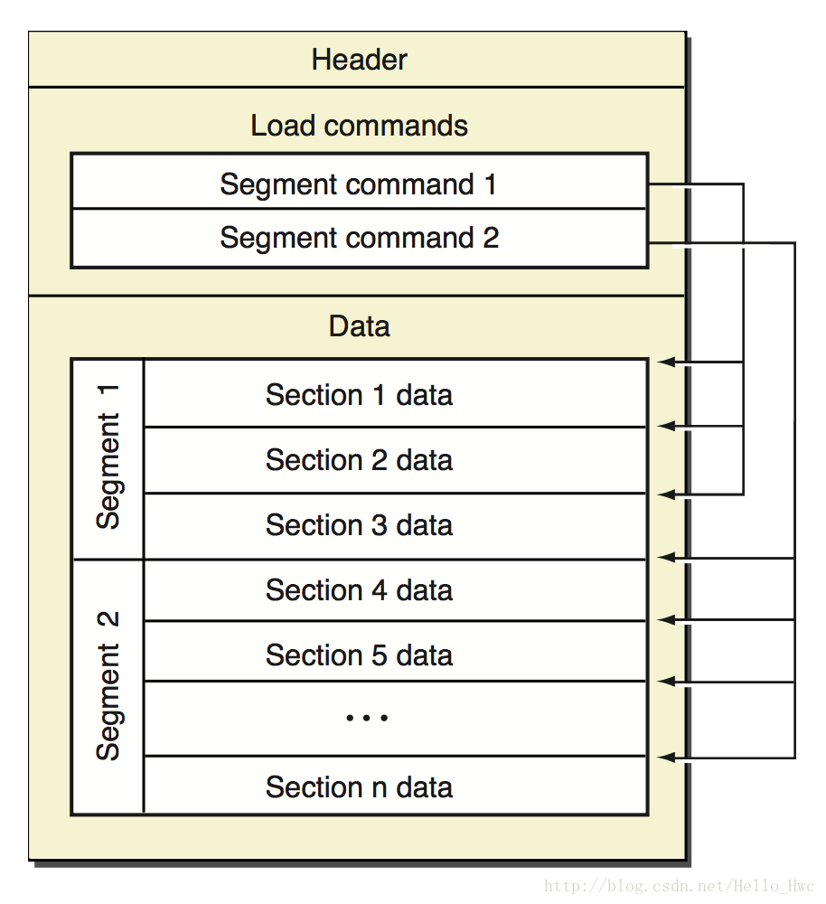
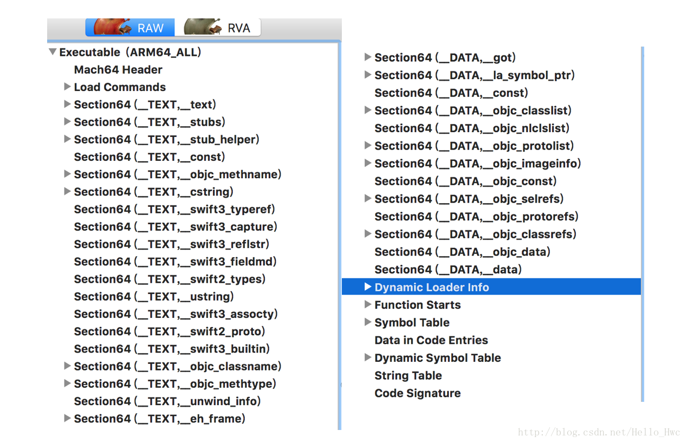
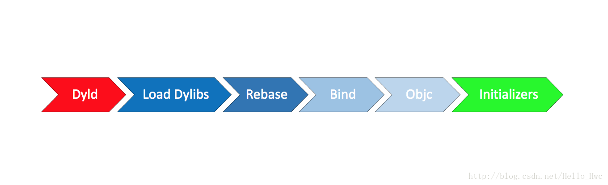
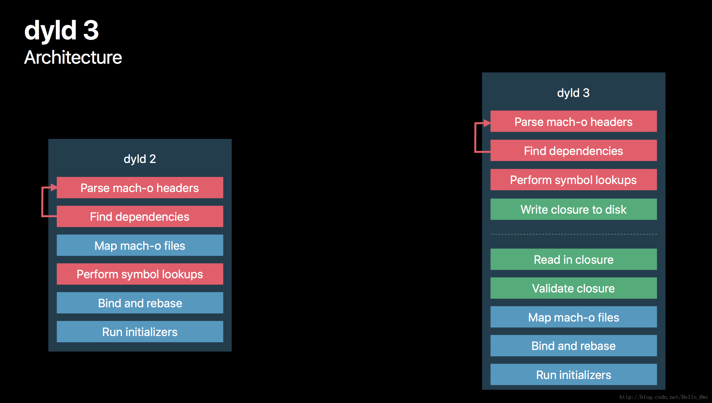
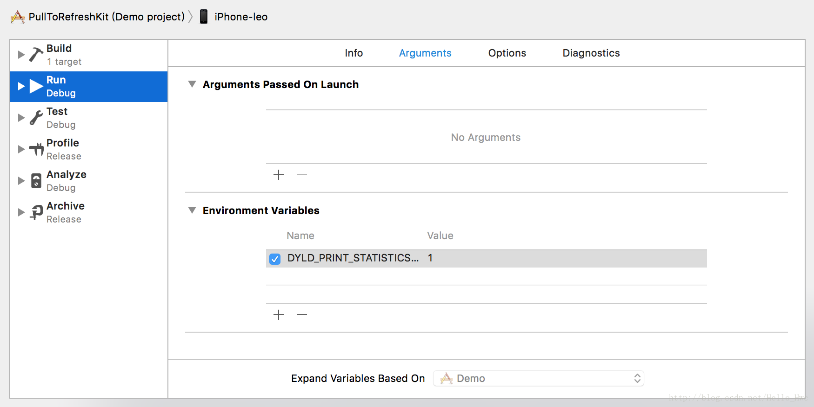
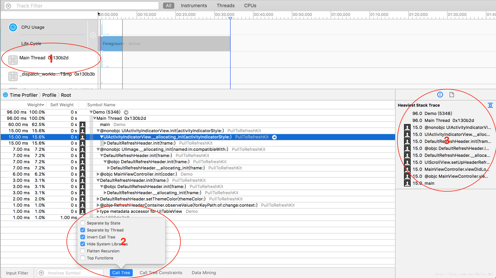
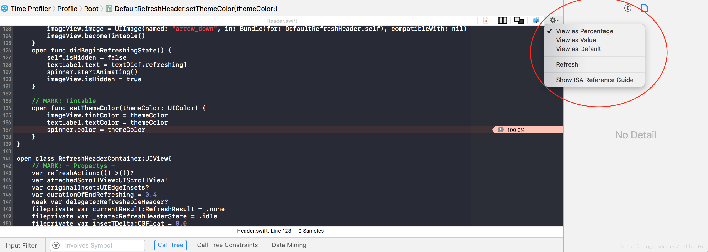

## 前言

> 启动时间是衡量应用品质的重要指标。

本文首先会从原理上出发，讲解iOS系统是如何启动App的，然后从main函数之前和main函数之后两个角度去分析如何优化启动时间。

## 准备知识

### Mach-O

哪些名词指的是Mach-o

- Executable 可执行文件
- Dylib 动态库
- Bundle 无法被连接的动态库，只能通过dlopen()加载
- Image 指的是Executable，Dylib或者Bundle的一种，文中会多次使用Image这个名词。
- Framework 动态库和对应的头文件和资源文件的集合，note：framework也可以包含静态库，但静态库不是Macho-O

Apple出品的操作系统的可执行文件格式几乎都是mach-o，iOS当然也不例外。
mach-o可以大致的分为三部分：



- Header 头部，包含可以执行的CPU架构，比如x86,arm64
- Load commands 加载命令，包含文件的组织架构和在虚拟内存中的布局方式
- Data，数据，包含load commands中需要的各个段(segment)的数据，每一个Segment都得大小是Page的整数倍。


我们用**MachOView**打开Demo工程的可以执行文件，来验证下mach-o的文件布局：



图中分析的mach-o文件来源于[PullToRefreshKit](https://github.com/LeoMobileDeveloper/PullToRefreshKit)，这是一个纯Swift的编写的工程。

那么Data部分又包含哪些segment呢？绝大多数mach-o包括以下三个段（支持用户自定义Segment，但是很少使用）

- __TEXT 代码段，只读，包括函数，和只读的字符串，上图中类似`__TEXT,__text`的都是代码段
- __DATA 数据段，读写，包括可读写的全局变量等，上图类似中的`__DATA,__data`都是数据段
- __LINKEDIT `__LINKEDIT`包含了方法和变量的元数据（位置，偏移量），以及代码签名等信息。


关于mach-o更多细节，可以看看文档：《[Mac OS X ABI Mach-O File Format Reference](https://github.com/LeoMobileDeveloper/React-Native-Files/blob/master/Mac%20OS%20X%20ABI%20Mach-O%20File%20Format%20Reference.pdf)》。

### dyld

> dyld的全称是[dynamic loader](https://developer.apple.com/library/content/releasenotes/DeveloperTools/RN-dyld/)，它的作用是加载一个进程所需要的image，dyld是[开源的](https://opensource.apple.com/source/dyld/)。


### Virtual Memory

> 虚拟内存是在物理内存上建立的一个逻辑地址空间，它向上（应用）提供了一个连续的逻辑地址空间，向下隐藏了物理内存的细节。  
> 虚拟内存使得逻辑地址可以没有实际的物理地址，也可以让多个逻辑地址对应到一个物理地址。  
> 虚拟内存被划分为一个个大小相同的Page（64位系统上是16KB），提高管理和读写的效率。 Page又分为只读和读写的Page。

虚拟内存是建立在物理内存和进程之间的**中间层**。在iOS上，当内存不足的时候，会尝试释放那些只读的Page，因为只读的Page在下次被访问的时候，可以再从磁盘读取。如果没有可用内存，会通知在后台的App（也就是在这个时候收到了memory warning），如果在这之后仍然没有可用内存，则会杀死在后台的App。


### Page fault

> 在应用执行的时候，它被分配的逻辑地址空间都是可以访问的，当应用访问一个逻辑Page，而在对应的物理内存中并不存在的时候，这时候就发生了一次Page fault。当Page fault发生的时候，会中断当前的程序，在物理内存中寻找一个可用的Page，然后从磁盘中读取数据到物理内存，接着继续执行当前程序。

### Dirty Page & Clean Page

- 如果一个Page可以从磁盘上重新生成，那么这个Page称为Clean Page
- 如果一个Page包含了进程相关信息，那么这个Page称为Dirty Page

像代码段这种只读的Page就是Clean Page。而像数据段(`_DATA`)这种读写的Page，当写数据发生的时候，会触发COW(Copy on write)，也就是写时复制，Page会被标记成Dirty，同时会被复制。


想要了解更多细节，可以阅读文档：[Memory Usage Performance Guidelines](https://developer.apple.com/library/content/documentation/Performance/Conceptual/ManagingMemory/ManagingMemory.html#//apple_ref/doc/uid/10000160-SW1)
 
 

## 启动过程

使用dyld2启动应用的过程如图：



大致的过程如下：

> 加载dyld到App进程  
> 加载动态库（包括所依赖的所有动态库）  
> Rebase  
> Bind  
> 初始化Objective C Runtime  
> 其它的初始化代码


### 加载动态库

> dyld会首先读取mach-o文件的Header和load commands。  
> 接着就知道了这个可执行文件依赖的动态库。例如加载动态库A到内存，接着检查A所依赖的动态库，就这样的递归加载，直到所有的动态库加载完毕。通常一个App所依赖的动态库在100-400个左右，其中大多数都是系统的动态库，它们会被缓存到dyld shared cache，这样读取的效率会很高。

查看mach-o文件所依赖的动态库，可以通过MachOView的图形化界面(展开Load Command就能看到)，也可以通过命令行otool。

```
192:Desktop Leo$ otool -L demo 
demo:
	@rpath/PullToRefreshKit.framework/PullToRefreshKit (compatibility version 1.0.0, current version 1.0.0)
	/System/Library/Frameworks/Foundation.framework/Foundation (compatibility version 300.0.0, current version 1444.12.0)
	/usr/lib/libobjc.A.dylib (compatibility version 1.0.0, current version 228.0.0)
	@rpath/libswiftCore.dylib (compatibility version 1.0.0, current version 900.0.65)
	@rpath/libswiftCoreAudio.dylib (compatibility version 1.0.0, current version 900.0.65)
	//...
```

### Rebase && Bind

这里先来讲讲为什么要Rebase？

有两种主要的技术来保证应用的安全：ASLR和Code Sign。

ASLR的全称是Address space layout randomization，翻译过来就是“地址空间布局随机化”。App被启动的时候，程序会被影射到逻辑的地址空间，这个逻辑的地址空间有一个起始地址，而ASLR技术使得这个起始地址是随机的。如果是固定的，那么黑客很容易就可以由起始地址+偏移量找到函数的地址。

Code Sign相信大多数开发者都知晓，这里要提一点的是，在进行Code sign的时候，加密哈希不是针对于整个文件，而是针对于每一个Page的。这就保证了在dyld进行加载的时候，可以对每一个page进行独立的验证。

mach-o中有很多符号，有指向当前mach-o的，也有指向其他dylib的，比如`printf`。那么，在运行时，代码如何准确的找到`printf`的地址呢？

mach-o中采用了PIC技术，全称是Position Independ code。当你的程序要调用`printf`的时候，会先在`__DATA`段中建立一个指针指向printf，在通过这个指针实现间接调用。dyld这时候需要做一些fix-up工作，即帮助应用程序找到这些符号的实际地址。主要包括两部分

- Rebase 修正内部(指向当前mach-o文件)的指针指向
- Bind 修正外部指针指向


之所以需要Rebase，是因为刚刚提到的ASLR使得地址随机化，导致起始地址不固定，另外由于Code Sign，导致不能直接修改Image。Rebase的时候只需要增加对应的偏移量即可。待Rebase的数据都存放在`__LINKEDIT`中。  
可以通过MachOView查看：Dynamic Loader Info -> Rebase Info

也可以通过命令行：

```
192:Desktop Leo$ xcrun dyldinfo -bind demo 
bind information:
segment section          address        type    addend dylib            symbol
__DATA  __got            0x10003C038    pointer      0 PullToRefreshKit __T016PullToRefreshKit07DefaultC4LeftC9textLabelSo7UILabelCvWvd
__DATA  __got            0x10003C040    pointer      0 PullToRefreshKit __T016PullToRefreshKit07DefaultC5RightC9textLabelSo7UILabelCvWvd
__DATA  __got            0x10003C048    pointer      0 PullToRefreshKit __T016PullToRefreshKit07DefaultC6FooterC9textLabelSo7UILabelCvWvd
__DATA  __got            0x10003C050    pointer      0 PullToRefreshKit __T016PullToRefreshKit07DefaultC6HeaderC7spinnerSo23UIActivityIndicatorViewCvWvd
//...
```

Rebase解决了内部的符号引用问题，而外部的符号引用则是由Bind解决。在解决Bind的时候，是根据字符串匹配的方式查找符号表，所以这个过程相对于Rebase来说是略慢的。

同样，也可以通过xcrun dyldinfo来查看Bind的信息，比如我们查看bind信息中，包含UITableView的部分：

```
192:Desktop Leo$ xcrun dyldinfo -bind demo | grep UITableView
__DATA  __objc_classrefs 0x100041940    pointer      0 UIKit            _OBJC_CLASS_$_UITableView
__DATA  __objc_classrefs 0x1000418B0    pointer      0 UIKit            _OBJC_CLASS_$_UITableViewCell
__DATA  __objc_data      0x100041AC0    pointer      0 UIKit            _OBJC_CLASS_$_UITableViewController
__DATA  __objc_data      0x100041BE8    pointer      0 UIKit            _OBJC_CLASS_$_UITableViewController
__DATA  __objc_data      0x100042348    pointer      0 UIKit            _OBJC_CLASS_$_UITableViewController
__DATA  __objc_data      0x100042718    pointer      0 UIKit            _OBJC_CLASS_$_UITableViewController
__DATA  __data           0x100042998    pointer      0 UIKit            _OBJC_METACLASS_$_UITableViewController
__DATA  __data           0x100042A28    pointer      0 UIKit            _OBJC_METACLASS_$_UITableViewController
__DATA  __data           0x100042F10    pointer      0 UIKit            _OBJC_METACLASS_$_UITableViewController
__DATA  __data           0x1000431A8    pointer      0 UIKit            _OBJC_METACLASS_$_UITableViewController
```

### Objective C

Objective C是动态语言，所以在执行main函数之前，需要把类的信息注册到一个全局的Table中。同时，Objective C支持Category，在初始化的时候，也会把Category中的方法注册到对应的类中，同时会唯一Selector，这也是为什么当你的Cagegory实现了类中同名的方法后，类中的方法会被覆盖。

另外，由于iOS开发时基于Cocoa Touch的，所以绝大多数的类起始都是系统类，所以大多数的Runtime初始化起始在Rebase和Bind中已经完成。

### Initializers

接下来就是必要的初始化部分了，主要包括几部分：

- +load方法。
- C／C++静态初始化对象和标记为`__attribute__(constructor)`的方法

这里要提一点的就是，+load方法已经被弃用了，如果你用Swift开发，你会发现根本无法去写这样一个方法，官方的建议是实用`initialize`。区别就是，load是在类装载的时候执行，而initialize是在类第一次收到message前调用。

## dyld3

上文的讲解是dyld2的加载方式。而最新的是dyld3加载方式略有不同：



dyld2是纯粹的in-process，也就是在程序进程内执行的，也就意味着只有当应用程序被启动的时候，dyld2才能开始执行任务。

dyld3则是部分out-of-process，部分in-process。图中，虚线之上的部分是out-of-process的，在App下载安装和版本更新的时候会去执行，out-of-process会做如下事情：

- 分析Mach-o Headers
- 分析依赖的动态库
- 查找需要Rebase & Bind之类的符号
- 把上述结果写入缓存

这样，在应用启动的时候，就可以直接从缓存中读取数据，加快加载速度。

## 启动时间

### 冷启动 VS 热启动

> 如果你刚刚启动过App，这时候App的启动所需要的数据仍然在缓存中，再次启动的时候称为热启动。如果设备刚刚重启，然后启动App，这时候称为冷启动。

启动时间在小于400ms是最佳的，因为从点击图标到显示Launch Screen，到Launch Screen消失这段时间是400ms。启动时间不可以大于20m，否则会被系统杀掉。

在Xcode中，可以通过设置环境变量来查看App的启动时间，`DYLD_PRINT_STATISTICS`和`DYLD_PRINT_STATISTICS_DETAILS`。



```
Total pre-main time:  43.00 milliseconds (100.0%)
         dylib loading time:  19.01 milliseconds (44.2%)
        rebase/binding time:   1.77 milliseconds (4.1%)
            ObjC setup time:   3.98 milliseconds (9.2%)
           initializer time:  18.17 milliseconds (42.2%)
           slowest intializers :
             libSystem.B.dylib :   2.56 milliseconds (5.9%)
   libBacktraceRecording.dylib :   3.00 milliseconds (6.9%)
    libMainThreadChecker.dylib :   8.26 milliseconds (19.2%)
                       ModelIO :   1.37 milliseconds (3.1%)
```

对于这个libMainThreadChecker.dylib估计很多同学会有点陌生，这是XCode 9新增的动态库，用来做主线成检查的。

## 优化启动时间

启动时间这个名词，不同的人有不同的定义。在我看来，

> 启动时间是用户点击App图标，到第一个界面展示的时间。

以main函数作为分水岭，启动时间其实包括了两部分：main函数之前和main函数到第一个界面的`viewDidAppear:`。所以，优化也是从两个方面进行的，个人建议优先优化后者，因为绝大多数App的瓶颈在自己的代码里。

### Main函数之后

我们首先来分析下，从main函数开始执行，到你的第一个界面显示，这期间一般会做哪些事情。

- 执行AppDelegate的代理方法，主要是`didFinishLaunchingWithOptions`
- 初始化Window，初始化基础的ViewController结构(一般是`UINavigationController`+`UITabViewController`)
- 获取数据(Local DB／Network)，展示给用户。

#### UIViewController

> 延迟初始化那些不必要的`UIViewController`。

比如网易新闻：


在启动的时候只需要初始化**首页**的**头条**页面即可。像“要闻”，“我的”等页面，则延迟加载，即启动的时候只是一个UIViewController作为占位符给TabController，等到用户点击了再去进行真正的数据和视图的初始化工作。

#### AppDelegate

通常我们会在AppDelegate的代理方法里进行初始化工作，主要包括了两个方法：

- `didFinishLaunchingWithOptions`
- `applicationDidBecomeActive`

优化这些初始化的核心思想就是：

> 能延迟初始化的尽量延迟初始化，不能延迟初始化的尽量放到后台初始化。

这些工作主要可以分为几类：

- 三方SDK初始化，比如Crash统计; 像分享之类的，可以等到第一次调用再出初始化。
- 初始化某些基础服务，比如WatchDog，远程参数。
- 启动相关日志，日志往往涉及到DB操作，一定要放到后台去做
- 业务方初始化，这个交由每个业务自己去控制初始化时间。

对于`didFinishLaunchingWithOptions`的代码，建议按照以下的方式进行划分：

```
@interface AppDelegate ()
//业务方需要的生命周期回调
@property (strong, nonatomic) NSArray<id<UIApplicationDelegate>> * eventQueues;
//主框架负责的生命周期回调
@property (strong, nonatomic) id<UIApplicationDelegate> basicDelegate;
@end
```
然后，你会得到一个**非常干净的AppDelegate**文件：

```
- (BOOL)application:(UIApplication *)application didFinishLaunchingWithOptions:(NSDictionary *)launchOptions {
    for (id<UIApplicationDelegate> delegate in self.eventQueues) {
        [delegate application:application didFinishLaunchingWithOptions:launchOptions];
    }
    return [self.basicDelegate application:application didFinishLaunchingWithOptions:launchOptions];
}
```

由于对这些初始化进行了分组，在开发期就可以很容易的控制每一个业务的初始化时间：

```
CFTimeInterval startTime = CACurrentMediaTime();
//执行方法
CFTimeInterval endTime = CACurrentMediaTime();
```


#### 用Time Profiler找到元凶

Time Profiler在分析时间占用上非常强大。实用的时候注意三点

- 在打包模式下分析（一般是Release）,这样和线上环境一样。
- 记得开启dsym，不然无法查看到具体的函数调用堆栈
- 分析性能差的设备，对于支持iOS 8的，一般分析iphone 4s或者iphone 5。

一个典型的分析界面如下：



几点要注意：

1. 分析启动时间，一般只关心主线程
2. 选择Hide System Libraries和Invert Call Tree，这样我们能专注于自己的代码
3. 右侧可以看到详细的调用堆栈信息

在某一行上双击，我们可以进入到代码预览界面，去看看实际每一行占用了多少时间：



#### 小结

不同的App在启动的时候做的事情往往不同，但是优化起来的核心思想无非就两个：

- 能延迟执行的就延迟执行。比如SDK的初始化，界面的创建。
- 不能延迟执行的，尽量放到后台执行。比如数据读取，原始JSON数据转对象，日志发送。

### Main函数之前

Main函数之前是iOS系统的工作，所以这部分的优化往往更具有通用性。

#### dylibs

启动的第一步是加载动态库，加载系统的动态库使很快的，因为可以缓存，而加载内嵌的动态库速度较慢。所以，提高这一步的效率的关键是：**减少动态库的数量**。  

- 合并动态库，比如公司内部由私有Pod建立了如下动态库：XXTableView, XXHUD, XXLabel，强烈建议合并成一个XXUIKit来提高加载速度。

#### Rebase & Bind & Objective C Runtime

Rebase和Bind都是为了解决指针引用的问题。对于Objective C开发来说，主要的时间消耗在Class/Method的符号加载上，所以常见的优化方案是：

- 减少`__DATA`段中的指针数量。
- 合并Category和功能类似的类。比如：UIView+Frame,UIView+AutoLayout...合并为一个
- 删除无用的方法和类。
- 多用Swift Structs，因为Swfit Structs是静态分发的。感兴趣的同学可以看看我之前这篇文章：《[Swift进阶之内存模型和方法调度](http://blog.csdn.net/hello_hwc/article/details/53147910)》

#### Initializers

通常，我们会在`+load`方法中进行method-swizzling，这也是[Nshipster](http://nshipster.com/method-swizzling/)推荐的方式。

- 用initialize替代load。不少同学喜欢用method-swizzling来实现AOP去做日志统计等内容，强烈建议改为在initialize进行初始化。
- 减少`__atribute__((constructor))`的使用，而是在第一次访问的时候才用dispatch_once等方式初始化。
- 不要创建线程
- 使用Swfit重写代码。

## 参考资料

- WWDC 2016: [Optimizing App Startup Time](https://developer.apple.com/videos/play/wwdc2016/406)
- WWDC 2017: [App Startup Time: Past, Present, and Future](https://developer.apple.com/videos/play/wwdc2017/413/)
