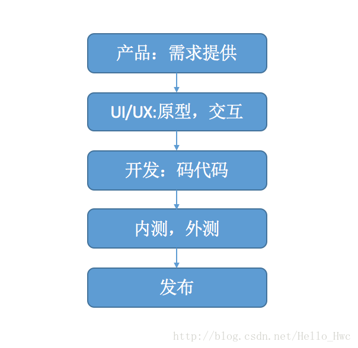
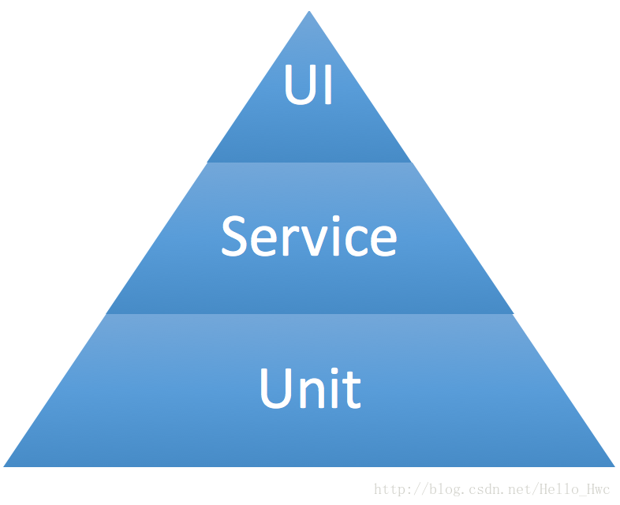
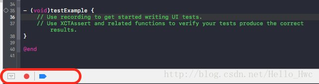
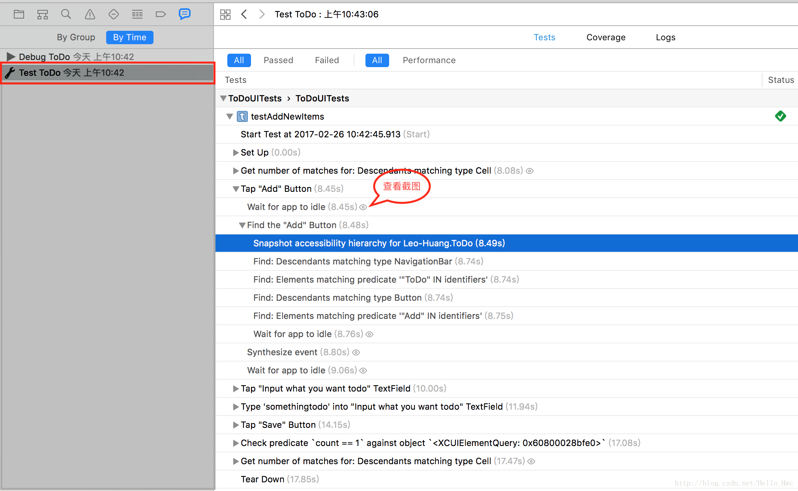
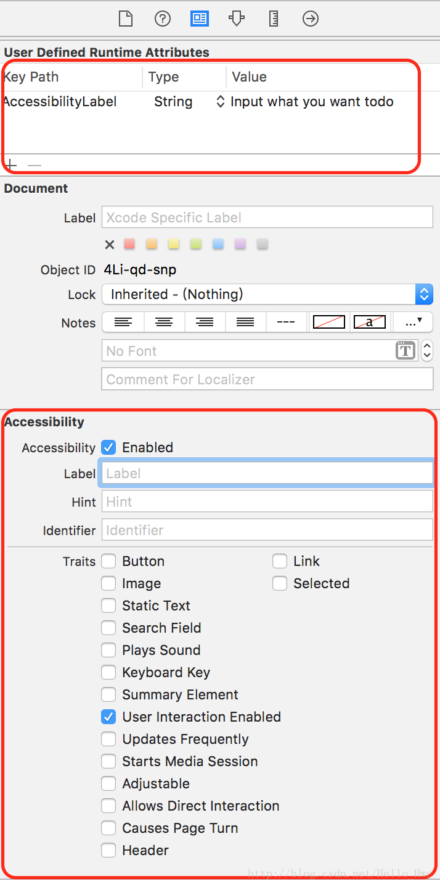
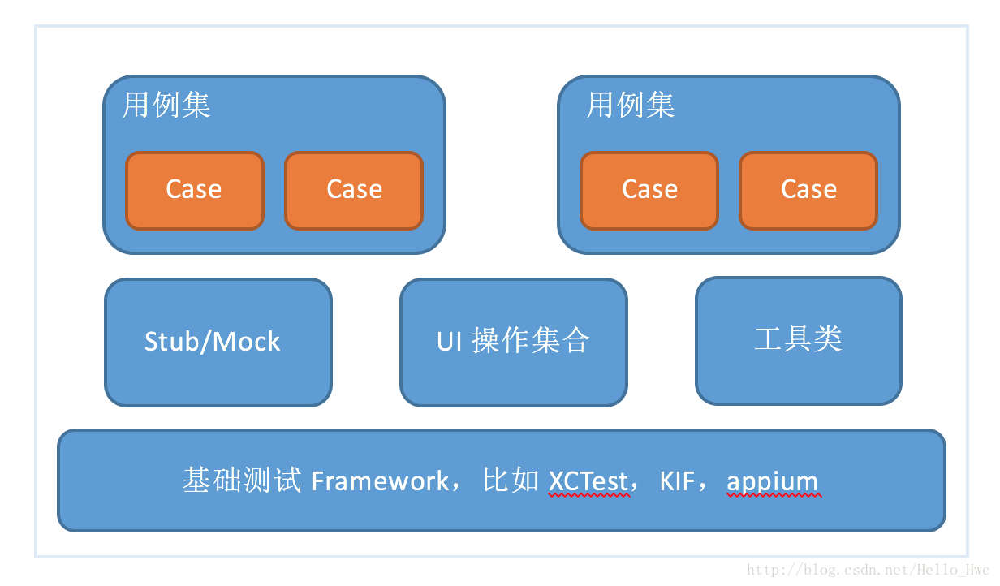
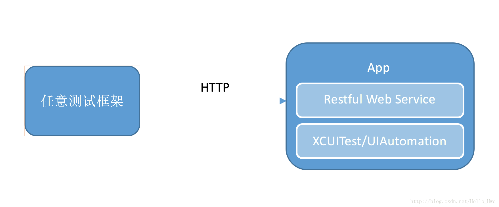

## 前言

> **如果有测试大佬发现内容不对，欢迎指正，我会及时修改。**

大多数的iOS App(没有持续集成)迭代流程是这样的



也就是说，测试是发布之前的最后一道关卡。如果bug不能在测试中发现，那么bug
就会抵达用户，所以测试的<font color="red">**完整性**</font>和<font color="red">可靠性</font>十分重要。

目前，大多数App还停留在人工测试阶段，人工测试投入的成本最低，能够保证核心功能的使用，而且测试人员不需要会写代码。

但是，在很多测试场景下，人工测试的效率太低，容易出错。举两个常见的例子：

 - 一个App的核心功能，在每一次发布版本前的测试必定会跑一遍所有的测试用例，不管对应的业务在当前版本有没有变化（天知道开发在做业务A的时候，对业务B有没有影响），如果这次测出新的bug，测试人员在下一次发版测试中，又不得不做这些重复的工作。
 - 开发在写API请求相关代码的时候没有做数据容错，测试在人工测试的时候都是正常的数据，所以测试通过。上线了之后，后台配置数据的时候出了点小问题，导致大面积崩溃，boom～。
 
然后，老板就要过来找你了


**本文所讲解的均是基于XCode 8.2.1，有些概念可能不适用于低版本的XCode**

----
## 自动化测试

> 自动化测试就是写一些测试代码，用代码代替人工去完成模块和业务的测试。

**其实不管是开发还是测试，如果你在不断的做重复性工作的时候，就应该问自己一个问题：是不是有更高效的办法？**

自动化测试有很多优点：

- 测试速度快，避免重复性的工作
- <font color="orange">**避免regression，让开发更有信心去修改和重构代码(个人认为最大的优点)**</font>
- 具有一致性。
- 有了自动化测试，持续集成（CI）会变得更可靠。
- 迫使开发人员写出更高质量的代码。（自动化测试不通过，代码不允许合并）

当然，自动化测试也有一些缺点。

- 开发和维护成本高。
- 不能完全替代人工测试。
- <font color="orange">无法完全保证测试的准确性 - 让代码去判断一段逻辑是否正确很容易，但是，让代码判断一个控件显示是否正确却没那么容易</font>。

所以，在做自动化测试之前，首先要问自己几个问题？

- 这个测试业务的变动是否频繁？
- 这个测试业务是否属于核心功能？
- 编写测试代码的成本有多少？
- 自动化测试能保证测试结果的准确么？

通常，我们会选择那些**业务稳定，需要频繁测试的部分来编写自动化测试脚本**，其余的采用人工测试，人工测试仍然是iOS App开发中不可缺少的一部分。

-----
## 测试种类

从是否接触源代码的角度来分类：测试分为黑盒和白盒（灰盒就是黑盒白盒结合，这里不做讨论）。

白盒测试的时候，测试人员是可以直接接触待测试App的源代码的。白盒测试更多的是单元测试，测试人员针对各个单元进行各种可能的输入分析，然后测试其输出。白盒测试的测试代码通常由iOS开发编写。

黑盒测试。黑盒测试的时候，测试人员不需要接触源代码。是从App层面对其行为以及UI的正确性进行验证，黑盒测试由iOS测试完成。

从业务的层次上来说，测试金字塔如图：



而iOS测试通常只有以下两个层次：

- Unit，单元测试，保证每一个类能够正常工作
- UI，UI测试，也叫做集成测试，从业务层的角度保证各个业务可以正常工作。


----
## 框架选择

啰里八嗦讲的这么多，自动化测试的效率怎么样，关键还是在测试框架上。那么，如何选择测试框架呢？框架可以分为两大类：**XCode内置的**和**三方库**。

选择框架的时候有几个方面要考虑

- 测试代码编写的成本
- 是否可调式
- 框架的稳定性
- 测试报告（截图，代码覆盖率，...）
- WebView的支持（很多App都用到了H5）
- 自定义控件的测试
- 是否需要源代码
- 能否需要连着电脑
- 是否支持CI（持续集成）
- ....


我们首先来看看XCode内置的框架：**XCTest**。**XCTest**又可以分为两部分：**Unit Test** 和 **UI Test**，分别对应**单元测试**和**UI测试**。有一些三方的测试库也是基于XCTest框架的，这个在后文会讲到。由于是Apple官方提供的，所以这个框架会不断完善。


成熟的三方框架通常提供了很多封装好的有好的接口，笔者综合对比了一些，推荐以下框架：


单元测试：
> 以下三个框架都是BDD([Behavior-driven development](https://en.wikipedia.org/wiki/Behavior-driven_development)) - 行为驱动开发。行为驱动开发简单来说就是先定义行为，然后定义测试用例，接着再编写代码。 **<font color="red">实践中发现，通常没有那么多时间来先定义行为，不过BDD中的domain-specific language (DSL)能够很好的描述用例的行为</font>**。

- [Kiwi](https://github.com/kiwi-bdd/Kiwi) 老牌测试框架
- [specta](https://github.com/specta/specta) 另一个BDD优秀框架
- [Quick](https://github.com/Quick/Quick) <font color="red">三个项目中Star最多，支持OC和Swift，优先推荐。</font>

UI测试

- [KIF](https://github.com/kif-framework/KIF) 基于XCTest的测试框架，调用私有API来控制UI，测试用例用Objective C或Swift编写。
- [appium](https://github.com/appium/appium) 基于Client - Server的测试框架。App相当于一个Server，测试代码相当于Client，通过发送JSON来操作APP，测试语言可以是任意的，支持android和iOS。

> 篇幅有限，本文会先介绍XCtest，接着三方的Unit框架会以Quick为例，UI Test框架侧重分析KIF，appium仅仅做原理讲解。

----
## XCTest
对于XCTest来说，最后生成的是一个bundle。bundle是不能直接执行的，必须依赖于一个宿主进程。关于XCTest进行单元测试的基础(XCode的使用，异步测试，性能测试，代码覆盖率等)，我在这篇文章里讲解过，这里不再详细讲解。


- [iOS 单元测试之XCTest详解](http://blog.csdn.net/hello_hwc/article/details/46671053)

### 单元测试用例

比如，我有以下一个函数：

```
//验证一段Text是否有效。（不能以空字符开头，不能为空）
- (BOOL)validText:(NSString *)text error:(NSError *__autoreleasing *)error{
}
```

那么，我该如何为这个函数编写单元测试的代码？通常，需要考虑以下用例：
 
1. 输入以空白字符或者换行符开头的，error不为空，返回 NO
2. 输入正确的内容，error为空，返回YES
3. 输入为nil,error不为空，返回 NO (边界条件)
4. 输入为非NSString类型，验证不通过，返回NO （错误输入）
5. 特殊输入字符（标点符号，非英文等等）


### UI测试
UI测试是模拟用户操作，进而从业务处层面测试。关于XCTest的UI测试，建议看看WWDC 2015的这个视频：

- [UI Testing in Xcode](https://developer.apple.com/videos/play/wwdc2015/406/)

关于UI测试，有几个核心类需要掌握

- [XCUIApplication](https://developer.apple.com/reference/xctest/xcuiapplication) 测试应用的代理
- [XCUIElement](https://developer.apple.com/reference/xctest/xcuielement) 一个UI上可见的视图对象
- [XCUIElementQuery](https://developer.apple.com/reference/xctest/xcuielementquery) 查找XCUIElement

UI测试还有一个核心功能是UI Recording。选中一个UI测试用例，然后点击图中的小红点既可以开始UI Recoding。你会发现：
> 随着点击模拟器，自动合成了测试代码。（通常自动合成代码后，还需要手动的去调整）



在写UI测试用例的时候要注意：测试行为而不是测试代码。比如，我们测试这样一个case
>进入Todo首页，点击add，进入添加页面，输入文字，点击save。

测试效果如下：


对应测试代码：

```
- (void)testAddNewItems{
    //获取app代理
    XCUIApplication *app = [[XCUIApplication alloc] init];
    //找到第一个tabeview，就是我们想要的tableview
    XCUIElement * table = [app.tables elementBoundByIndex:0];
    //记录下来添加之前的数量
    NSInteger oldCount = table.cells.count;
    //点击Add
    [app.navigationBars[@"ToDo"].buttons[@"Add"] tap];
    //找到Textfield
    XCUIElement *inputWhatYouWantTodoTextField = app.textFields[@"Input what you want todo"];
    //点击Textfield
    [inputWhatYouWantTodoTextField tap];
    //输入字符
    [inputWhatYouWantTodoTextField typeText:@"somethingtodo"];
    //点击保存
    [app.navigationBars[@"Add"].buttons[@"Save"] tap];
    //获取当前的数量
    NSInteger newCount = table.cells.count;
    //如果cells的数量加一，则认为测试成功
    XCTAssert(newCount == oldCount + 1);
}
```
这里是通过前后tableview的row数量来断言成功或者失败。

### 等待
通常，在视图切换的时候有转场动画，我们需要等待动画结束,然后才能继续，否则query的时候很可能找不到我们想要的控件。

比如，如下代码等待VC转场结束，当query只有一个table的时候，才继续执行后续的代码。

```
[self expectationForPredicate:[NSPredicate predicateWithFormat:@"self.count = 1"]
          evaluatedWithObject:app.tables
                      handler:nil];
[self waitForExpectationsWithTimeout:2.0 handler:nil];
//后续代码....
```


>Tips: 当你的UI结构比较复杂的时候，比如各种嵌套childViewController，使用XCUIElementQuery的代码会很长，也不好维护。

> 另外，UI测试还会在每一步操作的时候截图，方便对测试报告进行验证。

### 查看测试结果
使用基于XCTest的框架，可以在XCode的report navigator中查看测试结果。



其中：

- Tests 用来查看详细的测试过程
- Coverage 用来查看代码覆盖率
- Logs 用来查看测试的日志
- 点击图中的红色框指向的图标可以看到每一步UI操作的截图

除了利用XCode的GUI，还可以通过后文提到的命令行工具来测试，查看结果。


### Stub/Mock

首先解释两个术语：

- mock 表示一个模拟对象
- stub 追踪方法的调用，在方法调用的时候返回指定的值。

通常，如果你采用纯存的XCTest，推荐采用[OCMock](https://github.com/)来实现mock和stub，单元测试的三方库通常已集成了stub和mock。

那么，如何使用mock呢？举个官方的例子：

```
//mock一个NSUserDefaults对象
id userDefaultsMock = OCMClassMock([NSUserDefaults class]);
//在调用stringForKey的时候，返回http://testurl
OCMStub([userDefaultsMock 
stringForKey:@"MyAppURLKey"]).andReturn(@"http://testurl");
```

再比如，我们要测试打开其他App，那么如何判断确实打开了其他App呢？

```
id app = OCMClassMock([UIApplication class]);
OCMStub([app sharedInstance]).andReturn(app);
OCMVerify([app openURL:url] 
```

使用Stub可以让我们很方便的实现这个。

关于OCMock的使用，推荐看看objc.io的这篇文章

- [置换测试: Mock, Stub 和其他](https://objccn.io/issue-15-5/)


----
## Quick

> Quick是建立在[XCTestSuite](https://developer.apple.com/reference/xctest/xctestsuite)上的框架，使用[XCTestSuite](https://developer.apple.com/reference/xctest/xctestsuite)允许你动态创建测试用例。所以，使用Quick,你仍让可以使用XCode的测试相关GUI和命令行工具。

使用Quick编写的测试用例看起来是这样子的：

```
import Quick
import Nimble

class TableOfContentsSpec: QuickSpec {
  override func spec() {
    describe("the 'Documentation' directory") {
      it("has everything you need to get started") {
        let sections = Directory("Documentation").sections
        expect(sections).to(contain("Organized Tests with Quick Examples and Example Groups"))
        expect(sections).to(contain("Installing Quick"))
      }

      context("if it doesn't have what you're looking for") {
        it("needs to be updated") {
          let you = You(awesome: true)
          expect{you.submittedAnIssue}.toEventually(beTruthy())
        }
      }
    }
  }
}
```

BDD的框架让测试用例的目的更加明确，测试是否通过更加清晰。使用Quick,测试用例分为两种：

### **单独的用例 - 使用it来描述**

it有两个参数，

- 行为描述
- 行为的测试代码

比如，以下测试Dolphin行为，它具有行为`is friendly`和`is smart`

```
//Swift代码
class DolphinSpec: QuickSpec {
  override func spec() {
    it("is friendly") {
      expect(Dolphin().isFriendly).to(beTruthy())
    }

    it("is smart") {
      expect(Dolphin().isSmart).to(beTruthy())
    }
  }
}
```

> 可以看到，BDD的核心是行为。也就是说，需要关注的是一个类提供哪些行为。

### **用例集合，用describe和context描述**

比如，验证dolphin的click行为的时候，我们需要两个用例。一个是`is loud`,一个是`has a high frequency`，就可以用describe将用例组织起来。

```
class DolphinSpec: QuickSpec {
  override func spec() {
    describe("a dolphin") {
      describe("its click") {
        it("is loud") {
          let click = Dolphin().click()
          expect(click.isLoud).to(beTruthy())
        }

        it("has a high frequency") {
          let click = Dolphin().click()
          expect(click.hasHighFrequency).to(beTruthy())
        }
      }
    }
  }
}
```

context可以指定用例的条件：

比如

```
describe("its click") {
    context("when the dolphin is not near anything interesting") {
      it("is only emitted once") {
        expect(dolphin!.click().count).to(equal(1))
      }
    }
}
```

除了这些之外，Quick也支持一些切入点，进行测试前的配置：

- beforeEach
- afterEach
- beforeAll
- afterAll
- beforeSuite
- afterSuite

### **Nimble**
由于Quick是基于XCTest，开发者当然可以收使用断言来定义测试用例成功或者失败。Quick提供了一个更有好的Framework来进行这种断言：[Nimble](https://github.com/Quick/Nimble)

比如，一个常见的XCTest断言如下：

```
XCTAssertTrue(ConditionCode, "FailReason")
```
在出错的时候，会提示

> XCAssertTrue failed, balabala

这时候，开发者要打个断点，查看下上下文，看看具体失败的原因在哪。

使用Nimble后，断言变成类似

```
expect(1 + 1).to(equal(2))
expect(3) > 2
expect("seahorse").to(contain("sea"))
expect(["Atlantic", "Pacific"]).toNot(contain("Mississippi"))
```
并且，出错的时候，提示信息会带着上下文的值信息，让开发者更容易的找到错误。


----
## 让你的代码更容易单元测试

测试的**准确性和工作量很大程度上依赖于开发人员的代码质量**。

通常，为了单元测试的准确性，我们在写函数(方法)的时候会借鉴一些函数式编程的思想。其中最重要的一个思想就是

- pure function(纯函数)

**何为Pure function？就是如果一个函数的输入一样，那么输出一定一样。**

比如，这样的一个函数就不是pure function。因为它依赖于外部变量value的值。

```
static NSInteger value = 0;

- (NSInteger)function_1{
    value = value + 1;
    return value;
}
```

而这个函数就是pure function，因为给定输入，输出一定一致。

```
- (NSInteger)function_2:(NSInteger)base{
    NSInteger value = base + 1;
    return value;
}
```

所以，**如果你写了一个没有参数，或者没有返回值的方法**，那么你要小心了，很可能这个方法很难测试。

### 关于MVC
在良好的MVC架构的App中，

- View只做纯粹的展示型工作，把用户交互通过各种方式传递到外部
- Model只做数据存储类工作
- Controller作为View和Model的枢纽，往往要和很多View和Model进行交互，也是自动化包括代码维护的痛点。

所以，对Controller瘦身是iOS架构中比较重要的一环，一些通用的技巧包括：

逻辑抽离：

- 网络请求独立。可以每个网络请求以Command模式封装成一个对象，不要直接在Controller调用[AFNetworking](https://github.com/AFNetworking/AFNetworking)。
- 数据存储独立。建立独立的Store类，用来做数据持久化和缓存。
- 共有数据服务化（协议）。比如登录状态等等，通过服务去访问，这样服务提供者之需要处理服务的质量，服务使用者则信任服务提供者的结果。

Controller与View解耦合

- 建立ViewModel层，这样Controller只需要和ViewModel进行交互。
- 建立UIView子类作为容器，将一些View放到容器后再把容器作为SubView添加到Controller里
- 建立可复用的Layout层，不管是AutoLayout还是手动布局。

Controller与Controller解耦合

- 建立页面路由。每一个界面都抽象为一个URL，跳转仅仅通过Intent或者URL跳转，这样两个Controller完全独立。

> 如果你的App用Swift开发，那么面向协议编程和不可变的值类型会让你的代码更容易测试。

**当然，iOS组建化对自动化测试的帮助也很大，因为不管是基础组件还是业务组件，都可以独立测试。组建化又是一个很大的课题，这里不深入讲解了。**


----
## KIF
**[KIF](AccessibilityLabel)**的全称是Keep it functional。它是一个建立在XCTest的UI测试框架，**通过accessibility来定位具体的控件，再利用私有的API来操作UI。**由于是建立在XCTest上的，所以你可以完美的借助XCode的测试相关工具（包括命令行脚本）。

**> KIF是个人非常推荐的一个框架，简单易用。**

使用KIF框架强制要求你的代码支持accessibility。如果你之前没接触过，可以看看Apple的文档

- [Accessibility Programming Guide for iOS](https://developer.apple.com/library/prerelease/content/documentation/UserExperience/Conceptual/iPhoneAccessibility/Introduction/Introduction.html)

简单来说，accessibility能够让视觉障碍人士使用你的App。每一个控件都有一个描述AccessibilityLabel。在开启VoiceOver的时候，点击控件就可以选中并且听到对应的描述。

通常UIKit的控件是支持accessibility的，自定定义控件可以通过代码或者Storyboard上设置。

在Storyboard上设置：



- 上面的通过Runtime Attributes设置（KVC）
- 下面的通过GUI来设置

通过代码设置：

```
[alert setAccessibilityLabel:@"Label"];
[alert setAccessibilityValue:@"Value"];
[alert setAccessibilityTraits:UIAccessibilityTraitButton];
```

如果你有些Accessibility的经验，那么你肯定知道，像TableView的这种不应该支持VoiceOver的。我们可以用条件编译来只对测试Target进行设置：

```
#ifdef DEBUG
[tableView setAccessibilityValue:@"Main List Table"];
#endif

#ifdef KIF_TARGET (这个值需要在build settings里设置)
[tableView setAccessibilityValue:@"Main List Table"];
#endif
```

使用KIF主要有两个核心类：

- KIFTestCase XCTestCase的子类
- KIFUITestActor 控制UI，常见的三种是：点击一个View，向一个View输入内容，等待一个View的出现

我们用KIF来测试添加一个新的ToDo

```
- (void)testAddANewItem{
    [tester tapViewWithAccessibilityLabel:@"Add"];
    [tester enterText:@"Create a test to do item" intoViewWithAccessibilityLabel:@"Input what you want todo"];
    [tester tapViewWithAccessibilityLabel:@"Save"];
    [tester waitForTimeInterval:0.2];
    [tester waitForViewWithAccessibilityLabel:@"Create a test to do item"];
}
```


-----
## 命令行
自动化测试中，命令行工具可以facebook的开源项目：

- [xctool](https://github.com/facebook/xctool)

这是一个基于`xcodebuild`命令的扩展，在iOS自动化测试和持续集成领域很有用,而且它支持`-parallelize`并行测试多个bundle，大大提高测试效率。

安装XCTool,

```
brew install xctool
```

使用

```
path/to/xctool.sh \
  -workspace YourWorkspace.xcworkspace \
  -scheme YourScheme \
  -reporter plain:/path/to/plain-output.txt \
  run-test
```

并且，xctool对于持续集成很有用，iOS常用的持续集成的server有两个：

- [Travis CI](https://travis-ci.org/) 对于公开仓库（比如github）免费，私有仓库收费
- [Jenkins](http://jenkins-ci.org/) 免费


----
## 优化你的测试代码

### 准确的测试用例
通常，你的你的测试用例分为三部分：

- 配置测试的初始状态
- 对要测试的目标执行代码
- 对测试结果进行断言（成功 or 失败）


### 测试代码结构

当测试用例多了，你会发现测试代码编写和维护也是一个技术活。通常，我们会从几个角度考虑：

- 不要测试私有方法（封装是OOP的核心思想之一，不要为了测试破坏封装）
- 对用例分组（功能，业务相似）
- 对单个用例保证测试独立（不受之前测试的影响，不影响之后的测试），这也是测试是否准确的核心。
- 提取公共的代码和操作，减少copy/paste这类工作，测试用例是上层调用，只关心业务逻辑，不关心内部代码实现。

一个常见的测试代码组织如下：




----
## appium

appium采用了Client Server的模式。对于App来说就是一个Server，基于[WebDriver JSON wire protocol](https://w3c.github.io/webdriver/webdriver-spec.html)对实际的UI操作库进行了封装，并且暴露出RESTFUL的接口。然后测试代码通过HTTP请求的方式，来进行实际的测试。其中，实际驱动UI的框架根据系统版本有所不同：

- < 9.3 采用UIAutomation
- >= 9.3 XCUITest

原因也比较简单：Apple在10.0之后，移除了UIAutomation的支持，只支持XCUITest。



对比KIF，appium有它的优点：

- 跨平台，支持iOS，Android
- 测试代码可以由多种语言编写，这对测试来说门槛更低
- 测试脚本独立与源代码和测试框架


当然，任何框架都有缺点：

- 自定义控件支持不好
- WebView的支持不好

------
## 总结

> 由于我不是专业的iOS测试，关于测试的一点见解如下：
> 
> - 单元测试还是选择BDD框架，毕竟可读性高一些，推荐[Quick](https://github.com/Quick/Quick)（Swift），[Kiwi](https://github.com/kiwi-bdd/Kiwi)(Objective C)
> - UI测试优先推荐[KIF](https://github.com/kif-framework/KIF)，如果需要兼顾安卓测试，或者测试人员对OC/Swift很陌生，可以采用[appium](https://github.com/appium/appium)


-----
## 参考资料
- [Testing with Xcode](https://developer.apple.com/library/content/documentation/DeveloperTools/Conceptual/testing_with_xcode/chapters/01-introduction.html#//apple_ref/doc/uid/TP40014132-CH1-SW1) 官方文档，关于XCTest以及XCode有详细的讲解
- [objc.io关于测试的资料](https://objccn.io/issue-1-3/)对于官方文档的补充
- [腾讯移动品质中心](http://tmq.qq.com/?s=ios) 鹅厂移动品质中心，有很多好文章，强力推荐。
- [基于 KIF 的 iOS UI 自动化测试和持续集成](https://zhuanlan.zhihu.com/p/22283843) 美团点评技术团队写的一篇博客
- [testing-in-swift](https://realm.io/news/testing-in-swift/)
- [微信读书排版引擎自动化测试方案](http://wereadteam.github.io/2016/08/23/Typesetter/#comments)


> 声明：本博客所有文章均为个人观点，与雇主没有任何关系。
