## 前言

这是一篇写给开发者的博客，如果碰巧非开发者搜到了这篇博客，那么博客的内容可能不适合你。

其实网上Reveal的教程很多，但是很多都是停留在Reveal 1或者Reveal 2时代的博客，不太适合最新版本的Reveal 7，所以还是决定写这样一篇文章。

本文最终的效果：

淘宝首页：

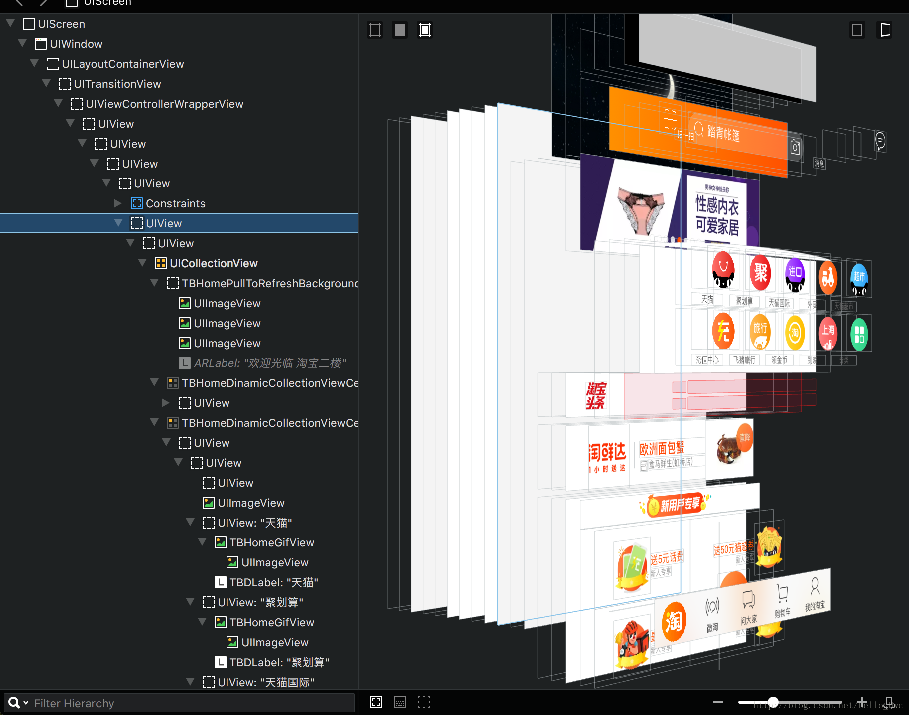

- 可以看到，淘宝首页其实就是一个巨大的CollectionView

京东首页：

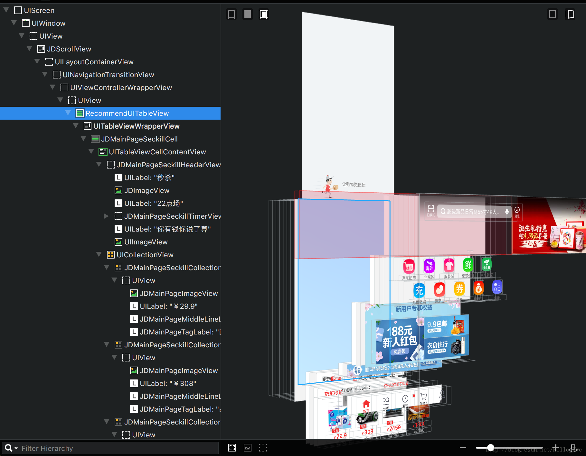

- 可以看到，京东首页其实就是一个巨大的TableView

----
## 越狱

准备工作：

- 一台待越狱的设备(10.3系统以下），最好用测试机或者淘汰下来的收据越狱，越狱前关闭设备的密码，做好数据备份。
- XCode

> 笔者的设备是iphone 5s(10.0.2), XCode 8.3


步骤

- 下载开源项目[yalu102](https://github.com/kpwn/yalu102),并用XCode打开。
- 下载IOKitHeaders，并且把头文件拖拽到上一步打开的XCode项目中，注意选中Copy。[下载地址](http://download.csdn.net/detail/hello_hwc/9804611)
- 修改`jailbreak.m`中的`#import <IOKit/IOKitlib.h>`为`#import "IOKitLib.h"`
- 修改Bundle identifier, 连接iphone运行项目。发现多安装了一个App名称为“yalu102”
- 打开yalu102,点击Go开始越狱。越狱成功后，桌面程序会重启，然后会发现多个一个Cydia的App，越狱成功。

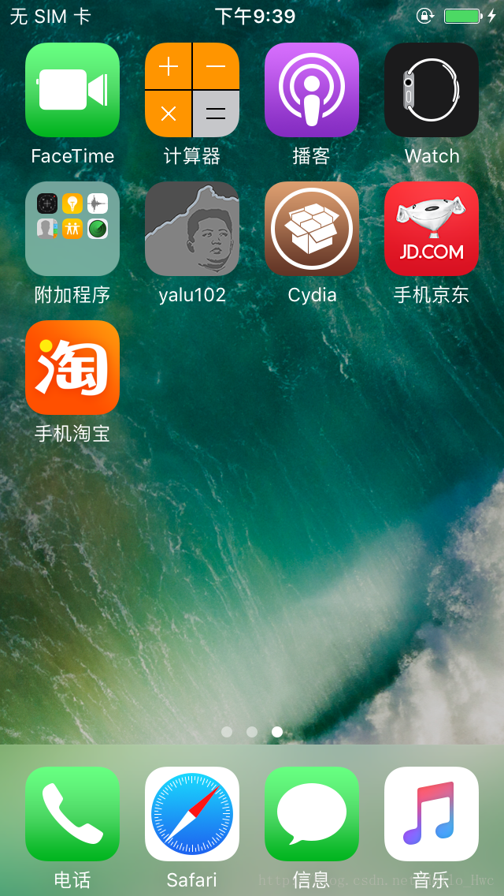

----
## 配置本文需要的环境

### **安装OpenSSH，方便我们把mac上的文件拷贝到手机**

- 在Cydia中搜索OpenSSH，点击安装。

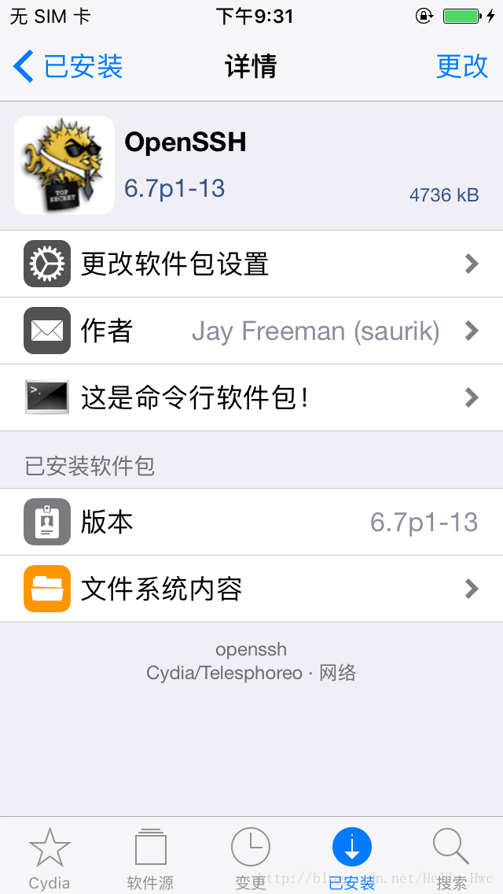

### **通过USB进行SSH**

可以通过Wifi进行SSH，不过USB进行SSH的话，速度更快，所以本文采用USB的方式。

- 安装**homebrew**

```
ruby -e "$(curl -fsSL https://raw.githubusercontent.com/Homebrew/	install/master/install)“
```

- 安装**libimobiledevice**
	
```
brew install libimobiledevice
```
> 如果失败，执行`brew link --overwrite libusb`,后再执行`brew install libimobiledevice`	

- 然后检查iproxy是否安装成功

```
ls /usr/local/bin/ | grep iproxy 
```
如果有grep不是空的，说明安装成功。

- 然后，桌面新建一个plist，命名为`com.usbmux.iproxy.plist`,内容如下：

```
<?xml version="1.0" encoding="UTF-8"?>
<!DOCTYPE plist PUBLIC "-//Apple//DTD PLIST 1.0//EN" "http://www.apple.com/DTDs/PropertyList-1.0.dtd">
<plist version="1.0">
<dict>
    <key>Label</key>
    <string>com.usbmux.iproxy</string>
    <key>ProgramArguments</key>
    <array>
        <string>/usr/local/bin/iproxy</string>
        <string>2222</string>
        <string>22</string>
    </array>
    <key>RunAtLoad</key>
    <true/>
    <key>KeepAlive</key>
    <true/>
</dict>
</plist
```
- 给这个plist执行权限

```
cd ~/Desktop
chmod +x com.usbmux.iproxy.plist
```
- 右键finder，然后输入

```
~/Library/LaunchAgents
```

- 把刚刚桌面上的plist，拖拽到LaunchAgents文件夹下。启动这个proxy

```
launchctl load ~/Library/LaunchAgents/com.usbmux.iproxy.plist
```

- 接着，在终端输入

```
ssh root@localhost -p 2222
```

- 会提示输入密码

```
192:~ Leo$ ssh root@localhost -p 2222
root@localhost's password: *
```

> 默认密码：**alpine**

**显示`xxxxx-iPhone:~ root#`,则表示ssh环境配置成功。**

<font color="red">!!!!iOS设备上删文件一定要慎重，不要动系统的文件，当心白苹果。</font>

-----
## 安装cyberduck

cyberduck可以让我们通过拖拽的方式把mac上的文件拷贝到ios设备。

- 官网下载[cyberduck](https://cyberduck.io/)，下载完成后，解压缩，拖拽到应用目录

- 启动cyberduck，点击新建连接,选择SFTP（SSH），然后按照图中的方式填写。注意默认密码和上文一样，都是**alpine**

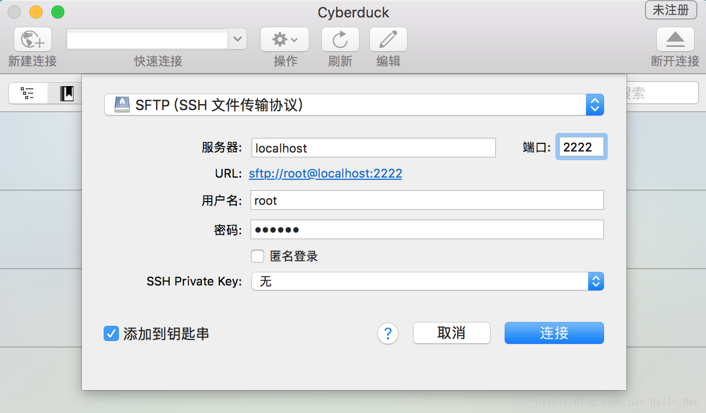

- 点击连接,看到下图表示SSH成功。点击图中的部分，可以回到根目录。

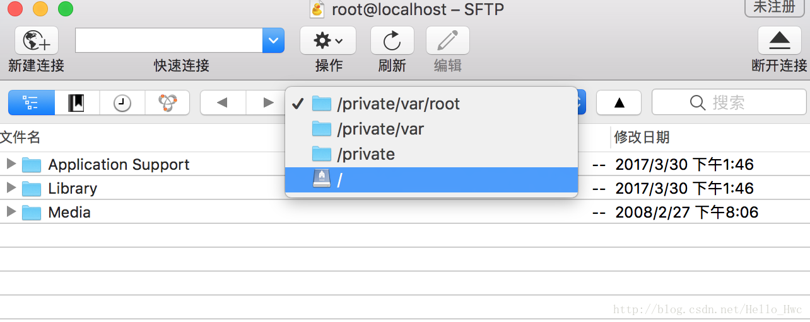


----
## 安装Reveal

- 从官网下载[Reveal](https://revealapp.com/)，本文下载当前最新的版本Reveal 7（试用版需要先填写email信息，然后获得试用key）.下载完成后，将reveal拖拽到应用目录，然后执行Reveal。这时候如图：

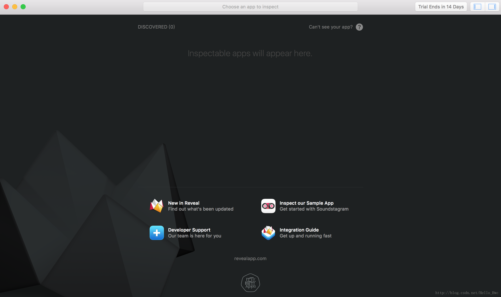

----
## 最后的步骤

通过前文的准备，我们可以把文件拷贝到越狱的手机，MAC上我们也有Reveal了。接下来就是最后的，也是比较关键的步骤。

- 安装Reveal2Loader（注意不是RevealLoader，那个源版本太老了）。在cydia中，搜索Reveal2Loader,然后安装。

> 如果安装失败，在软件源中点击编辑->删除BigBoss。接着点击Tabbar上的Cydia -> 更多软件源重新安装BigBoss(比较慢).再试着安装Reveal2Loader

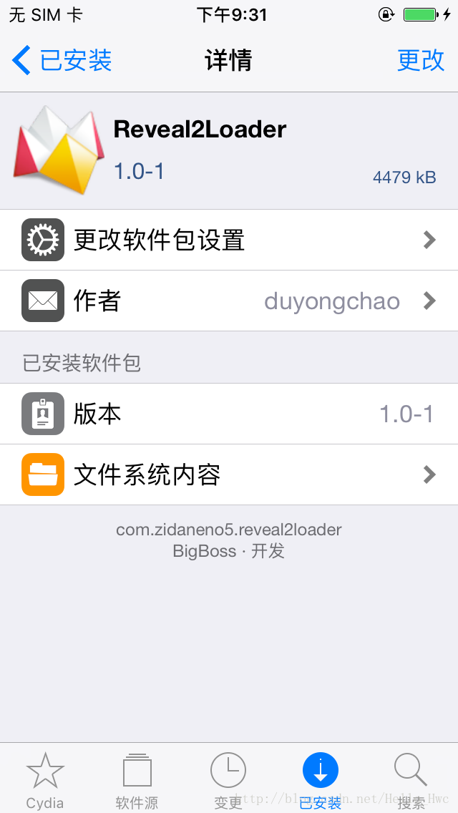

- 安装Reveal2Loader成功后，在设置中会多一个Reveal选项，进入然后选择Enable Applications，这里是你想要用Reveal分析的App。比如我选择打开手机淘宝。

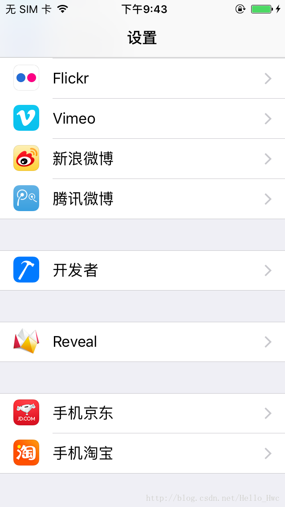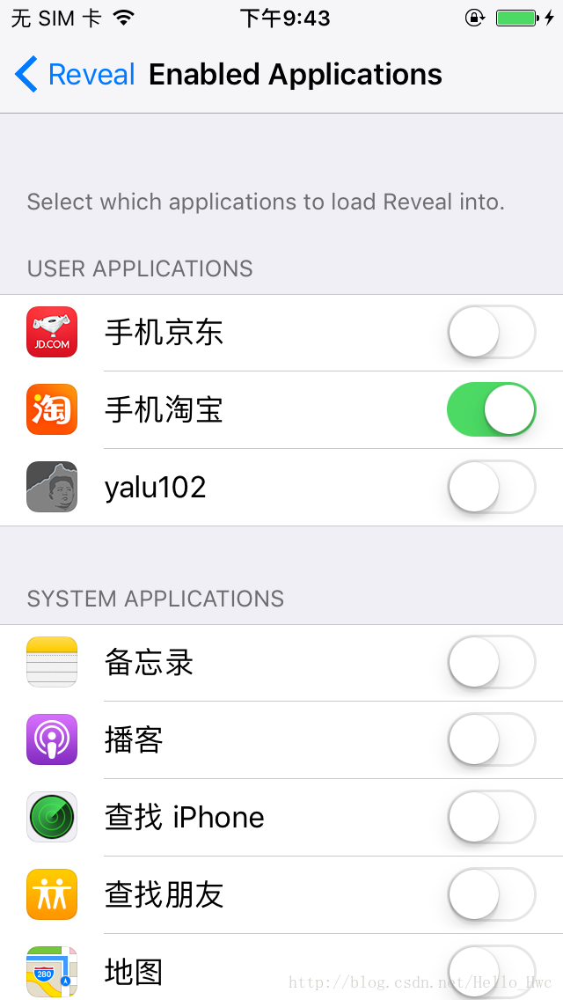

然后，运行淘宝，你会发现Reveal中有提示了，如果没有提示，尝试关闭淘宝，重新启动。

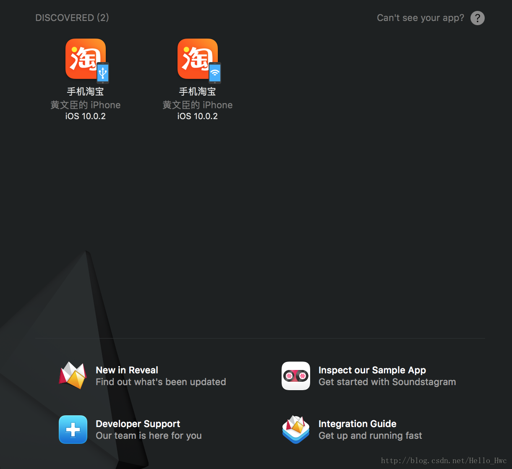

到这里，如果提示链接的Framework版本过低，那么我们需要把最新的Framework拷贝到手机上。

- 点击Reveal的菜单栏中的Help，然后按照图中方式打开对应的framework路径。


- 用上文的cyberduck SSH到iOS 设备上，然后进入`/Library/Frameworks`，删除当前目录下的RevealServer.framework（注意别删错了）

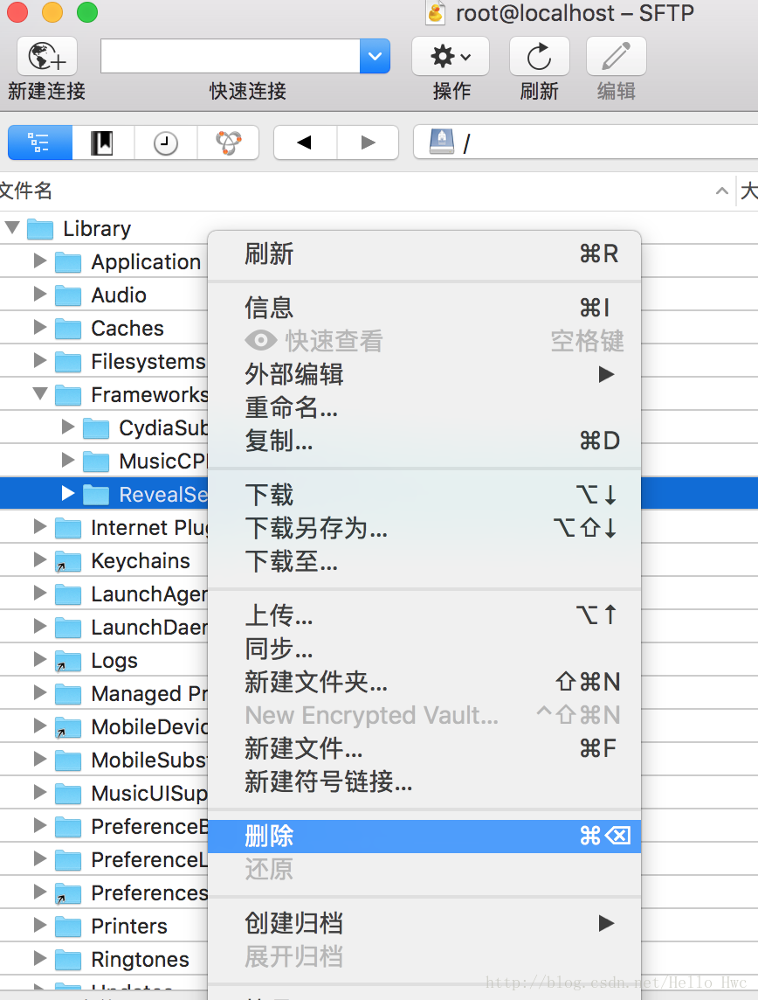

接着，按照图中的方式，把RevealServer.framework拖拽到`/Library/Frameworks`下。


然后，终端SSH到iOS设备，执行以下命令，重启SpringBoard即可。

```
killall SpringBoard
```


