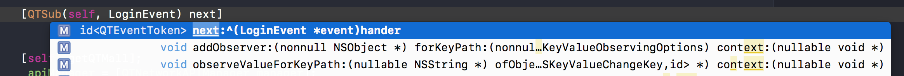

## 目标

订阅登录事件LoginEvent，当self dealloc时候自动取消订阅

```
[QTSub(self, LoginEvent) next:^(LoginEvent *event) {
    
}];
```

订阅通知NSNotification，当self dealloc的时候自动取消订阅

```
//订阅通知name
[QTSubNoti(self,"name") next:^(NSNotification *event) {
    
}];
//订阅App将要关闭
[[self subscribeAppWillTerminate] next:^(NSNotification *event) {
    
}];
```

并且XCode可以自动推断类型



好了，开始啰里八嗦讲原理和设计了，做好准备，文章挺长的。不想看我啰嗦，[代码在这里](https://github.com/LeoMobileDeveloper/QTEventBus)。

## Notification的痛点

Cocoa Touch提供了一种消息中心机制：NSNotificationCenter，相信iOS开发者都很熟悉了，

- `addObserver` 订阅通知
- `postNotification` 发送通知
- `removeObserver` 取消订阅

当然，还有一个接口是比较容易忽略的，就是利用block注册订阅

```
NSNotificationCenter * center = [NSNotificationCenter defaultCenter];
id<NSObject> token = [center addObserverForName:@"name"
		                                 object:nil
		                                  queue:nil
		                             usingBlock:^(NSNotification * _Nonnull note) {
		                                                  
		                            }];
[center removeObserver:token]
```

实际开发中，Notification又有哪些痛点呢？

### Name如何管理？

方式一：hardcode在代码里

```
[center addObserverForName:@"UserLoginNotification" ...]
```

优点：无需额外的import，松耦合。  
缺点：修改和版本管理麻烦

方式二：在相关模块的源文件里，比如登录成功的通知放在登录模块里。

```
//.h文件
extern NSString * const UserLoginNotification; //登录成功
//.m文件
NSString * const UserLoginNotification = @"UserLoginNotification";
```

优点：便于修改和版本管理  
缺点：需要import引入对应的模块，导致强耦合模块，但是得到的却是弱类型。

> 有些同学喜欢把name堆到一个头文件里，这种设计理念是不符合软件设计原则的：“接口隔离原则，不应该强制客户端依赖那些他们不需要的接口”。想想也有道理：我不需要的通知为啥让我引入进来对吧？。

### 弱类型

常见的用Notification传递消息的方式是UserInfo，然后声明各种key

```
extern NSString * const kUserId; //用户id
```

接收者取出信息

```
NSString * userId = [notification.userInfo objectForKey: kUserId];
```

缺点：必须看文档或者源代码才知道通知里具体有什么，字典是弱类型的，不易做接口的版本管理。

> 弱类型还有个明显的劣势就是无法在编译期找到类型不匹配的问题。

优点：只要userInfo是JSON，就是松耦合的。

### 胶水代码

使用Notificaton不得不写很多胶水代码

取消监听，不然会crash

```
- (void)dealloc{
	[center removeObserver:self];
}
```

取出通知内容

```
NSString * userId = [notification.userInfo objectForKey:@"userId"]
```

### 小结

总的来说，NotificationCenter的通信方式在完全松耦合的场景下是很适用的：发送者不用关心接收者，发送者和接收者统一按照JSON等协议通信。

而实际开发中，**很多时候我们并不需要松耦合的通信**。

- 业务层代码的通信需要松耦合，因为两个业务通常是独立开发迭代，通信按照指定协议即可，不可能开发的时候强制要import另一个业务代码进来。
- 像登录这种基础服务代码，本质上不属于业务，开发的时候往往需要import对应的framework进来，这时候强类型的通信方式往往更好。

相信我，和基础服务(Service层)代码通信的频率要远高于业务之间通信，甚至业务之间的通信很多时候也可以沉入到Service层。

## 总线

总线本质上是"发布-订阅"这种消息范式：订阅者不关心消息由谁发送；发布者也不关系消息由谁接收。

总线是为了解决模块或者类之间消息通信而存在的，如果我们要实现一个总线，我们我们希望它能有哪些特点呢？

- **接口友好，接口友好，接口友好，重要的事情说三遍**
    - 不需要手动取消监听
    - 参数少，方法短，阅读起来一目了然
    - 基于block的回调，降低上下文理解难度
- 兼容Notification
- 效率高
- 支持强类型/弱类型

## 定义事件

Notification用字符串来唯一事件，用一个类就代表了所有通知。而我们需要同时支持强类型和弱类型事件，怎么办呢？

- 用类名来区分事件，从而实现强类型：订阅者subscribe类名，发布者dispatch类。
- 用字符串eventType来对类事件进行二级划分，从而实现弱类型。

协议定义如下

```
@protocol QTEvent<NSObject>
@optional
- (NSString *)eventType;
@end
```

这样，我们就可以兼容Notification了

```
@interface NSNotification (QTEvent)<QTEvent>
@end
@implementation NSNotification (QTEvent)
- (NSString *)eventType{
    return self.name;
}
@end
```

然后强类型事件client自己定义类，弱类型事件可以采用框架提供的统一类，比如：

```
@interface QTJsonEvent : NSObject<QTEvent>
+ (instancetype)eventWithId:(NSString *)uniqueId jsonObject:(NSDictionary *)data;
@end
```

## 接口

由于我们的事件是用类来定义的，所以接口不难定义：

```
@interface QTEventBus : NSObject
- (...)on:(Class)eventClass; //订阅事件
- (void)dispatch:(id<QTEvent>)event; //发布事件
@end
```

## 取消监听

### 手动取消

我们需要返回给client一个数据结构来取消监听，我们选择抽象的协议作为返回

```
@protocol QTEventToken<NSObject>
//取消监听
- (void)dispose;
@end
```

> 用协议作为返回值的好处是隐藏了内部的实现，这样内部实现就可以独立的变化，而对外透明。

然后内部创建一个具体的类，并且在dispose调用一个传入的block，在传入的block取消订阅

> 这是函数式的编程思想，把dispose抽象成一个传入的函数。

```
@interface _QTEventToken: NSObject<QTEventToken>
...
- (void)dispose{
    @synchronized(self){
        if (_isDisposed) {
            return;
        }
        _isDisposed = YES;
    }
    if (self.onDispose) {
        self.onDispose(self.uniqueId);
    }
}
```

### 自动取消

如何实现自动取消订阅呢？根据二八原则，我们来思考下百分之八十的情况下在什么时候取消监听？

> 在对象释放的时候。

如果回调方式选择target/action，可以选择支持弱引用的集合(`NSMapTable`等)。但是我们设计的回调接口是基于block的，总线必须强持有这个block，所以就不能简单的使用这些弱引用集合了。

那么，如何知道一个对象被释放了呢？

> **关联对象**。

由于一个对象可能多次调用，所以我们的关联对象应该支持一次取消多个注册。QTDisposeBag接收多个`id<QTEventToken>`，然后在dealloc的时候调用他们的dispose。

```
- (void)dealloc{
    for (id<QTEventToken> token in self.tokens) {
        if ([token respondsToSelector:@selector(dispose)]) {
            [token dispose];
        }
    }
}
```

然后，用关联对象的方式，绑定到指定对象上，这样它的生命周期就和指定对象绑定在一起了

```
- (QTDisposeBag *)eb_disposeBag{
    QTDisposeBag * bag = objc_getAssociatedObject(self, &event_bus_disposeContext);
    if (!bag) {
        bag = [[QTDisposeBag alloc] init];
        objc_setAssociatedObject(self, &event_bus_disposeContext, bag, OBJC_ASSOCIATION_RETAIN);
    }
    return bag;
}
```
## 效率

在分析效率之前，我们下来看看总线的数据模型：

> 一个ClassName对应着多个监听者: Name -> [subscribers]，而总线维护着多个这种映射关系。

最直接想到的数据结构：字典嵌套数组，但是我们都知道数组删除一个元素的时候是需要额外的时间消耗的，平均O(n)。

为了实现增加和删除效率是O(1)，可以选择另外一种数据结构：双向链表。还需要用一个额外的字典记录下来每一个元素在链表中的位置。

所以，最后我们的数据结构是：字典 + 双向链表 + 字典，这样我们在增加和删除元素的时间消耗都是O(1)的。

由于总线有可能在多个线程被调用，所以这个数据结构要做到线程安全的。

## 链式参数

我们来思考下注册Event的时候，有哪些变量：

1. 回调block执行的队列: queue
2. 和哪个对象的生命周期绑定在一起：object
3. 事件的二级划分：eventType
4. 回调的代码块：next

这四个变量除了next是必须的，其他的都是可选的。一种很笨的做法是穷举法：

```
[bus subscribeNext:]
[bus subscribeOnQueue:next:]
[bus subscribeOnQueue:freeWith:next]
...
```

这种复杂对象的创建，我们可以用一个工厂来一步步创建:

```
typedef void (^QTEventNextBlock)(Value event);
@interface QTEventSubscriberMaker<Value> : NSObject
- (id<QTEventToken>)next:(QTEventNextBlock)hander;
@property (readonly) QTEventSubscriberMaker<Value> *(^atQueue)(dispatch_queue_t);
@property (readonly) QTEventSubscriberMaker<Value> *(^ofType)(NSString *);
@property (readonly) QTEventSubscriberMaker<Value> *(^freeWith)(id);
@end
```

EventBus提供一个接口返回QTEventSubscriberMaker对象，让client用组合的方式创建：

```
- (QTEventSubscriberMaker<id> *(^)(Class eventClass))on{
	//返回一个block，从而实现点语法
    return ^QTEventSubscriberMaker *(Class eventClass){...};
}
```

接着就可以用点语法任意组合参数了：

```
bus.on(LoginEvent.class).atQueue(main).next(^(LoginEvent * event{

}));
```

### 简化接口

我们的监听要跟着某一个对象的生命周期走，这时候添加一个NSObject的Category，让self成为一个参数输入能够进一步简化调用流程

```
@implementation NSObject (QTEventBus)
- (QTEventSubscriberMaker *)subscribe:(Class)eventClass{
    return [QTEventBus shared].on(eventClass).freeWith(self);
}
@end
```


## 线程模型

事件的派发可以分为两个步骤：发送者dispatch，接收者回调block

设计回调的时候，有一些问题不得不考虑：那就是整个通信过程是同步还是异步的？都设计成异步的可以吗？

当然不可以都设计成异步的，举个简单的例子：在某些事件的时候，你需要完成某些初始化工作，这些初始化工作未完成的时候，当前线程是不可以走下去的。

所以线程模型默认的设计成了同步，也就是说：发送方dispatch -> eventbus分发 -> 执行回调block这些都是同步的。

通过提供方法，来实现dispatch和回调block的异步

```
//在总线内部队列上dispatch
- (void)dispatchOnBusQueue:(id<QTEvent>)event;
//主线程异步回调
bus.on(LoginEvent.class).atQueue(main)
```

## 神奇的宏定义

为了在编译期支持强类型，所以被QTEventSubscriberMaker定义成了范型类型

```
@interface QTEventSubscriberMaker<Value> : NSObject
typedef void (^QTEventNextBlock)(Value event) NS_SWIFT_UNAVAILABLE("");
- (id<QTEventToken>)next:(QTEventNextBlock)hander;
@end
```
但是这就有一个问题：我必须这么写，XCode才能自动推断出类型

```
QTEventSubscriberMaker<QTMockIdEvent *> * event = self.eventBus.on(QTMockIdEvent.class).ofType(_id).freeWith(self)
[event next:...]
```

毫无疑问**这种接口是及其不友好的**，并且这个代码还有个大问题：代码很长。

这时候一个强大工具可以帮助我们来解决这个问题：**宏定义**。

比如这样的一个宏定义：

```
#define QTSub(_object_,_className_) ((QTEventSubscriberMaker<_className_ *> *)[_object_ subscribe:[_className_ class]])
```


## 总结

[QTEventBus](https://github.com/LeoMobileDeveloper/QTEventBus)三部曲：

定义事件

```
@interface QTLoginEvent : NSObject<QTEvent>
@property (copy, nonatomic) NSString * userId;
@end
```

订阅事件

```
//注意eventBus会持有这个block，需要弱引用self
[QTSub(self,QTLoginEvent) next:^(QTLoginEvent * event) {
   NSLog(@"%ld",event.userId);
}];
```

发布事件

```
QTLoginEvent * event;
[QTEventBus.shared dispatch:event];
```

## 踩坑记录

### 通知多次addObserver

[issue4](https://github.com/LeoMobileDeveloper/QTEventBus/issues/4)

之前没有遇到过这个问题，天真的以为系统NotificationCenter在增加target/action时候会自动过滤，其实并没有。


