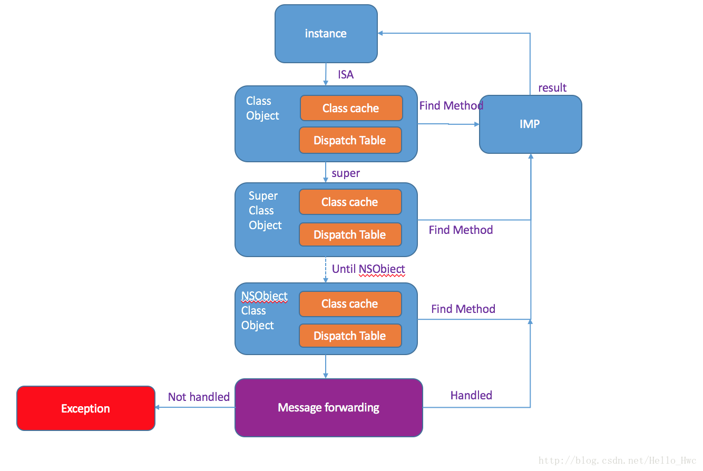
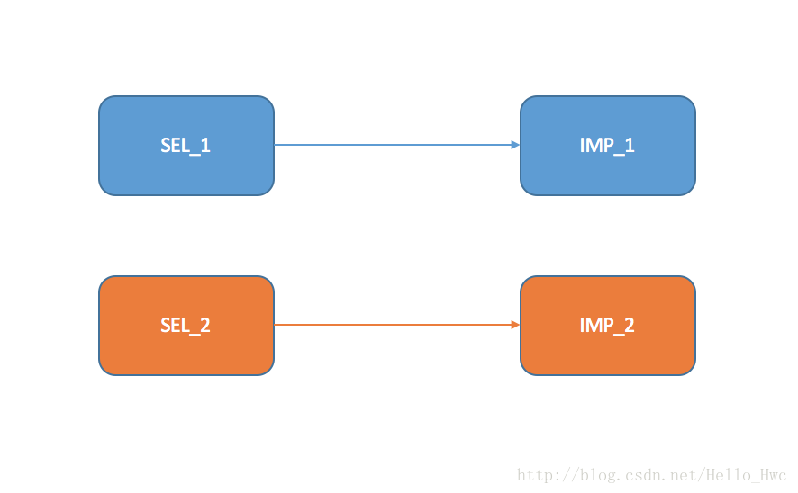
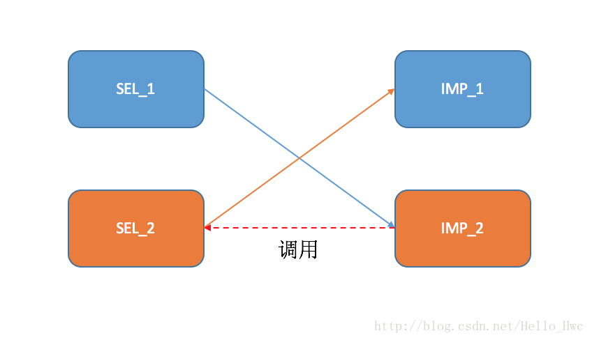
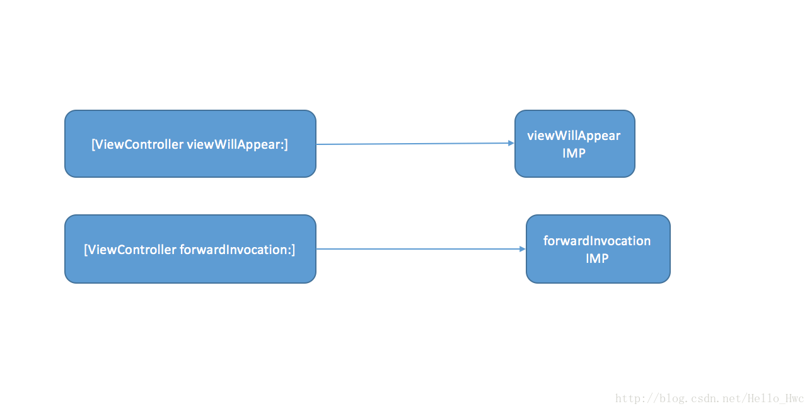
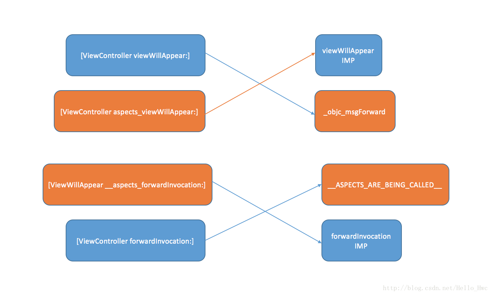

## 前言

最近在搞重构相关的事情，遇到了不少这样的场景：

> 进入一个界面，在`viewWillAppear:`的时候做相应判断，如果满足条件则执行对应代码。

这类业务有一个特点，业务内容是对应整个App的，与对应的`ViewController`毛关系都没有，但是却不得不耦合到（即使是调用代码可以精简到一行）`ViewController`中。

我们都知道，这种类似的业务用AOP（面向切片编程）来做十分适合，所谓面向切片编程就是在不修改原方法的前提下，动态的插入自己的想要的执行代码，由于Objective C是动态语言，可以很容易的利用method swizzling来实现AOP。

在正文之前特别感谢**微信阅读**团队的这篇博客：

- [面向切面编程之 Aspects 源码解析及应用](http://wereadteam.github.io/2016/06/30/Aspects/)

这篇博客原理上讲解的比较清楚，但是细节上并没有讲的很详细，所以也就有了本文。

----
## Objective C方法调用过程

这个其实我之前在这篇博客里讲过：

-  [iOS Runtime详解(消息机制，类元对象，缓存机制，消息转发)](http://blog.csdn.net/hello_hwc/article/details/49687543)

这里，把核心的内容再一次列出来。

如下Objective C代码

```
- (NSInteger )myTestFunction:(NSInteger)input{
    return input + 1;
}

- (void)mySpecialFunction{
   NSInteger result =  [self myTestFunction:10];
}
```

用clang来重写为C++,

```
clang -rewrite-objc  MyClass.m
```

然后，我们通过搜索`mySpecialFunction`方法名字，来找到转换后的代码，经过简单整理如下

```
static NSInteger _I_MyClass_myTestFunction_(MyClass * self, SEL _cmd, NSInteger input) {
    return input + 1;
}
static void _I_MyClass_mySpecialFunction(MyClass * self, SEL _cmd) {
   NSInteger result = objc_msgSend(self, sel_registerName("myTestFunction:"),10);
}
```

我们看到，方法体进行了如下转换

```
//OC
- (NSInteger )myTestFunction:(NSInteger)input{
    return input + 1;
}
//C++
static NSInteger _I_MyClass_myTestFunction_(MyClass * self, SEL _cmd, NSInteger input) {
    return input + 1;
}
```

方法调用进行了如下转换

```
//OC
NSInteger result =  [self myTestFunction:10];
//C++
NSInteger result = objc_msgSend(self, sel_registerName("myTestFunction:"),10);
```

不难看出，方法的调用并不是直接转换成了对应的C/C++方法调用，而是调用了`objc_msgSend`通过`SEL`(就是一个字符串)在运行时动态找到这个的执行体`_I_MyClass_myTestFunction_`。

那么，在运行时如何找到这个方法的执行体呢？ 这里省略一些细节，对细节感兴趣的同学可以看我上文写的那篇文章。**一个实例方法**的流程如下：



- 对象实例收到消息（SEL+参数）
- 根据存储在对象实例中的ISA到类对象，类对象依次查找Class Cache（方法表缓存）和dispatch table找到对应的Method，如果找到Method，执行对应Method的IMP（方法体），并且返回结果
- 如果找不到Method，则根据类对象中的`super_class`指针找到父类的Class对象。一直找到`NSObject`的类对象
- 如果NSObject也无法找到这个SEL，则进入**消息转发机制**
- 如果消息转发机制无法处理，则抛出异常: `doesNotRecognizeSelector`

----
## Method Swizzling 

通过上文我们知道，一个方法的调用实际上就是SEL（方法名）通过Runtime找到IMP（方法执行体）



既然是通过Runtime动态找到的，那么我们就可以利用Runtime的API，讲SEL\_1来指向IMP\_2，接着我们再在在IMP\_2的方法体中执行IMP\_1，就实现了动态插入代码。



----
## 消息转发机制
在Objective C的方法调用过程中，我们提到了当无法响应一个`selector`时，在抛出异常之前会先进入消息转发机制。这里来详细讲解消息转发的过程：

关于消息转发，官方文档在这里：[Message Forwarding](https://developer.apple.com/library/content/documentation/Cocoa/Conceptual/ObjCRuntimeGuide/Articles/ocrtForwarding.html#//apple_ref/doc/uid/TP40008048-CH105-SW2)

在触发消息转发机制即`forwardInvocation:`之前，Runtime提供了两步来进行轻量级的动态处理这个`selector`.

- resolveInstanceMethod:

> Dynamically provides an implementation for a given selector for an instance method.

这个方法提供了一个机会：**为当前类无法识别的SEL动态增加IMP**。

比如：最常见的可以通过`class_addMethod`

```
void dynamicMethodIMP(id self, SEL _cmd){/*...implementation...*/}
+ (BOOL) resolveInstanceMethod:(SEL)aSEL
{
    if (aSEL == @selector(resolveThisMethodDynamically))
    {
          class_addMethod([self class], aSEL, (IMP) dynamicMethodIMP, "v@:");
          return YES;
    }
    return [super resolveInstanceMethod:aSel];
}
```
> Tips，这里的`"v@:"`表示方法参数编码，`v`表示`Void`，`@`表示`OC对象`，`:`表示`SEL`类型。关于方法参数编码，更详细的内容参见[文档](https://developer.apple.com/library/mac/documentation/Cocoa/Conceptual/ObjCRuntimeGuide/Articles/ocrtTypeEncodings.html#//apple_ref/doc/uid/TP40008048-CH100-SW1)。

如果`resolveInstanceMethod`返回NO，则表示无法在这一步动态的添加方法，则进入下一步：

- forwardingTargetForSelector:

> Returns the object to which unrecognized messages should first be directed.

这个方法提供了一个机会：简单的把这个SEL交给另外一个对象来执行。

比如：

```
-(id)forwardingTargetForSelector:(SEL)aSelector{
    if (aSelector == @selector(dynamicSelector) && [self.myObj respondsToSelector:@selector(dynamicSelector)]) {
        return self.myObj;
    }else{
        return [super forwardingTargetForSelector:aSelector];
    }
}
```

如果上述两步都无法完成这个SEL的处理，则进入消息转发机制，消息转发机制有两个比较重要的方法：

- forwardInvocation:  具体的NSInvocaion
- methodSignatureForSelector: 返回SEL的方法签名

这里不得不提一下两个类：

- `NSMethodSignature` 用来表示方法的参数签名信息：返回值，参数数量和类型
- `NSInvocaion` SEL + 执行SEL的Target + 参数值

通常，拿到`NSInvocaion`对象后，我们可选择的进行如下操作

- 修改执行的SEL
- 修改执行的Target
- 修改传入的参数

然后调用：`[invocation invoke]`，来执行这个消息。

### `_objc_msgForward`

我们知道，正常情况下SEL背后会对一个IMP，在OC中有一个特殊的IMP就是：`_objc_msgForward`。当执行`_objc_msgForward`时，会直接触发消息转发机制，即`forwardInvocation:`。

----
## Aspect的基本原理

使用Aspect，可以在一个OC方法执行前/后插入代码，也可以替换这个OC方法的实现。

这里，我们以在ViewControler的`viewWillAppear:`方法之后插入一段代码为例，来讲解hook前后的变化，

在没有hook之前，ViewController的SEL与IMP关系如下



调用以下aspect来hook `viewWillAppear:`后：

```
 [ViewController aspect_hookSelector:@selector(viewWillAppear:)
                            withOptions:AspectPositionAfter
                             usingBlock:^{
                                 NSLog(@"Insert some code after ViewWillAppear");
                             } error:&error];
```



- 最初的`viewWillAppear:` 指向了`_objc_msgForward`
- 增加了`aspects_viewWillAppear:`,指向最初的`viewWillAppear:`的IMP
- 最初的`forwardInvocation:`指向了Aspect提供的一个C方法`__ASPECTS_ARE_BEING_CALLED__`
- 动态增加了`__aspects_forwardInvocation:`,指向最初的`forwardInvocation:`的IMP

然后，我们再来看看hook后，一个`viewWillAppear:`的实际调用顺序：

- object收到selector(viewWillAppear:)的消息
- 找到对应的IMP：`_objc_msgForward`，执行后触发消息转发机制。
- object收到`forwardInvocation:`消息
- 找到对应的IMP：`__ASPECTS_ARE_BEING_CALLED__`，执行IMP
	- 向object对象发送`aspects_viewWillAppear:`,执行最初的viewWillAppear方法的IMP
	- 执行插入的block代码
	- 如果ViewController无法响应`aspects_viewWillAppear`，则向object对象发送`__aspects_forwardInvocation:`来执行最初的`forwardInvocation` IMP

> 所以，Aspects是采用了集中式的hook方式，所有的调用最后走的都是一个C函数`__ASPECTS_ARE_BEING_CALLED__`。

---
## 核心类/数据结构

- AspectIdentifier - 代表一个Aspect的具体信息：包括被Hook的对象，SEL，插入的block等具体信息。

```
@interface AspectIdentifier : NSObject
@property (nonatomic, assign) SEL selector;
@property (nonatomic, strong) id block;
@property (nonatomic, strong) NSMethodSignature *blockSignature;
@property (nonatomic, weak) id object;
@property (nonatomic, assign) AspectOptions options;
@end

```

- AspectTracker - 跟踪一个类的继承链中的hook状态：包括被hook的类，哪些SEL被hook了。

```
@interface AspectTracker : NSObject
@property (nonatomic, strong) Class trackedClass;
@property (nonatomic, readonly) NSString *trackedClassName;
@property (nonatomic, strong) NSMutableSet *selectorNames;
@property (nonatomic, strong) NSMutableDictionary *selectorNamesToSubclassTrackers;
@end
```

- AspectContainer - AspectIdentifier的容器：以SEL合成key，然后作为关联对象存储到对应的类/对象里。包括`beforeAspects`，`insteadAspects`，`afterAspects`

```
@interface AspectsContainer : NSObject
@property (atomic, copy) NSArray *beforeAspects;
@property (atomic, copy) NSArray *insteadAspects;
@property (atomic, copy) NSArray *afterAspects;
@end
```

- AspectInfo - `NSInvocation`的容器，表示一个执行的Command。

```
@interface AspectInfo : NSObject <AspectInfo>
@property (nonatomic, unsafe_unretained, readonly) id instance;
@property (nonatomic, strong, readonly) NSArray *arguments;
@property (nonatomic, strong, readonly) NSInvocation *originalInvocation;
@end
```
---
## hook过程

同样，我们以一个实例方法为例，讲解在这个方法调用后发生了什么

```
 [ViewController aspect_hookSelector:@selector(viewWillAppear:)
                            withOptions:AspectPositionAfter
                             usingBlock:^{
                                 NSLog(@"Insert some code after ViewWillAppear");
                             } error:&error];
```

1. 对Class和MetaClass进行进行合法性检查，判断能否hook，规则如下
	- `retain`,`release`,`autorelease`,`forwoardInvocation:`不能被hook
	- dealloc只能在方法前hook
	- 类的继承关系中，同一个方法只能被hook一次


2. 创建`AspectsContainer`对象，以aspects_ + SEL为key，作为关联对象依附到被hook 的对象上
	
	```
	objc_setAssociatedObject(self, aliasSelector, aspectContainer, OBJC_ASSOCIATION_RETAIN);

	``` 
3. 创建`AspectIdentifier`对象，并且添加到`AspectsContainer`对象里存储起来。这个过程分为两步
	- 生成block的方法签名`NSMethodSignature`
	- 对比block的方法签名和待hook的方法签名是否兼容（参数个数，按照顺序的类型） 
4. 根据hook实例对象/类对象／类元对象的方法做不同处理。其中，对于上文以类方法来hook的时候，分为两步
	- hook类对象的`forwoardInvocation:`方法，指向一个静态的C方法，并且创建一个`aspects_ forwoardInvocation:`动态添加到之前的类中

	
	```
	IMP originalImplementation = class_replaceMethod(klass, @selector(forwardInvocation:), (IMP)__ASPECTS_ARE_BEING_CALLED__, "v@:@");
    if (originalImplementation) {
        class_addMethod(klass, NSSelectorFromString(AspectsForwardInvocationSelectorName), originalImplementation, "v@:@");
    }
	```
	- hook类对象的`viewWillAppear:`方法让其指向`_objc_msgForward`,动态添加`aspects_viewWillAppear:`指向最初的`viewWillAppear:`实现

-----
### Hook实例的方法

> Aspects支持只hook一个对象的实例方法

只不过在第4步略有出入，当hook一个对象的实例方法的时候：

- 新建一个子类，`_Aspects_ViewController`,并且按照上述的方式hook `forwoardInvocation:`
- hook `_Aspects_ViewController`的`class`方法，让其返回`ViewController`
- hook 子类的类元对象，让其返回`ViewController`
- 调用objc_setClass来修改`ViewController`的类为`_Aspects_ViewController`

> 这样做，就可以通过` object_getClass(self)`获得类名，然后看看是否有前缀类名来判断是否被hook过了
	
----
## 其他

### object_getClass/与self.class的区别

- object_getClass获得的是isa的指向
- self.class则不一样，当self是实例对象的时候，返回的是类对象，否则则返回自身。

比如：

```
TestClass * testObj = [[TestClass alloc] init];
//Same
logAddress([testObj class]);
logAddress([TestClass class]);
    
//Not same
logAddress(object_getClass(testObj));
logAddress(object_getClass([TestClass class]));
```

Log

```
2017-05-22 22:41:48.216 OCTest[899:25934] 0x107d10930
2017-05-22 22:41:48.216 OCTest[899:25934] 0x107d10930
2017-05-22 22:41:48.216 OCTest[899:25934] 0x107d10930
2017-05-22 22:41:49.061 OCTest[899:25934] 0x107d10908
```

### Block签名
block因为背后其实是一个C结构体，结构体中存储着着一个函数指针来指向实际的方法体

Block的内存布局如下

```
typedef NS_OPTIONS(int, AspectBlockFlags) {
	AspectBlockFlagsHasCopyDisposeHelpers = (1 << 25),
	AspectBlockFlagsHasSignature          = (1 << 30)
};
typedef struct _AspectBlock {
	__unused Class isa;
	AspectBlockFlags flags;
	__unused int reserved;
	void (__unused *invoke)(struct _AspectBlock *block, ...);
	struct {
		unsigned long int reserved;
		unsigned long int size;
		// requires AspectBlockFlagsHasCopyDisposeHelpers
		void (*copy)(void *dst, const void *src);
		void (*dispose)(const void *);
		// requires AspectBlockFlagsHasSignature
		const char *signature;
		const char *layout;
	} *descriptor;
	// imported variables
} *AspectBlockRef;

```

对应生成`NSMethodSignature`的方法：
```
static NSMethodSignature *aspect_blockMethodSignature(id block, NSError **error) {
    AspectBlockRef layout = (__bridge void *)block;
	if (!(layout->flags & AspectBlockFlagsHasSignature)) {
        NSString *description = [NSString stringWithFormat:@"The block %@ doesn't contain a type signature.", block];
        AspectError(AspectErrorMissingBlockSignature, description);
        return nil;
    }
	void *desc = layout->descriptor;
	desc += 2 * sizeof(unsigned long int);
	if (layout->flags & AspectBlockFlagsHasCopyDisposeHelpers) {
		desc += 2 * sizeof(void *);
    }
	if (!desc) {
        NSString *description = [NSString stringWithFormat:@"The block %@ doesn't has a type signature.", block];
        AspectError(AspectErrorMissingBlockSignature, description);
        return nil;
    }
	const char *signature = (*(const char **)desc);
	return [NSMethodSignature signatureWithObjCTypes:signature];
}
```

关于Block的更多讲解，参见我的前一篇博客

- [Objective C block背后的黑魔法](http://blog.csdn.net/hello_hwc/article/details/70210549)

### 效率

> 消息转发机制相对于正常的方法调用来说是比较昂贵的，所以一定不要用消息转发机制来处理那些一秒钟成百上千次的调用。
