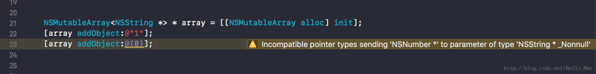
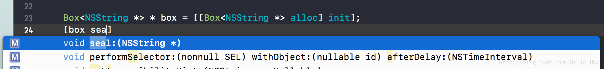
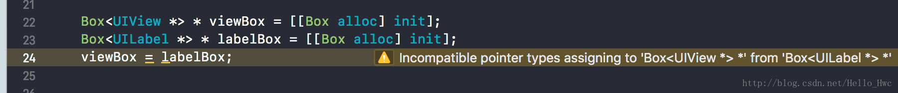
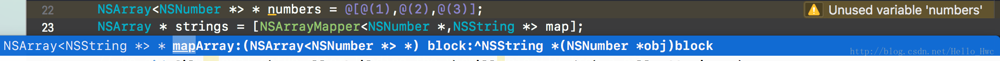

## 范型

范型编程是一种程序语言设计范式，它允许程序员在使用强类型的语言编写代码的时候，延迟确定具体的类型。

以Swift代码为例，假如有一个需求是要交换两个int,很容易写出类似代码

```
func swapTwoInts(_ a: inout Int, _ b: inout Int) {
    let temporaryA = a
    a = b
    b = temporaryA
}

```

然后，又来了个需求，交换两个double,

```
func swapTwoDoubles(_ a: inout Double, _ b: inout Double) {
    let temporaryA = a
    a = b
    b = temporaryA
}
```

于是，有一种类型，就需要Copy/Paste一遍。有一天交换的逻辑要更改，你会发现一下子需要改许多地方。

范型完美的解决了这个问题，使用范型编写的代码，不需要指定具体的类型，而是使用占位符

```
func swapTwoValues<T>(_ a: inout T, _ b: inout T) {
    let temporaryA = a
    a = b
    b = temporaryA
}
```

## Objective C 范型

Objective C支持轻量级的范型。在编写自定义的范型类之前，我们先来看看Cocoa Touch的集合类(`NSArray,NSDictionary,NSSet`)对于范型的支持。

首先创建一个数组，这个数组只应该用来存储字符串：

```
NSMutableArray * array = [[NSMutableArray alloc] init];
[array addObject:@"1"];
//误加了一个非字符串类型进去
[array addObject:@(0)];
```

这时候，对数组中元素进行遍历，Crash：

```
[array enumerateObjectsUsingBlock:^(id  _Nonnull obj, NSUInteger idx, BOOL * _Nonnull stop) {
    NSInteger length = [obj length];
}];
```

> Terminating app due to uncaught exception 'NSInvalidArgumentException', reason: '-[__NSCFNumber length]: unrecognized selector sent to instance 0xb000000000000002'

**如果编译器能帮助我们来确保加入数组中的元素都是String就好了**

范型可以帮助我们解决这个问题：

```
//创建一个保存字符串的数组
NSMutableArray<NSString *> * array = [[NSMutableArray alloc] init];
[array addObject:@"1"];
[array addObject:@(0)];
```

往这个数组里加入非字符串类型的对象时，编译器会给出警告：



同样的，NSDictionary和NSSet也支持范型：

```
NSDictionary<NSString *, NSNumber *> * dic;
NSSet<NSString *> * set;
```

### 范型与Swift

由于Swift是一个强类型的语言，这样的一个数组

```
@property (strong, nonatomic, nullable) NSArray * contents;
```

在Swift中访问时候的类型是：

```
var contents: [Any]?
```

如果使用范型，那么编译器就能够推断出具体类型了：

```
var contents: [String]?
```

## 写一个范型类型

自定义一个范型类型很简单，和其他语言类似，在声明类的时候声明占位符即可：

声明一个Box容器，用来存储一个值：

Box.h

```
@interface Box<ObjectType> : NSObject
@property (nonatomic, readonly) ObjectType value;
- (void)seal:(ObjectType)value;
@end
```
Box.m

```
@interface Box()

@property (strong, nonatomic) id value;

@end

@implementation Box

- (void)seal:(id)value{
    _value = value;
}

@end
```

接着，我们就可以这样使用，

```
Box<NSString *> * box = [[Box<NSString *> alloc] init];
[box seal:@"1234"];
[box seal:@(1)];//Warning
```

同时还可以看到XCode自动推断出了参数的具体类型



关于Objective C范型的几点说明：

- 在头文件的类声明中添加占位符ObjectType，但是不同于Swift，Objective C往往会使用显而易见的名称占位符
- 在.m文件中无法使用范型占位符，用id类型替代即可。

### 约束

类似于Swift，Objective 也可以为范型增加轻量级的约束，比如要求ObjectType实现NSCopying协议：

```
@interface Box<ObjectType:id<NSCopying>> : NSObject
```

那么，只有实现NSCopying的类型才能够通过编译：

```
//Error
Box<NSObject *> * box1 = [[Box<NSObject *> alloc] init];
//Work
Box<NSString *> * box2 = [[Box<NSString *> alloc] init];
```

当然，也可以约束ObjectType继承某些类：

```
//Error
Box<NSObject *> * box1 = [[Box<NSObject *> alloc] init];
//Work
Box<NSString *> * box2 = [[Box<NSString *> alloc] init];
//Work
Box<NSMutableString *> * box3 = [[Box<NSMutableString *> alloc] init];
```


## 逆变与协变

在开始这部分之前，我们先来聊聊软件设计模式的六大原则之一：[里氏替换原则](https://en.wikipedia.org/wiki/Liskov_substitution_principle)。


> 里氏替换原则指出：子类对象能够替换父类对象而使用。

举例：

```

@interface Person : NSObject

- (NSString *)name;

@end

@interface Male: Person

@end

```

根据里氏替换原则，这样的代码是可以工作的

```
Person * leo = [[Male alloc] init];
NSLog(@"%@",leo.name);
```

接着，回到范型，我们来看看刚刚的自定义范型类Box：

```
@interface Box<ObjectType> : NSObject
- (void)seal:(ObjectType)value;
@end
```

创建一个ViewBox和LabelBox，并且把LabelBox赋值给ViewBox

```
Box<UIView *> * viewBox = [[Box alloc] init];
Box<UILabel *> * labelBox = [[Box alloc] init];
viewBox = labelBox;
```

这时候编译器会给出警告



> 这看似合理，又不合理。

- 合理是因为两个Box中容纳的类型不一样，赋值的时候类型检查不通过。
- 不合理是因为根据`里氏替换原则`，一个容纳UILabel的Box，那么也应该是一个容纳UIView的Box。

### 协变

> 协变由关键字`__covariant`声明。一个协变类型的范型占位符，如果变量A的占位符类型是子类，那么可以把它赋值给占位符类型是父类的B。

也就是说，通过协变，我们能够解决：`一个容纳UILabel的Box，那么也应该是一个容纳UIView的Box`

```
@interface Box<__covariant ObjectType> : NSObject
@end
```

```
Box<UIView *> * viewBox = [[Box alloc] init];
Box<UILabel *> * labelBox = [[Box alloc] init];
//子类赋值给父类
viewBox = labelBox;
```

协变常常用于**容器类型**，像系统的NSArray，NSDictionary，NSSet都采用了协变：

```
@interface NSArray<__covariant ObjectType> : NSObject
@interface NSDictionary<__covariant KeyType, __covariant ObjectType> : NSObject
@interface NSSet<__covariant ObjectType> : NSObject
```

#### 逆变

> 逆变(`__contravariant`),一个逆变类型的范型占位符，如果变量A的占位符类型是父类，那么可以把它赋值给占位符类型是子类的B。

- **逆变侧重行为。**

举个例子：

```
//用来解析字符串中的数字
@interface StringPaser<__contravariant ObjectType:NSString *> : NSObject

- (NSString *)paseNumber;

@end
```

那么以下代码则不会有编译器警告

```
StringPaser<NSString *> * stringPaser = [[StringPaser alloc] init];
StringPaser<NSMutableString *> * mutableStringPaser = [[StringPaser alloc] init];
//父类赋值给子类
mutableStringPaser = stringPaser;
```


- **逆变要求父类和子类能够提供同样的行为，所以通过父类的接口创建的范型类，可以用来处理子类。**


## 范型方法

Objective C对于范型占位符只能声明在类名中，所以往往为了让某些类支持范型，我们需要额外再写一个类：

比如，对数组中的元素进行map：

```
//通过Category的方式来添加范型函数是无法正常工作的
@interface NSArray<ObjectType> (Map)

//编译器找不到ResultType
- (NSArray<ResultType> *)map:(ResultType(^)(ObjectType obj))block;

@end
```

新建一个类，通过把占位符写入到类声明中，然后再写范型方法

```

@interface NSArrayMapper<ObjectType,ResultType>: NSObject

+ (NSArray<ResultType> *)mapArray:(NSArray<ObjectType> *)input
                            block:(ResultType(^)(ObjectType obj))block;

@end
```

```

@implementation NSArrayMapper

+ (NSArray *)mapArray:(NSArray *)input
           block:(id(^)(id obj))block{
    NSMutableArray * result = [[NSMutableArray alloc] init];
    [input enumerateObjectsUsingBlock:^(id  _Nonnull obj, NSUInteger idx, BOOL * _Nonnull stop) {
        [result addObject:block(obj)];
    }];
    return [NSArray arrayWithArray:result];
}
@end
```

接着，我么就可以这么使用：

```
NSArray<NSNumber *> * numbers = @[@(1),@(2),@(3)];
NSArray * strings = [NSArrayMapper<NSNumber *,NSString *> mapArray:numbers
                                                             block:^NSString *(NSNumber *obj) {
                                                                 return [obj stringValue];
                                                             }];
```

并且，开发的时候，XCode会为我们自动补全：



## 总结

范型是一种强大的编程范式，虽然Objective C只支持轻量级的范型，但是仍然能够为我们在设计接口的时候提供更多选择。